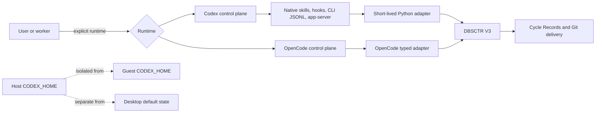

# Codex CLI Integration

This Initiative makes Codex CLI a fully managed peer to OpenCode across the
macOS host, Fedora Lima guests, Herdr, Hermes, and DBSCTR. Both runtimes remain
supported. Parity means equivalent outcomes and safety, not copied client
internals.

The coordinator repository is `Saltiola7/dotfiles-ai`. The canonical machine
ledger is [`MANIFEST.json`](MANIFEST.json).

## Success

- A normal apply installs and configures both OpenCode and Codex CLI.
- Interactive users explicitly run `opencode` or `codex`; automation defaults to
  OpenCode until `rnd.runtime` or a workspace override selects Codex.
- Codex uses one dedicated `CODEX_HOME` without changing desktop `~/.codex`.
- OpenCode and Codex implement one DBSCTR V3 lifecycle through conforming
  adapters and preserve the same gate, evidence, approval, and delivery outcomes.
- Every requested parity capability is native, reused, adapted, or explicitly
  not applicable. A missing requested outcome blocks parity readiness.
- Host and guest credentials, sessions, logs, private evidence, and worker state
  remain isolated.

## Context Map

| Context | Responsibility | Dependency |
|---|---|---|
| `dbsctr_v3_lifecycle` | Generic harness contract, proposed Cycle Record schema 5, compatibility, and conformance | None |
| `codex_control_plane` | Codex instructions, skills, agents, approvals, hooks, sessions, and lifecycle adapters | DBSCTR lifecycle |
| `dotfiles_ai_distribution` | Host/guest installation, managed config projection, runtime selection, worker distribution, and rollback | Codex control plane |
| `shell_auth_startup` | External-volume health, signed Herdr ancestry, and exact Codex session recovery | Codex control plane and distribution |
| `opencode_control_plane` | Unchanged coexistence and regression baseline | DBSCTR lifecycle |
| `dbsctr_knowledge_store` | Existing DKS and Graphify interfaces | None |
| `pm_kernel` | Existing canonical ticket workflow | DBSCTR lifecycle |
| `writing_skills` | Existing writing skills and external-write boundaries | None |
| `opencode_inference_cost` | OpenCode-only cost baseline; no premature generalization | OpenCode control plane |

The user approved this complete context map on 2026-08-29.
The user approved the bounded `transcript_path`, `codex-managed`, projected TOML
role, and inline-hook corrections on 2026-08-30.
The user approved bounded sanitized private text and one lifecycle-owned generic
history request-and-page envelope on 2026-08-31.

## Approved Delivery Decisions

- Deliver `codex-host-foundation` and `codex-distribution` as two sequential pull requests. The first establishes the tested control-plane source contract without installing Codex; the second installs, projects, and deploys it.
- Live probes and workers require an existing boundary-local login. They never auto-authenticate, inject a shared API key, or copy authentication between the host and guests.
- Host foundation manages only the initial native workflow roles Build, Discovery, Plan, Review, Explore, and Scout. It does not mirror every OpenCode agent.
- Distribution updates all registered managed Fedora guests and automatically provisions future managed guests. Identity correlation uses one representative authenticated Fedora guest per frozen release while every guest must pass install, version, configuration, and isolation checks.
- Host foundation stages portable source under `~/.config/dotfiles-ai/codex-managed/`, defines projected custom roles as `$CODEX_HOME/agents/**/*.toml`, and configures the five identity hooks as inline command hooks.
- The sanitizer accepts documented `transcript_path` only as bounded transient hook input and discards it without reading, canonicalizing, logging, exposing, or persisting it.

## Architecture

**Text Equivalent:** A caller explicitly selects OpenCode or Codex. OpenCode
keeps its existing typed adapter. Codex uses native skills, hooks, CLI JSONL, and
supported app-server methods through a short-lived Python adapter. Both adapters
use one DBSCTR V3 lifecycle and Git delivery authority. Host Codex state, each
guest Codex state, and desktop default state remain separate.

## Delivery Slices

| Slice | Execution owner | Outcome | Depends on |
|---|---|---|---|
| `multi-harness-lifecycle` | `build` | Proposed schema-5 generic harness identity and conformance while schemas 3/4 remain readable | None |
| `generic-history-source-pages` | `build` | Closed private source-page validation and immutable continuation contract | `multi-harness-lifecycle` |
| `codex-host-foundation` | `build` | Managed Codex source config, six native workflow roles, sanitizer, capability probe, and bounded CLI adapter | `multi-harness-lifecycle` |
| `codex-distribution` | `build` | Homebrew host install, pinned Fedora install, atomic config projection, and runtime selection | `codex-host-foundation` |
| `codex-identity-probe` | `discovery` | Cross-platform decision for hook session identity versus app-server thread identity | `codex-distribution` |
| `codex-history-adapter` | `build` | Private stable app-server conversion into generic source pages | `codex-identity-probe`, `generic-history-source-pages` |
| `codex-history-parity` | `build` | Supported thread history, incidents, review, telemetry, and benchmarks | `codex-history-adapter` |
| `codex-worker-routing` | `build` | Explicit Herdr/Hermes/autonomous-worker runtime binding without fallback | `codex-distribution`, `codex-identity-probe` |
| `codex-state-recovery` | `build` | External-volume circuit breaking and exact supported-session resume | `codex-worker-routing`, `codex-identity-probe` |
| `codex-federation-parity` | `build` | Bounded host/guest history federation and handoff | `codex-history-parity`, `codex-worker-routing` |
| `codex-parity-readiness` | `discovery` | Outcome-parity assessment with no unexplained unavailable capability | All preceding slices |

## Dependency-Gated Slice Contracts

| Slice | Build or probe boundary | Promotion evidence |
|---|---|---|
| `codex-host-foundation` | Portable control-plane source, six TOML native roles, inline identity hooks, bounded transient-path sanitizer, and adapter; no package install, login, or live identity claim | Fake-command/schema tests, shared lifecycle conformance, OpenCode regressions, and reviewed source contract |
| `codex-distribution` | Install exact host/guest release, project digest-owned config, activate wrapper, and persist selector schema; no worker activation | Host and all-guest version/config/state isolation, rollback, and source-identical deployment after host foundation is delivered |
| `codex-identity-probe` | Discovery-run disposable correlation on macOS and one representative authenticated Fedora guest | Exact or deterministic versioned mapping across hooks, CLI JSONL, app-server thread identity, resume, and fork; ambiguity keeps dependents blocked |
| `generic-history-source-pages` | Lifecycle-owned closed page validator over stdin; no native runtime parsing or persistence | Positive/negative schema, continuation, digest, privacy, byte-bound, no-mutation, and existing-consumer compatibility tests |
| `codex-history-adapter` | Pinned stable `thread/list` and `thread/read` over initialized app-server stdio; private pages remain in-process | Schema-digest, conversion, privacy, continuation, body-free probe, no-mutation, host, and all-guest tests |
| `codex-history-parity` | Closed in-process reducers consume delivered generic Codex pages | Existing review, Incident, telemetry, immutable-capture, and benchmark schemas; unavailable required fields block parity |
| `codex-worker-routing` | Resolve workspace override, then `rnd.runtime`, then OpenCode default across native, Hermes, Herdr, and autonomous workers | Exact runtime, release, adapter revision, and session identity where available; passing Herdr launch-health baseline; mismatch, absence, duplication, or failure never falls back |
| `codex-state-recovery` | Extend existing exact-volume preflight and content-free snapshot to supported Codex resume | Healthy/degraded/recovered probes, exact returned identity, process preservation, rollback, and no substitute session |
| `codex-federation-parity` | Existing bounded federated-capture schemas transport sanitized Codex source pages and handoff identity | Immutable host/guest capture, deterministic ordering, continuation invalidation, privacy rejection, and no credential or content transfer |
| `codex-parity-readiness` | Discovery reconciles the complete capability matrix and OpenCode coexistence baseline | Every requested capability must have passing evidence or a separately approved scope change; unexplained unavailable results fail readiness |

Only the first dependency-satisfied slice is receipt-ready. Delivering a
predecessor does not automatically promote its successor: Discovery revalidates
the committed artifacts, manifest digest, runtime evidence, and ownership before
changing the successor to `ready`.

Discovery owns normative contracts, parity disposition, dependencies, and slice
scope. Build owns only the implementation paths in an approved DBSCTR
applicability plan and Cycle Record. Late changes to lifecycle semantics, context
ownership, state isolation, parity meaning, or dependencies reopen readiness.
The completed host-foundation hook correction was a Discovery-owned readiness
revalidation persisted by the Build primary; it did not change slice scope,
dependencies, execution ownership, or parity meaning.

This Initiative creates no PM Kernel tickets. The manifest records host
foundation, distribution, and the exact cross-platform identity probe as
delivered, including generic history-source validation, and marks only
`codex-history-adapter` ready. Consumer reducers, benchmark capture, worker
routing, recovery, federation, and final parity remain dependency-gated.
Applicability plans and Cycle Records cannot substitute for a fresh Initiative
readiness receipt.

## Release Groups

| Group | Members | Exit condition |
|---|---|---|
| `contract-foundation` | `multi-harness-lifecycle` | Generic lifecycle adapter contract is delivered without OpenCode regression |
| `installable-peer` | `codex-host-foundation`, `codex-distribution` | Two sequential pull requests deliver tested control-plane source, then install isolated and explicitly selectable host/guest runtimes |
| `native-lifecycle` | `codex-identity-probe`, `codex-worker-routing`, `codex-state-recovery` | Exact identity, worker routing, and recovery pass on both platforms |
| `history-federation` | `generic-history-source-pages`, `codex-history-adapter`, `codex-history-parity`, `codex-federation-parity` | Bounded review, incident, telemetry, and federation outcomes pass |
| `parity-readiness` | `codex-parity-readiness` | Every requested capability has an evidence-backed passing disposition |

## Constraints

- Desktop Codex remains separately managed at default `~/.codex`.
- A configured centralized root maps CLI state to `<root>/codex`; an empty root
  maps it to `~/.local/state/dotfiles-ai/codex`.
- Chezmoi projects only digest-owned managed files into `CODEX_HOME`; it never
  owns auth, sessions, logs, plugins, or unrelated state.
- OpenCode remains installed and supported. Runtime presence never changes a
  default and runtime failure never falls back to the other client.
- Codex private SQLite and JSONL storage are not contracts. Supported CLI, hook,
  and app-server interfaces are authoritative.
- Hooks collect only bounded sanitized identity and event evidence and never
  mutate lifecycle state.
- Hook `transcript_path` is a documented transient transport field, not evidence;
  the sanitizer bounds and discards it without accessing the referenced file.
- No MCP, plugin package, SDK-bundled second runtime, Rust rewrite, or private
  Codex fork is introduced without a separately approved proven need.
- No performance claim or language rewrite is accepted without representative
  benchmark evidence.

## Current Evidence Boundary

Codex CLI `0.151.0` is deployed on the managed Apple Silicon host and every
registered Fedora guest. Fedora uses `codex-aarch64-unknown-linux-musl.tar.gz`
with SHA-256
`c1cf2baf375e261c1469381a52dc2c8fd05b6fb45cfff83fed0988fd6c5369b6`.
Host and guest version, configuration, state isolation, rollback, and separate
boundary-local authentication prerequisites have passed.
The frozen-version identity probe proved hook `session_id`, CLI JSONL thread
identity, app-server `thread.id`, and root `thread.sessionId` are exactly equal on
macOS and representative Fedora. Resume preserved exact identity; fork returned
an exact parent relation and a new root equal to the fork thread.
Official `0.151.0` source confirms recursive `agents/**/*.toml` role discovery,
inline command hooks, and the common hook `transcript_path` field. Installed
identity behavior is authoritative only for the frozen release and must be
reprobed on upgrade.
