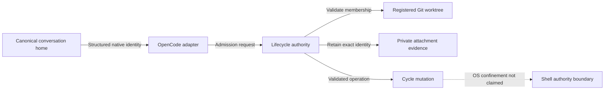

# Canonical Session Continuation

Status: isolated core ready; adapter qualification and rollout remain pending.

Core readiness evidence: all three committed diagrams rendered in GitHub's
Mermaid frames at commit `78d18a45e06000c9c2cb697b758360b6944b641a` and were
visually checked against their text equivalents. Initiative validation, artifact
existence and the eleven-gate plan/profile check passed; seven focused Initiative
validator tests passed. These are Discovery checks, not implementation evidence.
The core uses Method Revision 3.29 and critical risk. No live cycle is enrolled
by its isolated implementation or qualification fixtures.

The operator approved the context map and outcomes below. This document preserves
that approval, source evidence, proposed contracts and remaining decisions. It is
not a Build receipt, deployment approval, or an override of currently delivered
attachment contracts. No continuation slice may launch while its material
readiness questions remain unresolved.

## Outcome And Scope

Keep interactive conversations associated with each repository's canonical
checkout while executing cycle work in its isolated registered worktrees. A
runtime/model change, sibling source checkout, or controlled process restart must
not require a replacement conversation or copied handoff prompt.

Session history stays in native private runtime storage, not in Git or on a
branch. The native session directory is not silently rebound. Cycle execution
must not switch or write the canonical checkout's branch as a substitute for
attachment. This work is independent of automatic merge and its configuration.

### Approved Decisions

| Decision | Contract |
|---|---|
| Repository scope | Same Git repository only; canonical and sibling linked checkouts may select registered cycle worktrees. Equal remote URLs alone do not establish repository identity. |
| Runtime changes | Compatible same-provider model and Build-agent transitions are automatic after validation. Cross-provider transitions require explicit confirmation; no automatic provider fallback. |
| Existing cycles | Recovery includes already-active cycles, preserving original identity and evidence; no bulk history rewrite or implicit record migration. |
| Ownership | Multiple readers, one writer per cycle, explicit recoverable handover; separate cycles remain independently usable. The operator selected cooperating managed-session coordination, not OS-enforced confinement of arbitrary same-user shell code. |
| Access | Interactive primary sessions may inspect registered worktrees. Plan remains read-only. Authorized Build writers may mutate their selected cycle. Child-agent permissions do not broaden. |
| Process reload | An operator-approved restart may load the fix; reopen the exact conversation and recover its validated target. No automatic restart or promise of hot reload. |
| Delivery | Targeted host deployment and existing-conversation recovery first, then configured guest qualification. No broad apply, automatic process interruption, or copying private state across environments. |

Non-goals: cross-repository attachment, native session migration, new workflow
engines, new hosted services, automatic merge changes, bypassing Plan permissions,
editing incident feature work to prove recovery, or silently accepting weaker
writer guarantees.

## Contexts And Profile

All context homes are the existing contexts in the coordinator repository.

| Context | Owns | Profile |
|---|---|---|
| `dbsctr_v3_lifecycle` | Repository authorization, activation history, durable attachment identity, writer transitions and record compatibility | `../../specs/dbsctr_v3_lifecycle/PROFILE.md` |
| `opencode_control_plane` | Same-conversation routing, tool admission, effective permissions, preflight and restart recovery | `../../specs/opencode_control_plane/PROFILE.md` |
| `dotfiles_ai_distribution` | Targeted deployment, runtime qualification, rollback and host/guest evidence | `../../specs/dotfiles_ai_distribution/PROFILE.md` |

Reuse `../../specs/dotfiles_ai_distribution/PRODUCT.md` for the operator journey;
do not create competing Product Intent. The accountable operational owner is the
dotfiles owner. Scope uses Python >=3.12, Bun/TypeScript, managed OpenCode,
Markdown and chezmoi configuration on profile-supported macOS and Linux targets.
No new runtime dependency is selected.

Current scope overrides: critical risk for writer authorization, elevated or
higher for compatibility and deployment (never silently lower risk); eventual
feature-branch draft PR and approved targeted deployment. Modules: Python,
Security, ML/AI and Cloud for the deployment slice. No version or Method Revision
bump is selected in this draft. Existing cycles retain their recorded profiles.

## Source Evidence

### Delivered Local Behavior

| Authority | Finding |
|---|---|
| `dot_local/bin/executable_dbsctrctl`, `harness_activation_for_message` | Activation includes exact provider, model, agent, core revision and overlay revision. |
| Same helper, `command_attach_runtime` | Full activation inequality rejects reattachment; accepted runtime roots are the exact source or cycle checkout. |
| Same helper, `record_worktree_matches` | Existing common-Git-directory and worktree-identity checks can be reused rather than inventing repository identity. |
| Same helper, `evidence_lock` and `target_lock` | Record writes and delivery already have locks; neither is a lifetime lock around native file/shell tool execution. |
| `private_dot_config/opencode/lib/dbsctr-runtime.ts`, `cycleTargets` | Selected targets are process-local; a missing entry falls back to the invocation checkout. |
| `tests/test_dbsctrctl.py`, `assert_vertex_begin_round_trip` | Changed model identity is explicitly expected to reject attachment, including reuse of the same session. |
| `docs/specs/dbsctr_v3_lifecycle/README.md`, Exact Runtime Correlation and provider-native harness rules | Broad resumed-checkout behavior coexists with immutable root-activation equality. These contracts must be reconciled, not bypassed. |
| `docs/specs/dbsctr_v3_lifecycle/features/harness-adapters.md` | Schemas 3/4 retain shape; schema 5 generic/legacy OpenCode identity must agree exactly. |
| `.chezmoitemplates/opencode.json.tmpl` and installed permission inspection | External-directory access is already allowed; the separate reported access failure is not proven to be a missing global allow rule. |

Incident-specific differing activation fields and effective loaded permissions
remain unverified. Do not read raw private session bodies to fill these gaps.
Use bounded structured identity and permission diagnostics when available.

### Upstream Runtime Evidence

Public source inspection through GitHub identified OpenCode tag `v1.18.29` at
commit `16747470f976aca3d362ad730bcd3fe82ecc2c9a`. These are source findings, not
proof of the code path loaded by an existing host conversation.

| Upstream path | Finding |
|---|---|
| `packages/plugin/src/index.ts` | Before/after hooks receive session and call IDs. Their declarations do not promise a finally hook. |
| `packages/opencode/src/session/tools.ts` | Native tool admission calls `tool.execute.before`, awaits execution, then calls `tool.execute.after` on success. The after hook is not a guaranteed failure/cancellation finalizer. MCP calls also use before/after sequencing. |
| `packages/opencode/src/session/prompt.ts` | Direct shell execution uses `shell.env`; it is a distinct entry path that must not escape tool-admission accounting. |
| `packages/opencode/src/tool/shell.ts` | Shell execution has process handling and environment augmentation, but a working directory is not filesystem confinement. |
| `packages/core/src/tool/bash.ts` | The newer core describes host-user filesystem/process/network authority and advisory argument-path checks; its TODOs explicitly leave plugin shell environment integration pending. |

The deployed adapter path must be capability-qualified, not inferred from a
version string. Neither a before/after counter nor shell command/path heuristics
alone proves safe writer handover or confinement to one cycle.

## Domain And Proposed Contracts

| Term | Meaning |
|---|---|
| Conversation home | Immutable native session checkout association. |
| Execution target | Explicitly selected cycle ID and validated registered worktree. |
| Attachment | Validated relation between native session, repository and active cycle; not a change of native session directory. |
| Activation event | Immutable structured identity at an admitted attachment/transition, with source availability rather than inferred fields. |
| Writer generation | Monotonically changing ownership identity used to reject stale mutation admission. |
| In-flight operation | Admitted mutation whose completion or quiescence must be established before handover. |

### Repository And Routing

Resolve configured registry and target paths canonically; reject escapes and
non-root paths. Verify Git registration, common-directory equality, cycle
worktree identity, active state and branch before admitting attachment. Equal
repository slugs, remote URLs, directory prefixes or timestamps are insufficient.
Keep the original source checkout as provenance rather than an exclusive runtime
home. Missing historical source worktrees require an explicitly specified legacy
recovery path; they do not authorize guessed identities.

Persist session-to-target selection in private lifecycle-owned state, scoped by
runtime storage boundary, native session and repository identity. An in-memory
map may cache but never override it. Revalidate after restart and before mutation.
Never select a newest cycle or silently fall back to canonical main when a stored
target is invalid. A read-only preflight must not create attachment state.

File tools need explicit validated paths; shell commands need explicit target
working directories. Merely changing the adapter's typed-tool map does not change
native read, edit, apply_patch or shell behavior. Target instructions must be
loaded as repository context without rebinding the native conversation.

### Activation And Compatibility

Keep prior activation evidence immutable. Validate current message/session
ownership and current Build authority before accepting a new activation event.
Automatically admit compatible same-provider changes; require target-bound
approval for cross-provider changes. Revision compatibility is an explicit
contract, not lexical equality, numerical ordering or a model-family guess.

Mixed-runtime cycles must remain mixed in reports. Do not duplicate their counts,
attribute their whole history to the latest model, or manufacture timing precision
for old evidence. Existing immutable reports retain their original semantics.
Generic and legacy adapter consumers, stored-record readers, federation and
provider evaluation are downstream compatibility review inputs.

The core contract selects private repository-local companion state, preserving
Cycle Record schemas 3/4/5 and original activation. Enrollment requires explicit
old-runtime quiescence; the new helper rejects unmediated enrolled-cycle mutation.
An old standalone executable cannot be fenced by state it ignores, so deployment
must exclude it before activation. No code may simply remove the activation
comparison or overwrite the legacy activation field as this fix. The exact core
contract is `../../specs/dbsctr_v3_lifecycle/features/canonical-continuation.md`.

### Ownership And Recovery

Attach does not steal writer ownership. Repeated attachment by the current owner
is idempotent; another session may inspect and request an explicit handover.
Admission, generation changes and in-flight registration must be atomic with
respect to each other. Ownership must not expire solely because a wall-clock
timeout elapsed. Every mediated mutator must reject stale generations.

Handover stops new old-owner admission, establishes that admitted operations and
their descendants can no longer write, then grants a new generation. If completion
is unknown after error, interruption or restart, preserve an explicit recovery
state and refuse takeover until quiescence is established. Never treat missing
after-hook execution as evidence that a tool stopped or started no subprocess.

No OS-level isolation claim is made. The operator explicitly accepted the
cooperative managed-tool boundary after reviewing the shell and callback evidence.
Unknown completion stays blocked until exact operator-authorized quiescence
recovery; that assertion is not described as machine-proven process death.

### Preflight Interface Requirements

The proposed read-only typed preflight takes an optional worktree and inspects the
current structured primary identity without attaching, migrating, claiming a
writer or repairing permissions. Return a versioned bounded result containing
eligibility, boundary-specific reason, activation field differences, ownership
availability and a supported next action. Unknown evidence is `unavailable`, not
`allowed`. Do not include raw transcript, credentials, full config or raw errors.

Candidate reasons: external permission unavailable/denied, registry mismatch,
repository mismatch, invalid cycle state, unsupported runtime capability,
activation transition required, writer occupied, operation still in flight and
legacy recovery required. The core candidate schema/commands are specified in the
linked lifecycle feature; the native preflight permission/capability projection
still needs adapter qualification. Neither interface is a shipped API.

## Acceptance Behavior

| ID | Given / When / Then |
|---|---|
| CC-01 | Given a primary in the canonical checkout, when it attaches to an active same-repository cycle, then cycle work targets that worktree and native conversation identity remains unchanged. |
| CC-02 | Given a cycle created from a sibling linked checkout, when the canonical primary resumes it, then validated Git membership replaces exact source-path equality without losing provenance. |
| CC-03 | Given compatible same-provider model or Build-agent changes, when attachment resumes, then exact new activation is retained without rewriting earlier identity. |
| CC-04 | Given a provider change or incompatible revision, when admission runs, then explicit transition approval or compatibility recovery is required without provider fallback. |
| CC-05 | Given a controlled restart, when the exact conversation reopens, then the stored target is revalidated; missing/ambiguous/completed targets never route cycle writes to canonical main. |
| CC-06 | Given Plan and Build primaries, when they inspect registered worktrees, then read/search access follows effective policy, while Plan mutation and attachment remain denied. |
| CC-07 | Given two sessions selecting one cycle, when the second requests write access, then the old writer is not silently displaced and readers remain usable. |
| CC-08 | Given an admitted tool, when it fails, is cancelled, forks descendants or loses its runtime, then ownership cannot transfer while writes remain possible or quiescence is unknown. |
| CC-09 | Given different cycles, when separate validated writers execute, then target selection and ownership do not leak between sessions or cycles. |
| CC-10 | Given malformed identity, a symlink escape, an unregistered checkout, an unrelated repository or a completed cycle, when admission runs, then it rejects before mutation. |
| CC-11 | Given an existing active record, when recovery runs, then old evidence and session history remain intact and unsupported old mutation cannot bypass the new contract. |
| CC-12 | Given mixed activations, when history or evaluation reads the cycle, then attribution is truthful and old immutable reports are unchanged. |
| CC-13 | Given host qualification succeeds, when approved guest rollout proceeds, then each boundary retains its own state/credentials and rollback leaves conversations intact. |
| CC-14 | Given a reported blocked conversation, when recovery is verified, then no feature edits, gate completion, commits, data publication or merge are inferred from attachment success. |

## Visual Evidence

| Concern | Decision | Canonical source and owner/change trigger |
|---|---|---|
| Boundary | required: ownership flow | Contexts and Proposed Contracts; lifecycle owner on authority change |
| Interaction | required: handover ordering table | Ownership And Recovery; control-plane owner on admission change |
| State | required: recovery transition table | Ownership And Recovery; lifecycle owner on transition change |
| Data/trust | required: ownership flow | Profile and Proposed Contracts; lifecycle owner on evidence change |
| Schema | not_applicable: the linked lifecycle feature owns companion-state relationships; do not duplicate its schema | Lifecycle owner; storage contract change |
| Dependency/deployment | required: delivery dependency table | Delivery Slices; distribution owner on rollout change |
| Quantitative | not_applicable: no measured performance comparison or threshold decision | Acceptance Behavior |

**Text Equivalent:** The native conversation stays in its canonical checkout.
The OpenCode adapter submits structured identity to lifecycle authority, which
validates registered Git worktree membership and retains exact private evidence.
Admitted mutations target the cycle. OS-level shell confinement is explicitly
outside the approved managed-coordination boundary, not implied by admission.

| Handover order | Required fact |
|---|---|
| 1. Request | Current and requested owners and expected generation are explicit. |
| 2. Stop admission | No additional mutation is admitted for the outgoing generation. |
| 3. Quiesce | Existing operations and descendants cannot continue writing; unknown completion blocks transfer. |
| 4. Transfer | Ownership and generation change atomically against the expected state. |
| 5. Resume | New operations revalidate target and current authority; old generation is rejected. |

**Text Equivalent:** Handover requires explicit ownership, stopped admission,
proven quiescence, atomic generation transfer and renewed validation, in that
order. A failed after hook cannot establish step 3.

| State | Event/guard | Next state |
|---|---|---|
| Unattached | Validated reader selection | Reader |
| Reader | Validated Build authority; no writer or unresolved operation | Writer |
| Writer | Handover requested; stop admission | Draining |
| Draining | Quiescence established and explicit transfer authorized | New writer generation |
| Writer or Draining | Completion/descendant state unknown | Recovery required |
| Recovery required | Operator-authorized recovery proves quiescence | Reader or new writer generation |
| Any attachment | Target removed, completed or identity invalid | Invalid target; cycle mutation refused |

**Text Equivalent:** Reader selection does not acquire ownership. Writer admission
requires valid Build authority and no conflicting writer/operation. Handover drains
before transferring. Unknown execution pins recovery. Invalid targets refuse cycle
mutation rather than falling back to the conversation home.

## Delivery Slices

| Slice | Context | Dependency | State and ownership |
|---|---|---|---|
| `canonical-continuation-core` | Lifecycle | None from automatic delivery | Ready for isolated Build; exact receipt approval required |
| `canonical-continuation-opencode` | OpenCode | Continuation core | Blocked; Build implementation after runtime-boundary proof |
| `canonical-continuation-rollout` | Distribution | Continuation OpenCode | Captured; host first, guests second |

**Text Equivalent:** Core continuation is independent of automatic merge. The
OpenCode adapter depends on core contracts; rollout depends on the qualified
adapter. Implementation is serial. No receipt or launch approval is issued by
this document.

Discovery owns this Initiative, normative features, acceptance and scope. Build
owns helper/adapter/configuration implementation and tests only after readiness.
Candidate future contract homes are the three existing contexts' `features/`
directories. Do not duplicate the contract across them; lifecycle owns shared
semantics, OpenCode owns runtime translation, distribution owns activation.

Review the three context READMEs and CHANGELOGs in each slice. This Discovery
draft records no completed cycle and adds no fictitious completion entry. Preserve
the existing automatic-delivery slices; reconcile `base-session-handoff` with this
scope before its own promotion instead of replacing it silently.

## Validation And Gate Ledger

Configured authorities: `uv run --group test pytest` from the project metadata;
affected lifecycle/helper and OpenCode contract tests; Bun execution; chezmoi
rendered/resolved configuration and runtime smokes. CI selects Python 3.12/3.13/
3.14, Bun 1.3.14 and installs OpenCode 1.18.9 in the main test workflow. Therefore
CI success alone cannot qualify host OpenCode 1.18.29 hook semantics. The separate
CentOS smoke has path filters; do not assume a docs/adapter PR triggers it.

Discovery checks: `dbsctrctl initiative-check --manifest
docs/initiatives/dbsctr-delivery-lifecycle/MANIFEST.json --json`, affected existing
Initiative validator tests, artifact-link/statement coverage and `git diff --check`.
These validate Discovery structure, not runtime acceptance. Required visuals also
need rendered review before implementation readiness. No new linter, typechecker,
scanner or dependency is prescribed; unavailable selected capabilities stay visible.

| Gate | Applicability | Result | Exception |
|---|---|---|---|
| Domain | required | pending | none |
| Behavior | required | pending | none |
| Spec | required | pending: core draft review and native adapter qualification | none |
| Contract | required | pending | none |
| Test-driven implementation | required | not_run | none |
| Refactor | required | not_run | none |
| Review/Integrate | required | not_run | none |
| Release | not_applicable: no separately published versioned artifact is selected | not_run | none |
| Deploy | required for eventual qualified rollout; per-slice applicability must be explicit | not_run | none |
| Operate | required for same-conversation recovery and host/guest evidence | not_run | none |
| Maintain/Retire | required for legacy records, rollback, old-runtime exclusion and cleanup interaction | not_run | none |

The isolated core candidate plan is
`../../specs/dbsctr_v3_lifecycle/CANONICAL-CONTINUATION-CORE.plan.json`.
It deliberately excludes live deployment/operation from that slice; the aggregate
rollout gates above remain required. Before launch, validate the plan against the
committed profile and copy its exact content into ignored `.dbsctr/plans/`.
No adapter or rollout plan is issued before its capability contract is ready.

## Readiness And Recovery Risks

| ID | Material gap | Required resolution |
|---|---|---|
| R1 | A same-UID unrestricted shell is not confined by cwd, external-directory permission, an attachment map or before-hook admission. | Resolved by explicit operator selection of managed-session coordination. OS/adversarial same-user confinement is out of scope, not claimed as passed security evidence. |
| R2 | After hooks are not guaranteed on failure/cancellation; direct shell and alternate runtime paths differ. | Core records uncertain operations and requires explicit bound quiescence recovery, never timeout-only takeover. Adapter must still qualify every entry path before enabling mediation. |
| R3 | Legacy shape preservation and new ownership fencing can conflict under mixed helper versions. | Core selects companion state and explicit quiesced enrollment; current helper rejects unmediated enrolled-cycle mutations. Dependent deployment must exclude old standalone runtimes before enabling this opt-in behavior. |
| R4 | Exact live incident identity difference and permission-denial layer are unavailable. | Bounded structured diagnostics, not raw private-history export or manual cycle-record repair. |
| R5 | Critical authorization changes need qualified review and rollback proof. | Independent review where a qualified reviewer is available; record availability explicitly, without spawning denied child sessions. No self-approved exception. |

R1 was a newly verified material distinction and is now explicitly resolved.
Core implementation is bounded to isolated conformance, not native runtime proof.
R2 remains a live adapter-readiness condition and R3 an activation condition. A
core pass never disposes either dependent slice's live evidence obligations.

Keep raw sessions, credentials, machine paths and incident identities out of Git.
Live deployment, process restart, ownership recovery and private-state migration
remain separately explicit operations. Rollback must retain records and either
restore a compatible mediated runtime or keep mutation disabled; it must not
reactivate an incompatible old writer.

## Same-Conversation Handoff

Continue Discovery in the current Build primary, without Task or new sessions.
Validate the core contract and plan, then qualify adapter R2/R3 with bounded
source/probe evidence. Validate the changed manifest after
each material edit. Only committed clean artifacts can produce a fresh
`initiative-receipt`; request approval for that exact digest-bound slice before
using typed `dbsctr_begin` in Initiative mode. Ordinary Begin is not a substitute.
