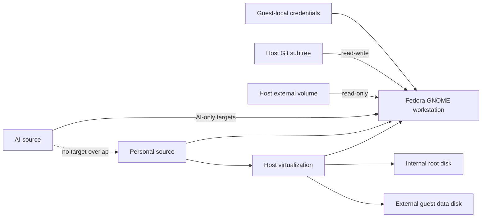

# Fedora Parallels Workstation

This Initiative delivers one managed Fedora ARM64 desktop in Parallels while
keeping personal workstation configuration and AI runtime configuration in their
existing authoritative repositories. The canonical material-statement ledger is
[`MANIFEST.json`](MANIFEST.json).

## Success

- One Fedora GNOME workstation can be created, updated, verified, and rebuilt
  without cloning project repositories.
- Host storage, guest data storage, host shares, and private runtime state have
  explicit owners and fail-closed availability checks.
- The personal chezmoi source and AI chezmoi source have disjoint target sets and
  can be applied in a fixed order from independent guest checkouts.
- OpenCode, Codex CLI, and Herdr run natively on Fedora ARM64 with guest-local
  authentication and retained compatible state.
- The operator can switch bounded CPU and memory profiles without a command
  interrupting a running workstation.

## Context Map

| Context | Home repository | Responsibility | Dependency |
|---|---|---|---|
| `parallels_fedora_workstation` | `Saltiola7/dotfiles` | Host virtualization, storage, guest lifecycle, integration, recovery | None |
| `personal_shell_auth_startup` | `Saltiola7/dotfiles` | Guest shell, terminal, desktop packages, Atuin, updates, cache placement | Workstation foundation |
| `dotfiles_ai_distribution` | `Saltiola7/dotfiles-ai` | Fedora workstation role, AI runtime installation, target ownership | Personal profile |
| `opencode_control_plane` | `Saltiola7/dotfiles-ai` | OpenCode platform qualification | AI distribution |
| `codex_control_plane` | `Saltiola7/dotfiles-ai` | Codex platform and session qualification | AI distribution |

The operator approved this complete map on 2026-08-31. The existing standalone
remote-user-environment contracts remain separate: they provide reusable
user-local Linux patterns but do not own a Parallels desktop or its storage.

## Delivery

`host-vm-foundation` is the only initially ready slice. Personal configuration,
AI distribution, and runtime qualification remain dependency-gated. The AI
slice must also wait until any active distribution cycle with overlapping ignore,
installer, or test ownership has completed or relinquished those paths.

Each exact digest-bound Build approval includes the source changes and applicable
local deployment named by that slice. A Build finding that changes storage,
ownership, authentication, preservation, or dependency contracts reopens
Discovery.

## Architecture

**Text Equivalent:** The personal source owns host virtualization and the Fedora
desktop. The root disk remains internal, while a dedicated sibling external
volume stores the guest data disk. Fedora can read the complete host external
volume and write only its Git subtree. The independent AI source owns only AI
targets. Credentials are created inside Fedora and never copied from the host.

## Constraints And Risks

- Storage creation is an explicit elevated-risk operation and may not infer or
  replace the selected APFS container.
- APFS quota limits allocation but does not reserve capacity. Host and guest
  storage growth can still exhaust the shared container.
- The accepted plain-storage design does not encrypt AI auth, session history,
  IDE local history, or container data at rest.
- Shared project worktrees can retain operating-system-specific build artifacts;
  switching operating systems requires rebuilding those artifacts.
- A Fedora kernel update can require Parallels Tools repair. Retained kernels and
  the vendor reinstall path are mandatory recovery controls.
- Existing dirty checkouts remain untouched. Discovery and Build use isolated
  worktrees from reviewed repository commits.

## Non-goals

No alternate compositor, ChatGPT desktop client, desktop ricing, automatic VM
startup, automatic snapshot, unattended package upgrade, VM clone, copied auth,
or automatic private-state deletion is introduced.
