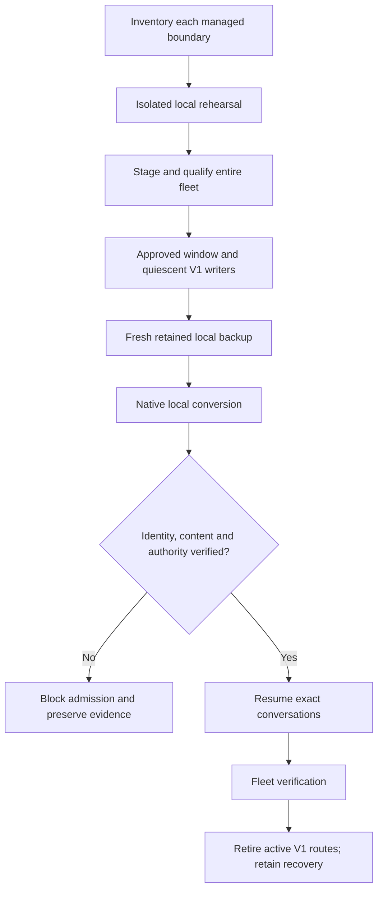

# OpenCode V2 Migration

Status: migration scope approved; CLI surface probe delivered. Native schema
evidence supports source-only lifecycle compatibility implementation. Full native
integration and rollout remain unqualified.

Current operator scope is the one-time transition to the latest official stable
V2 selected at staging. See V2-TRANSITION-READINESS.md for 2.0.22 candidate,
real-history rehearsal, accepted transformation and retained-recovery evidence.
Hourly OpenCode/Codex updates and recurring update-policy changes are deferred
and do not block this transition. The source-only control-plane applicability
plan does not waive the deployment/operations gates below.

## Outcome and boundaries

Migrate the host, every registered managed guest, CLI and Desktop, and supported
provisioning/CI profiles to OpenCode V2. Claim live migration only for inventoried,
verified targets. The operator lifted the prior guest deferral for this scope.
Additional unregistered machines are excluded. Preserve guest-local credentials
and history; never copy host state into guests as an upgrade shortcut.

Use the existing initiative and approved lifecycle, OpenCode control-plane,
Codex control-plane and distribution contexts. Lifecycle owns CLI registration,
evidence gates and in-place adoption; each harness owns native sessions,
models, agents, permissions and commands; distribution owns
verified artifacts, wrappers, service/state-root integration, provisioning,
Desktop installation, Herdr recovery, fleet cutover and retirement.

Functional gaps are reported for later reconciliation rather than requiring
perfect V1 parity. Every concrete gap records impact, safe unavailable/disabled
behavior, owner, disposition and review condition. This is not a blanket gate
exception: unexplained message loss and failed authorization/recovery invariants
block activation. No fork or replacement lifecycle is approved.

## Engineering profile and authority

Reuse the committed PROFILE.md files in dbsctr_v3_lifecycle,
opencode_control_plane, codex_control_plane and dotfiles_ai_distribution, and the existing
distribution PRODUCT.md. Risk is critical: native authority, live history and
fleet availability are affected. Modules: Python, Security, Data, Cloud, ML/AI.
Delivery is reviewed draft pull requests followed by qualified controlled deploy.
Shared ownership is serialized; preserve unrelated relocation work and existing
cycle evidence. Source publication never itself authorizes a live restart.

The source baseline inspected is commit
`0f6a6286e28b1bd5b684300a84cd577da1382e99`. The Discovery checkout is distinct;
reconcile authoritative source before implementation rather than replacing
unrelated local work. V1 receipt readiness must not be reused for V2.

## Qualification findings

See [native findings](V2-NATIVE-FINDINGS.md) for bounded, synthetic runtime
evidence and remaining qualification work. Those findings do not establish fleet
or live-history readiness.

The investigated candidate is 2.0.21, with publisher-recorded source commit
`f46fa72a9285a0e8479e25d400f7026bfd8fe5c8`. This is an investigation baseline,
not a permanent pin or native qualification result. Revalidate official metadata,
artifact digests and exact candidate identity before execution. Public publisher
references belong in bounded qualification evidence, not machine-private state.

An isolated macOS candidate passed version, root/debug/session/service help and
database-path checks after verification against the published archive checksum.
The initial Python HTTP download was rejected with HTTP 403; the standard curl
download succeeded and the checksum matched. This is surface evidence only.
V2 help explicitly states that --session can create a missing session: recovery
must positively verify V2 history before resume, never trust a retained V1 row.

Historical adapter investigation: the V2 public tool hook contract carries sessionID, agent, messageID and call id;
execute.after distinguishes completed and error results. The shell create.before
contract has command/cwd/timeout/shell/env but no session or call identity. Native
operation correlation across that boundary remains unqualified; do not infer it
from a global last-call variable. The approved replacement retires the custom
per-tool continuation contract instead of recreating it through another transport.
Native shell permissions and checkout validation remain required; plain CLI
invocation does not provide authenticated message/call identity.

The released native migration copies session IDs into session_v2, transforms
message/compaction representation, clears legacy per-session permission values,
resets revert state, substitutes unavailable non-inline attachments, and can skip
invalid rows with warnings. Completion alone is not proof of preservation.
Original archives are retained; concrete transformation limitations receive a
reviewed report. Do not claim the database archive contains externally referenced
attachment bytes that were never stored in it.

Current integration uses V1 plugin hooks, tool arguments and completion events.
Lifecycle actor/parent checks and Herdr recovery read the legacy session table;
these must not authorize V2 operations from stale retained V1 rows. CI installs
V1 and package discovery follows the V1 release feed. V2's shared server requires
per-session context and boundary-local data-root qualification, including Desktop.

## Behaviors and invariants

- Given one verified candidate, when preparation runs, every target stages and
  validates before activation; unavailable targets prevent partial success claims.
- Given a running V1 writer, when migration is requested, quiescence is verified
  before native conversion; absence of a visible client is not proof of quiescence.
- Given migration warnings, when verification completes, each omission or
  transformation is reconciled against original evidence; unexplained message
  loss prevents normal work from being admitted.
- Given a migrated session, when it resumes, its native ID, project association,
  provider affinity and native worktree remain correct. Retained V1 rows never
  substitute for current V2 native evidence. CLI actor attribution may be
  unavailable and must not be invented.
- Given a denied native action or read-only role, execution remains restricted
  by native permissions/sandboxing. Worktrunk and the launch-time busy check do
  not replace that security boundary. Legacy writer leases are retired only by
  explicit in-place adoption after quiescence, retaining uncertain evidence.
- Given multiple projects using one server, each operation resolves its own
  session/project context rather than the plugin initialization directory.
- Given missing external storage, startup fails closed instead of creating an
  internal fallback database. Desktop and CLI obey the same managed boundary.
- Given interruption before normal work resumes, recovery uses the qualified
  binary/configuration/service/data generation and retains failure evidence.
- Given new V2 work, rollback never discards it by restoring an older snapshot;
  preserve that generation and use an explicitly qualified recovery path.
- Given successful fleet verification, active V1 launch, update, provisioning and
  CI paths retire. Inactive recovery binaries and original data remain until a
  separate verified disposal decision. Historical records are not rewritten.

## Controlled migration sequence

Inventory -> isolated boundary-local rehearsal -> candidate staging -> explicit
maintenance window -> quiesce writers/jobs -> fresh consistent backups -> local
native migration -> identity/content/authorization checks -> resume conversations
-> fleet verification -> active V1 retirement.

Keep the existing verified archive immutable. Measure additional capacity and
duration during rehearsal; do not invent a maintenance deadline from fixture
timing. Update the binary-only transaction contract explicitly for migration:
binary, configuration, service and data generations form the recovery unit.
Ordinary rolling updates retain their no-restart policy; the major-version
maintenance operation is separately approved and bounded.

## Delivery slices

| Slice | Owner context | Depends on | Execution owner |
|---|---|---|---|
| v2-cli-surface-probe | opencode_control_plane | none | build |
| v2-qualification | opencode_control_plane | v2-cli-surface-probe | discovery |
| v2-lifecycle-compatibility | dbsctr_v3_lifecycle | v2-cli-surface-probe and recorded native schema evidence | build |
| worktrunk-native-workspaces | dbsctr_v3_lifecycle | v2-lifecycle-compatibility; readiness reopened | build |
| v2-control-plane | opencode_control_plane | worktrunk-native-workspaces | build |
| codex-native-workspaces | codex_control_plane | worktrunk-native-workspaces | build |
| v2-distribution-recovery | dotfiles_ai_distribution | both harness workspace slices | build |
| v2-fleet-cutover-retirement | dotfiles_ai_distribution | v2-distribution-recovery | build |

The latest WORKTREE-BASELINE decisions supersede assumptions that transparent
continuation or custom DBSCTR tool catalogs must be ported. Skills remain, and
both harnesses use dbsctrctl through native shell permissions. Existing worktrees
are adopted in place with original cycle IDs; newly created worktrees use native
Worktrunk layout. A bounded launch-time busy check has explicit operator override
and does not claim per-tool or background-process ownership.

Qualification must finalize the retained native CLI/permission/location contracts,
history reconciliation and recovery envelopes, Desktop service integration,
release trust/digest sources, safe gap dispositions, target inventory and
ownership conflicts before dependent specifications become implementation-ready.
It may inspect public source and run isolated probes; it does not mutate live
state, invoke models with private history or implement production adapters.

The lifecycle slice is now bounded by the native-authority feature specification:
source-only identity decoding and persisted terminal proof, with V1/Codex
regressions. Its dependency is the delivered surface probe plus recorded native
schema evidence; waiting for an installed adapter before implementing its helper
would be circular. This is a dependency refinement, not completion of the broad
qualification slice. Native integration, consent, background operations, Desktop,
guest and live-history gates still block activation in downstream slices.

The small first Build slice makes the temporary surface experiment repeatable
under the contract in the OpenCode control-plane V2 qualification feature.
It owns only a tests-directory probe and regression tests; its success explicitly
leaves continuation, migration and deployment unavailable. Subsequent contracts
remain Discovery-owned until their material uncertainties are resolved.
The control-plane dependency on the lifecycle port is expressed on the
v2-control-plane slice, not on the independent surface probe. This avoids
requiring the migration to be implemented before its initial CLI evidence exists.

## Validation and gates

Configured authorities include pytest through the test dependency group, Bun
adapter execution, chezmoi rendering, shell validation and the existing CentOS
remote-user smoke. Select affected tests rather than an unsolicited full audit.
Replace continuation-specific acceptance with approved native-workspace/CLI and
adoption contracts; retain distribution, history and Herdr recovery evidence;
fixtures alone cannot establish live readiness. Qualify interruption, restart,
denied cases, multi-project context, CLI/Desktop coexistence and fleet recovery.
Record only sanitized results in Git; identities and content remain local.

| Gate | Applicability | Result |
|---|---|---|
| Domain | required | pending |
| Behavior | required | pending |
| Spec | required | pending |
| Contract | required | pending |
| Test-driven implementation | required | pending |
| Refactor | required | pending |
| Review/Integrate | required | pending |
| Release | not_applicable: consume upstream artifacts; no separate package publication | not_run |
| Deploy | required for rollout; earlier slices require profile-bound applicability | pending |
| Operate | required for running-system qualification | pending |
| Maintain/Retire | required for active V1 retirement and retained recovery | pending |

This is the initiative ledger, not a fabricated cycle result. Each Build slice
needs a committed-profile applicability plan, fresh receipt, successful typed
launch preflight and exact digest-bound approval. General implementation intent
does not replace those checks.

## Visual Evidence

| Concern | Decision | Authority / change trigger |
|---|---|---|
| Boundary | required: migration flow | Context ownership or target boundary change |
| Interaction | required: migration flow | Admission or cutover ordering change |
| State | required: migration flow | Recovery or retirement transition change |
| Data/trust | required: migration flow | Backup or privacy contract change |
| Schema | not_applicable: exact native schema remains a qualification deliverable | No speculative ER model |
| Dependency/deployment | required: delivery-slice dependency table | Slice ordering change |
| Quantitative | not_applicable: capacity/duration measurements unavailable | Add evidence only after rehearsal |

**Text Equivalent:** Each target keeps its own data and credentials. Isolated
rehearsal precedes fleet-wide staging. A separately approved window quiesces V1
writers before fresh local backup and conversion. Failed verification blocks
normal work. Verified conversations resume before fleet-wide retirement; original
recovery material remains. The dependency table requires qualification, lifecycle,
control-plane and distribution work before cutover in that order.
