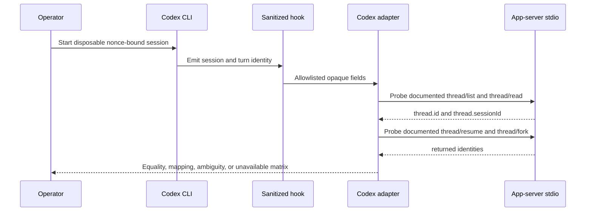

# Codex Control Plane Operation

## Visual Evidence

| Concern | Decision | Review question | Canonical source | Owner/change trigger |
|---|---|---|---|---|
| Boundary | `not_applicable`: the README peer-runtime and trust visuals are canonical | Which runtime owns state and evidence? | `README.md` | Boundary change |
| Interaction | `required: identity-probe sequence` | How is authoritative session mapping established? | Identity Probe | Probe or API change |
| State | `not_applicable`: operation produces one evidence matrix rather than durable workflow state | What states persist? | Probe result contract | Persistent probe state added |
| Data/trust | `required: identity-probe sequence` | Which data is retained from a controlled session? | Privacy Rules | Allowed field change |
| Schema | `not_applicable`: the result table below is the complete contract | What result is recorded? | Result Contract | Result shape change |
| Dependency/deployment | `not_applicable`: host/guest topology is canonical in the distribution feature | Where does the probe run? | Distribution feature | Topology change |
| Quantitative | `not_applicable`: equality and availability, not comparative metrics, control the decision | What threshold passes? | Result Contract | Statistical decision added |

**Text Equivalent:** The operator starts one disposable session containing a
non-secret correlation nonce. A sanitized hook passes only opaque session and
turn identities to the adapter. The adapter bounds and discards
`transcript_path` without reading it, initializes a version-bound app-server
stdio connection without experimental capability, and uses documented methods
to list and read the candidate thread, then resumes and forks it. The retained
result records only exact equality, a deterministic mapping, ambiguity, or
unavailability plus source digests. `transcript_path` is discarded unread;
transcript content rejects the event and never enters retained evidence.

## Hook Privacy

Codex `0.151.0` supplies `transcript_path` as a common hook transport field. The
sanitizer accepts it only as a bounded UTF-8 string, then must discard
`transcript_path` without reading it. It never opens, resolves, canonicalizes,
checks, logs, exposes, or persists the value. Raw `cwd` is handled separately and
may be canonicalized only to derive the bounded workspace enum. Any other
path-bearing field, transcript content, prompt, tool data, environment, URL,
credential, or account field rejects the identity event.

## Identity Probe

Run after the same frozen Codex release is installed on macOS and Fedora:

1. Verify an existing boundary-local login in the managed `CODEX_HOME` on the
   macOS host and one
   representative authenticated Fedora guest. Never auto-authenticate, inject a
   shared API key, or copy auth files. Missing login blocks the probe.
2. Verify every registered managed Fedora guest has the frozen executable,
   managed configuration, guest-local `CODEX_HOME`, and isolated auth boundary.
3. Create an isolated temporary worktree and bounded hook sink while keeping the
   boundary's existing managed `CODEX_HOME`. The probe never redirects, copies,
   mounts, or reads authentication state.
4. Start one disposable session with a non-secret correlation nonce in that
   worktree.
5. Retain hook event enum, opaque `session_id`, turn ID, model ID, workspace enum
   `primary_worktree`, `cycle_worktree`, or `unknown`, timestamp, release, and
   adapter revision only. Bound and discard `transcript_path` without reading it;
   retain no filesystem path.
6. Complete documented `initialize` and `initialized` messages over app-server
   stdio without `experimentalApi`, then probe `thread/list` and `thread/read`.
7. Resume and fork the exact candidate through documented target methods; treat
   them as unavailable unless the frozen-version probe accepts them.
8. Compare hook `session_id`, `thread.id`, `thread.sessionId`, resumed identity,
   fork identity, and parent/root relation.
9. Retain any Codex-created transcript only in runtime-private state under that
   boundary's normal retention policy. Do not inspect or delete private storage;
   retain only the bounded result matrix and digests as probe evidence.

The source-controlled result records the frozen release, adapter revision,
platform classes, exact/mapped/ambiguous/unavailable disposition, and evidence
digests only. Opaque runtime IDs and private event records remain outside Git.

Result values are:

| Result | Consequence |
|---|---|
| `exact` | Direct equality is authoritative for the frozen release and platform. |
| `mapped` | A deterministic versioned mapping is authoritative after negative tests. |
| `ambiguous` | Attach, exact history, worker recovery, and federation fail closed. |
| `unavailable` | Identity-dependent slices remain blocked. |

Temporal, cwd, process, pane, or model-only correlation never passes.
Only an `exact` or `mapped` outcome produces the public success matrix below.
An `ambiguous` or `unavailable` outcome keeps the slice blocked and records only
its bounded reason in private evidence and the changelog; it never publishes an
incomplete identity matrix.

## Frozen Release Result

Codex `0.151.0` with adapter revision `codex-adapter-1` passed on managed macOS
and one representative Fedora Lima guest. On both platform classes, hook
`session_id`, CLI JSONL thread identity, app-server `thread.id`, and root
`thread.sessionId` were exactly equal. `thread/resume` returned the exact thread
and root identity. `thread/fork` returned a distinct fork whose
`forkedFromId` exactly named the parent and whose new root `sessionId` equaled the
fork thread ID. A content-bearing hook event failed closed while bounded
`SessionStart` and `SessionEnd` identity events passed.

The source-controlled matrix is
[`identity-probe-result.json`](identity-probe-result.json). It contains only
platform classes, relation dispositions, release and adapter identity, and
SHA-256 evidence digests. Opaque IDs, account data, paths, prompts, transcripts,
raw protocol bodies, guest names, and private records remain outside Git. This
result is authoritative only for `0.151.0`; every release upgrade reopens the
probe.

The top-level keys are exactly `schema_version`, `release`, `adapter_revision`,
`disposition`, `mapping`, `protocol_schema_sha256`, and `platforms`.
`disposition` is `exact` or `mapped`. `mapping` is exactly
`hook_session_id_equals_thread_id` for direct equality or
`hook_session_id_equals_thread_session_id` for a deterministic mapped result.
`platforms` contains exactly `host_macos` and `fedora_lima_guest`.
Each platform contains exactly `cli_thread_relation`,
`thread_session_relation`, `resume_identity`, `fork_parent_relation`,
`fork_session_relation`, `content_rejection`, `cli_jsonl_sha256`,
`hook_evidence_sha256`, and `app_server_evidence_sha256`.
`cli_thread_relation`, `resume_identity`, and `fork_parent_relation` are
`exact`; `thread_session_relation` is `thread` or `distinct`;
`fork_session_relation` is `parent_session`, `fork_thread`, or `distinct`; and
`content_rejection` is `passed` or `not_observed`. Every digest is 64 lowercase
hexadecimal characters. An unknown key or enum invalidates the result rather
than widening retained evidence.

## Installation And State Checks

- Verify `codex --version` equals the source pin before cross-runtime work.
- Verify CLI `CODEX_HOME` resolves to the configured root or documented fallback.
- Verify desktop `~/.codex` is unchanged.
- Verify managed config ownership and reject unmanaged or symlink collisions.
- Run `codex login status` only inside the intended host or guest boundary; never
  copy auth files between boundaries.
- Do not use `codex doctor` as an offline or non-authenticating health authority.

## Failure And Recovery

Malformed hook data, unknown app-server required fields, timeout, version drift,
missing external state, identity mismatch, or duplicate session ownership blocks
the affected operation without changing a Cycle Record. Recovery resumes only an
exact supported thread. It never starts a substitute or falls back to OpenCode.

## Upgrade And Rollback

Upgrade host and guest as one reviewed compatibility change. Freeze exact release
and guest digest, rerun config, hook, thread, worker, and recovery probes, then
activate new adapters. A failed probe restores prior managed configuration and
runtime selection while retaining private state. No rollback copies or deletes
auth, sessions, or desktop state.
