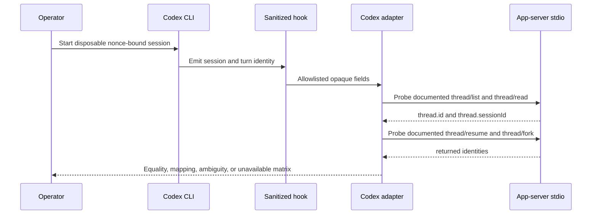

# Codex Control Plane Operation

## Visual Evidence

| Concern | Decision | Review question | Canonical source | Owner/change trigger |
|---|---|---|---|---|
| Boundary | `not_applicable`: the README peer-runtime and trust visuals are canonical | Which runtime owns state and evidence? | `README.md` | Boundary change |
| Interaction | `required: identity-probe sequence` | How is authoritative session mapping established? | Identity Probe | Probe or API change |
| State | `not_applicable`: operation produces one evidence matrix rather than durable workflow state | What states persist? | Probe result contract | Persistent probe state added |
| Data/trust | `required: identity-probe sequence` | Which data is retained from a controlled session? | Privacy Rules | Allowed field change |
| Schema | `not_applicable`: the result table below is the complete contract | What result is recorded? | Result Contract | Result shape change |
| Dependency/deployment | `not_applicable`: host/guest topology is canonical in the distribution feature | Where does the probe run? | Distribution feature | Topology change |
| Quantitative | `not_applicable`: equality and availability, not comparative metrics, control the decision | What threshold passes? | Result Contract | Statistical decision added |

**Text Equivalent:** The operator starts one disposable session containing a
non-secret correlation nonce. A sanitized hook passes only opaque session and
turn identities to the adapter. The adapter initializes a version-bound
app-server stdio connection without experimental capability and uses documented
methods to list and read the candidate thread, then resumes and forks it. The retained
result records only exact equality, a deterministic mapping, ambiguity, or
unavailability plus source digests. Transcript content is discarded.

## Identity Probe

Run after the same frozen Codex release is installed on macOS and Fedora:

1. Create an isolated temporary `CODEX_HOME` and bounded hook sink.
2. Start one disposable session with a non-secret correlation nonce.
3. Retain hook event enum, opaque `session_id`, turn ID, model ID, workspace enum
   `primary_worktree`, `cycle_worktree`, or `unknown`, timestamp, release, and
   adapter revision only. Retain no filesystem path.
4. Complete documented `initialize` and `initialized` messages over app-server
   stdio without `experimentalApi`, then probe `thread/list` and `thread/read`.
5. Resume and fork the exact candidate through documented target methods; treat
   them as unavailable unless the frozen-version probe accepts them.
6. Compare hook `session_id`, `thread.id`, `thread.sessionId`, resumed identity,
   fork identity, and parent/root relation.
7. Repeat on the Fedora guest.
8. Delete disposable transcripts and retain only the bounded result matrix and
   digests.

Result values are:

| Result | Consequence |
|---|---|
| `exact` | Direct equality is authoritative for the frozen release and platform. |
| `mapped` | A deterministic versioned mapping is authoritative after negative tests. |
| `ambiguous` | Attach, exact history, worker recovery, and federation fail closed. |
| `unavailable` | Identity-dependent slices remain blocked. |

Temporal, cwd, process, pane, or model-only correlation never passes.

## Installation And State Checks

- Verify `codex --version` equals the source pin before cross-runtime work.
- Verify CLI `CODEX_HOME` resolves to the configured root or documented fallback.
- Verify desktop `~/.codex` is unchanged.
- Verify managed config ownership and reject unmanaged or symlink collisions.
- Run `codex login status` only inside the intended host or guest boundary; never
  copy auth files between boundaries.
- Do not use `codex doctor` as an offline or non-authenticating health authority.

## Failure And Recovery

Malformed hook data, unknown app-server required fields, timeout, version drift,
missing external state, identity mismatch, or duplicate session ownership blocks
the affected operation without changing a Cycle Record. Recovery resumes only an
exact supported thread. It never starts a substitute or falls back to OpenCode.

## Upgrade And Rollback

Upgrade host and guest as one reviewed compatibility change. Freeze exact release
and guest digest, rerun config, hook, thread, worker, and recovery probes, then
activate new adapters. A failed probe restores prior managed configuration and
runtime selection while retaining private state. No rollback copies or deletes
auth, sessions, or desktop state.
