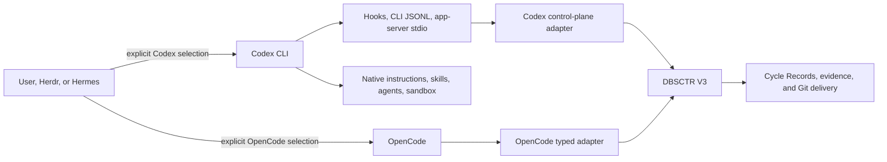
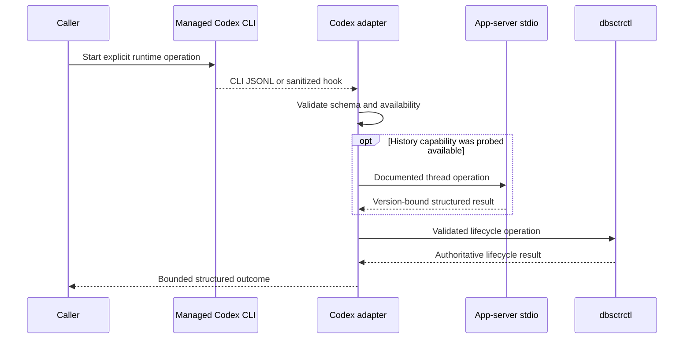
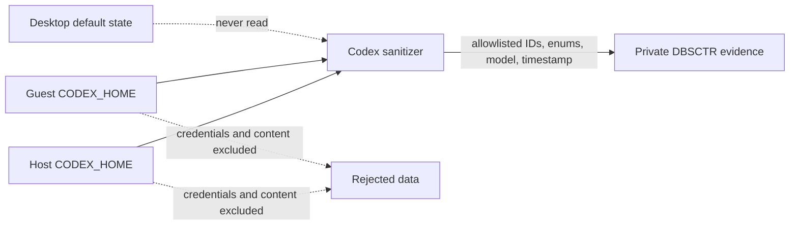

# Codex Control Plane

**Status:** Exact identity and generic history source delivered; Codex history adapter ready
**Created:** 2026-08-29
**Last updated:** 2026-08-30

## Engineering Profile And Overrides

The stable profile is [`PROFILE.md`](PROFILE.md).

| Field | Current Initiative override |
|---|---|
| Risk | Elevated: adds an authenticated agent runtime, private session integration, worker execution, and external-volume state |
| Delivery | Staged feature branches and draft pull requests; managed host/guest deployment only after affected gates pass |
| Scope | Host and Fedora guest CLI, native configuration, shared DBSCTR adapter, history, workers, recovery, and parity evidence |
| Non-goals | Desktop management, OpenCode retirement, MCP, plugin packaging, private storage parsing, SDK-bundled runtime, Rust rewrite, or Codex fork |

### RWUE-002 Remote Workspace Override

| Field | Value |
|---|---|
| Risk | Elevated: installs authenticated Codex CLI state for separate users on one shared remote host |
| Delivery | Draft pull request; disposable CentOS proof followed by separately approved two-user deployment |
| Scope | Checksum-pinned x86_64 CLI, dedicated user-local `CODEX_HOME`, managed configuration, independent login, and content-free readiness probe |
| Non-goals | Desktop state, shared API keys, copied host login, peer state access, automatic login, or private storage inspection |

Each remote user authenticates Codex independently after distribution succeeds.
Rendering, install, update, rollback, and shell startup require no Codex
credential. Readiness proves exact version, isolated home, managed configuration,
and authenticated command availability without retaining account, token, thread,
prompt, response, path, or runtime identity.

## Overview

The Codex control plane owns managed Codex CLI behavior while OpenCode remains a
supported peer. It uses Codex-native instructions, skills, agents, sandbox,
approvals, hooks, CLI JSONL, and supported app-server thread methods. One
short-lived Python adapter translates those surfaces into the shared DBSCTR V3
contracts without creating another lifecycle state machine.

## Problem

The repository now installs and configures Codex CLI beside deeply managed
OpenCode while keeping the separately managed desktop application isolated.
OpenCode-specific session, permission, history, worker, and recovery adapters
cannot be assumed to work for Codex. The control plane must prove equivalent
outcomes without copying client internals or weakening lifecycle authority.

## Goals

- Manage Codex CLI on the macOS host and Fedora 44 Lima guests.
- Keep OpenCode installed, supported, and unchanged during coexistence.
- Reuse the existing user skill directory and shared DBSCTR, Discovery, QA, PM,
  writing, DKS, and Graphify contracts.
- Use supported Codex interfaces and explicit capability availability.
- Manage the minimal native workflow roles Build, Discovery, Plan, Review, Explore, and Scout without mirroring every OpenCode agent.
- Preserve exact runtime, session, worker, evidence, approval, and recovery
  identity where Codex can prove it.
- Make full parity an evidence-backed outcome decision rather than an
  implementation-detail comparison.

## Non-goals

- Managing or redirecting the Codex desktop application.
- Retiring OpenCode or choosing one interactive default.
- Creating a Codex-specific DBSCTR version or state machine.
- Reading undocumented Codex SQLite or rollout JSONL storage.
- Adding an MCP server, plugin package, or custom slash-command framework.
- Adding the official Python or TypeScript SDK when installed CLI and stable
  app-server stdio provide the required interface.
- Rewriting the existing Python helper in Rust or maintaining a Codex fork.
- Claiming performance improvement without representative benchmarks.

## Bounded Context

`codex_control_plane` owns Codex CLI configuration semantics, global
instructions, native agents, sandbox and approvals, narrow hooks, capability
probes, supported session adapters, and Codex-specific parity evidence.

Adjacent contexts own:

| Context | Authority |
|---|---|
| `dbsctr_v3_lifecycle` | Lifecycle phases, gates, Cycle Records, evidence, approval semantics, federation, and conformance |
| `dotfiles_ai_distribution` | Package installation, rendered targets, dynamic config projection, host/guest deployment, and worker launch transport |
| `shell_auth_startup` | External-volume health, signed Herdr responsibility, shell credentials, and process-preserving recovery |
| `opencode_control_plane` | Existing OpenCode runtime and adapter behavior |
| `pm_kernel` and `writing_skills` | Ticket and writing workflows |
| `dbsctr_knowledge_store` | DKS retrieval and Graphify evidence |

## Visual Evidence

| Concern | Decision | Review question | Canonical source | Owner/change trigger |
|---|---|---|---|---|
| Boundary | `required: peer-runtime flowchart` | Which runtime owns native behavior and which contracts remain shared? | Architecture | Control-plane owner; runtime or ownership change |
| Interaction | `required: adapter sequence` | How do Codex events reach DBSCTR without becoming lifecycle authority? | Adapter behavior | Control-plane owner; adapter surface change |
| State | `required: capability transition table` | When may a capability be called parity-ready? | Parity contract | Control-plane owner; disposition change |
| Data/trust | `required: identity and evidence flowchart` | Which private data may cross into shared evidence? | Trust contracts | Control-plane owner; source or output change |
| Schema | `not_applicable`: Codex private schemas are explicitly non-contractual | What private Codex shape is supported? | Non-goals and contracts | A private schema is proposed |
| Dependency/deployment | `required: host/guest deployment flowchart` | Which runtime, home, and adapter run in each boundary? | Distribution feature spec | Distribution owner; topology change |
| Quantitative | `not_applicable`: no measured performance decision exists | Does timing justify another language or service? | Performance contract | A benchmarked decision exists |



**Text Equivalent:** User and worker paths explicitly choose Codex or OpenCode.
Codex loads its native control surfaces. Only bounded hook, CLI JSONL, and
version-probed documented app-server data enter the short-lived Codex adapter. The adapter and OpenCode's
existing typed adapter both invoke one DBSCTR V3 lifecycle. Cycle Records,
evidence, and Git delivery remain DBSCTR authority.



**Text Equivalent:** A caller explicitly launches managed Codex. CLI JSONL or a
sanitized hook enters the short-lived adapter, which validates schema and
availability. History operations use documented app-server stdio only after a
successful capability probe. The adapter invokes `dbsctrctl`, which alone
changes lifecycle state, and returns a bounded result.



**Text Equivalent:** Host and guest Codex homes are independent sources. Desktop
state is never read. The sanitizer permits only opaque identities, bounded event
and workspace enums, model ID, and timestamp into private DBSCTR evidence.
Transient `cwd` is reduced to a workspace enum and `transcript_path` is bounded
then discarded without reading it. Credentials, prompts, transcripts, tool
inputs and outputs, URLs, account identity, and every other filesystem path are
rejected.

```mermaid
stateDiagram-v2
    accTitle: Codex capability parity states
    accDescr: A requested capability begins captured. A successful version-bound probe makes it available; a native, reused, or adapted implementation with passing evidence makes it parity-ready. Missing, ambiguous, private-schema-dependent, or failed evidence blocks parity. An approved not-applicable outcome is terminal without implementation.
    [*] --> Captured
    Captured --> Available: version-bound probe passes
    Captured --> Blocked: missing, ambiguous, or private-only
    Available --> ParityReady: implementation evidence passes
    Available --> Blocked: implementation or evidence fails
    Captured --> NotApplicable: approved rationale
    Blocked --> Available: corrected probe passes
```



**Text Equivalent:** Every requested capability starts captured. A
version-bound successful probe makes it available. Passing native, reused, or
adapted evidence makes it parity-ready. Missing, ambiguous, private-only, or
failed evidence blocks parity. An explicitly approved not-applicable outcome is
terminal without implementation.

## Ubiquitous Language

| Term | Definition |
|---|---|
| Peer Runtime | Codex or OpenCode selected explicitly without retiring the other runtime. |
| Native Surface | An officially supported Codex instruction, CLI, hook, agent, sandbox, approval, or app-server interface. |
| Codex Adapter | Short-lived Python process that validates Codex data and invokes shared lifecycle commands. |
| Runtime Identity | Exact harness, version, session, turn, provider, model, and agent facts where authoritative. |
| Capability Availability | `available`, `unavailable`, `partial`, or `not_requested`, with a bounded reason. |
| Outcome Parity | Equivalent behavior and safety achieved natively, by reuse, or through a thin adapter. |
| Identity Probe | Controlled comparison of hook and app-server identifiers on both supported platforms. |

## Behavior

### Runtime coexistence

- Given both runtimes are installed, when a user starts one explicitly, then it
  receives only its own configuration and state.
- Given automation has no runtime override, when it resolves the runtime, then it
  selects OpenCode.
- Given a selected runtime is unavailable, when launch or resume runs, then it
  fails without falling back to the other runtime.
- Given a live probe or worker has no existing login in its host or guest boundary,
  when Codex is requested, then it fails closed without auto-authentication, shared
  API-key injection, or authentication copying.

### Dedicated CLI state

- Given the centralized state root is configured, when Codex CLI starts, then
  `CODEX_HOME` is `<root>/codex`.
- Given the root is empty, when Codex CLI starts, then `CODEX_HOME` is
  `~/.local/state/dotfiles-ai/codex`.
- Given desktop Codex exists, when managed CLI configuration applies, then
  `~/.codex` remains untouched.

### Native-first behavior

- Given Codex natively provides a requested outcome, when parity is assessed,
  then the native surface is used and no duplicate implementation is added.
- Given installed CLI commands and hooks satisfy an adapter need, when the
  adapter runs, then no SDK-bundled second Codex runtime is installed.
- Given only private storage exposes a field, when the field is requested, then
  it is unavailable rather than parsed or inferred.

### Hooks and evidence

- Given a configured hook runs, when the adapter receives its payload, then it
  emits only event enum, opaque session and turn IDs, model ID, timestamp, and
  workspace enum `primary_worktree`, `cycle_worktree`, or `unknown`.
- Given the documented payload contains `transcript_path`, when the adapter
  validates the hook, then it bounds and discards that field without opening,
  canonicalizing, logging, exposing, or persisting it.
- Given a hook contains prompt, transcript, tool input or output, environment,
  URL, credential, account identity, or any filesystem path except documented
  transient `cwd` and `transcript_path`, then the adapter rejects the event
  without persistence.
- Given a hook fails, when lifecycle work continues, then no Cycle Record or gate
  changes because a hook never owns lifecycle state.

### Session correlation and recovery

- Given the identity probe proves one exact hook-to-thread mapping on macOS and
  Fedora, when attach or resume runs, then the versioned mapping may supply
  authoritative runtime identity.
- Given the mapping is missing or conflicting, when attach, history, or recovery
  requires exact identity, then the operation is unavailable or ambiguous and
  fails closed.
- Given an exact supported thread can resume, when recovery runs, then it resumes
  only that thread and verifies returned identity; it never creates a substitute.

### Outcome parity

- Given a requested capability is native, reused, adapted, or explicitly not
  applicable with an approved rationale, when all required evidence passes, then
  the capability passes parity.
- Given a requested outcome is missing, unexplained, inferred, or dependent on a
  private schema, when parity is assessed, then parity fails.

## Interfaces

### History adapter slice

The ready adapter is the private, read-only boundary between stable Codex
app-server methods and the delivered `generic-history-source-pages` validator. Its complete
wire, conversion, privacy, and body-free probe contract is
[`history-adapter.md`](features/history-adapter.md). Generic pages never become
shell or hosted-provider output; they remain in one local adapter process for a
later reducer.

`codex-history-parity` remains captured behind the adapter. Discovery must still
define closed review, Incident, telemetry, immutable-capture, and benchmark
reducers before promoting that slice. A source page alone does not satisfy any
consumer or benchmark contract.

Only supported user-message and final agent-message text may enter future
`content`. Text is bounded and privacy-validated locally; an unsafe item is
discarded, safe siblings remain ordered, and content availability becomes
`partial`. Reasoning, images, credentials,
high-entropy tokens, URLs, absolute paths, tool commands, arguments, output,
environment, and raw protocol fields never enter a page. Supported tool items
may contribute only bounded status signals and counts. Missing token or cost data
is explicitly unavailable and is never inferred. The exact shared page contract is
[`harness-history-source.schemas.json`](../dbsctr_v3_lifecycle/features/harness-history-source.schemas.json).

### Host foundation slice

`codex-host-foundation` is the first of two sequential pull requests. It owns the
portable managed source for global `AGENTS.md`, Codex configuration, six custom
agent definitions, bounded hooks, the sanitizer, and the short-lived Python
adapter. Build, Discovery, Plan, Review, Explore, and Scout are the complete
initial custom-agent set. Model and provider selection remain inherited runtime
configuration rather than duplicated per agent. Plan, Review, Explore, and Scout
are read-only roles; Build and Discovery receive write capability only from an
explicit launch sandbox and approval policy.

This slice adds fake-command and schema tests but does not install Codex, project
files into `CODEX_HOME`, authenticate, claim native identity, or deploy a running
adapter. `codex-distribution` owns those actions after this slice is delivered.

Portable source is staged under
`~/.config/dotfiles-ai/codex-managed/` as `config.toml`, `AGENTS.md`, and six
`agents/*.toml` files. Distribution later projects those files into the managed
CLI home, where Codex `0.151.0` discovers custom roles recursively as
`$CODEX_HOME/agents/**/*.toml`. The staged `config.toml` uses inline command hooks
that invoke `codex-control-plane hook EVENT`; no machine path, provider, model,
credential, or private runtime state is embedded in source.

#### Native role policy

| Role | Mutation boundary | Network boundary | Purpose |
|---|---|---|---|
| Build | `workspace-write` only when explicitly launched; cannot relax parent sandbox | Inherited, off unless launch authorizes it | Implement approved owned paths |
| Discovery | `workspace-write` only for approved normative artifacts | Inherited, off unless bounded research is authorized | Refine contracts and readiness |
| Plan | `read-only` | Off | Produce implementation handoff |
| Review | `read-only` | Off | Find correctness and safety gaps |
| Explore | `read-only` | Off | Inspect local source |
| Scout | `read-only` | Explicitly authorized public research only | Research public external contracts without private repository content |

Every custom agent inherits the selected model and provider. No child may relax
its parent's sandbox or approval mode, and no role configuration embeds secrets,
account identity, or machine paths.

#### Initial hook and adapter contract

The first slice configures identity-only `SessionStart`, `SessionEnd`,
`SubagentStart`, `SubagentStop`, and `Stop` hooks. Tool, permission, prompt,
compaction, and notification hooks remain unconfigured until a later slice has a
specific parity need. These are inline command hooks in managed `config.toml`,
not a second hook-discovery or lifecycle mechanism. The adapter converts
version-probed documented payloads to:

```json
{
  "schema_version": 1,
  "adapter_revision": "codex-adapter-1",
  "event": "SessionStart",
  "session_id": "opaque-id",
  "workspace": "primary_worktree",
  "observed_at": "2026-08-30T00:00:00Z"
}
```

`event`, `session_id`, `workspace`, and adapter-owned `observed_at` are required.
Optional `turn_id` and `model_id` are present only when the installed documented
payload supplies them. Opaque IDs and model IDs are ASCII presentation IDs of at
most 128 bytes. Workspace is `primary_worktree`, `cycle_worktree`, or `unknown`.

Documented raw `cwd` is a transient classification input. It must be an absolute
UTF-8 path of at most 4096 bytes with no NUL or control characters, resolve to an
existing directory, and canonicalize successfully. The adapter compares that
canonical path against canonical Git worktree roots using root containment,
classifies a unique primary or active cycle worktree, otherwise emits `unknown`,
and discards raw and canonical paths before output, storage, or logging.

Documented raw `transcript_path` is a separate transient transport field. It must
be a UTF-8 string of at most 4096 bytes with no NUL or control characters. The
adapter never opens, resolves, canonicalizes, checks the existence of, logs,
exposes, or persists that field; it discards the value immediately after bounded
schema validation. Any other path-bearing field rejects the event.

Hook stdin is at most 64 KiB, the normalized record at most 8 KiB, bounded reasons
at most 256 ASCII bytes, and hook processing at most five seconds. Version/help
probes allow at most 1 MiB and 30 seconds; app-server handshake and each method
allow at most 1 MiB and ten seconds. Unknown required fields, duplicate JSON keys,
invalid UTF-8, non-ASCII identity, overflow, timeout, or content-bearing prompt,
transcript content, tool argument/output, environment, URL, credential, or
account fields produce no identity record.

`codex-control-plane` returns `0` only for a validated command result, `1` for a
validation, capability, runtime, or transport failure, and `2` for CLI usage.
Identity hook wrappers never mutate lifecycle state or write stdout; after a
bounded private success or failure record they return `0` to avoid making an
observability hook an execution authority. Owner-only hook records retain only
the normalized envelope or a bounded failure enum and expire after 24 hours.

The managed executable is `codex-control-plane`, implemented in Python without a
daemon or private database:

```text
codex-control-plane probe
codex-control-plane hook EVENT
codex-control-plane session list|read|resume|fork
codex-control-plane dbsctr OPERATION
```

The first adapter stage uses installed `codex --version`, `codex exec --json`,
and documented command hooks. The frozen-version identity probe validated the
installed `codex app-server` stdio handshake and documented target methods
`thread/list`, `thread/read`, `thread/resume`, and `thread/fork`. The managed
session commands remain unavailable until the history-parity adapter is built.
Experimental item/turn pagination and WebSocket transport are excluded.
Every stdio connection completes documented `initialize` and `initialized`
handshake messages without opting into `experimentalApi` before a thread method.

The adapter executes argument vectors without shell interpolation, bounds time
and output, rejects malformed or unknown required fields, and emits only
schema-validated JSON. `dbsctrctl` remains the sole lifecycle writer.

## Evidence Sources

The captured interface and release hypotheses derive from official public
sources retrieved during Discovery on 2026-08-29:

- Codex release `rust-v0.151.0`:
  <https://github.com/openai/codex/releases/tag/rust-v0.151.0>
- Codex configuration reference:
  <https://developers.openai.com/codex/config-reference/>
- Codex app-server reference:
  <https://developers.openai.com/codex/app-server/>
- Codex hooks reference:
  <https://developers.openai.com/codex/hooks/>
- Codex repository and protocol source:
  <https://github.com/openai/codex>

These citations justify a bounded implementation target, not runtime evidence.
The installed host and Fedora release must revalidate command, hook, protocol,
asset, and digest claims before activation.

## Parity Contract

| Capability | Initial disposition | Required evidence |
|---|---|---|
| Global and project instructions | Native | Loaded-source probe and precedence test |
| Skills | Native/reuse | Existing `~/.agents/skills` discovery and invocation |
| Agents, models, sandbox, approvals | Native | Rendered config, negative policy tests, runtime smoke |
| DBSCTR kernel, gates, worktrees, delivery | Reuse | Shared conformance fixtures |
| Discovery, QA, PM, writing, DKS, Graphify | Reuse/adapter | Workflow-specific smoke and trust-boundary tests |
| Runtime identity and attach | Adapter | Cross-platform identity probe and mismatch rejection |
| Incidents, review, history, telemetry, benchmarks | Adapter | Supported thread/event evidence and bounded schemas |
| Herdr, Hermes, autonomous workers | Adapter | Exact runtime/session binding and no-fallback tests |
| Federation and recovery | Adapter | Immutable capture, isolation, exact resume, and rollback evidence |
| OpenCode typed tools and 1Password MCP | Not applicable | OpenCode remains authoritative; no copied Codex mechanism |

An `unavailable` disposition is valid during staged delivery but does not pass
final parity for a requested outcome without a separately approved scope change.

## Contracts

- OpenCode remains installed and its existing tests remain regression authority.
- `CODEX_HOME` is explicit and wrapper-scoped; it is not exported to the desktop
  application or broad GUI session.
- Host and each guest authenticate separately.
- Codex release and adapter revisions are exact non-secret evidence.
- Runtime identity comes only from supported structured interfaces.
- Live probes and workers require `codex login status` to prove an existing login
  inside the current boundary; the control plane never performs login.
- Cwd and worktree data is reduced to validated repository-relative identity
  before persistence or model exposure.
- The documented hook `transcript_path` key is bounded and discarded; the
  adapter never accesses the referenced transcript or retains its path.
- Hook records are owner-only, bounded, retained under private state, and never
  contain content fields.
- App-server compatibility is version-probed and unknown required fields fail
  closed.
- Provider, model, agent, session relation, and capability availability are
  explicit; no timestamp, path, pane, or configuration guess supplies identity.
- No runtime failure changes provider family or peer runtime automatically.
- Performance and implementation-language changes require representative
  benchmark evidence.

## Risks And Assumptions

Facts:

- Codex CLI `0.151.0` is installed through the managed wrapper on the host and
  every registered Fedora guest with isolated state and authentication.
- The frozen baseline is public release `0.151.0`; each identity probe must
  revalidate its runtime, hook shape, and app-server methods.
- Official hook documentation does not guarantee identity equality across
  releases; the frozen `0.151.0` host and Fedora probe found hook `session_id`,
  CLI JSONL thread identity, app-server `thread.id`, and root `thread.sessionId`
  exactly equal.
- Official `0.151.0` source includes `transcript_path` in common hook payloads,
  recursive `agents/**/*.toml` role discovery, and inline command hooks.
- The official Python SDK source at the target tag pins an older CLI runtime, so
  it is not the baseline adapter.

Risks:

- Codex hook and app-server contracts may drift across releases.
- Homebrew may advance before the pinned guest binary, blocking version parity.
- Supported thread reads may not expose every OpenCode-derived history outcome.
- Native provider routing may not enforce every OpenCode child-agent restriction.
- External-volume denial may block new CLI work while existing processes remain
  alive and require explicit retry.

## Gate Ledger

| Gate | Applicability | Result | Authority | Owner |
|---|---|---|---|---|
| Domain | required | pending | This specification | Primary |
| Behavior | required | pending | Scenario and adapter tests | Primary |
| Spec | required | pending | This README and `OPERATION.md` | Primary |
| Contract | required | pending | Schema and conformance tests | Primary |
| Test-driven implementation | required | pending | Focused Python and render tests | Primary |
| Refactor | required | pending | Diff and duplication review | Primary |
| Review/Integrate | required | pending | Affected QA and independent review | Primary |
| Release | not_applicable: no separately published artifact | not_run | Engineering Profile | Primary |
| Deploy | required for managed host/guest slices | pending | Apply and runtime smoke | Primary |
| Operate | required | pending | Identity, worker, history, and recovery probes | Primary |
| Maintain/Retire | required | pending | Upgrade, rollback, coexistence, and removal evidence | Primary |

## Validation

```bash
python3 dot_local/bin/executable_dbsctrctl initiative-check --manifest docs/initiatives/codex-cli-integration/MANIFEST.json --json
uv run --group test pytest tests/test_codex_control_plane.py tests/test_dbsctr_lifecycle.py tests/test_portable_distribution.py -q
python3 -m py_compile dot_local/bin/executable_codex-control-plane dot_local/bin/executable_dbsctrctl
git diff --check
```

Focused `tests/test_codex_control_plane.py` coverage preceded the first source
change. Live validation additionally requires exact host and guest version, state
isolation, hook correlation, version-probed documented app-server methods, worker launch/resume,
federation, and process-preserving recovery evidence.
