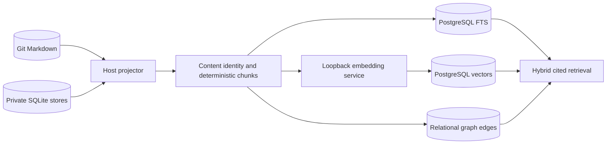
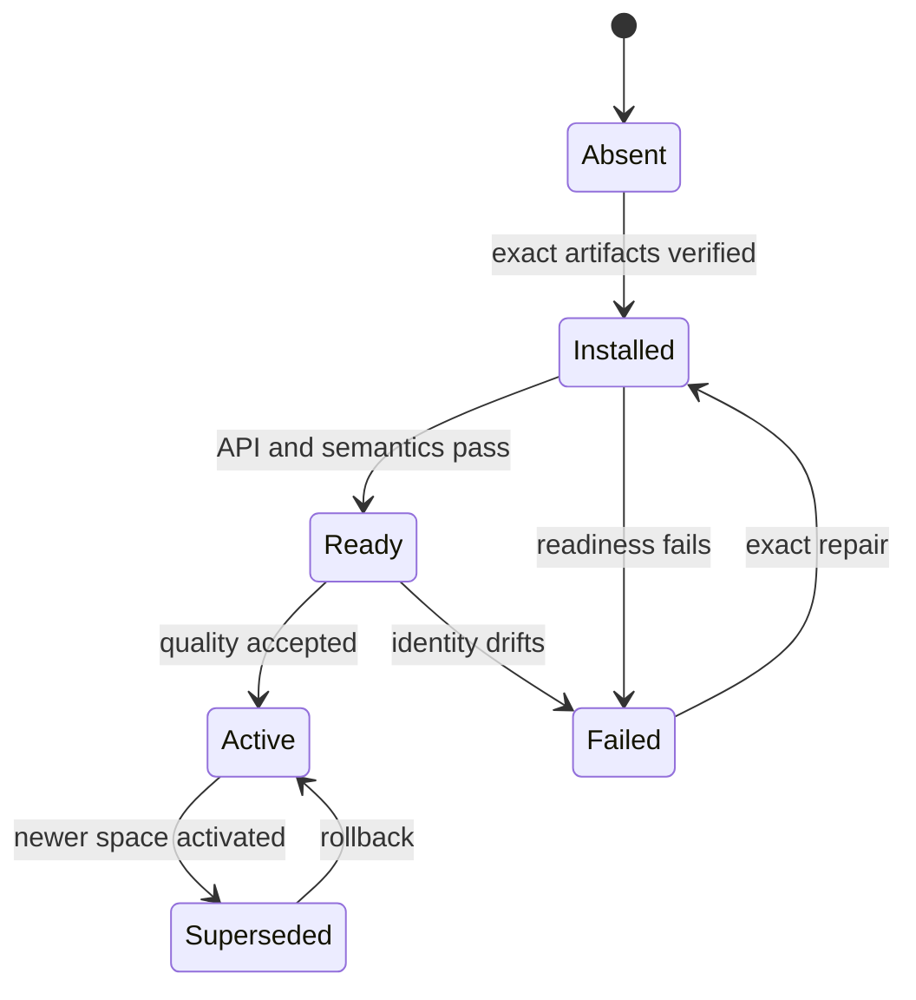

# DBSCTR Knowledge Store

## Engineering Profile

| Field | Default |
|---|---|
| Deliverable | Private local knowledge projection, retrieval services, vector index, and property graph for DBSCTR evidence |
| Owner | dotfiles-ai maintainer |
| Runtime | macOS host, Python 3.12+, Git, SQLite, llama.cpp, optional PostgreSQL 19 and pgvector |
| Platforms | Apple Silicon macOS host and configured Fedora Lima workspace |
| Compatibility | Git and existing SQLite stores remain authoritative until a separately approved canonical migration |
| Trust/data | Private source, transcript, tool, credential, and derived embedding data; loopback-only service boundaries |
| Delivery | Feature branch and draft pull request; local deployment only after affected gates pass |
| Authorities | Fixed Git revisions, source digests, focused tests, launchd validation, embedding fixtures, and runtime health probes |

### DKS-001 Cycle Overrides

| Field | Value |
|---|---|
| Risk | `elevated`: deploys a long-lived local model service that will later process private DBSCTR data |
| Delivery intent | Install and deploy one pinned loopback-only embedding runtime, then deliver a draft pull request |
| Scope | Official Qwen3 Embedding 8B Q4_K_M GGUF, pinned llama.cpp macOS arm64 runtime, immutable manifest, launchd supervision, and semantic/runtime validation |
| Non-goals | SQLite ingestion, PostgreSQL schema changes, pgvector, corpus embedding, reranking, graph extraction, and database-canonical writes |

Applicable modules are ML/AI, data, security, and local deployment operations.

## Overview

The DBSCTR Knowledge Store makes committed documents and private local evidence
retrievable without changing their authority. Git Markdown and existing SQLite
stores remain canonical. PostgreSQL will initially be a rebuildable structured,
lexical, vector, and graph projection. Any later database-canonical domain must
define its own writes, audit, export, backup, and conflict contracts.

The first slice owns only the durable embedding runtime. `pm_kernel` continues to
own ticket and Jira workflows and becomes one future source of knowledge rather
than the owner of the database or retrieval system.

## Goals

- Preserve exact source revision, content digest, chunker, model, runtime, and
  retrieval provenance.
- Project Git Markdown, DBSCTR evidence, OpenCode history, and other approved
  local sources without requiring direct cross-VM SQLite access.
- Combine PostgreSQL full-text search, dense retrieval, and native SQL/PGQ graph
  traversal while retaining explicit citations.
- Run private embedding and reranking services locally with immutable model and
  runtime identities.
- Make every projection disposable and replayable while source systems remain
  authoritative.

## Non-Goals

- Directly mounting a live SQLite WAL database into PostgreSQL, Lima, or Podman.
- Treating embeddings, graph inference, or search rank as authoritative facts.
- Automatically sending private corpus text to hosted model providers.
- Embedding every repeated event snapshot without content deduplication.
- Moving canonical authority to PostgreSQL in DKS-001.

## Bounded Context

`dbsctr_knowledge_store` owns source registration, immutable snapshots, content
identity, deterministic chunking, embedding spaces, retrieval fusion, graph
projections, retrieval citations, and local model-service operation.

Adjacent contexts:

- `dbsctr_v3_lifecycle` owns cycles, gates, evidence, review history, benchmarks,
  and sanitized typed interfaces.
- `pm_kernel` owns local tickets, Jira projections, and its existing PostgreSQL
  ticket cache until a later migration transfers shared database ownership.
- `opencode_control_plane` owns OpenCode providers, tools, permissions, and the
  private OpenCode SQLite source.
- `opencode_inference_cost` owns usage attribution and cost report semantics.
- `dotfiles_ai_distribution` owns host/guest configuration and service delivery.

## Ubiquitous Language

| Term | Definition |
|---|---|
| Source Authority | Git commit, SQLite transaction snapshot, or typed private ledger that owns the original data. |
| Source Revision | Immutable commit/blob, snapshot identity, or event cursor used for one projection. |
| Content Object | Canonical byte/text value identified by a cryptographic digest and linked to one or more source records. |
| Knowledge Chunk | Deterministic retrieval unit with source ranges, heading or turn context, and content digest. |
| Embedding Space | Immutable model, runtime, quantization, pooling, normalization, dimension, instruction, tokenizer, and chunker contract. |
| Projection | Rebuildable PostgreSQL representation of source records, chunks, vectors, or graph relationships. |
| Asserted Edge | Deterministic source relationship or model-derived relationship with explicit provenance and confidence. |
| Retrieval Citation | Source identity, revision, range, and digest returned with a result. |

## Domain Model

Entities include `Source`, `SourceRevision`, `SourceRecord`, `ContentObject`,
`KnowledgeChunk`, `EmbeddingSpace`, `EmbeddingJob`, `Embedding`, `GraphNode`,
`GraphEdge`, `SyncRun`, and `RetrievalResult`.

Events include `SourceSnapshotted`, `RecordProjected`, `ContentDeduplicated`,
`ChunkDerived`, `EmbeddingRequested`, `EmbeddingCompleted`, `EmbeddingRejected`,
`GraphProjected`, `RetrievalExecuted`, and `EmbeddingSpaceActivated`.

## Behavior

### Authority and projection

**Scenario: Rebuild without changing source authority**

- Given committed Git artifacts and consistent local SQLite snapshots
- When the knowledge projection is rebuilt
- Then PostgreSQL records exact source revisions and deterministic derivatives
- And no source record is rewritten through the projection path

**Scenario: Avoid direct live SQLite federation**

- Given OpenCode writes a host SQLite database in WAL mode
- When DBSCTR synchronizes that source
- Then a host projector reads a consistent snapshot or bounded event range
- And PostgreSQL never mounts or queries the live SQLite, WAL, or SHM files

### Embedding runtime

**Scenario: Start one immutable embedding space**

- Given the configured external model root contains the exact approved GGUF
- And the installed llama.cpp archive and model match their approved SHA-256 values
- When the managed service starts
- Then it binds only to host loopback
- And readiness identifies the expected runtime, model, dimensions, pooling, and normalization

**Scenario: Fail closed on missing external state**

- Given the external volume, runtime, model, manifest, or API credential is absent or changed
- When launchd starts or restarts the service
- Then the process exits without downloading, selecting another model, or binding a port
- And the prior projection remains readable without a substitute embedding space

**Scenario: Preserve Qwen retrieval semantics**

- Given one instructed query, one relevant document, and one irrelevant document
- When the embedding service processes the fixture
- Then every vector has the configured dimension and approximately unit norm
- And the query-to-relevant dot product exceeds query-to-irrelevant

**Scenario: Keep model updates isolated**

- Given a model, quantization, runtime, instruction, tokenizer, dimension, pooling,
  normalization, or chunker changes
- When the candidate is evaluated
- Then it receives a new embedding-space identity and separate vectors
- And activation never overwrites the previous rollback space

### Retrieval and graph

**Scenario: Return evidence rather than inferred authority**

- Given lexical, dense, and graph candidates
- When DBSCTR retrieves knowledge
- Then every result includes source revision, range, digest, and score components
- And model-derived edges remain distinct from deterministic source relationships

## Interfaces

### DKS-001 configuration

```toml
[dotfiles_ai.knowledge_store]
enabled = false
model_root = ""
embedding_port = 11435
embedding_dimensions = 4096
embedding_context_tokens = 4096
```

When disabled, no runtime, model, credential, LaunchAgent, or listener is created.
When enabled, `model_root` must be an absolute existing directory. Runtime files
live beneath the configured durable state root; model files live beneath the
configured model root.

### Embedding-space identity

DKS-001 pins:

| Property | Value |
|---|---|
| Source model | `Qwen/Qwen3-Embedding-8B-GGUF` at commit `69d0e58a13e463cd99a9b83e3f5fee7c10265fab` |
| Model file | `Qwen3-Embedding-8B-Q4_K_M.gguf` |
| Model SHA-256 | `3fcd3febec8b3fd64435204db75bf0dd73b91e8d0661e0331acfe7e7c3120b85` |
| Runtime | llama.cpp `b10505`, macOS arm64 archive |
| Runtime archive SHA-256 | `d3383ae8c2a435a2ded122b243e971ca96b9bee6fde29a3b9889e85c8cf19176` |
| Pooling | Last valid token |
| Normalization | L2 |
| Native output dimension | 4096 |
| Operational input ceiling | 4096 tokens |
| Query format | `Instruct: Retrieve authoritative DBSCTR engineering evidence\nQuery:<query>` (`dks-query-v1`) |
| Document format | Deterministic chunk text without query instruction |

llama.cpp `b10505` exposes the model's native 4096 dimensions and no output-
dimension request parameter. Actual vector storage begins only after a later
quality cycle validates explicit client-side MRL truncation and renormalization
to 4000 dimensions, the maximum indexed `halfvec` size supported by pgvector.

### Planned synchronization

The host projector will use SQLite Online Backup for initial/reconciliation
snapshots and ordered OpenCode event cursors for incremental work. It will stream
client-side `COPY FROM STDIN` batches into PostgreSQL staging and transactionally
upsert records plus checkpoints. Repeated event payloads will link to one content
object rather than produce duplicate chunks and vectors.

## Contracts

- The service binds only to `127.0.0.1`; no LAN, wildcard, guest bridge, or public
  listener is permitted.
- Production startup uses local immutable paths only. It never uses `-hf`,
  `latest`, model galleries, or runtime downloads.
- Runtime archive, model file, and manifest digests must pass before launch.
- The external model volume is a launch precondition and failure never falls back
  to another disk or model.
- Query and document formats differ and are versioned.
- Embedding responses must have the expected count, order, finite values,
  dimension, and norm before persistence.
- Active secrets are resolved only through authorized live boundaries. Revoked
  credential history may be retained only after rejection is verified and its
  retrieval policy is explicit.
- Runtime logs and metrics never contain prompt, document, vector, credential, or
  source-path content.
- Source authorities remain readable when the embedding runtime is unavailable.

## Security And Operations

The service runs as the logged-in user under launchd, requires the mounted
external model and state volumes, and exposes only a loopback endpoint. A private
API key file is generated locally with mode `0600`; the value is never rendered
by chezmoi or committed. Disablement unloads the listener before removing managed
entry points and retains the private key with immutable rollback assets. A fresh
disabled installation creates none of them. Health checks send fixed public
fixture text only.

Runtime and model upgrades create new immutable directories and manifests. The
loader validates the candidate, starts it, verifies semantic readiness, and
unloads a rejected candidate while keeping prior embedding-space assets available
for explicit rollback. It does not delete models, vectors, or runtime versions
automatically.

## Validation Strategy

- Render enabled and disabled configurations and reject unsafe paths, ports,
  dimensions, and incomplete state.
- Verify exact runtime/model URLs, revisions, sizes, and SHA-256 values.
- Lint the LaunchAgent and shell wrappers.
- Prove loopback-only binding and API-key rejection.
- Verify dimension, finite values, unit norm, determinism, instructed-query
  change, and relevant-over-irrelevant similarity.
- Restart the LaunchAgent and prove the same immutable model identity recovers.
- Run affected distribution, PM, control-plane, and knowledge-store tests.

## Visual Evidence

| Concern | Decision | Review question | Canonical source | Owner/change trigger |
|---|---|---|---|---|
| Boundary | required: authority and projection flow | Which system may change source truth? | Overview and Contracts | Knowledge owner; authority change |
| Interaction | required: authority and projection flow | How does private source become cited retrieval? | Behavior and Interfaces | Knowledge owner; pipeline change |
| State | required: embedding-space lifecycle | How are candidate spaces activated and rolled back? | Contracts and Operations | Model owner; identity change |
| Data/trust | required: authority and projection flow | Where may private content and vectors move? | Security and Operations | Security owner; trust change |
| Schema | deferred: PostgreSQL schema is outside DKS-001 | - | Planned synchronization | Later schema cycle |
| Dependency/deployment | required: embedding-space lifecycle | What must exist before the service starts? | DKS-001 configuration | Runtime owner; deployment change |
| Quantitative | deferred: benchmark results do not yet exist | - | Validation Strategy | Quality evaluation cycle |



**Text Equivalent:** Git Markdown and private SQLite stores own source truth. A
host projector reads fixed Git revisions and consistent SQLite snapshots, creates
content-addressed records and deterministic chunks, and writes rebuildable
PostgreSQL full-text and relational graph projections. A loopback-only service
creates versioned vectors. Retrieval combines those projections and returns exact
source citations; it cannot rewrite the source authorities.



**Text Equivalent:** An embedding space is absent until its exact runtime, model,
and manifest are verified. API and semantic checks make it ready; a later quality
decision may activate it. A newer active space supersedes rather than deletes the
old one, permitting rollback. Missing or changed assets fail closed and require
exact repair before readiness can return.

## Gate Ledger

| Gate | Applicability | Result | Planned evidence |
|---|---|---|---|
| Domain | required | pending | Bounded context, authority, language, trust boundaries, and ownership |
| Behavior | required | pending | Runtime identity, failure, semantic, update, and retrieval scenarios |
| Spec | required | pending | Config, artifact identities, service topology, and synchronization interface |
| Contract | required | pending | Loopback, digest, privacy, failure, compatibility, and rollback invariants |
| Test-driven implementation | required | pending | Red/green rendering, installer, wrapper, service, and semantic checks |
| Refactor | required | pending | Minimal shared configuration and removal of stale PM database ownership claims |
| Review/Integrate | required | pending | Independent security/runtime review and upstream reconciliation |
| Release | not_applicable | not_run | No repository package or public artifact is published |
| Deploy | required | pending | Scoped chezmoi preview/apply and exact artifact installation |
| Operate | required | pending | LaunchAgent recovery, listener, readiness, metrics, and semantic smoke |
| Maintain/Retire | required | pending | Version pin, update/rollback, retained assets, and removal procedure |

## Decisions And Risks

- PostgreSQL remains a rebuildable cache in the first knowledge-store phases.
- A host projector is preferred over SQLite FDWs because the live WAL source is
  outside the Lima/Podman server filesystem and current FDWs do not verify
  PostgreSQL 19 compatibility.
- llama.cpp is preferred over GUI or wrapper runtimes because pooling,
  normalization, offline startup, versioning, and process operation are explicit.
- Qwen3 Embedding 8B is a quality hypothesis. A later frozen local bakeoff decides
  whether 8B, 4B, or another model becomes the active production space.
- PostgreSQL 19 and SQL/PGQ remain prerelease technology and cannot become sole
  authority during this cycle.
