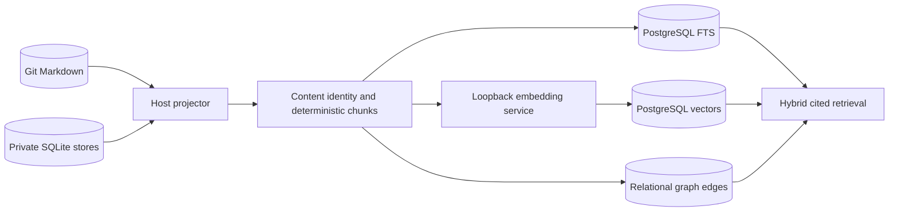
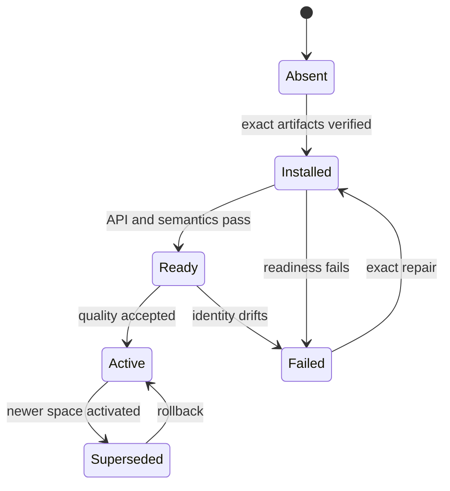
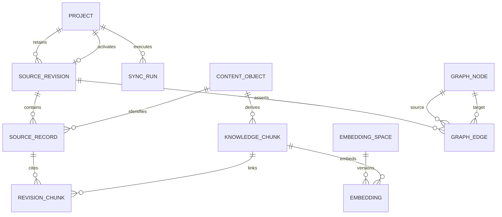
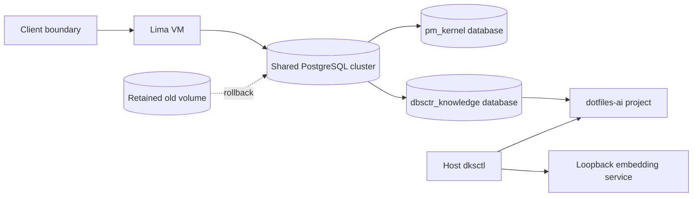
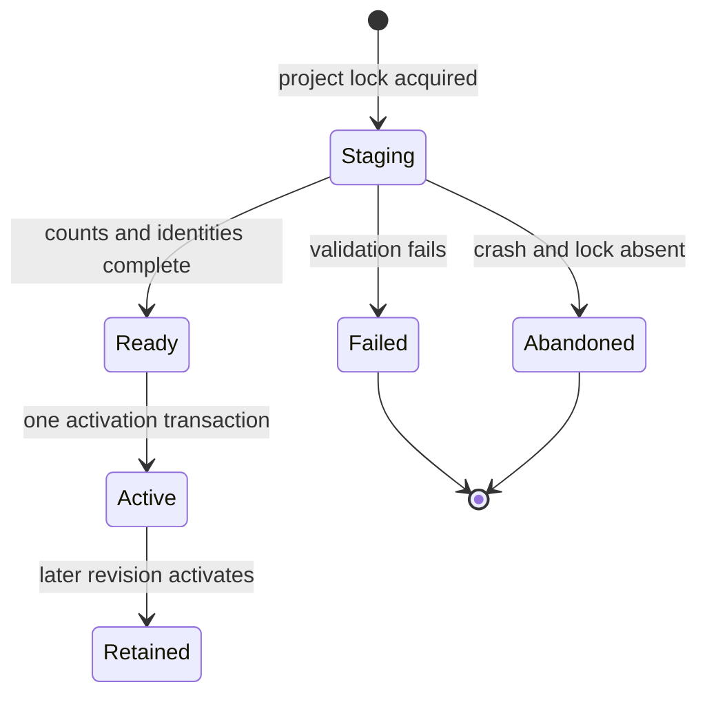

# DBSCTR Knowledge Store

## Engineering Profile

| Field | Default |
|---|---|
| Deliverable | Private local knowledge projection, retrieval services, vector index, and property graph for DBSCTR evidence |
| Owner | dotfiles-ai maintainer |
| Runtime | macOS host, Python 3.12+, Git, SQLite, llama.cpp, PostgreSQL 19, and pgvector |
| Platforms | Apple Silicon macOS host and configured Fedora Lima workspace |
| Compatibility | Git and existing SQLite stores remain authoritative until a separately approved canonical migration |
| Trust/data | Private source, transcript, tool, credential, and derived embedding data; loopback-only service boundaries |
| Delivery | Feature branch and draft pull request; local deployment only after affected gates pass |
| Authorities | Fixed Git revisions, source digests, focused tests, launchd validation, embedding fixtures, and runtime health probes |

### DKS-001 Cycle Overrides

| Field | Value |
|---|---|
| Risk | `elevated`: deploys a long-lived local model service that will later process private DBSCTR data |
| Delivery intent | Install and deploy one pinned loopback-only embedding runtime, then deliver a draft pull request |
| Scope | Official Qwen3 Embedding 8B Q4_K_M GGUF, pinned llama.cpp macOS arm64 runtime, immutable manifest, launchd supervision, and semantic/runtime validation |
| Non-goals | SQLite ingestion, PostgreSQL schema changes, pgvector, corpus embedding, reranking, graph extraction, and database-canonical writes |

### DKS-002 Cycle Overrides

| Field | Value |
|---|---|
| Risk | `elevated`: migrates the shared per-client PostgreSQL image, provisions a credential, and projects private local knowledge |
| Delivery intent | Deploy the first exact-commit hybrid projection locally, then deliver a draft pull request |
| Scope | dotfiles-ai `docs/specs` and `docs/tickets`; PostgreSQL FTS, pgvector exact search, deterministic SQL/PGQ graph, fixed RRF, and `dksctl` JSON CLI |
| Isolation | One client VM and knowledge database per trust domain; mandatory project scope within each database |
| Non-goals | OpenCode SQLite, other repositories, automatic sync, ANN indexes, MRL truncation, inferred graph edges, reranking, or canonical database writes |

Applicable modules are ML/AI, data, security, and local deployment operations.

## Overview

The DBSCTR Knowledge Store makes committed documents and private local evidence
retrievable without changing their authority. Git Markdown and existing SQLite
stores remain canonical. PostgreSQL will initially be a rebuildable structured,
lexical, vector, and graph projection. Any later database-canonical domain must
define its own writes, audit, export, backup, and conflict contracts.

The first slice owns only the durable embedding runtime. `pm_kernel` continues to
own ticket and Jira workflows and becomes one future source of knowledge rather
than the owner of the database or retrieval system.

## Goals

- Preserve exact source revision, content digest, chunker, model, runtime, and
  retrieval provenance.
- Project Git Markdown, DBSCTR evidence, OpenCode history, and other approved
  local sources without requiring direct cross-VM SQLite access.
- Combine PostgreSQL full-text search, dense retrieval, and native SQL/PGQ graph
  traversal while retaining explicit citations.
- Run private embedding and reranking services locally with immutable model and
  runtime identities.
- Make every projection disposable and replayable while source systems remain
  authoritative.

## Non-Goals

- Directly mounting a live SQLite WAL database into PostgreSQL, Lima, or Podman.
- Treating embeddings, graph inference, or search rank as authoritative facts.
- Automatically sending private corpus text to hosted model providers.
- Embedding every repeated event snapshot without content deduplication.
- Moving canonical authority to PostgreSQL in DKS-001.

## Bounded Context

`dbsctr_knowledge_store` owns source registration, immutable snapshots, content
identity, deterministic chunking, embedding spaces, retrieval fusion, graph
projections, retrieval citations, and local model-service operation.

Adjacent contexts:

- `dbsctr_v3_lifecycle` owns cycles, gates, evidence, review history, benchmarks,
  and sanitized typed interfaces.
- `pm_kernel` owns local tickets, Jira projections, and its existing PostgreSQL
  ticket cache until a later migration transfers shared database ownership.
- `opencode_control_plane` owns OpenCode providers, tools, permissions, and the
  private OpenCode SQLite source.
- `opencode_inference_cost` owns usage attribution and cost report semantics.
- `dotfiles_ai_distribution` owns host/guest configuration and service delivery.

## Ubiquitous Language

| Term | Definition |
|---|---|
| Source Authority | Git commit, SQLite transaction snapshot, or typed private ledger that owns the original data. |
| Source Revision | Immutable commit/blob, snapshot identity, or event cursor used for one projection. |
| Content Object | Canonical byte/text value identified by a cryptographic digest and linked to one or more source records. |
| Knowledge Chunk | Deterministic retrieval unit with source ranges, heading or turn context, and content digest. |
| Embedding Space | Immutable model, runtime, quantization, pooling, normalization, dimension, instruction, tokenizer, and chunker contract. |
| Projection | Rebuildable PostgreSQL representation of source records, chunks, vectors, or graph relationships. |
| Asserted Edge | Deterministic source relationship or model-derived relationship with explicit provenance and confidence. |
| Retrieval Citation | Source identity, revision, range, and digest returned with a result. |

## Domain Model

Entities include `Source`, `SourceRevision`, `SourceRecord`, `ContentObject`,
`KnowledgeChunk`, `EmbeddingSpace`, `EmbeddingJob`, `Embedding`, `GraphNode`,
`GraphEdge`, `SyncRun`, and `RetrievalResult`.

Events include `SourceSnapshotted`, `RecordProjected`, `ContentDeduplicated`,
`ChunkDerived`, `EmbeddingRequested`, `EmbeddingCompleted`, `EmbeddingRejected`,
`GraphProjected`, `RetrievalExecuted`, and `EmbeddingSpaceActivated`.

## Behavior

### Authority and projection

**Scenario: Rebuild without changing source authority**

- Given committed Git artifacts and consistent local SQLite snapshots
- When the knowledge projection is rebuilt
- Then PostgreSQL records exact source revisions and deterministic derivatives
- And no source record is rewritten through the projection path

**Scenario: Avoid direct live SQLite federation**

- Given OpenCode writes a host SQLite database in WAL mode
- When DBSCTR synchronizes that source
- Then a host projector reads a consistent snapshot or bounded event range
- And PostgreSQL never mounts or queries the live SQLite, WAL, or SHM files

**Scenario: Project one exact Git revision**

- Given a configured project and an exact commit containing tracked Markdown
- When `dksctl sync` projects that commit
- Then it reads blobs from Git rather than the worktree
- And activates the revision only after records, chunks, vectors, and asserted
  edges are complete

**Scenario: Preserve revisions and deduplicate content**

- Given a later commit changes or removes paths
- When the later revision becomes active
- Then prior revision links remain queryable by explicit commit
- And unchanged content, chunks, and embeddings retain one digest identity

**Scenario: Fail without replacing the active projection**

- Given parsing, tokenization, embedding, database, or graph validation fails
- When a sync run cannot complete
- Then the prior active revision remains unchanged
- And the failed run records bounded diagnostics without source text or secrets

### Embedding runtime

**Scenario: Start one immutable embedding space**

- Given the configured external model root contains the exact approved GGUF
- And the installed llama.cpp archive and model match their approved SHA-256 values
- When the managed service starts
- Then it binds only to host loopback
- And readiness identifies the expected runtime, model, dimensions, pooling, and normalization

**Scenario: Fail closed on invalid external state**

- Given the external volume, runtime, model, or manifest is absent or changed
- Or the API credential is absent, redirected, malformed, or exposed by permissions
- When launchd starts or restarts the service
- Then the process exits without downloading, selecting another model, or binding a port
- And the prior projection remains readable without a substitute embedding space

**Scenario: Preserve Qwen retrieval semantics**

- Given one instructed query, one relevant document, and one irrelevant document
- When the embedding service processes the fixture
- Then every vector has the configured dimension and approximately unit norm
- And the query-to-relevant dot product exceeds query-to-irrelevant

**Scenario: Keep model updates isolated**

- Given a model, quantization, runtime, instruction, tokenizer, dimension, pooling,
  normalization, or chunker changes
- When the candidate is evaluated
- Then it receives a new embedding-space identity and separate vectors
- And activation never overwrites the previous rollback space

### Retrieval and graph

**Scenario: Return evidence rather than inferred authority**

- Given lexical, dense, and graph candidates
- When DBSCTR retrieves knowledge
- Then every result includes source revision, range, digest, and score components
- And model-derived edges remain distinct from deterministic source relationships

**Scenario: Keep client and project retrieval scoped**

- Given each client VM owns a separate `dbsctr_knowledge` database
- And that database contains one or more project namespaces
- When `dksctl query` runs
- Then a project is mandatory and candidates cannot cross that project
- And graph expansion never creates an implicit cross-project edge

**Scenario: Fuse transparent hybrid candidates**

- Given lexical, exact-vector, and deterministic one-hop graph candidates
- When a scoped query runs
- Then fixed reciprocal-rank fusion produces one deterministic order
- And each result reports channel ranks, fused score, commit, path, byte range,
  blob digest, content digest, and chunk identity

## Interfaces

### DKS-001 configuration

```toml
[dotfiles_ai.knowledge_store]
enabled = false
model_root = ""
embedding_port = 11435
embedding_dimensions = 4096
embedding_context_tokens = 4096
```

When disabled, no runtime, model, credential, LaunchAgent, or listener is created.
When enabled, `model_root` must be an absolute existing directory. Runtime files
live beneath the configured durable state root; model files live beneath the
configured model root.

### Embedding-space identity

DKS-001 pins:

| Property | Value |
|---|---|
| Source model | `Qwen/Qwen3-Embedding-8B-GGUF` at commit `69d0e58a13e463cd99a9b83e3f5fee7c10265fab` |
| Model file | `Qwen3-Embedding-8B-Q4_K_M.gguf` |
| Model SHA-256 | `3fcd3febec8b3fd64435204db75bf0dd73b91e8d0661e0331acfe7e7c3120b85` |
| Runtime | llama.cpp `b10505`, macOS arm64 archive |
| Runtime archive SHA-256 | `d3383ae8c2a435a2ded122b243e971ca96b9bee6fde29a3b9889e85c8cf19176` |
| Pooling | Last valid token |
| Normalization | L2 |
| Native output dimension | 4096 |
| Operational input ceiling | 4096 tokens |
| Query format | `Instruct: Retrieve authoritative DBSCTR engineering evidence\nQuery:<query>` (`dks-query-v1`) |
| Document format | Deterministic chunk text without query instruction |

llama.cpp `b10505` exposes the model's native 4096 dimensions and no output-
dimension request parameter. Actual vector storage begins only after a later
quality cycle validates explicit client-side MRL truncation and renormalization
to 4000 dimensions, the maximum indexed `halfvec` size supported by pgvector.

### DKS-002 configuration

```toml
[dotfiles_ai.knowledge_store]
postgres_enabled = false

[dotfiles_ai.knowledge_store.projects.dotfiles_ai]
repository = ""
remote = "https://github.com/Saltiola7/dotfiles-ai"
postgres_password_ref = ""
```

`postgres_enabled` requires PM PostgreSQL to be enabled. The PM configuration is
the sole authority for workspace, port, container, volume, and image identity;
knowledge configuration cannot override them. The client VM is the outer trust
boundary. Each client VM uses the same
`dbsctr_knowledge` database and owner names. Each project receives a separate
no-membership login role and generated credential bound by database policy to
exactly that project. Project identifiers are unique only inside that database. Repository paths and
1Password references remain machine-local configuration.

### PostgreSQL image and schema

DKS-002 builds a local arm64 image from
`postgres:19beta3@sha256:bfa69ac147240b42c3fc9005d8d173a8b0f07949c7d5c5bbc8985c17b011ec40`
and pgvector `0.8.6` commit
`8ee86c96f0fd72390f890aa8a336fda6d3ab4c6c` archive SHA-256
`d076a3098010905fd60256649327809651f6288327db6413f0938305f62ea299`.
`dotfiles_ai_distribution` owns the Containerfile, pinned build inputs, local
image labels/digest, and Quadlet image activation. `pm_kernel` owns the shared
cluster, data volume, PM migration, backup, restore, health, rollback, and image
compatibility decision. `dbsctr_knowledge_store` owns only its database, role,
schema, migrations, credential rotation, projector, and rebuild/retirement.

The final local image identity is recorded in the sole PM image setting before
activation. The migration
creates extension `vector` and versioned tables for projects, source revisions,
source records, content objects, knowledge chunks, revision links, graph nodes,
graph edges, and sync runs. `vector(4096)` is exact-scanned; DKS-002 creates no
HNSW or IVFFlat index.

### Deterministic projection

`dksctl sync --project dotfiles-ai --commit <40-hex-sha>` reads only Git blobs
under the configured allowlist. Repository identity is the normalized configured
remote URL plus Git object format `sha1`. Sync accepts only a 40-lowercase-hex
commit that passes `git cat-file -e SHA^{commit}`; tags, trees, abbreviated IDs,
SHA-256 repositories, symlinks, submodules, and non-blob tree modes are rejected.
It enumerates bytewise path order with
`git ls-tree -rz --full-tree SHA -- docs/specs docs/tickets`, accepts only modes
`100644` and `100755`, and then accepts a path exactly when it ends in `.md`,
starts with `docs/specs/` or `docs/tickets/`, and has no `_archive` path component.
No configurable glob semantics exist in DKS-002. It verifies each object ID and
strictly decodes UTF-8 without a BOM. Worktree files are never opened.

Project configuration supplies the expected canonical remote. `origin` is read
with `git remote get-url origin`; HTTPS removes credentials/query/fragment,
lowercases scheme and host, and removes trailing slash/`.git`; SCP-style
`git@host:owner/repo.git` becomes `https://host/owner/repo`; every other form is
rejected. The normalized value must byte-equal configured `remote`.

Chunker `dks-markdown-v1` is byte-oriented and preserves raw source bytes. It
recognizes `CRLF`, `LF`, and `CR` as line endings without converting them. A blank
line has only ASCII space/tab before its line ending. Outside fences, an ATX
heading matches `^(#{1,6})[ \t]+(.+?)[ \t]*$`; heading text is the captured UTF-8
bytes and heading levels replace the same/deeper prior path. A fence opener has
zero to three leading ASCII spaces, then at least three identical backtick or
tilde bytes. Its closer uses the same character, at least the opener length, and
only trailing ASCII space/tab. Headings inside a fence are body. Frontmatter,
tables, lists, HTML, and code have no other syntax.

Each heading section (including a pre-heading section with empty path) is divided
into maximal nonblank paragraphs. The splitter greedily packs adjacent units
left-to-right, including original separators in the contiguous byte range, while
the complete serialized embedding input remains at most 1024 tokens. An
oversized paragraph is split left-to-right after the bytes `.`, `!`, or `?` when
followed by ASCII whitespace; an oversized sentence splits after maximal ASCII
whitespace runs; an oversized remaining unit takes the longest UTF-8-codepoint
prefix that fits. Every choice takes the longest fitting prefix, guaranteeing
progress or rejecting a single code point that cannot fit. Chunks never overlap
or normalize source text.

A chunk stores one contiguous body byte range plus a separately serialized
heading path. Embedding input is
`Heading: <heading path joined by " > ">\n\n<body>`. Token counts come from the
pinned llama.cpp `/tokenize` endpoint over that complete string, not the body
alone. If heading serialization alone reaches 1024 tokens, sync rejects the
source instead of truncating context.

Content IDs are lowercase SHA-256 of raw blob bytes. Chunk IDs are lowercase
SHA-256 of canonical UTF-8 JSON (`sort_keys=true`, separators `,` and `:`) over
`content_id`, `chunker=dks-markdown-v1`, ordinal, start/end byte offsets, heading
path, and body SHA-256. Paths, headings, ordinals, and object IDs are sorted by
UTF-8 byte sequence before identity generation.

Deterministic graph edges include heading containment, Markdown links whose
targets resolve inside the project, ticket `depends_on`, and ticket `owns` and
`reads` paths. Unknown frontmatter is retained as source text but does not create
an edge. No model-inferred node or edge is created.

Node ID is SHA-256 canonical JSON over project ID, node kind, and stable key.
Edge ID adds revision, edge type, source node, target node, and source byte range.
`contains` points heading to chunk; `links_to` points source chunk to resolved
project path or heading; `depends_on` points ticket to dependency ticket; `owns`
and `reads` point ticket to normalized project path. Relative Markdown links are
percent-decoded, query removed, resolved with POSIX semantics from the source
directory, and rejected when absolute, external, ambiguous, or escaping project
roots. Fragments resolve only to a unique normalized ATX heading in the target.
During graph expansion, a chunk node maps to itself; a ticket node maps to all
chunks of its active ticket record; a path node maps to all chunks of its active
source record; and a heading node maps to chunks whose exact heading path begins
at that heading in its active record. Nodes without active chunks contribute no
candidate. Multiple chunks order by source path byte sequence then ordinal and
deduplicate by chunk ID at their first graph rank.

### dksctl JSON CLI

- `dksctl sync --project ID --commit SHA` stages and atomically activates one
  exact revision.
- `dksctl query --project ID --text QUERY [--commit SHA] [--limit N]` embeds the
  instructed query and returns cited JSON results.
- `dksctl status --project ID` reports active revision, counts, embedding space,
  migration, and last run without source text.
- `dksctl rebuild --project ID --commit SHA` reproduces a revision from Git and
  fails if resulting identities differ.

Queries take the top 20 English FTS candidates, top 20 exact inner-product
candidates (vectors are unit-normalized), and deterministic one-hop graph
expansion from the top 10 fused seeds. Reciprocal-rank fusion uses fixed `k=60`,
stable identity tie-breaking, and a default final limit of 20. These constants
are contract values, not a quality claim.

Lexical and vector channels rank by score descending then chunk ID. Preliminary
seed score is `sum(1 / (60 + rank))` over lexical and vector ranks; ties use chunk
ID and the first 10 become graph seeds. One-hop incoming and outgoing active-
revision edges map to cited chunks and rank by seed rank, edge type, edge ID, then
chunk ID; duplicate chunks retain first rank and the first 20 form the graph
channel. Final score is the same formula over lexical, vector, and graph ranks;
ties use chunk ID. Missing channels contribute zero. The JSON response reports
each rank and score term.

English lexical storage requires non-null body text and is
`setweight(to_tsvector('english', coalesce(heading_text, '')), 'A') ||
setweight(to_tsvector('english', body), 'B')`. Query SQL uses
`websearch_to_tsquery('english', :query)` and
`ts_rank_cd(search_tsv, query_tsv, 32)` descending. The query embedding must pass
the active embedding-space dimension, finite-value, norm, and instruction
contract. Vector SQL uses `-(embedding <#> :query_vector)` descending because
`<#>` returns negative inner product. Both channels apply active revision and RLS
before `ORDER BY score DESC, chunk_id ASC LIMIT 20`.

### Atomic activation and isolation

The bootstrap PM administrator creates the database and no-login owner, then one
least-privilege login per project (`dks_dotfiles_ai` first); generated project credentials never have
`CREATEDB`, `CREATEROLE`, replication, PM schema, or migration privileges. All
knowledge tables carry `project_id`; primary/unique keys and foreign keys include
it. Forced row-level security compares `project_id` with transaction-local
`dks.project_id`, and a database-owned mapping binds `session_user` to one project.
Policies require both values to equal; changing `dks.project_id` cannot authorize
another project. `dksctl` sets the local value before every read or write. The
migrator alone bypasses RLS. Adversarial direct SQL under a project role must not
read, write, link, or traverse another project, including after unauthorized
`SET LOCAL dks.project_id`.

One session-level PostgreSQL advisory lock derived from the project ID covers the
entire sync or rebuild; a concurrent command fails immediately. Sync runs move
`staging -> ready -> active` or `staging -> failed/abandoned`. Staged revision
links and edges carry `run_id` and are invisible because every query joins the
project's active revision. One activation transaction verifies expected path,
chunk, embedding, and edge counts; no pending/rejected embedding; project-local
foreign keys; embedding-space identity; and one ready run. It then marks the old
run retained, changes the project active revision, and marks the new run active.
A unique constraint permits one active run per project.

On lock acquisition, any stale `staging` or `ready` run whose prior session lock
is absent becomes abandoned and its run-owned links/edges are removed;
deduplicated content/chunks/embeddings remain. DKS-002 never auto-activates a
recovered ready run; the operator reruns the exact command.
Crashes before activation preserve the prior pointer. A committed activation is
complete and survives client disconnect. Rebuild reuses an existing embedding
whose identity is SHA-256 canonical JSON over chunk ID and embedding-space ID, so
stored vector bytes and ranking remain stable. If an embedding is absent, the
candidate must meet dimension, norm, finite-value, and cosine-stability contracts
before storage; identity comparison is separate from floating-point tolerance.

## Contracts

- The service binds only to `127.0.0.1`; no LAN, wildcard, guest bridge, or public
  listener is permitted.
- Production startup uses local immutable paths only. It never uses `-hf`,
  `latest`, model galleries, or runtime downloads.
- Runtime archive, model file, and manifest digests must pass before launch.
- The loader verifies the complete runtime tree before bootstrap. On automatic
  launchd restarts, an external-volume native hasher rechecks the archive,
  server, and model while macOS validates the signed runtime libraries; this
  avoids macOS System Policy blocking interpreter reads from removable volumes.
- The external model volume is a launch precondition and failure never falls back
  to another disk or model.
- Query and document formats differ and are versioned.
- Embedding responses must have the expected count, order, finite values,
  dimension, and norm before persistence.
- Active secrets are resolved only through authorized live boundaries. Revoked
  credential history may be retained only after rejection is verified and its
  retrieval policy is explicit.
- Runtime logs and metrics never contain prompt, document, vector, credential, or
  source-path content.
- Source authorities remain readable when the embedding runtime is unavailable.
- Client databases never share a PostgreSQL VM, volume, credential, backup, or
  query. Every table and CLI query is project-scoped inside its client database.
- Git commit and blob identities are verified before projection; dirty worktree
  content is never read.
- Sync activation is atomic. Failed or interrupted runs never change the active
  project revision.
- PostgreSQL stores native `vector(4096)` values and performs exact inner-product
  search only. Approximate indexes require a later measured representation change.
- Graph edges are deterministic, typed, revision-bound, and source-cited.
- Result ordering is deterministic for equal inputs and active revision.
- Canonical tickets under `docs/tickets/context=<context>/` are work authority;
  per-context `docs/specs/<context>/BACKLOG.md` files are retired and must not be
  recreated. PostgreSQL PM views project tickets automatically.
- PostgreSQL 19 SQL/PGQ is required, not inferred: migration creates one property
  graph over project-scoped node/edge relations, and capability validation runs
  the exact `CREATE PROPERTY GRAPH` plus `GRAPH_TABLE` one-hop query used by
  `dksctl` against the target image.

## Security And Operations

The service runs as the logged-in user under launchd, requires the mounted
external model and state volumes, and exposes only a loopback endpoint. A private
API key file is generated locally with mode `0600`; the value is never rendered
by chezmoi or committed. Disablement unloads the listener before removing managed
entry points and retains the private key with immutable rollback assets. A fresh
disabled installation creates none of them. Health checks send fixed public
fixture text only.

Runtime and model upgrades create new immutable directories and manifests. The
loader validates the candidate, starts it, verifies semantic readiness, and
unloads a rejected candidate while keeping prior embedding-space assets available
for explicit rollback. It does not delete models, vectors, or runtime versions
automatically.

Integrity checks detect missing and accidentally corrupted assets; network
authentication protects the loopback endpoint from other callers. They do not
defend against compromise of the logged-in account, which necessarily owns the
managed wrapper, LaunchAgent, helper, key, runtime, and model. Account compromise
requires reinstalling exact artifacts and rotating the API key before recovery.

Before replacing the shared PostgreSQL image, deployment records the running
image digest, `SELECT version()`, extension inventory, data-directory
`PG_VERSION`, PM schema version, and row counts; completes the existing PM logical
backup and scratch restore; and builds/inspects the pinned local image. The named
volume may be reused only when the target PostgreSQL base digest and binary/data
format identity equal the running image. Any base or prerelease binary change
requires target-tool logical restore into a new versioned volume while retaining
the untouched old volume and image for rollback. Activation restarts PM and
rechecks exact schema, counts, health, and backup before knowledge provisioning.
The dedicated knowledge credential is generated in 1Password and exposed
only through the existing secret boundary. The knowledge database is rebuildable;
recovery recreates schema and replays exact Git revisions rather than treating a
database backup as source authority.

## Validation Strategy

- Render enabled and disabled configurations and reject unsafe paths, ports,
  dimensions, and incomplete state.
- Verify exact runtime/model URLs, revisions, sizes, and SHA-256 values.
- Lint the LaunchAgent and shell wrappers.
- Prove loopback-only binding and API-key rejection.
- Verify dimension, finite values, unit norm, determinism, instructed-query
  change, and relevant-over-irrelevant similarity.
- Treat repeated Metal embeddings as stable when cosine similarity is at least
  `0.9999`; exact element equality is not portable across GPU executions.
- Restart the LaunchAgent and prove the same immutable model identity recovers.
- Run affected distribution, PM, control-plane, and knowledge-store tests.
- Build pgvector from its exact commit/archive and verify PostgreSQL 19 extension
  version `0.8.6` on arm64.
- Prove PM backup/scratch restore and unchanged PM health before and after the
  shared image migration.
- Project a clean fixture and a dirty worktree at the same commit and prove equal
  revision, record, chunk, vector, and graph identities.
- Prove interrupted sync leaves the prior active revision unchanged; rebuild an
  exact commit and compare identities.
- Verify project-required queries, FTS/vector/graph channel ranks, fixed RRF,
  citations, deterministic ties, and absence of cross-project candidates.
- Inject crashes before staging, during records/chunks/embeddings/edges, before
  activation, and after commit; exercise two concurrent syncs and stale-run cleanup.
- Reject malformed commits, unsupported Git modes, invalid UTF-8/BOM, ambiguous
  links/headings, invalid CLI limits, and incompatible project/image settings.
- Prove RLS and composite constraints reject direct cross-project reads, writes,
  edges, and graph traversal under a project role, including an unauthorized
  `SET LOCAL dks.project_id`.
- Use frozen vectors for rank-boundary/RRF fixtures; separately prove live Metal
  embeddings meet numeric tolerance without claiming byte determinism.

## Visual Evidence

| Concern | Decision | Review question | Canonical source | Owner/change trigger |
|---|---|---|---|---|
| Boundary | required: authority and projection flow | Which system may change source truth? | Overview and Contracts | Knowledge owner; authority change |
| Interaction | required: authority and projection flow | How does private source become cited retrieval? | Behavior and Interfaces | Knowledge owner; pipeline change |
| State | required: embedding-space lifecycle | How are candidate spaces activated and rolled back? | Contracts and Operations | Model owner; identity change |
| Data/trust | required: authority and projection flow | Where may private content and vectors move? | Security and Operations | Security owner; trust change |
| Schema | required: DKS-002 projection and graph schema | Can every derivative trace to project, commit, blob, content, and chunk? | PostgreSQL image and schema | Knowledge owner; migration or identity change |
| Dependency/deployment | required: embedding-space lifecycle | What must exist before the service starts? | DKS-001 configuration | Runtime owner; deployment change |
| Quantitative | deferred: benchmark results do not yet exist | - | Validation Strategy | Quality evaluation cycle |



**Text Equivalent:** Git Markdown and private SQLite stores own source truth. A
host projector reads fixed Git revisions and consistent SQLite snapshots, creates
content-addressed records and deterministic chunks, and writes rebuildable
PostgreSQL full-text and relational graph projections. A loopback-only service
creates versioned vectors. Retrieval combines those projections and returns exact
source citations; it cannot rewrite the source authorities.



**Text Equivalent:** An embedding space is absent until its exact runtime, model,
and manifest are verified. API and semantic checks make it ready; a later quality
decision may activate it. A newer active space supersedes rather than deletes the
old one, permitting rollback. Missing or changed assets fail closed and require
exact repair before readiness can return.



**Text Equivalent:** A project retains immutable source revisions and points to
at most one active revision. Each revision
contains source records linked to deduplicated content objects. Deterministic
knowledge chunks derive from content and connect back to each revision record for
citations. Versioned embedding spaces map chunks to stored vectors.
Revision-bound typed graph edges connect stable project-scoped nodes.



**Text Equivalent:** Every client has a separate VM, PostgreSQL cluster, volume,
credential set, and knowledge database. PM owns shared image migration and keeps
the old volume for rollback. The knowledge role is confined to its database, and
RLS requires one project for all projector and query access. Host `dksctl` reads
exact Git objects and calls the loopback embedding service.



**Text Equivalent:** One project lock permits one staging run. Complete identities
and counts make it ready. A single transaction changes the active pointer and
retains the prior revision. Validation failures and stale crashed runs become
failed or abandoned and never change active retrieval.

## Gate Ledger

### DKS-001

| Gate | Applicability | Result | Planned evidence |
|---|---|---|---|
| Domain | required | passed | Bounded context, authority, language, trust boundaries, and ownership |
| Behavior | required | passed | Runtime identity, failure, semantic, update, and retrieval scenarios |
| Spec | required | passed | Config, artifact identities, service topology, and synchronization interface |
| Contract | required | passed | Loopback, digest, privacy, failure, compatibility, and rollback invariants |
| Test-driven implementation | required | passed | Red/green rendering, installer, wrapper, service, and semantic checks |
| Refactor | required | passed | Minimal configuration, read-only runtime, and bounded launchd recovery |
| Review/Integrate | required | passed | Independent security/runtime review and upstream reconciliation |
| Release | not_applicable | not_run | No repository package or public artifact is published |
| Deploy | required | passed | Scoped chezmoi apply and exact artifact installation |
| Operate | required | passed | LaunchAgent recovery, loopback listener, auth, metrics, and semantic smoke |
| Maintain/Retire | required | passed | Pinned read-only assets, retained rollback data, and tested unload procedure |

### DKS-002

| Gate | Applicability | Result | Planned evidence |
|---|---|---|---|
| Domain | required | pending | Client/database/project boundaries, source authority, revisions, chunks, vectors, edges, and retrieval terms |
| Behavior | required | pending | Exact sync, deduplication, failed activation, scoped hybrid query, rebuild, and image migration scenarios |
| Spec | required | pending | Pinned image, config, schema, CLI, chunker, graph, and RRF interfaces |
| Contract | required | pending | Isolation, atomicity, provenance, deterministic ranking, secret, rollback, and compatibility invariants |
| Test-driven implementation | required | pending | Red/green image, migration, projector, query, recovery, and live fixture checks |
| Refactor | required | pending | Reuse PM deployment/backup patterns and keep one dependency-free projector CLI |
| Review/Integrate | required | pending | Independent data/security/runtime review and upstream reconciliation |
| Release | not_applicable | not_run | No public package or registry image is published |
| Deploy | required | pending | PM backup/restore, local image migration, role/database creation, schema, and exact projection |
| Operate | required | pending | PM and DKS health, scoped query smoke, metrics/counts, restart, and rebuild |
| Maintain/Retire | required | pending | Image/extension upgrades, rebuild recovery, credential rotation, project removal, and retained revisions |

## Decisions And Risks

- PostgreSQL remains a rebuildable cache in the first knowledge-store phases.
- A host projector is preferred over SQLite FDWs because the live WAL source is
  outside the Lima/Podman server filesystem and current FDWs do not verify
  PostgreSQL 19 compatibility.
- llama.cpp is preferred over GUI or wrapper runtimes because pooling,
  normalization, offline startup, versioning, and process operation are explicit.
- Qwen3 Embedding 8B is a quality hypothesis. A later frozen local bakeoff decides
  whether 8B, 4B, or another model becomes the active production space.
- PostgreSQL 19 Beta 3 remains prerelease technology and cannot become source
  authority. pgvector `0.8.6` tests PostgreSQL 19 but has no published PG19 image,
  so DKS owns the pinned local derivative and migration proof.
- Exact 4096-dimensional search is intentionally unindexed for the first bounded
  corpus. ANN requires measured need and a separately versioned representation.
