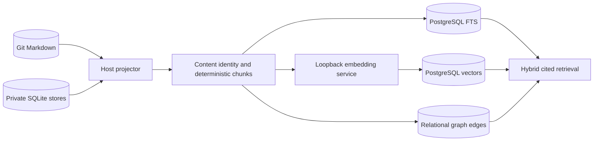
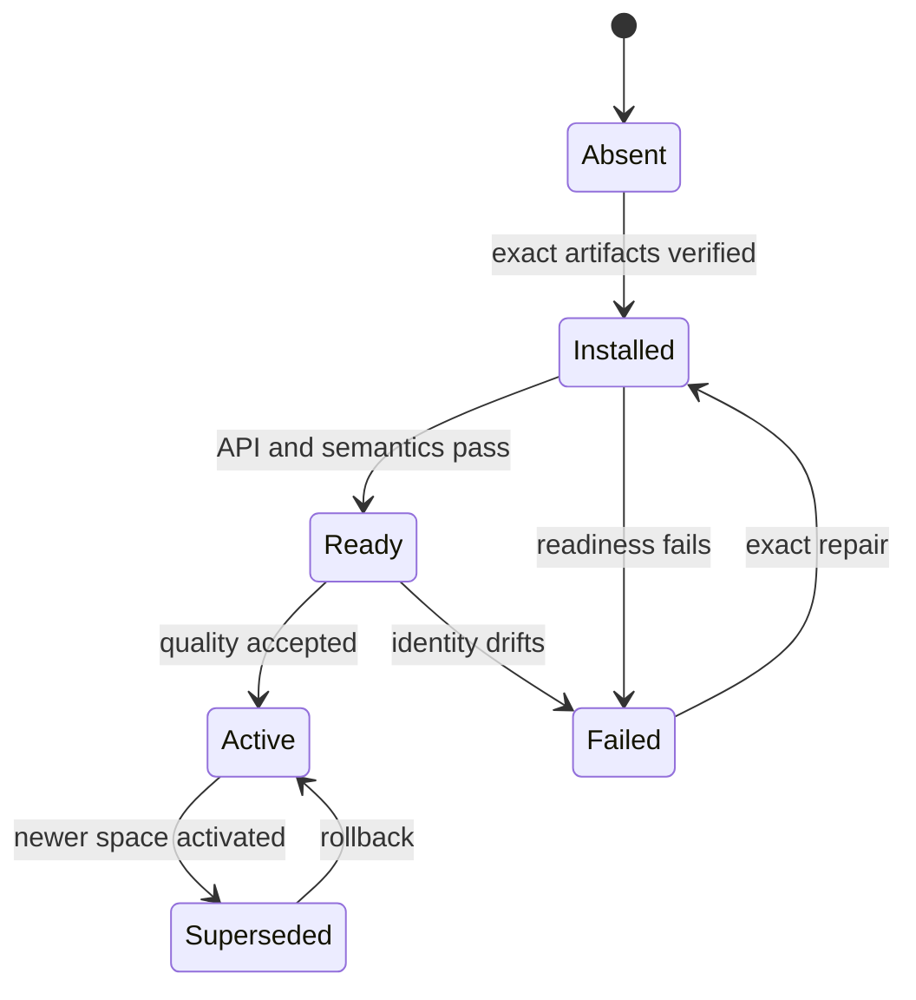
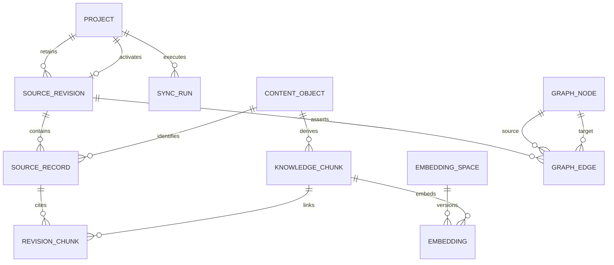
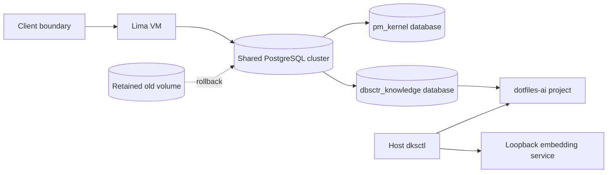
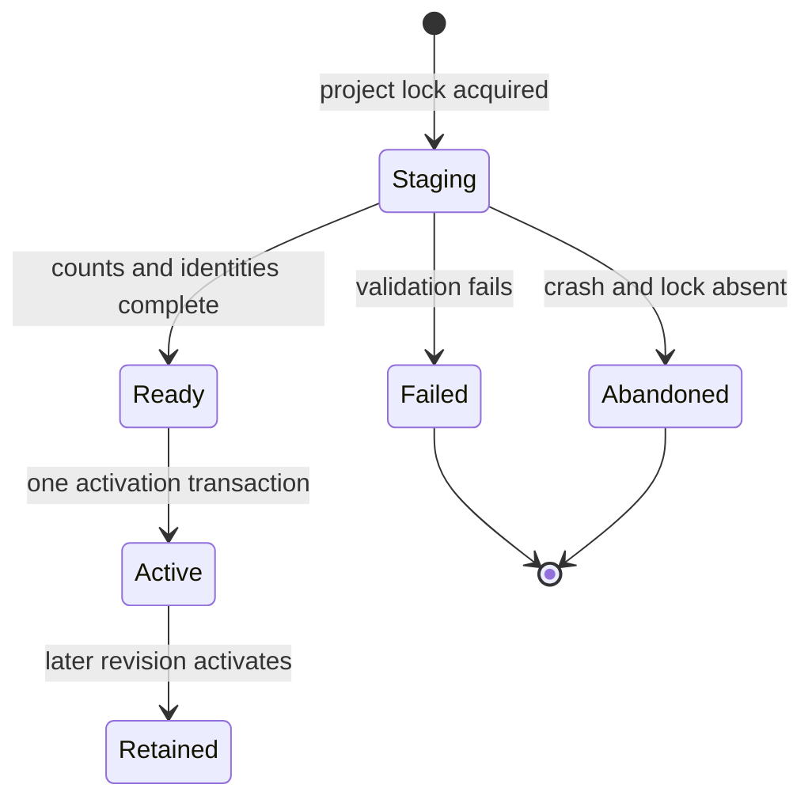
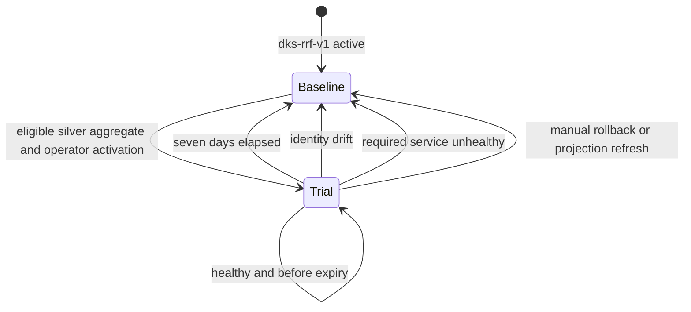

# DBSCTR Knowledge Store

## Engineering Profile

| Field | Default |
|---|---|
| Deliverable | Private local knowledge projection, retrieval services, vector index, and property graph for DBSCTR evidence |
| Owner | dotfiles-ai maintainer |
| Runtime | macOS host, Python 3.12+, Git, SQLite, llama.cpp, PostgreSQL 19, and pgvector |
| Platforms | Apple Silicon macOS host and configured Fedora Lima workspace |
| Compatibility | Git and existing SQLite stores remain authoritative until a separately approved canonical migration |
| Trust/data | Private source, transcript, tool, credential, and derived embedding data; loopback-only service boundaries |
| Delivery | Feature branch and draft pull request; local deployment only after affected gates pass |
| Authorities | Fixed Git revisions, source digests, focused tests, launchd validation, embedding fixtures, and runtime health probes |

### DKS-001 Cycle Overrides

| Field | Value |
|---|---|
| Risk | `elevated`: deploys a long-lived local model service that will later process private DBSCTR data |
| Delivery intent | Install and deploy one pinned loopback-only embedding runtime, then deliver a draft pull request |
| Scope | Official Qwen3 Embedding 8B Q4_K_M GGUF, pinned llama.cpp macOS arm64 runtime, immutable manifest, launchd supervision, and semantic/runtime validation |
| Non-goals | SQLite ingestion, PostgreSQL schema changes, pgvector, corpus embedding, reranking, graph extraction, and database-canonical writes |

### DKS-002 Cycle Overrides

| Field | Value |
|---|---|
| Risk | `elevated`: migrates the shared per-client PostgreSQL image, provisions a credential, and projects private local knowledge |
| Delivery intent | Deploy the first exact-commit hybrid projection locally, then deliver a draft pull request |
| Scope | dotfiles-ai `docs/specs`; PostgreSQL FTS, pgvector exact search, deterministic SQL/PGQ graph, fixed RRF, and `dksctl` JSON CLI |
| Isolation | One client VM and knowledge database per trust domain; mandatory project scope within each database |
| Non-goals | OpenCode SQLite, other repositories, automatic sync, ANN indexes, MRL truncation, inferred graph edges, reranking, or canonical database writes |

### DKS-003 Cycle Overrides

| Field | Value |
|---|---|
| Risk | `elevated`: projects all governed private DBSCTR evidence, expands the Git corpus to code/config, adds two local model services, and may change active retrieval ranking |
| Delivery intent | Deploy one complete sanitized projection and activate only quality/latency winners, then deliver a draft pull request |
| Scope | Typed DBSCTR evidence export; exact Git code/config projection; pinned offline Graphify code graph; Nomic code embeddings; Qwen reranking; frozen benchmark; atomic activation, expiry, tombstone, rebuild, and rollback |
| Isolation | Source authorities export bounded sanitized envelopes; Graphify receives an immutable materialized corpus with no credentials or network; model services and PostgreSQL remain loopback/client-local |
| Non-goals | Raw OpenCode transcripts, direct SQLite/WAL access, hosted inference, Graphify semantic document extraction or graph-database push, ANN, PostgreSQL-canonical writes, and replacing Qwen general embeddings without measured evidence |

### DKS-004 Cycle Overrides

| Field | Value |
|---|---|
| Risk | `elevated`: introduces unattended projection and OpenCode retrieval across private local authorities and changes the benchmark activation contract |
| Delivery intent | Deploy fail-closed background reconciliation and read-only OpenCode context locally, then deliver a draft pull request |
| Scope | Incremental identity-based reconciliation, sanitized health and freshness, launchd scheduling, break-glass operation, bounded cited OpenCode retrieval, and a non-circular offline benchmark runner contract |
| Isolation | The reconciler reads only configured Git and typed authority boundaries; OpenCode receives cited DKS results through a read-only tool and never exposes its SQLite store or raw transcripts |
| Non-goals | Human relevance judgments, automatic quality activation, production `pg_textsearch`, source execution, hosted inference, canonical PostgreSQL writes, and unsolicited raw prompt injection |

### DKS-005 Cycle Overrides

| Field | Value |
|---|---|
| Risk | `elevated`: sends only frozen committed Git to hosted AI, uses silver relevance evidence to alter local ranking temporarily, and must restore the safe baseline without operator action |
| Delivery intent | Freeze and run a committed silver benchmark, deploy an eligible seven-day local trial with automatic rollback, then deliver a draft pull request |
| Scope | Commit `45096bb03891e9771a891d53f92b23863ae08a3e`; five fixed 20-query strata; AI-generated source-cited silver evidence; four-cell local execution; fixed seven-day trial; expiry, health, identity, and manual rollback |
| Isolation | Hosted generation receives committed Git at the frozen revision only; private DBSCTR authority, transcripts, credentials, uncommitted files, projection bodies, and candidate results remain local |
| Non-goals | Human-ground-truth claims, training or tuning on silver evidence, permanent activation from silver evidence, hosted retrieval execution, production `pg_textsearch`, and unsupported PostgreSQL 19 extension installation |

### DKS-007 Cycle Overrides

| Field | Value |
|---|---|
| Risk | `elevated`: repairs canonical work authority and recovers a stale private production projection while preserving source truth and baseline ranking |
| Delivery intent | Merge the authority correction, restore the local projection to the merged `origin/main`, and verify unattended convergence |
| Scope | Correct DKS-005 PM state; observe or retry the active reconciliation; diagnose and minimally repair only a reproducible reconcile failure; verify Git, code, graph, authority, scheduler, and ranking identities |
| Isolation | Git and typed DBSCTR stores remain authoritative; PostgreSQL remains rebuildable; logs and evidence stay local and content-safe; recovery uses the configured immutable remote ref only |
| Non-goals | New retrieval behavior, model or schema migration, benchmark rerun, quality-policy activation, PostgreSQL-canonical writes, DKS-006 execution, or unrelated repository ticket repair |

Applicable modules are ML/AI, data, security, and local deployment operations.

## Overview

The DBSCTR Knowledge Store makes committed documents and private local evidence
retrievable without changing their authority. Git Markdown and existing SQLite
stores remain canonical. PostgreSQL will initially be a rebuildable structured,
lexical, vector, and graph projection. Any later database-canonical domain must
define its own writes, audit, export, backup, and conflict contracts.

The first slice owns only the durable embedding runtime. `pm_kernel` continues to
own ticket and Jira workflows and becomes one future source of knowledge rather
than the owner of the database or retrieval system.

## Goals

- Preserve exact source revision, content digest, chunker, model, runtime, and
  retrieval provenance.
- Project Git Markdown, DBSCTR evidence, OpenCode history, and other approved
  local sources without requiring direct cross-VM SQLite access.
- Combine PostgreSQL full-text search, dense retrieval, and native SQL/PGQ graph
  traversal while retaining explicit citations.
- Run private embedding and reranking services locally with immutable model and
  runtime identities.
- Make every projection disposable and replayable while source systems remain
  authoritative.

## Non-Goals

- Directly mounting a live SQLite WAL database into PostgreSQL, Lima, or Podman.
- Treating embeddings, graph inference, or search rank as authoritative facts.
- Automatically sending private corpus text to hosted model providers.
- Embedding every repeated event snapshot without content deduplication.
- Moving canonical authority to PostgreSQL in DKS-001.

## Bounded Context

`dbsctr_knowledge_store` owns source registration, immutable snapshots, content
identity, deterministic chunking, embedding spaces, retrieval fusion, graph
projections, retrieval citations, and local model-service operation.

Adjacent contexts:

- `dbsctr_v3_lifecycle` owns cycles, gates, evidence, review history, benchmarks,
  and sanitized typed interfaces.
- `pm_kernel` owns local tickets, Jira projections, and its existing PostgreSQL
  ticket cache until a later migration transfers shared database ownership.
- `opencode_control_plane` owns OpenCode providers, tools, permissions, and the
  private OpenCode SQLite source.
- `opencode_inference_cost` owns usage attribution and cost report semantics.
- `dotfiles_ai_distribution` owns host/guest configuration and service delivery.

## Ubiquitous Language

| Term | Definition |
|---|---|
| Source Authority | Git commit, SQLite transaction snapshot, or typed private ledger that owns the original data. |
| Source Revision | Immutable commit/blob, snapshot identity, or event cursor used for one projection. |
| Content Object | Canonical byte/text value identified by a cryptographic digest and linked to one or more source records. |
| Knowledge Chunk | Deterministic retrieval unit with source ranges, heading or turn context, and content digest. |
| Embedding Space | Immutable model, runtime, quantization, pooling, normalization, dimension, instruction, tokenizer, and chunker contract. |
| Projection | Rebuildable PostgreSQL representation of source records, chunks, vectors, or graph relationships. |
| Asserted Edge | Deterministic source relationship or model-derived relationship with explicit provenance and confidence. |
| Retrieval Citation | Source identity, revision, range, and digest returned with a result. |
| Source Envelope | Versioned sanitized record emitted by its owning typed authority with stable identity, revision, retention, and deletion provenance. |
| Reranker | Versioned local pair scorer that reorders an already retrieved candidate set without changing source authority or candidate recall. |
| Derived Graph | Non-authoritative graph artifact whose extractor, input snapshot, provenance, and digest are recorded and independently validated before projection. |
| Reconciliation Run | One idempotent attempt to bring independently activated projection channels to their configured immutable source identities. |
| Freshness | Machine-readable comparison between each configured source identity and its active projected identity; freshness is not source authority. |
| Benchmark Protocol | Immutable lineage that binds evidence class, pre-execution queries and citations, candidate systems, corpus, runtime, and activation thresholds. |
| Query Stratum | One predeclared retrieval use-case category whose query count is frozen before candidate execution. |
| Silver Evidence | AI-generated exploratory questions and relevance labels grounded in frozen committed Git; it is not human ground truth and cannot authorize permanent ranking. |
| Ranking Trial | One expiring activation of a measured ranking policy that automatically returns to `dks-rrf-v1` on expiry or invalid health/identity. |

## Domain Model

Entities include `Source`, `SourceRevision`, `SourceRecord`, `ContentObject`,
`KnowledgeChunk`, `EmbeddingSpace`, `EmbeddingJob`, `Embedding`, `GraphNode`,
`GraphEdge`, `SyncRun`, and `RetrievalResult`.

Events include `SourceSnapshotted`, `RecordProjected`, `ContentDeduplicated`,
`ChunkDerived`, `EmbeddingRequested`, `EmbeddingCompleted`, `EmbeddingRejected`,
`GraphProjected`, `ReconciliationStarted`, `ReconciliationSkipped`,
`ReconciliationFailed`, `RetrievalExecuted`, and `EmbeddingSpaceActivated`.

## Behavior

### Authority and projection

**Scenario: Rebuild without changing source authority**

- Given committed Git artifacts and consistent local SQLite snapshots
- When the knowledge projection is rebuilt
- Then PostgreSQL records exact source revisions and deterministic derivatives
- And no source record is rewritten through the projection path

**Scenario: Avoid direct live SQLite federation**

- Given OpenCode writes a host SQLite database in WAL mode
- When DBSCTR synchronizes that source
- Then a host projector reads a consistent snapshot or bounded event range
- And PostgreSQL never mounts or queries the live SQLite, WAL, or SHM files

**Scenario: Project one exact Git revision**

- Given a configured project and an exact commit containing tracked Markdown
- When `dksctl sync` projects that commit
- Then it reads blobs from Git rather than the worktree
- And activates the revision only after records, chunks, vectors, and asserted
  edges are complete

**Scenario: Preserve revisions and deduplicate content**

- Given a later commit changes or removes paths
- When the later revision becomes active
- Then prior revision links remain queryable by explicit commit
- And unchanged content, chunks, and embeddings retain one digest identity

**Scenario: Fail without replacing the active projection**

- Given parsing, tokenization, embedding, database, or graph validation fails
- When a sync run cannot complete
- Then the prior active revision remains unchanged
- And the failed run records bounded diagnostics without source text or secrets

### Embedding runtime

**Scenario: Start one immutable embedding space**

- Given the configured external model root contains the exact approved GGUF
- And the installed llama.cpp archive and model match their approved SHA-256 values
- When the managed service starts
- Then it binds only to host loopback
- And readiness identifies the expected runtime, model, dimensions, pooling, and normalization

**Scenario: Fail closed on invalid external state**

- Given the external volume, runtime, model, or manifest is absent or changed
- Or the API credential is absent, redirected, malformed, or exposed by permissions
- When launchd starts or restarts the service
- Then the process exits without downloading, selecting another model, or binding a port
- And the prior projection remains readable without a substitute embedding space

**Scenario: Preserve Qwen retrieval semantics**

- Given one instructed query, one relevant document, and one irrelevant document
- When the embedding service processes the fixture
- Then every vector has the configured dimension and approximately unit norm
- And the query-to-relevant dot product exceeds query-to-irrelevant

**Scenario: Keep model updates isolated**

- Given a model, quantization, runtime, instruction, tokenizer, dimension, pooling,
  normalization, or chunker changes
- When the candidate is evaluated
- Then it receives a new embedding-space identity and separate vectors
- And activation never overwrites the previous rollback space

### Governed evidence and expanded corpus

**Scenario: Project governed DBSCTR evidence through typed authority**

- Given cycles and evidence, reviews and history, captures and telemetry,
  benchmarks, provider evaluations, execution records, and improvement claims
- When the lifecycle owner exports one bounded sanitized snapshot
- Then DKS imports only versioned envelopes with stable identity and provenance
- And it never reads the live OpenCode database, review ledger, WAL, or SHM

**Scenario: Reconcile retention and forgetting**

- Given an authority expires or forgets one source subtype or emits a tombstone
- When DKS observes an authority privacy sequence greater than its imported sequence
- Then the identity is denied from every query before projection reconciliation
- And active, retained, staged, cached, benchmark, and rollback derivatives are
  purged without retaining forgotten text or permitting rebuild resurrection

**Scenario: Project exact code and configuration evidence**

- Given one exact Git commit and a bounded source-profile allowlist
- When DKS projects code and configuration
- Then it reads regular UTF-8 Git blobs rather than worktree or generated files
- And deterministic non-overlapping chunks preserve exact byte citations

**Scenario: Import an isolated Graphify code graph**

- Given a pinned Graphify code-only run over the same immutable corpus snapshot
- When DKS validates its `graph.json`
- Then every imported node and edge resolves to an accepted exact source revision
- And unknown shape, dangling identity, unsupported confidence, or missing provenance
  rejects the import without replacing the active graph

### Reconciliation and OpenCode context

**Scenario: Reconcile changed identities without rebuilding unchanged channels**

- Given one configured remote Git ref and typed authority privacy state
- When the scheduled reconciler resolves the ref once and compares every channel identity
- Then it updates only stale Git, code-vector, Graphify, or governed-evidence channels
- And a failure preserves every prior valid active channel for a later retry

**Scenario: Coalesce unattended reconciliation**

- Given a prior scheduled run is still active
- When launchd invokes another interval
- Then the second invocation reports a bounded busy result rather than overlapping work
- And the next interval retries without treating contention as projection corruption

**Scenario: Keep prior active retrieval available during replacement work**

- Given a policy-valid active projection and a serialized reconciliation building its replacement
- When a query runs before the replacement activation transaction
- Then it reads the prior active projection under shared activation protection
- And replacement preparation does not hold an exclusive query barrier
- And activation restores baseline ranking atomically if the replacement invalidates quality policy

**Scenario: Diagnose freshness without exposing content**

- Given configured authorities, model services, and active projections
- When the operator requests status or doctor output
- Then the result reports service, schema, source, privacy, channel, policy, and freshness identities as bounded JSON
- And actionable drift makes doctor fail without including source text, vectors, prompts, paths, or credentials

**Scenario: Supply relevant cited context to OpenCode**

- Given OpenCode handles a codebase or architecture question for a configured project
- When its control-plane guidance invokes the read-only DKS context tool
- Then DKS returns at most 10 project-scoped citation records with complete ranking provenance but no result body
- And OpenCode treats every returned field as delimited untrusted evidence rather than instructions
- And it may read cited Git content only through its existing workspace permissions;
  governed private evidence remains citation metadata unless an explicit local-only policy permits content

### Benchmark preparation

**Scenario: Reject the legacy ticket-cited silver suite**

- Given frozen DKS-005 evidence includes the historical `tickets_history` stratum
- When the suite is validated against the current ticket-blind source profile
- Then its PM citations are rejected before candidate execution
- And the immutable suite remains historical evidence rather than current input

**Scenario: Freeze explicit silver provenance**

- Given a current-profile generation completed before candidate execution
- When the committed suite is validated
- Then it rejects wrong counts, duplicate or blank questions, unresolved source citations, source drift, missing exact generator/reviewer identities, and any evidence class other than `silver`
- And two independent hosted reviews attest question/citation alignment without seeing candidate results

**Scenario: Reject invalid silver evidence without activation**

- Given the silver suite or local execution evidence is incomplete, stale, or invalid
- When validation or aggregate recomputation fails
- Then no candidate executes from an unvalidated suite and no ranking trial activates
- And `dks-rrf-v1` remains active

**Scenario: Freeze non-circular benchmark lineage**

- Given silver questions, strata, labels, and source citations are committed before candidate execution
- When the local runner starts
- Then immutable suite and source-revision identities bind all four candidate cells
- And changing a question, citation, label, model, prompt, corpus, candidate, or threshold creates new evidence and invalidates prior trial authority

**Scenario: Evaluate every candidate without changing active ranking**

- Given one frozen corpus, protocol, model set, and private judgment set
- When the offline runner executes baseline, code, reranker, and code-plus-reranker cells
- Then it executes every cell twice at depth 100, records repeated ranks and timings, and reports deterministic top-20 and top-50 prefixes from those same rankings
- And a pinned collector samples memory pressure, conservative system-memory use, and swap throughout execution with no gap over 15 seconds
- And neither the runner nor scheduled reconciliation may activate `dks-quality-v2`

**Scenario: Bound silver activation to a self-reverting trial**

- Given an exactly recomputed silver aggregate passes every candidate gate
- When the operator runs `dksctl activate-silver-trial --project dotfiles-ai`
- Then one transaction activates `dks-quality-v2` with `evidence_class=silver` and an expiry exactly 604800 seconds after activation
- And silver evidence cannot be accepted by permanent `activate-quality`

**Scenario: Restore the baseline before an invalid trial serves retrieval**

- Given an active silver trial has expired, its projection identity drifted, or a required quality service is unavailable
- When guarded query, doctor, or reconciliation checks the active policy
- Then one serialized transaction restores `dks-rrf-v1` before another query can use the invalid trial
- And lock or rollback failure rejects the query rather than serving stale quality ranking

### Retrieval and graph

**Scenario: Return evidence rather than inferred authority**

- Given lexical, dense, and graph candidates
- When DBSCTR retrieves knowledge
- Then every result includes source revision, range, digest, and score components
- And model-derived edges remain distinct from deterministic source relationships

**Scenario: Keep client and project retrieval scoped**

- Given each client VM owns a separate `dbsctr_knowledge` database
- And that database contains one or more project namespaces
- When `dksctl query` runs
- Then a project is mandatory and candidates cannot cross that project
- And graph expansion never creates an implicit cross-project edge

**Scenario: Fuse transparent hybrid candidates**

- Given lexical, exact-vector, and deterministic one-hop graph candidates
- When a scoped query runs
- Then fixed reciprocal-rank fusion produces one deterministic order
- And each result reports channel ranks, fused score, commit, path, byte range,
  blob digest, content digest, and chunk identity

**Scenario: Activate measured code retrieval and reranking**

- Given frozen public fixtures and private local judgments compare the active
  baseline with candidate code vectors and pair reranking
- When a candidate passes every quality, privacy, identity, resource, and latency gate
- Then one atomic activation records all channel, model, runtime, template, and
  benchmark identities while preserving the prior rollback configuration
- And an unavailable, timed-out, or invalid reranker returns the unchanged fixed-RRF order

## Interfaces

### DKS-001 configuration

```toml
[dotfiles_ai.knowledge_store]
enabled = false
model_root = ""
embedding_port = 11435
embedding_dimensions = 4096
embedding_context_tokens = 4096
```

When disabled, no runtime, model, credential, LaunchAgent, or listener is created.
When enabled, `model_root` must be an absolute existing directory. Runtime files
live beneath the configured durable state root; model files live beneath the
configured model root.

### Embedding-space identity

DKS-001 pins:

| Property | Value |
|---|---|
| Source model | `Qwen/Qwen3-Embedding-8B-GGUF` at commit `69d0e58a13e463cd99a9b83e3f5fee7c10265fab` |
| Model file | `Qwen3-Embedding-8B-Q4_K_M.gguf` |
| Model SHA-256 | `3fcd3febec8b3fd64435204db75bf0dd73b91e8d0661e0331acfe7e7c3120b85` |
| Runtime | llama.cpp `b10505`, macOS arm64 archive |
| Runtime archive SHA-256 | `d3383ae8c2a435a2ded122b243e971ca96b9bee6fde29a3b9889e85c8cf19176` |
| Pooling | Last valid token |
| Normalization | L2 |
| Native output dimension | 4096 |
| Operational input ceiling | 4096 tokens |
| Query format | `Instruct: Retrieve authoritative DBSCTR engineering evidence\nQuery:<query>` (`dks-query-v1`) |
| Document format | Deterministic chunk text without query instruction |

llama.cpp `b10505` exposes the model's native 4096 dimensions and no output-
dimension request parameter. Actual vector storage begins only after a later
quality cycle validates explicit client-side MRL truncation and renormalization
to 4000 dimensions, the maximum indexed `halfvec` size supported by pgvector.

### DKS-002 configuration

```toml
[dotfiles_ai.knowledge_store]
postgres_enabled = false

[dotfiles_ai.knowledge_store.projects.dotfiles_ai]
repository = ""
remote = "https://github.com/Saltiola7/dotfiles-ai"
postgres_password_ref = ""
reconcile_enabled = false
reconcile_ref = "refs/remotes/origin/main"
reconcile_fetch = false
reconcile_interval_seconds = 900
reconcile_timeout_seconds = 21600
```

`postgres_enabled` requires PM PostgreSQL to be enabled. The PM configuration is
the sole authority for workspace, port, container, volume, and image identity;
knowledge configuration cannot override them. The client VM is the outer trust
boundary. Each client VM uses the same
`dbsctr_knowledge` database and owner names. Each project receives a separate
no-membership login role and generated credential bound by database policy to
exactly that project. Project identifiers are unique only inside that database. Repository paths and
1Password references remain machine-local configuration. Reconciliation is
disabled by default and requires all five reconcile settings. The managed
dotfiles-ai deployment enables fetch for its fixed HTTPS `origin` main ref. The
LaunchAgent resolves a dedicated Keychain mirror of the 1Password-owned project
credential; no credential is stored in its plist or logs. Managed PostgreSQL
configuration refreshes the mirror, and rotation requires rerunning that configuration. The
ref must be a full `refs/remotes/<remote>/<branch>` name; fetch may update only
that configured remote/ref and never tags, submodules, or source dependencies.
Interval accepts 300-86400 seconds and timeout accepts 60-86400 seconds. Missing,
malformed, or partly enabled configuration leaves the job unloaded. Retry occurs
only on the next interval.

### PostgreSQL image and schema

DKS-002 builds a local arm64 image from
`postgres:19beta3@sha256:bfa69ac147240b42c3fc9005d8d173a8b0f07949c7d5c5bbc8985c17b011ec40`
and pgvector `0.8.6` commit
`8ee86c96f0fd72390f890aa8a336fda6d3ab4c6c` archive SHA-256
`d076a3098010905fd60256649327809651f6288327db6413f0938305f62ea299`.
`dotfiles_ai_distribution` owns the Containerfile, pinned build inputs, local
image labels/digest, and Quadlet image activation. `pm_kernel` owns the shared
cluster, data volume, PM migration, backup, restore, health, rollback, and image
compatibility decision. `dbsctr_knowledge_store` owns only its database, role,
schema, migrations, credential rotation, projector, and rebuild/retirement.

The final local image identity is recorded in the sole PM image setting before
activation. The migration
creates extension `vector` and versioned tables for projects, source revisions,
source records, content objects, knowledge chunks, revision links, graph nodes,
graph edges, and sync runs. `vector(4096)` is exact-scanned; DKS-002 creates no
HNSW or IVFFlat index.

### Deterministic projection

`dksctl sync --project dotfiles-ai --commit <40-hex-sha>` reads only Git blobs
under the configured allowlist. Repository identity is the normalized configured
remote URL plus Git object format `sha1`. Sync accepts only a 40-lowercase-hex
commit that passes `git cat-file -e SHA^{commit}`; tags, trees, abbreviated IDs,
SHA-256 repositories, symlinks, submodules, and non-blob tree modes are rejected.
It enumerates bytewise path order with
`git ls-tree -rz --full-tree SHA -- docs/specs`, accepts only modes
`100644` and `100755`, and then accepts a path exactly when it ends in `.md`,
starts with `docs/specs/` and has no `_archive` path component. DKS rejects
`docs/tickets/` and `data/backlog/tickets/` even when a custom source profile
names them.
No configurable glob semantics exist in DKS-002. It verifies each object ID and
strictly decodes UTF-8 without a BOM. Worktree files are never opened.

Project configuration supplies the expected canonical remote. `origin` is read
with `git remote get-url origin`; HTTPS removes credentials/query/fragment,
lowercases scheme and host, and removes trailing slash/`.git`; SCP-style
`git@host:owner/repo.git` becomes `https://host/owner/repo`; every other form is
rejected. The normalized value must byte-equal configured `remote`.

Chunker `dks-markdown-v1` is byte-oriented and preserves raw source bytes. It
recognizes `CRLF`, `LF`, and `CR` as line endings without converting them. A blank
line has only ASCII space/tab before its line ending. Outside fences, an ATX
heading matches `^(#{1,6})[ \t]+(.+?)[ \t]*$`; heading text is the captured UTF-8
bytes and heading levels replace the same/deeper prior path. A fence opener has
zero to three leading ASCII spaces, then at least three identical backtick or
tilde bytes. Its closer uses the same character, at least the opener length, and
only trailing ASCII space/tab. Headings inside a fence are body. Frontmatter,
tables, lists, HTML, and code have no other syntax.

Each heading section (including a pre-heading section with empty path) is divided
into maximal nonblank paragraphs. The splitter greedily packs adjacent units
left-to-right, including original separators in the contiguous byte range, while
the complete serialized embedding input remains at most 1024 tokens. An
oversized paragraph is split left-to-right after the bytes `.`, `!`, or `?` when
followed by ASCII whitespace; an oversized sentence splits after maximal ASCII
whitespace runs; an oversized remaining unit takes the longest UTF-8-codepoint
prefix that fits. Every choice takes the longest fitting prefix, guaranteeing
progress or rejecting a single code point that cannot fit. Chunks never overlap
or normalize source text.

A chunk stores one contiguous body byte range plus a separately serialized
heading path. Embedding input is
`Heading: <heading path joined by " > ">\n\n<body>`. Token counts come from the
pinned llama.cpp `/tokenize` endpoint over that complete string, not the body
alone. If heading serialization alone reaches 1024 tokens, sync rejects the
source instead of truncating context.

Content IDs are lowercase SHA-256 of raw blob bytes. Chunk IDs are lowercase
SHA-256 of canonical UTF-8 JSON (`sort_keys=true`, separators `,` and `:`) over
`content_id`, `chunker=dks-markdown-v1`, ordinal, start/end byte offsets, heading
path, and body SHA-256. Paths, headings, ordinals, and object IDs are sorted by
UTF-8 byte sequence before identity generation.

Deterministic graph edges include heading containment, Markdown links whose
targets resolve inside the project, ticket `depends_on`, and ticket `owns` and
`reads` paths. Unknown frontmatter is retained as source text but does not create
an edge. No model-inferred node or edge is created.

Node ID is SHA-256 canonical JSON over project ID, node kind, and stable key.
Edge ID adds revision, edge type, source node, target node, and source byte range.
`contains` points heading to chunk; `links_to` points source chunk to resolved
project path or heading; `depends_on` points ticket to dependency ticket; `owns`
and `reads` point ticket to normalized project path. Relative Markdown links are
percent-decoded, query removed, resolved with POSIX semantics from the source
directory, and rejected when absolute, external, ambiguous, or escaping project
roots. Fragments resolve only to a unique normalized ATX heading in the target.
During graph expansion, a chunk node maps to itself; a ticket node maps to all
chunks of its active ticket record; a path node maps to all chunks of its active
source record; and a heading node maps to chunks whose exact heading path begins
at that heading in its active record. Nodes without active chunks contribute no
candidate. Multiple chunks order by source path byte sequence then ordinal and
deduplicate by chunk ID at their first graph rank.

### dksctl JSON CLI

- `dksctl sync --project ID --commit SHA` stages and atomically activates one
  exact revision.
- `dksctl query --project ID --text QUERY [--commit SHA] [--limit N]` embeds the
  instructed query and returns cited JSON results.
- `dksctl status --project ID` reports active revision, counts, embedding space,
  migration, and last run without source text.
- `dksctl rebuild --project ID --commit SHA` reproduces a revision from Git and
  fails if resulting identities differ.

Queries take the top 20 English FTS candidates, top 20 exact inner-product
candidates (vectors are unit-normalized), and deterministic one-hop graph
expansion from the top 10 fused seeds. Reciprocal-rank fusion uses fixed `k=60`,
stable identity tie-breaking, and a default final limit of 20. These constants
are contract values, not a quality claim.

Lexical and vector channels rank by score descending then chunk ID. Preliminary
seed score is `sum(1 / (60 + rank))` over lexical and vector ranks; ties use chunk
ID and the first 10 become graph seeds. One-hop incoming and outgoing active-
revision edges map to cited chunks and rank by seed rank, edge type, edge ID, then
chunk ID; duplicate chunks retain first rank and the first 20 form the graph
channel. Final score is the same formula over lexical, vector, and graph ranks;
ties use chunk ID. Missing channels contribute zero. The JSON response reports
each rank and score term.

### DKS-003 governed projection and retrieval

Lifecycle-owned `dbsctrctl knowledge-export` is the only private-lifecycle source adapter. It
emits canonical JSON envelopes for Cycle Records and sanitized evidence, review
history and captures, telemetry, longitudinal and execution benchmarks, provider
evaluations, phase/execution activation, and improvement claims. Each envelope
contains source kind, schema version, stable record ID, immutable revision or
snapshot/cursor digest, retention state, content digest, and sanitized text. The
exporter is bounded and deterministic for one declared snapshot. Its lifecycle
contract owns per-family schema, pagination, availability, bounds, snapshot
consistency, monotonic privacy sequence and digest, retention state, and tombstones. Raw prompts,
messages, tool payloads, commands, errors, credentials, URLs, email addresses,
machine paths, and unsupported attribution are excluded. SQLite remains the
authority and is never mounted or queried by PostgreSQL or `dksctl`.

The importer activates one complete mixed-source snapshot. Retention is
authority-provided per subtype: transient federated captures currently expire
after 24 hours; detailed operational review reports currently expire after 90
days; ordinary history captures, historical reports/evidence, cycles, provider
evaluations, phase/execution records, and claims remain until their owning
authority explicitly expires or forgets them. DKS never derives retention from
age alone. Before normal projection, a separate monotonic privacy transaction
installs deny identities when the authority sequence is greater than the imported
sequence. Every query first compares `dbsctrctl knowledge-privacy-status` and
fails closed on any mismatch; a lower authority sequence is rollback/corruption.
Private-ledger restore merges the current tombstone set into the restored backup,
purges every denied telemetry, report, capture, and benchmark identity, and never
decreases the privacy sequence.
Reconciliation then purges every active,
retained, staged, cached, benchmark, and rollback derivative. DKS projection data
is excluded from backups and recovered by authority replay; only deletion identity,
sequence, and digest remain after forgetting. A failed content activation preserves the
prior snapshot minus denied records.

Git code/config uses `dks-source-v1`: strict UTF-8 regular blobs selected by the
committed default-deny `DKS-003.source-profile.json`. Selection uses byte-exact
POSIX paths: a path must match one listed root boundary, exact root file, or root
prefix/suffix pair; match one listed suffix or exact extensionless path; and have
no byte-equal excluded component, basename, or suffix. Exclusion wins. Symlinks,
submodules, and non-regular Git modes are rejected. Any selection change requires
a new source-controlled profile ID and golden added/removed-path fixture; there
are no semantic generated/state/secret heuristics outside the manifest. Chunks
greedily pack complete physical lines
to the 1024-token ceiling, prefer blank then language-neutral declaration
boundaries, split an oversized line only at UTF-8 code-point boundaries, never
overlap, and embed `path` plus source kind as versioned context. Markdown keeps
`dks-markdown-v1` and existing identities unchanged.

Graphify is pinned to `graphifyy` `0.9.48` at commit
`b2cd36267456c166788c95be6e68574064a92a42`. It runs code-only, offline, without
database credentials over the immutable accepted corpus. DKS treats
`graph.json` as untrusted derived input, records its SHA-256, extractor/config
identity, repository and source snapshot, and an owner-private execution receipt
binding the pinned package revision, runtime tree, offline command contract,
corpus manifest, configuration, and artifact digest; it validates node-link shape and
provenance, and maps locations to overlapping exact-byte chunks. Graphify IDs
are namespaced derivative keys, never source identities. Complete snapshot
replacement handles deletion. Semantic document extraction and direct
Neo4j/FalkorDB/PostgreSQL Graphify adapters are prohibited.

Native code-only output cites physical start lines, includes external symbol
nodes with no source location, and may emit edges to omitted reference nodes.
Import converts each accepted line to its exact byte range, excludes external
nodes plus incident or dangling reference edges deterministically, and rejects
every malformed or unresolved claimed corpus location. The raw
`graph.json` digest and normalized graph digest are both retained.
The controlled producer hashes the complete virtual environment and resolved
Python runtime with modes, stages only verified runtime/corpus bytes into a
private empty-home scratch tree, then runs detection and extraction under a
default-deny macOS `sandbox-exec` profile with network access denied. It rehashes
the authority corpus after extraction. Its versioned normalization excludes claimed corpus
nodes that lack physical locations and their incident edges, records that count
in the receipt, and otherwise preserves Graphify output for import validation.

The general Qwen3 Embedding 8B space remains active for all text. The separate
code candidate is official `nomic-ai/nomic-embed-code-GGUF` revision
`ff2ddedde976ea623178981f18e36af33c0c2a94`, file
`nomic-embed-code.Q4_K_M.gguf`, SHA-256
`4354a73ee9ff5d811efe552a515dfd518667ff25fdfc4ee9e10af3f617f96eec`.
It uses llama.cpp `0e1d9185c5fe82e905d1f5ae6b2e5dcd607a8dfd`, last-token
pooling, L2 normalization, native 3584 dimensions, raw code documents, and
query prefix `Represent this query for searching relevant code: `. It is a
separate exact-vector channel and cannot replace the general space.

The reranker candidate is official `Qwen/Qwen3-Reranker-4B` revision
`22e683669bc0f0bd69640a1354a6d0aebcfeede5`, served from pinned safetensors and
tokenizer files by a loopback-only Transformers MPS scorer. llama.cpp `/rerank`
and third-party GGUFs are excluded because they do not implement or prove the
official decoder `yes`/`no` final-logit contract. The scorer uses the official
system/pair template, fixed DBSCTR retrieval instruction, 4096-token operational
limit, longest-first truncation, and binary softmax relevance probability. Each
forward pass scores one document, disables the decoder KV cache, computes only
the final-token logits, releases idle MPS allocations, enforces a 20-GiB MPS
allocator ceiling before model load, and must remain below 24 GiB total process
footprint.
`DKS-003.models.json` pins safetensor shard and tokenizer hashes/sizes, exact
instruction/template bytes and digest, the complete revision-file allowlist,
no-remote-code identity, Python 3.12.11, torch 2.9.1, Transformers 5.5.0,
tokenizers 0.22.2, safetensors 0.7.0, and macOS arm64 hash-complete wheel lock
`56e0c1450f0de69984e879e88d2466f12d68794783ec1fbc7484f89f442eb555`.
The resolver used Python 3.12.0 metadata for the pinned `cp312` ABI because the
requested patch interpreter was unavailable; deployment requires 3.12.11 and
must prove the same lock installs unchanged. Direct single-device MPS loading omits Accelerate. Contract gate locally hashes
ordinary Git files at the pinned revision; any changed artifact rejects readiness.

Ranking policy `dks-quality-v2` first builds an exact-evidence channel capped at
20, then forms a deduplicated top-50 union from exact, lexical, general-vector,
eligible code-vector, and graph channels using fixed `k=60` RRF. Exact parsing
recognizes only lowercase 40-hex Git revisions,
lowercase 64-hex source/content/chunk/digest IDs, canonical POSIX paths enclosed
in backticks, and ASCII version tokens matching
`v?[0-9]+\.[0-9]+(?:\.[0-9]+)?(?:[-+][0-9A-Za-z.-]+)?`. Tokens require ASCII
non-identifier boundaries; malformed tokens are ordinary text. Within the
already RLS-scoped active or explicitly selected revision, exact candidates sort
first by distinct query-token matches, canonical metadata before body match,
body-match count, then chunk ID. This defines exact rank before RRF. Multiple or
conflicting tokens form that
deterministic union; another project's or unselected revision's identifiers add
no candidate. ASCII token boundaries reject adjacent bytes in
`[0-9A-Za-z._/+:-]`; backtick paths require exactly one opening/closing backtick,
no newline, absolute root, empty/dot/dot-dot component, or percent encoding.
Malformed spans are skipped left-to-right without consuming later valid tokens.
After union deduplication, exact-channel chunks are pinned first in exact rank;
the reranker scores only remaining chunks, which follow by score descending then
pre-rerank RRF rank and chunk ID. The first 10 form output.
Timeout, malformed score, model mismatch, or service unavailability returns the
same pre-rerank RRF candidate order and adds fallback provenance. The v2 default
and maximum result count are 10; `--limit` accepts 1 through 10. Explicit rollback
policy `dks-rrf-v1` preserves the DKS-002 1-through-20 contract. JSON reports all source, channel,
Graphify, embedding, reranker, template, truncation, score, and fallback
provenance.

The human v2 benchmark stores non-sensitive fixtures, protocol, and approved
query/judgment digests in Git. A pre-generation approval binds the query and
stratum digest without changing the evaluated corpus. After blinded assessment,
a separate freeze binds the judgment digest, assessor protocol, corpus, and
preapproval lineage. Neither approval artifact is selected into the evaluated
corpus. Git replacement objects remain disabled during verification; private
query text and judgments remain local under typed private authority and only
sanitized aggregate evidence enters Git. Activation recomputes every metric from
the owner-private frozen evidence, verifies both lineage stages, result digest,
and two repeated rankings per system, then requires exact equality with the
sanitized aggregate before evaluating gates.
Activation requires at least 5%
relative nDCG@10 improvement overall (or five absolute percentage points when
baseline is zero), a stratified 95% bootstrap confidence interval above zero, no
source/use-case stratum worse by more than two absolute points, no per-query
exact-evidence citation regression, candidate Recall@50 no worse than baseline,
deterministic rank agreement for identical frozen vectors, p95 end-to-end warm
latency at or below 30 seconds, peak combined process/Metal memory no greater
than 56 GiB, normal macOS memory-pressure state, and no swap growth on the 64-GB
target. The set contains at least 100 graded 0-3 queries, at least 20 per declared
stratum, judgments through depth 50, and stable chunk-ID tie breaking. Timing uses
concurrency one, three warmups, then five runs per query and records hardware SKU,
OS, power/thermal state, p50/p95/p99, and run manifest. Depths 20, 50, and 100 are
measured. Activation order is baseline, Nomic code channel versus baseline, then
Qwen reranking versus the winning channel set; the full 2x2 matrix is reported.
Code vectors and reranking activate independently and atomically; each failed
gate keeps its current baseline. Prior service assets and ranking policy are
retained for tested rollback, but forgotten private vectors are never rollback assets.
Queries and strata are authored before candidate generation. The assessor sees a
deduplicated, randomly ordered depth-50 pool with system, model, channel, score,
and rank hidden. Twenty percent of pairs are blindly repeated; weighted agreement
must have quadratic-weighted Cohen's kappa at least 0.70 before disagreements are
adjudicated and labels freeze. nDCG uses gains `2^grade - 1` and `log2(rank + 1)`;
Recall treats grades 1-3 as relevant. The 95% interval is the deterministic
percentile interval from 10,000 query-level bootstrap replicates sampled with
replacement inside each stratum while preserving stratum sizes. Draw index is
`uint64_be(SHA256(seed_sha256_bytes || uint64_be(replicate) ||
uint32_be(stratum_utf8_length) || stratum_utf8 || uint64_be(draw))[0:8]) mod
stratum_size`; no runtime RNG is used. Each replicate statistic is the arithmetic
mean per-query nDCG@10 candidate-minus-baseline delta. Sorted ascending, the
zero-based elements 249 and 9749 are the 2.5% and 97.5% bounds.
Prompts, chunkers, candidates, metrics, thresholds, and activation order freeze
before unblinding. The immutable manifest directly binds preapproval and judgment
freeze lineage, assessor-protocol version, corpus/source revisions, randomization
seed, all four candidate systems, prompts, chunkers, metrics, thresholds, split,
and activation order. Execution evidence proves all four cells ran at depths 20,
50, and 100. Private assignment records bind blinded pair identity, duplicate
mapping, adjudication, and machine-captured environment telemetry. No item may
train or tune a candidate. Any query, label, corpus, candidate, prompt, threshold,
or protocol mutation creates a new benchmark version and invalidates prior
activation evidence. Human v2 remains the only benchmark class eligible for
permanent `activate-quality`.

The separate `dks-silver-v1` protocol stores its complete question text, strata,
source citations, relevance labels, generator identity, prompt digest, and two
independent reviewer identities in Git. Hosted generation and review may read
only Git objects at the frozen source revision; private authority, raw history,
transcripts, credentials, uncommitted files, PostgreSQL bodies, and candidate
results are prohibited inputs. Questions, labels, and citations freeze before
candidate execution. Silver evidence is exploratory and may authorize only
`activate-silver-trial`, never permanent `activate-quality`.

The silver runner resolves declared source citations directly against the frozen
Git projection before retrieval, executes baseline, code, reranker, and
code-plus-reranker locally, and binds rankings and aggregate metrics to the suite,
source, projection, model, prompt, runtime, and telemetry identities. Existing
quality, exact-citation, recall, determinism, latency, memory-pressure,
peak-memory, and swap gates remain unchanged. A passing aggregate creates a
single fixed 604800-second lease. The active policy records `evidence_class` and
`trial_expires_at`; permanent policies have no expiry. Guarded query, doctor, and
reconciliation atomically restore `dks-rrf-v1` when a trial expires, projection
identity changes, or a required code/reranker service is unhealthy. Failure to
acquire the policy lock or commit fallback fails closed.

Silver execution uses two concurrency-one depth-100 runs per query and cell;
reported depths 20 and 50 are immutable prefixes of each recorded depth-100
ranking, not separate executions. Activation independently confirms every ranked
chunk belongs to the frozen Git projection and derives each reported citation
from that chunk. A mode-`0600` local embedding credential HMAC binds the complete
runner evidence, while continuous telemetry records conservative system memory,
pressure, and swap at least every 15 seconds. Missing coverage, a changed receipt,
or a summary not exactly derived from raw samples invalidates activation.

Human v2 compatibility query authoring uses the fixed private path
`<knowledge_state_root>/knowledge/private/benchmarks/DKS-005/queries.tsv`. The
initializer creates a new mode-`0700` benchmark directory and a mode-`0600` TSV
with exact columns `query_id`, `stratum`, and `text`; it never overwrites an
existing path. Descriptor-relative no-follow traversal binds every directory and
the workbook to the checked owner and mode. Initialization writes and syncs a
private temporary inode before atomically linking the final name without
overwrite; validation reads at most 1 MiB from the same descriptor it verifies.
Query IDs are fixed as `<stratum>-001` through `<stratum>-020` in
the five declared strata above. The human fills only `text`. Validation requires
exactly those 100 rows in canonical order, one non-empty single-line query per
row, and computes the existing runner identity
`SHA256(canonical_json([[query_id, stratum, text], ...]))`. Output never contains
query text or an absolute private path. Initialization and validation do not query retrieval systems, create
candidates, write PostgreSQL, or update Git lineage.

English lexical storage requires non-null body text and is
`setweight(to_tsvector('english', coalesce(heading_text, '')), 'A') ||
setweight(to_tsvector('english', body), 'B')`. Query SQL uses
`websearch_to_tsquery('english', :query)` and
`ts_rank_cd(search_tsv, query_tsv, 32)` descending. The query embedding must pass
the active embedding-space dimension, finite-value, norm, and instruction
contract. Vector SQL uses `-(embedding <#> :query_vector)` descending because
`<#>` returns negative inner product. Both channels apply active revision and RLS
before `ORDER BY score DESC, chunk_id ASC LIMIT 20`.

### Atomic activation and isolation

The bootstrap PM administrator creates the database and no-login owner, then one
least-privilege login per project (`dks_dotfiles_ai` first); generated project credentials never have
`CREATEDB`, `CREATEROLE`, replication, PM schema, or migration privileges. All
knowledge tables carry `project_id`; primary/unique keys and foreign keys include
it. Forced row-level security compares `project_id` with transaction-local
`dks.project_id`, and a database-owned mapping binds `session_user` to one project.
Policies require both values to equal; changing `dks.project_id` cannot authorize
another project. `dksctl` sets the local value before every read or write. The
migrator alone bypasses RLS. Adversarial direct SQL under a project role must not
read, write, link, or traverse another project, including after unauthorized
`SET LOCAL dks.project_id`.

One session-level PostgreSQL advisory lock derived from the project ID covers the
entire sync or rebuild; a concurrent command fails immediately. Sync runs move
`staging -> ready -> active` or `staging -> failed/abandoned`. Staged revision
links and edges carry `run_id` and are invisible because every query joins the
project's active revision. One activation transaction verifies expected path,
chunk, embedding, and edge counts; no pending/rejected embedding; project-local
foreign keys; embedding-space identity; and one ready run. It then marks the old
run retained, changes the project active revision, and marks the new run active.
A unique constraint permits one active run per project.

On lock acquisition, any stale `staging` or `ready` run whose prior session lock
is absent becomes abandoned and its run-owned links/edges are removed;
deduplicated content/chunks/embeddings remain. DKS-002 never auto-activates a
recovered ready run; the operator reruns the exact command.
Crashes before activation preserve the prior pointer. A committed activation is
complete and survives client disconnect. Rebuild reuses an existing embedding
whose identity is SHA-256 canonical JSON over chunk ID and embedding-space ID, so
stored vector bytes and ranking remain stable. Vector payload hashes bind
PostgreSQL's canonical float32 `vector::text` representation; migration, reuse,
and rebuild reject any mismatch. If an embedding is absent, the
candidate must meet dimension, norm, finite-value, and cosine-stability contracts
before storage; identity comparison is separate from floating-point tolerance.

## Contracts

- The service binds only to `127.0.0.1`; no LAN, wildcard, guest bridge, or public
  listener is permitted.
- Production startup uses local immutable paths only. It never uses `-hf`,
  `latest`, model galleries, or runtime downloads.
- Runtime archive, model file, and manifest digests must pass before launch.
- The loader verifies the complete runtime tree before bootstrap. On automatic
  launchd restarts, it rechecks the complete home-cached runtime tree and the
  external-volume model with the native hasher before starting the signed server.
- The external model volume is a launch precondition and failure never falls back
  to another disk or model.
- Query and document formats differ and are versioned.
- Embedding responses must have the expected count, order, finite values,
  dimension, and norm before persistence.
- Active secrets are resolved only through authorized live boundaries. Revoked
  credential history may be retained only after rejection is verified and its
  retrieval policy is explicit.
- Runtime logs and metrics never contain prompt, document, vector, credential, or
  source-path content.
- Source authorities remain readable when the embedding runtime is unavailable.
- Every private source enters through its owner's typed sanitized exporter;
  direct lifecycle/OpenCode SQLite access and retention beyond authority are prohibited.
- Candidate model weights must be Apache-2.0; runtime and transitive licenses,
  artifact digests, and offline startup behavior require recorded inventory and approval.
- Reranking can reorder only retrieved candidates, cannot hide pinned exact
  evidence, and must fail back to identical baseline RRF candidate ordering.
- Imported Graphify facts remain derived, confidence-labelled, versioned, and
  citation-resolvable; inferred edges cannot silently enter default retrieval.
- Client databases never share a PostgreSQL VM, volume, credential, backup, or
  query. Every table and CLI query is project-scoped inside its client database.
- Git commit and blob identities are verified before projection; dirty worktree
  content is never read.
- Sync activation is atomic. Failed or interrupted runs never change the active
  project revision.
- PostgreSQL stores native `vector(4096)` values and performs exact inner-product
  search only. Approximate indexes require a later measured representation change.
- Graph edges are deterministic, typed, revision-bound, and source-cited.
- Result ordering is deterministic for equal inputs and active revision.
- Background reconciliation resolves one configured Git ref to one immutable
  commit per run, never executes projected source, and no-ops every channel whose
  complete source identity already matches.
- Git identity is repository, commit, source profile, chunker, and general
  embedding space. Code identity adds code embedding space; Graphify identity adds
  corpus manifest plus producer/runtime/artifact; authority identity is manifest,
  privacy sequence/digest, exporter schema, chunker, and embedding space.
- Git activates first. Code and Graphify participate in default retrieval only
  when their commit matches active Git; stale revision-bound rows remain retained
  for explicit prior-revision use. Authority snapshots activate independently.
- Scheduled overlap is a bounded busy outcome. Partial failure preserves prior
  valid stored channel state, excludes incompatible channels from current default
  retrieval, and never triggers quality-policy activation.
- OpenCode access is read-only, project-scoped, citation-complete, and limited to
  10 metadata-only results. Returned values are untrusted evidence, not
  instructions. Hosted providers cannot receive governed private result content;
  cited Git reads use existing workspace/provider policy. The tool cannot expose
  raw transcripts or invoke DKS mutation commands.
- Benchmark preapproval and judgment freeze are separate immutable lineage stages;
  approval artifacts cannot change the corpus they attest.
- A quality candidate is ineligible if any query loses exact-citation correctness,
  any matrix cell or required depth is absent, or telemetry is not machine-captured.
- Specifications under `docs/specs/<context>/` are durable context authority;
  per-context `docs/specs/<context>/BACKLOG.md` files are retired and must not be
  recreated. Separate PM projections are never ingested by DKS.
- PostgreSQL 19 SQL/PGQ is required, not inferred: migration creates one property
  graph over project-scoped node/edge relations, and capability validation runs
  the exact `CREATE PROPERTY GRAPH` plus `GRAPH_TABLE` one-hop query used by
  `dksctl` against the target image.

## Security And Operations

The service runs as the logged-in user under launchd, requires the mounted
external model and state volumes, and exposes only a loopback endpoint. A private
API key file is generated locally with mode `0600`; the value is never rendered
by chezmoi or committed. Disablement unloads the listener before removing managed
entry points and retains the private key with immutable rollback assets. A fresh
disabled installation creates none of them. Health checks send fixed public
fixture text only.

Runtime and model upgrades create new immutable directories and manifests. The
loader validates the candidate, starts it, verifies semantic readiness, and
unloads a rejected candidate while keeping prior embedding-space assets available
for explicit rollback. It does not delete models, vectors, or runtime versions
automatically.

Integrity checks detect missing and accidentally corrupted assets; network
authentication protects the loopback endpoint from other callers. They do not
defend against compromise of the logged-in account, which necessarily owns the
managed wrapper, LaunchAgent, helper, key, runtime, and model. Account compromise
requires reinstalling exact artifacts and rotating the API key before recovery.

Before replacing the shared PostgreSQL image, deployment records the running
image digest, `SELECT version()`, extension inventory, data-directory
`PG_VERSION`, PM schema version, and row counts; completes the existing PM logical
backup and scratch restore; and builds/inspects the pinned local image. The named
volume may be reused only when the target PostgreSQL base digest and binary/data
format identity equal the running image. Any base or prerelease binary change
requires target-tool logical restore into a new versioned volume while retaining
the untouched old volume and image for rollback. Activation restarts PM and
rechecks exact schema, counts, health, and backup before knowledge provisioning.
The dedicated knowledge credential is generated in 1Password and exposed
only through the existing secret boundary. The knowledge database is rebuildable;
recovery recreates schema and replays exact Git revisions rather than treating a
database backup as source authority.

DKS-004 adds one interval-based launchd reconciliation job. It exits after each
attempt and does not use `KeepAlive`; service launch agents retain their existing
restart-on-failure behavior. The reconciler may fetch only the configured remote
ref, resolves it once, and processes no source code. It records bounded channel
identities and diagnostics, retries transient failures on the next interval, and
never downloads models or extensions. `dksctl doctor` distinguishes disabled,
busy, stale, privacy-mismatched, and unavailable states without logging content.
A concise `OPERATION.md` is the break-glass authority for status, manual reconcile,
service restart, rollback, disablement, and recovery. OpenCode must restart once
after its DKS tool/config deployment; ordinary projection refreshes require no
OpenCode restart.

## Validation Strategy

- Render enabled and disabled configurations and reject unsafe paths, ports,
  dimensions, and incomplete state.
- Verify exact runtime/model URLs, revisions, sizes, and SHA-256 values.
- Lint the LaunchAgent and shell wrappers.
- Prove loopback-only binding and API-key rejection.
- Verify dimension, finite values, unit norm, determinism, instructed-query
  change, and relevant-over-irrelevant similarity.
- Treat repeated Metal embeddings as stable when cosine similarity is at least
  `0.9999`; exact element equality is not portable across GPU executions.
- Restart the LaunchAgent and prove the same immutable model identity recovers.
- Run affected distribution, PM, control-plane, and knowledge-store tests.
- Build pgvector from its exact commit/archive and verify PostgreSQL 19 extension
  version `0.8.6` on arm64.
- Prove PM backup/scratch restore and unchanged PM health before and after the
  shared image migration.
- Project a clean fixture and a dirty worktree at the same commit and prove equal
  revision, record, chunk, vector, and graph identities.
- Prove interrupted sync leaves the prior active revision unchanged; rebuild an
  exact commit and compare identities.
- Verify project-required queries, FTS/vector/graph channel ranks, fixed RRF,
  citations, deterministic ties, and absence of cross-project candidates.
- Inject crashes before staging, during records/chunks/embeddings/edges, before
  activation, and after commit; exercise two concurrent syncs and stale-run cleanup.
- Reject malformed commits, unsupported Git modes, invalid UTF-8/BOM, ambiguous
  links/headings, invalid CLI limits, and incompatible project/image settings.
- Prove RLS and composite constraints reject direct cross-project reads, writes,
  edges, and graph traversal under a project role, including an unauthorized
  `SET LOCAL dks.project_id`.
- Use frozen vectors for rank-boundary/RRF fixtures; separately prove live Metal
  embeddings meet numeric tolerance without claiming byte determinism.
- Prove reconciliation resolves one commit once, skips matching identities,
  treats overlap as busy, retries safely, and preserves prior active channels at
  every injected failure boundary.
- Prove status and doctor detect stale Git, privacy, code, graph, service, schema,
  and ranking identities without returning source content.
- Render and lint enabled/disabled interval launchd configuration and prove
  disablement removes only owned reconciliation targets.
- Prove the OpenCode tool invokes only bounded `dksctl query`, returns complete
  metadata-only citations, rejects limits above 10, treats adversarial citation
  fields as inert data, denies private result bodies to hosted providers, and has
  no mutation or transcript path.
- Prove replacement preparation permits prior-active retrieval, activation and
  policy invalidation are atomic, and exhausted contention returns sanitized typed
  unavailability without citations.
- Prove the offline benchmark runner executes all four cells and three depths,
  rejects circular lineage and any per-query citation regression, and leaves the
  active ranking policy unchanged.

## Visual Evidence

| Concern | Decision | Review question | Canonical source | Owner/change trigger |
|---|---|---|---|---|
| Boundary | required: authority and projection flow | Which system may change source truth? | Overview and Contracts | Knowledge owner; authority change |
| Interaction | required: authority and projection flow | How does private source become cited retrieval? | Behavior and Interfaces | Knowledge owner; pipeline change |
| State | required: embedding-space lifecycle | How are candidate spaces activated and rolled back? | Contracts and Operations | Model owner; identity change |
| Data/trust | required: authority and projection flow | Where may private content and vectors move? | Security and Operations | Security owner; trust change |
| Schema | required: DKS-002 projection and graph schema | Can every derivative trace to project, commit, blob, content, and chunk? | PostgreSQL image and schema | Knowledge owner; migration or identity change |
| Dependency/deployment | required: embedding-space lifecycle | What must exist before the service starts? | DKS-001 configuration | Runtime owner; deployment change |
| Quantitative | deferred: benchmark results do not yet exist | - | Validation Strategy | Quality evaluation cycle |



**Text Equivalent:** Git Markdown and private SQLite stores own source truth. A
host projector reads fixed Git revisions and consistent SQLite snapshots, creates
content-addressed records and deterministic chunks, and writes rebuildable
PostgreSQL full-text and relational graph projections. A loopback-only service
creates versioned vectors. Retrieval combines those projections and returns exact
source citations; it cannot rewrite the source authorities.



**Text Equivalent:** An embedding space is absent until its exact runtime, model,
and manifest are verified. API and semantic checks make it ready; a later quality
decision may activate it. A newer active space supersedes rather than deletes the
old one, permitting rollback. Missing or changed assets fail closed and require
exact repair before readiness can return.



**Text Equivalent:** A project retains immutable source revisions and points to
at most one active revision. Each revision
contains source records linked to deduplicated content objects. Deterministic
knowledge chunks derive from content and connect back to each revision record for
citations. Versioned embedding spaces map chunks to stored vectors.
Revision-bound typed graph edges connect stable project-scoped nodes.



**Text Equivalent:** Every client has a separate VM, PostgreSQL cluster, volume,
credential set, and knowledge database. PM owns shared image migration and keeps
the old volume for rollback. The knowledge role is confined to its database, and
RLS requires one project for all projector and query access. Host `dksctl` reads
exact Git objects and calls the loopback embedding service.



**Text Equivalent:** One project lock permits one staging run. Complete identities
and counts make it ready. A single transaction changes the active pointer and
retains the prior revision. Validation failures and stale crashed runs become
failed or abandoned and never change active retrieval.



**Text Equivalent:** The fixed RRF baseline is the safe default. An operator may
activate one eligible silver quality policy for exactly seven days. Every guarded
query, doctor run, and reconciliation checks the lease, projection identities,
and required quality services. Any invalid condition atomically restores the
baseline before quality retrieval can continue; fallback failure rejects the
query.

## Gate Ledger

### DKS-001

| Gate | Applicability | Result | Planned evidence |
|---|---|---|---|
| Domain | required | passed | Bounded context, authority, language, trust boundaries, and ownership |
| Behavior | required | passed | Runtime identity, failure, semantic, update, and retrieval scenarios |
| Spec | required | passed | Config, artifact identities, service topology, and synchronization interface |
| Contract | required | passed | Loopback, digest, privacy, failure, compatibility, and rollback invariants |
| Test-driven implementation | required | passed | Red/green rendering, installer, wrapper, service, and semantic checks |
| Refactor | required | passed | Minimal configuration, read-only runtime, and bounded launchd recovery |
| Review/Integrate | required | passed | Independent security/runtime review and upstream reconciliation |
| Release | not_applicable | not_run | No repository package or public artifact is published |
| Deploy | required | passed | Scoped chezmoi apply and exact artifact installation |
| Operate | required | passed | LaunchAgent recovery, loopback listener, auth, metrics, and semantic smoke |
| Maintain/Retire | required | passed | Pinned read-only assets, retained rollback data, and tested unload procedure |

### DKS-002

| Gate | Applicability | Result | Evidence |
|---|---|---|---|
| Domain | required | passed | Client/database/project boundaries, source authority, revisions, chunks, vectors, edges, and retrieval terms |
| Behavior | required | passed | Exact sync, deduplication, failed activation, scoped hybrid query, rebuild, and image migration scenarios |
| Spec | required | passed | Pinned image, config, schema, CLI, chunker, graph, and RRF interfaces |
| Contract | required | passed | Isolation, atomicity, provenance, deterministic ranking, secret, rollback, and compatibility invariants |
| Test-driven implementation | required | passed | Red/green image, migration, projector, query, recovery, and live fixture checks |
| Refactor | required | passed | Reused PM deployment/backup patterns and retained one dependency-free projector CLI |
| Review/Integrate | required | passed | Independent data/security/runtime reviews closed all ship blockers |
| Release | not_applicable | not_run | No public package or registry image is published |
| Deploy | required | passed | Verified PM backup/restore, immutable image migration, dedicated role/database/schema, and exact projection |
| Operate | required | passed | PM and DKS health, scoped query, counts, failed activation, restart, and rebuild identity |
| Maintain/Retire | required | passed | Pinned identities, rebuild recovery, credential boundary, access removal, and retained revisions |

### DKS-003

| Gate | Applicability | Result | Evidence |
|---|---|---|---|
| Domain | required | passed | Typed authorities, mixed revisions, retention, model spaces, ranking, graph provenance, and ownership boundaries |
| Behavior | required | passed | Full projection, forgetting, exact code sync, Graphify rejection, benchmark gating, fallback, and rollback scenarios |
| Spec | required | passed | Export envelopes, schema migration, chunker, pinned artifacts/services, query JSON, benchmark, and activation interfaces |
| Contract | required | passed | Sanitization, isolation, citations, deletion, license, model identity, quality, latency, fallback, and atomicity invariants |
| Test-driven implementation | required | passed | Exporter, migration, chunker, graph importer, model clients, ranking, expiry, rebuild, and live checks |
| Refactor | required | passed | Preserved DKS-002 paths; reused one projector, immutable runtime verification, RLS, and activation pattern |
| Review/Integrate | required | passed | Independent privacy, data, ML, retrieval, migration, runtime, and deployment findings closed |
| Release | not_applicable | not_run | No public package, hosted service, model, or registry artifact is published |
| Deploy | required | passed | Schema 4, complete source/authority/graph/code projections, external model services, and baseline rollback deployed |
| Operate | required | passed | Runtime identities, source counts, restart, rebuild identity, rollback, and cited 20-result query probe passed |
| Maintain/Retire | required | passed | Pinned upgrades, canonical vector migration, rebuild recovery, model rollback, Graphify compatibility, and access removal |

### DKS-004

| Gate | Applicability | Result | Evidence |
|---|---|---|---|
| Domain | required | passed | Reconciliation, freshness, benchmark-lineage, OpenCode, and ownership boundaries |
| Behavior | required | passed | No-op, partial failure, overlap, diagnosis, cited context, and offline benchmark scenarios |
| Spec | required | passed | CLI JSON, timer/config, OpenCode tool, runbook, and benchmark protocol interfaces |
| Contract | required | passed | Privacy, immutable ref, no source execution, bounded output, lineage, and fail-closed invariants |
| Test-driven implementation | required | passed | Focused reconciliation, control-plane, configuration, protocol, and failure tests |
| Refactor | required | passed | Reused existing locks, project configuration, model clients, and atomic channel activation |
| Review/Integrate | required | passed | Independent privacy, operations, retrieval, benchmark, and upstream review closed all ship blockers |
| Release | not_applicable | not_run | No public package, hosted service, model, or registry artifact is published |
| Deploy | required | passed | Scoped chezmoi apply, timer/tool installation, OpenCode restart contract, and rollback proof |
| Operate | required | passed | Unattended reconcile, drift diagnosis, busy retry, service recovery, and break-glass checks |
| Maintain/Retire | required | passed | Disablement, retained source authority, scheduler/tool removal, and benchmark compatibility |

### DKS-005

| Gate | Applicability | Result | Evidence |
|---|---|---|---|
| Domain | required | passed | Silver evidence, source citation, ranking trial, expiry, fallback event, frozen Git authority, and hosted/local trust boundaries |
| Behavior | required | passed | Pre-execution generation, complete four-cell execution, ineligible-candidate denial, expiry, drift, service failure, manual rollback, and fail-closed locks |
| Spec | required | passed | `dks-silver-v1`, runner/aggregate JSON, schema 6, `activate-silver-trial`, status/doctor output, and accessible trial lifecycle visual |
| Contract | required | passed | Committed-Git-only hosted input, explicit provenance, immutable lineage, permanent-activation denial, fixed lease, and atomic fallback invariants |
| Test-driven implementation | required | passed | 84 focused suite, execution, migration, activation, status, expiry, drift, service-health, telemetry, reused-chunk, repeat-ranking, and rollback checks |
| Refactor | required | passed | Preserved human v2 compatibility and reused ranking, metric, lock, projection-validation, and baseline-fallback paths |
| Review/Integrate | required | passed | Two fixed-commit suite reviews plus independent final privacy, retrieval, migration, operations, and upstream review with no findings |
| Release | not_applicable | not_run | No public package, hosted service, model, or registry artifact is published |
| Deploy | required | passed | Schema 6 migration and scoped chezmoi apply of validated runner, model guard, and trial commands |
| Operate | required | passed | Complete 100-query matrix, warning-pressure denial, scheduler restoration, and retained `dks-rrf-v1` baseline |
| Maintain/Retire | required | passed | Trial expiry, silver invalidation, human v2 compatibility, baseline retention, and tool removal checks |

### DKS-007

| Gate | Applicability | Result | Evidence |
|---|---|---|---|
| Domain | required | passed | Canonical PM authority, immutable remote ref, rebuildable projection, scheduler, and baseline ranking boundaries verified |
| Behavior | required | passed | Upstream ticket correction, retained prior-valid state, one recovery retry, healthy convergence, and unchanged follow-up verified |
| Spec | required | passed | Existing PM schema, `dksctl` JSON, launchd interval, and runbook interfaces were sufficient without change |
| Contract | required | passed | Immutable source, content-safe diagnostics, prior-valid preservation, idempotent recovery, and no candidate activation held |
| Test-driven implementation | required | passed | Affected PM findings were empty and all 84 focused DKS tests passed; no runtime code defect reproduced |
| Refactor | required | passed | Reused the existing runbook and reconcile path; skipped duplicate ticket and speculative runtime changes |
| Review/Integrate | required | passed | Independent review found one unbound-detail issue; exact details were removed and re-review found no remaining findings |
| Release | not_applicable | not_run | No public package, hosted service, model, or registry artifact is published |
| Deploy | required | passed | One runbook retry converged all channels to `87d20d0`; bound unchanged-reconcile evidence passed |
| Operate | required | passed | Bound doctor evidence passed with active and target revisions equal, fresh channels, and baseline ranking |
| Maintain/Retire | required | passed | Existing prior-valid retention, baseline rollback, logs, disablement, and rebuild procedures remained sufficient |

## Decisions And Risks

- PostgreSQL remains a rebuildable cache in the first knowledge-store phases.
- A host projector is preferred over SQLite FDWs because the live WAL source is
  outside the Lima/Podman server filesystem and current FDWs do not verify
  PostgreSQL 19 compatibility.
- llama.cpp is preferred over GUI or wrapper runtimes because pooling,
  normalization, offline startup, versioning, and process operation are explicit.
- Qwen3 Embedding 8B is a quality hypothesis. A later frozen local bakeoff decides
  whether 8B, 4B, or another model becomes the active production space.
- PostgreSQL 19 Beta 3 remains prerelease technology and cannot become source
  authority. pgvector `0.8.6` tests PostgreSQL 19 but has no published PG19 image,
  so DKS owns the pinned local derivative and migration proof.
- Exact 4096-dimensional search is intentionally unindexed for the first bounded
  corpus. ANN requires measured need and a separately versioned representation.
- DKS-003 intentionally combines source expansion and measured model activation
  at operator direction. Gate increments must preserve an independently usable
  sanitized baseline before either candidate model can activate.
- Graphify `0.9.x` has no published stable artifact-schema promise. Its importer
  therefore rejects unknown shape, pins a golden fixture, and requires an
  explicit compatibility gate for every upgrade.
- DKS-004 accepts eventual per-channel freshness rather than one long transaction
  across model and graph generation. Every result retains channel-specific source
  provenance; incompatible stale code/graph channels are excluded from current
  default retrieval, retained for explicit prior revision use, and doctor reports drift.
- Automatic OpenCode context means relevant control-plane guidance invokes one
  bounded metadata-only read tool. Returned data is delimited untrusted evidence,
  never model instructions; governed private bodies, unsolicited prompt injection,
  and raw transcript ingestion remain prohibited.
- `pg_textsearch` v1.4.0 supports PostgreSQL 17-18, uses the PostgreSQL License,
  and requires `shared_preload_libraries` plus restart. Production PostgreSQL 19
  Beta 3 is unsupported; unmerged PR 460 is not a release. DKS-006 remains blocked
  until an exact-major official PostgreSQL 19 artifact exists.
- Moving JSON/SQLite source authority into PostgreSQL remains a separate future
  critical migration with writes, audit, export, conflict, backup, and recovery contracts.
