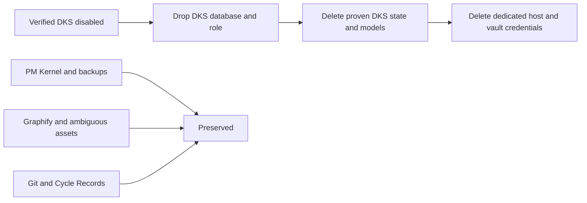

# DKS State Retirement

## Ownership And Preconditions

`dbsctr_knowledge_store` owns irreversible retirement of DKS database, access,
projections, private state, and digest-owned model artifacts. Distribution routing
and host disablement must be delivered and verified first. PM Kernel and Graphify
retain separate ownership.

Preconditions are: all DKS jobs/processes and OpenCode routes are absent; the
machine flag is false; shared PostgreSQL and PM backup health pass; one sanitized
inventory identifies each owned object; and explicit no-backup deletion approval
is bound to the current cycle. Failure before deletion changes nothing. Failure
after deletion leaves DKS off and returns bounded residual classes; it never
recreates credentials or restarts a service.

## Retirement Contract

- Terminate only sessions connected to `dbsctr_knowledge`, drop that database,
  then drop login `dks_dotfiles_ai` and no-login owner `dks_owner`. Preserve
  `pm_kernel`, its role, container, forwarding, verified backups, and VM.
- Permanently delete the DKS-owned knowledge state tree, private corpora,
  projections, receipts, benchmarks, API keys, caches, locks, and runtime artifacts.
- Delete only model/runtime artifacts whose existing manifests prove DKS ownership.
  Preserve ambiguous or shared Graphify/model assets and report them as retained.
- Delete DKS host Keychain entries and, only after database access is removed, the
  dedicated 1Password item supplying the DKS PostgreSQL password. Preserve every
  other vault item and credential.
- Delete DKS runtime logs and private benchmark/operational evidence after writing
  one owner-private sanitized retirement receipt outside the retired DKS tree.
- Retain Git source, specs, tests, migrations, Cycle Records, closed PR #130,
  branches, and commit history. The receipt contains categories, counts, digests,
  result classes, and time only; no secret, path, database identity, model body,
  or private evidence.
- No archive or recovery copy is created. Retirement is intentionally irreversible.

The exact filesystem inventory is:

- delete the complete configured DKS knowledge-state tree;
- delete the complete `dbsctr` child beneath the configured embedding model root;
- beneath the mixed quality-model `dbsctr` child, delete only
  `llama.cpp-0e1d9185`, `nomic-embed-code`, `qwen3-reranker-4b`, and
  `reranker-venv`;
- preserve every `graphify-sql-*` child and any unlisted or identity-mismatched
  model artifact;
- delete the four DKS stdout/stderr log pairs, DKS bytecode cache, and dedicated
  host Keychain service `dev.dotfiles-ai.dks-postgres`;
- delete the dedicated 1Password item `DBSCTR Knowledge PostgreSQL` in the
  Automation vault after database and role removal;
- reduce private machine configuration to `knowledge_store.enabled=false`,
  removing subordinate DKS project, model, port, quality, PostgreSQL, and
  reconciliation values.

Before deletion, source manifests and live identity/digest checks must prove each
model child. A mismatch becomes retained ambiguity, not permission to delete.
Write the sanitized receipt atomically with owner-only permissions beneath the
configured distribution retirement-state directory, outside every deleted tree.

## Behavior And Validation

Given proven ownership, retirement removes the exact object once and repeated
execution reports it absent. Given ambiguous ownership, it preserves the object
and reports retained ambiguity. Given a shared PM object, it refuses deletion.
Given any residual DKS database login, process, route, job, key, state, or proven
model artifact, Operate fails. Given a future enable request, no old state or
credential may resurrect; controlled re-enable creates new state under a future
contract.

Validation inventories before/after sizes and identities privately, tests a fake
database/state hierarchy red-first, proves refusal of shared/ambiguous assets,
verifies PM backup/restore and database health, confirms DKS database/login absence,
confirms `dks_owner` absence, and confirms no process, port, job, tool, config,
key, log, or private DKS tree.
The destructive live step requires a fresh confirmation after all preconditions
and non-destructive gates pass. Release is not applicable; every other gate is
required.

## Visual Evidence

| Concern | Decision | Review question |
|---|---|---|
| Boundary | required: ownership flow | Can PM or Graphify state be deleted? |
| Interaction | required: ordered retirement flow | Are credentials removed after database access? |
| State | required: behavior prose | Can partial failure reactivate DKS? |
| Data/trust | required: ownership flow | What private evidence is retained? |
| Schema | not_applicable: database is dropped, not migrated | - |
| Dependency/deployment | required: ownership flow | Which shared resources survive? |
| Quantitative | not_applicable: inventory is evidence, not comparison | - |

**Text Equivalent:** Only after DKS runtime is absent, the dedicated database and
role are dropped, proven DKS state/models are deleted, and dedicated credentials
are removed. PM Kernel, Graphify, ambiguous assets, Git, and Cycle Records remain.
Owner: DKS maintainer. Change trigger: state, credential, model, or shared-database
ownership change.
