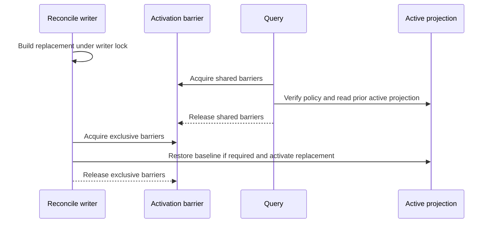
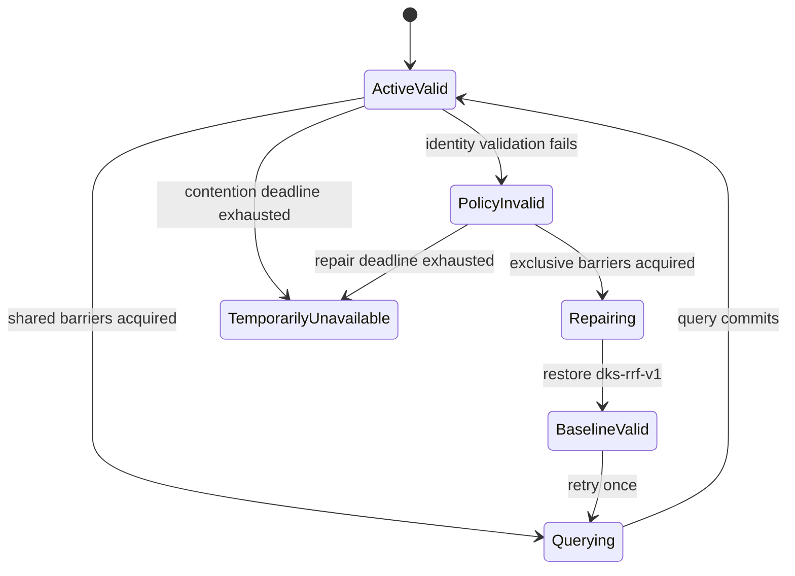

# DKS Query Performance

## Problem

Current queries validate quality policy under exclusive advisory locks and then
open a second session for shared query locks. Nonblocking contention fails as
`quality policy lock unavailable`, causing repeated retrieval loss and expensive
fallback exploration.

## Required Behavior

- A query verifies source, authority, privacy, ranking-policy, and projection
  identities before returning citations.
- Replacement preparation uses writer serialization but does not hold an
  activation barrier while parsing, embedding, or producing derived artifacts.
- The normal path uses one shared activation barrier and one repeatable-read
  transaction without acquiring an exclusive repair lock.
- A query may serve only the prior policy-valid active projection while a writer
  prepares its replacement.
- Query-visible activation is atomic and restores `dks-rrf-v1` in the same
  transaction whenever the new projection invalidates active quality-policy
  identity.
- Stale, missing, or invalid policy evidence may escalate to one bounded exclusive
  repair path.
- Activation contention uses bounded retry and returns a sanitized explicit
  availability class when exhausted.
- Existing project, code, and authority advisory-lock identities remain the
  activation barriers so old and new processes fail safely during deployment.
- Separate writer-only lock identities serialize long replacement preparation.
- Lock acquisition and one optional policy repair share one 2,000-millisecond
  monotonic deadline.
- Partial lock acquisition is released deterministically and lock-stage duration
  is observable without exposing PostgreSQL identity.
- Query fallback never bypasses policy validation, source authority, privacy
  sequence, or projection integrity.

## Scenarios

**Scenario: Serve the prior active projection during replacement preparation**

- Given one policy-valid active projection and a serialized writer building its replacement
- When a query starts before replacement activation
- Then the query reads the prior active projection under one shared activation barrier
- And writer preparation does not cause an opaque policy-lock failure

**Scenario: Invalidate quality policy atomically**

- Given active quality ranking bound to the current projection identity
- When replacement activation changes a bound source, authority, graph, or privacy identity
- Then the activation transaction restores `dks-rrf-v1`
- And no query can observe the new projection under the stale quality policy

**Scenario: Fail closed after bounded contention**

- Given activation or repair cannot acquire every required barrier within its bound
- When retry is exhausted
- Then `dksctl query` exits `75`, writes no stdout, and writes exactly
  `projection_busy\n` to stderr
- And no source, database session, process, path, or raw error identity is exposed

**Scenario: Repair one invalid active policy**

- Given a query holds every shared activation barrier and finds invalid active quality-policy identity
- When the same two-second deadline still permits repair
- Then it releases the shared barriers before acquiring the complete exclusive set
- And restores `dks-rrf-v1` atomically before retrying the query once
- But exhaustion returns `projection_busy` without citations or a second repair

## CLI Availability Contract

Successful query output remains the existing backward-compatible citation JSON.
Exhausted activation or repair contention has one machine interface:

| Field | Value |
|---|---|
| Process status | `75` |
| Stdout | empty |
| Stderr bytes | `projection_busy\n` |
| Citations | absent |
| Retryability | temporary; interpreted by the downstream OpenCode owner |

DKS does not return the model-visible availability envelope. Any other invalid,
malformed, unsafe, or non-operational outcome remains fail-closed under its
existing error contract.

## Lock Contract

Writer-only locks serialize replacement work for project, code, and authority
channels. Existing project, code, and authority lock identities remain activation
barriers and protect only query-visible transitions. Every query holds shared
activation barriers in canonical project, code, authority order through policy
verification and one repeatable-read transaction. Activation and policy repair
use the same order exclusively. A failed partial acquisition closes its database
session and releases every acquired lock before bounded backoff, retry, or return.
All acquisition attempts and the one permitted repair consume the same monotonic
2,000-millisecond budget.

## Visual Evidence

| Concern | Decision | Review question | Canonical source | Owner/change trigger |
|---|---|---|---|---|
| Boundary | not_applicable: authority and projection boundaries are unchanged | - | DKS README Visual Evidence | Authority change |
| Interaction | required: replacement/query sequence | Can queries use prior active state while replacement work proceeds? | Required Behavior and Lock Contract | Lock or activation change |
| State | required: active projection transition | Can stale quality policy observe a new active projection? | Scenarios and Lock Contract | Policy or activation change |
| Data/trust | not_applicable: no new data movement | - | DKS README Visual Evidence | Trust-boundary change |
| Schema | not_applicable: no schema change | - | Existing DKS schema contract | Schema change |
| Dependency/deployment | not_applicable: no new service or dependency | - | Existing DKS deployment contract | Runtime dependency change |
| Quantitative | required: paired contention measurements | Does the change remove opaque lock failures without citation regression? | Measurement | Acceptance-target change |

**Text Equivalent:** Reconciliation serializes replacement preparation without
holding query activation barriers. Queries hold shared barriers while verifying
and reading the prior active projection. The writer takes exclusive barriers only
for the final transition, restores baseline ranking in that transaction if the
new identity invalidates quality policy, activates the replacement atomically,
and releases the barriers.

**Text Equivalent:** A query may read only a policy-valid active projection.
Invalid policy receives one bounded exclusive repair that restores baseline
ranking before one retry. Failure to acquire the complete lock set within two
seconds exits temporarily unavailable without citations.

## Measurement

Measure cold and warm p50/p95, contention failures, retry count, fallback count,
policy-repair count, and citation-quality equivalence. The first target is warm
p95 below 10 seconds with zero opaque lock failures and unchanged exact citation
regressions.

## Gate Ledger

| Gate | Applicability | Result | Authority |
|---|---|---|---|
| Domain | required | pending | DKS README and Initiative manifest |
| Behavior | required | pending | Contention, repair, activation, and compatibility scenarios |
| Spec | required | pending | CLI availability, lock, visual, and measurement contracts |
| Contract | required | pending | DKS and OpenCode boundary validation |
| Test-driven implementation | required | pending | Focused fake-clock, lock-session, CLI, and citation fixtures |
| Refactor | required | pending | Shared lock helpers and stale-path review |
| Review/Integrate | required | pending | Diff, downstream contract, affected QA, and protected integration |
| Release | not applicable: no versioned artifact is published | not_run | Engineering Profile |
| Deploy | required | pending | Managed helper identity and local apply evidence |
| Operate | required | pending | Live reconcile/query contention smoke and rollback evidence |
| Maintain/Retire | required | pending | Compatibility, rollback, and lock-identity ownership |

## Non-Goals

Do not add a new store, daemon, hosted retrieval service, weaker policy, or
unverified cache.
