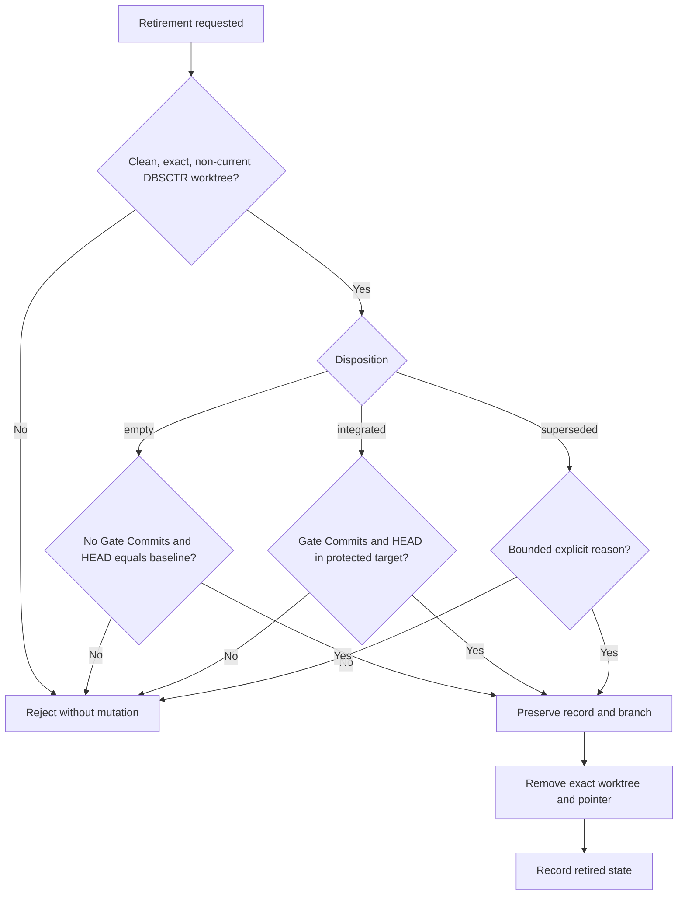

# Stale Cycle Retirement

## Scope

Retire stale DBSCTR-created cycle worktrees without fabricating successful gates,
deleting cycle records, deleting branch refs, or touching dirty worktrees.

## Behavior

- `dbsctrctl cycle-retire --cycle-id ID --confirm ID --disposition KIND
  --reason TEXT` accepts only an exact confirmed active cycle with a clean,
  identity-matched DBSCTR-created worktree outside the caller's worktree.
- `empty` requires no Gate Commits and a worktree HEAD equal to the cycle baseline.
- `integrated` requires every recorded Gate Commit and the current worktree HEAD
  to be ancestors of the fetched protected base branch.
- `superseded` requires a bounded explicit reason. It preserves the cycle record,
  commit identities, and local branch ref for later inspection.
- Retirement records a crash-recoverable removal marker, removes only the linked
  worktree and its exact active pointer, then changes cycle state to `retired`.
- Dirty, missing, current, foreign, branch-changed, malformed, or mismatched cycles
  fail closed. Normal completed-cycle cleanup remains unchanged.

## Validation

Synthetic Git fixtures cover all three dispositions, exact confirmation, dirty
rejection, target ancestry, branch retention, record retention, and retry after
interrupted worktree removal.

## Shared Completed Worktrees

- `dbsctrctl cycle-retire-worktree --cycle-id ID --confirm ID --reason TEXT`
  accepts only the DBSCTR-created owner of one clean completed worktree.
- Every Cycle Record sharing its worktree identity must be completed, and every
  recorded Gate Commit plus current HEAD must be contained in the fetched delivery
  target. A remaining active pointer, dirty path, foreign identity, missing commit,
  or unintegrated follow-up fails closed.
- The operation removes only the physical worktree. It keeps every completed Cycle
  Record and branch ref, and records all associated cycle IDs on the owner record.
  Inventory treats the absent, explicitly retired shared worktree as terminal
  rather than missing cleanup state.

## Visual Evidence

| Concern | Decision | Review question | Canonical source | Owner/change trigger |
|---|---|---|---|---|
| Boundary | not_applicable: all retirement authority remains inside the helper, Git, and local Cycle Records already named above | - | Scope and Behavior | Lifecycle owner |
| Interaction | required: retirement decision flow | What proof permits each destructive worktree removal path? | Behavior and Shared Completed Worktrees | Lifecycle owner; retirement precondition changes |
| State | required: retirement decision flow | Which active or completed records may become retired? | Helper retirement contract | Lifecycle owner; disposition changes |
| Data/trust | not_applicable: retirement retains local records and branch refs without crossing a trust boundary | - | Scope | Lifecycle owner |
| Schema | not_applicable: no persisted schema is introduced here | - | Cycle Record contract | Lifecycle owner |
| Dependency/deployment | not_applicable: no runtime topology is defined | - | Scope | Lifecycle owner |
| Quantitative | not_applicable: no decision depends on comparative numeric evidence | - | Validation | Lifecycle owner |

**Text Equivalent:** Retirement first proves an exact, clean, non-current DBSCTR
worktree. Empty retirement additionally proves no Gate Commits and baseline HEAD;
integrated retirement proves every Gate Commit and HEAD reached the protected
target; superseded retirement requires an explicit reason. Failure changes
nothing. Success preserves Cycle Records and branches, removes only the exact
worktree and pointer, then records retirement. The lifecycle owner updates this
view with any retirement precondition or disposition change.
