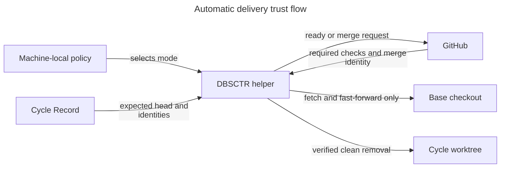
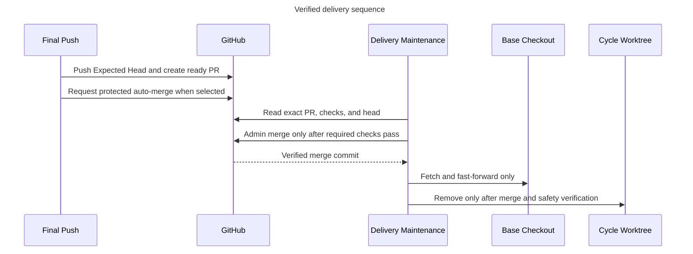

# Automatic Verified Delivery

## Purpose

Reduce branch and worktree ambiguity by allowing an explicitly enabled DBSCTR
cycle to merge after required CI passes, synchronize a compatible base checkout,
and retire only its clean isolated worktree. Existing installations remain on
draft-PR delivery until machine-local policy opts in.

## Domain

| Term | Meaning |
|---|---|
| Delivery Policy | Machine-local validated configuration selecting disabled, protected auto-merge, or exact-repository administrator merge. |
| Expected Head | The immutable feature-branch commit recorded when Final Push creates the pull request. |
| Verified Merge | A closed merged pull request whose repository, base, head branch, expected head, merge strategy, and merge commit all satisfy this contract. |
| Base Checkout | The unique linked checkout on the recorded protected base branch. |
| Delivery Maintenance | Idempotent reconciliation that observes CI and merge state, synchronizes the Base Checkout, and retires eligible cycle state. |

GitHub owns pull-request checks and merge state. The Cycle Record owns Expected
Head, repository, branch, base, policy snapshot, and reconciliation evidence.
Git owns checkout identity, ancestry, cleanliness, and worktree removal.

## Behavior

### Scenario: Preserve disabled delivery

- Given no valid enabled Delivery Policy exists
- When Final Push completes
- Then DBSCTR creates or verifies the existing draft pull request
- And it performs no ready transition, merge request, base synchronization, or early cleanup

### Scenario: Request protected auto-merge

- Given enabled policy selects ordinary merge for the exact repository
- When Final Push verifies the pushed Expected Head
- Then DBSCTR creates a ready pull request and requests GitHub merge-commit auto-merge with the Expected Head guard
- And GitHub branch protection and required checks remain authoritative

### Scenario: Perform configured administrator merge

- Given enabled policy lists the exact repository for administrator merge
- And the pull request remains open at Expected Head
- When GitHub reports every required check successful with none pending, failed, cancelled, skipped, or unavailable
- Then Delivery Maintenance requests one merge commit using administrator privilege and the Expected Head guard
- But it never treats mergeability alone as passing check evidence

### Scenario: Reconcile a verified merge

- Given the pull request is merged by a merge commit containing every recorded Gate Commit
- And the unique Base Checkout is clean, on the recorded base branch, and tracks the unchanged destination
- When Delivery Maintenance fetches the protected base
- Then it fast-forwards the Base Checkout to the verified merge
- And it removes the clean non-current DBSCTR-created cycle worktree and local cycle branch
- And repeated maintenance returns the same terminal outcome without another merge or destructive action

### Scenario: Preserve unsafe local state

- Given checks, pull-request identity, Expected Head, merge ancestry, Base Checkout identity, cleanliness, or fast-forward safety is missing or invalid
- When Delivery Maintenance runs
- Then it records or reports a bounded blocker
- And it does not merge, reset, force-push, delete a branch, remove a worktree, or alter the checkout

## Interfaces

The lifecycle helper reads an optional machine-local JSON document. Missing
configuration is equivalent to disabled automation.

```json
{
  "auto_merge": true,
  "admin_merge_repositories": ["owner/repository"]
}
```

`auto_merge` must be a JSON boolean. `admin_merge_repositories` must be a bounded
array of unique exact lowercase-or-case-preserving GitHub `owner/repository`
names; wildcards and URLs are invalid. Invalid enabled policy fails closed before
any GitHub mutation.

Final Push snapshots the selected mode and Expected Head in the Cycle Record.
Later local configuration changes do not escalate an existing cycle from
protected auto-merge to administrator merge.

Delivery Maintenance is a retry-safe helper operation over completed draft-PR
Cycle Records. It may request or observe merge, fetch the recorded base, perform
only `--ff-only` synchronization, and invoke existing cleanup checks. It returns
structured per-cycle outcomes without exposing credentials or absolute paths.

## Contracts

- Automatic merge is disabled by default and existing records remain readable.
- Every merge command includes the expected pull-request head SHA.
- The first implementation supports merge commits only; squash and rebase are rejected.
- Protected mode delegates pending checks to GitHub auto-merge.
- Administrator mode independently requires all required checks successful immediately before merge.
- A Verified Merge contains every recorded Gate Commit in its ancestry.
- Base synchronization is fetch plus fast-forward only.
- Cleanup requires completed state, exact DBSCTR ownership, non-current worktree,
  unchanged branch and HEAD, clean status, and Verified Merge evidence.
- Failures are retryable and never falsify a successful remote merge.
- Tokens, check output, URLs other than the validated public pull-request URL,
  absolute paths, and command arguments are not persisted in Git artifacts.

## Compatibility And Recovery

Absent policy preserves current draft delivery. Existing completed cycles without
an automation snapshot remain manual. Disabling policy stops new merge requests
but does not erase recorded outcomes. An operator resolves dirty or diverged
checkouts manually, after which maintenance may retry. Rollback disables policy;
it cannot unmerge an already verified pull request.

## Validation

- Focused helper tests cover disabled compatibility, protected auto-merge,
  administrator check gating, exact-head drift, merge ancestry, clean fast-forward,
  dirty/diverged preservation, idempotency, and cleanup ordering.
- Lifecycle contract tests reject universal administrator bypass, merge without
  checks, squash/rebase ancestry loss, and cleanup before merge verification.
- Python compilation and `git diff --check` remain required.

## Gate Ledger

| Gate | Applicability | Result | Evidence | Exception | Owner |
|---|---|---|---|---|---|
| Domain | required | pending | This specification | - | Discovery |
| Behavior | required | pending | Given/When/Then scenarios | - | Discovery |
| Spec | required | pending | Interfaces and Visual Evidence Plan | - | Discovery |
| Contract | required | pending | Safety, compatibility, and recovery contracts | - | Discovery |
| Test-driven implementation | required | pending | Focused helper and lifecycle tests | - | Build primary |
| Refactor | required | pending | Affected-scope diff review | - | Build primary |
| Review/Integrate | required | pending | Independent review and affected QA | - | Build primary |
| Release | not_applicable: no versioned artifact is published | not_run | Profile | - | Primary |
| Deploy | required | pending | Managed local helper deployment smoke | - | Build primary |
| Operate | required | pending | Retry and bounded blocker evidence | - | Build primary |
| Maintain/Retire | required | pending | Disabled default and rollback evidence | - | Build primary |

## Visual Evidence Plan

| Concern | Decision | Question answered | Evidence source | Owner / freshness trigger |
|---|---|---|---|---|
| Boundary | required: trust-flow flowchart and Text Equivalent | Which authority may mutate GitHub or local Git state? | Domain and Contracts | Lifecycle owner; authority change |
| Interaction | required: delivery sequence and Text Equivalent | In what order do checks, merge, synchronization, and cleanup occur? | Behavior and Interfaces | Lifecycle owner; operation-order change |
| State | not_applicable: scenarios and structured outcomes fully define states | - | Behavior | Lifecycle owner; new persistent state machine |
| Data/trust | required: trust-flow flowchart and Text Equivalent | Which public, private, and Git-owned facts cross boundaries? | Domain and Contracts | Lifecycle owner; persistence change |
| Quantitative | not_applicable: no numeric comparison or threshold is claimed | - | Validation | Lifecycle owner; threshold added |



**Text Equivalent:** Machine-local policy may enable automation but cannot change
the Cycle Record's Expected Head. DBSCTR sends a guarded request to GitHub and
accepts only GitHub check and merge identity evidence. After Git ancestry and
checkout safety checks pass, DBSCTR may fast-forward the Base Checkout and remove
the separate clean cycle worktree. GitHub never supplies local cleanliness or
worktree ownership authority.



**Text Equivalent:** Final Push publishes and binds the Expected Head. Protected
mode asks GitHub to merge only after its requirements pass. Administrator mode
waits for Delivery Maintenance to observe all required checks successful before
requesting a guarded admin merge. Maintenance then verifies merge ancestry,
fast-forwards the compatible Base Checkout, and only afterward removes the clean
cycle worktree.
