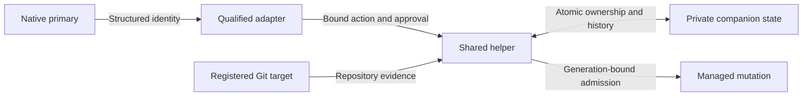
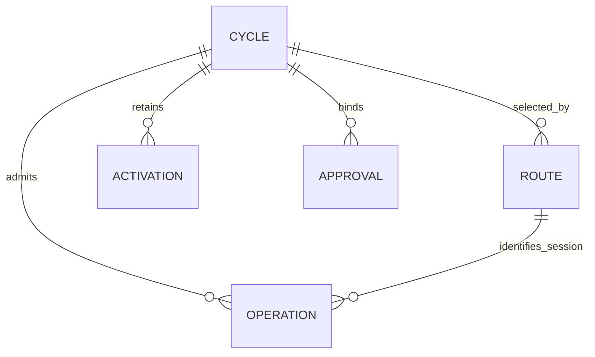

# Canonical Continuation Core Contract

Status: implemented and qualified; live cycle enrollment remains explicit and opt-in.

## Profile And Scope

Use `../PROFILE.md`. Owner: dotfiles owner. Risk: critical, because this changes
managed-session mutation admission. Modules: Python, Security and ML/AI.
Core delivery is a feature-branch draft PR, without live enrollment, deployment,
record migration or provider invocation. OpenCode translation and managed rollout
are dependent slices, not implied by core completion.

The approved Initiative scope is
`../../../initiatives/dbsctr-delivery-lifecycle/CANONICAL-CONTINUATION.md`.
The core provides repository-scoped private state and admission primitives, with
fixture-level conformance. It does not claim arbitrary-shell filesystem isolation.
The operator explicitly selected coordination among cooperating managed sessions.
Same-user manual/adversarial filesystem writes and unmanaged runtimes are outside
that guarantee; enrolling a cycle with an unquiesced old runtime is prohibited.

This feature is additive and opt-in per cycle. Delivered `attach-runtime`
behavior remains unchanged for unenrolled cycles until the adapter slice is
qualified. Do not change native conversation paths or replace the current session.

## Domain

Conversation home is the native checkout association. Execution target is the
validated cycle worktree. A route selects one cycle for one native session in
one runtime storage boundary. Reader selection is distinct from writer ownership.
An activation event records exact identity, not authority to mutate. A writer
generation is an integer fencing cooperating mutation admission. An operation is
an admitted call whose completion or explicit quiescence has not been forgotten.

Repository identity uses resolved Git common-directory equality, registered
worktree membership and the Cycle Record's worktree identity. A remote URL,
slug, path prefix, process ID, timestamp or model name cannot substitute for it.
Reuse existing `record_worktree_matches` and registry validation where applicable.

## Private State

Use one owner-private `continuation.sqlite3` under the repository's existing
Git-common-directory DBSCTR state root. SQLite is already a helper dependency
from the standard library. It is separate from native runtime databases and from
the existing global improvement ledger. No hosted service or new daemon.

Use a schema-version table and these logical tables, with exact key validation
in the helper; concrete SQL column types follow this contract:

| Table | Key | Required values |
|---|---|---|
| metadata | singleton | schema_version=1 |
| cycles | cycle_id | recorded worktree ID, enrollment record digest, writer session key or null, generation >=0, state (`reader_only`, `owned`, `draining`, `recovery_required`, `closed`) |
| routes | storage-boundary digest + native session ID | cycle_id, conversation worktree ID, current activation event ID or null |
| activations | monotonically assigned event ID | cycle_id, session key or null for legacy evidence, kind (`legacy`, `attach`, `transition`), exact validated activation or explicit unavailable, predecessor event ID or null |
| operations | opaque operation ID | cycle_id, writer generation, session key, native call ID, operation class, state (`running`, `completed`, `uncertain`), completion class or null |
| approvals | opaque receipt ID | action, cycle/worktree identity, expected generation, exact state digest, target session or null, validated operator approval binding; consumed once or replayed only idempotently |

Session keys identify a storage boundary and exact native session, not a model
or a guessed session family. Boundary digests are derived locally from the
resolved runtime storage identity; source paths are not returned or published.
Route IDs and worktree IDs remain private. Store neither prompts, transcript
bodies, shell strings, file contents, credentials, nor account metadata.

Database creation is explicit enrollment-only. Read-only check opens an existing
database with SQLite read-only mode and creates no directories, database, WAL,
route, operation or timestamp. Missing state is `not_enrolled`. Reject unsafe
ownership, symlinks, corrupt state, unknown schema or conflicting foreign keys.
Use restrictive owner-only directory/file modes, including SQLite auxiliary files.

Mutations use a bounded SQLite transaction with foreign keys enabled and one
writer (`BEGIN IMMEDIATE`). Busy acquisition has a two-second upper bound and
returns `state_busy`; do not spin or silently retry. Do not hold a database lock
while native tools run. Commit route, writer and activation changes together.
After a process interruption, SQLite atomicity preserves either the prior or new
transaction. Native tool completion is a separate state transition, never
inferred from transaction success.

Default enumeration is bounded to 100 rows with deterministic cursors. Limit each
request to 64 KiB and use existing opaque-ID/activation validators; reject unknown
keys. No automatic history pruning in core. A long-lived installation requires
explicit retention/compaction qualification before rollout; lack of a retention
policy does not authorize deleting activation or uncertain-operation evidence.

## Compatibility And Enrollment

Choose companion state, not a Cycle Record schema upgrade. Preserve schemas 3/4/5
and the exact existing generic/legacy OpenCode activation fields. Do not backfill
invented activation. Enrollment snapshots the old record digest and imports any
valid existing activation once as a legacy event, preserving unavailable session
or timing attribution as unavailable. Later gate writes may legitimately change
the record digest: validate current immutable cycle/worktree identity rather than
requiring forever-equal whole-record bytes.

An existing active cycle enrolls only after exact target validation and explicit
operator confirmation that nonparticipating old runtimes and their outstanding
mutations are quiescent. This is a trusted-operator assertion, not inferred runtime
evidence. Store its approval binding, not free text. Repeated enrollment is
idempotent only for matching identity and must not erase subsequent state.

Once enrolled, the current helper rejects legacy unmediated mutation for that
cycle with `continuation_admission_required`. Inventory every cycle-mutating
helper command and its callers before implementation; admission must occur at a
shared boundary, not only at attach. Read-only legacy status remains available.
Standalone old executables cannot be made safe by a new database they ignore;
qualified deployment must quiesce them. If exclusion cannot be established, do
not enroll or enable the cycle. Downgrade may retain readable old records but
must disable managed mutation rather than restart incompatible writers.

The old record's original activation remains historical, not the current actor.
New continuation-aware reports combine that baseline with activation events and
report mixed identities once per cycle. Consumers unable to interpret companion
state must report mixed-attribution unavailability rather than attributing all
work to the legacy singleton. Core includes reader/conformance fixtures;
federation/export deployment requires dependent consumer qualification. Existing
saved immutable reports are never rewritten.

## CLI And Typed Boundary

Proposed helper subcommands share the existing repository-resolution convention.
All outputs are exact schema-version-1 JSON with `ok`, `reason`, `cycle_id`,
`state`, `generation`, `writer_relation`, `activation_changes` and `next_action`.
Unavailable fields are null; `activation_changes` is an allowlisted array of
field names, never raw previous/current identities. State-mutating calls also
return their opaque operation/event ID when applicable, under a versioned
command-specific response shape. No free-form error or private path is returned.

| Subcommand | Inputs beyond exact target/native identity | Behavior |
|---|---|---|
| `continuation-check` | optional selected worktree | Read-only eligibility, stored target and supported recovery action; no auto-selection by recency |
| `continuation-enroll` | expected cycle-record digest, explicit quiescence approval binding | Validate and create companion cycle state; no writer claim or gate advancement |
| `continuation-attach` | reader or writer request, expected generation, optional provider-transition approval | Atomically validate route/activation and claim an unowned writer; never steal ownership |
| `continuation-admit` | expected generation, native call ID, operation class | Validate current authority and target; create one running operation idempotently |
| `continuation-finish` | operation ID, outcome (`completed`, `uncertain`) | Close only the exact caller-owned operation or pin recovery; no global unlock |
| `continuation-handover` | expected generation, explicit target session and bound approval | Begin draining; transfer only with no running/uncertain operations |
| `continuation-recover` | expected generation and exact outstanding-operation set digest, explicit quiescence approval binding | Record operator-confirmed quiescence; invalidate old generation and return to reader-only state |

Typed adapters supply session/message/call evidence from native context, not from
model-supplied identity fields. Validate exact primary message ownership and
current agent/provider compatibility using structured evidence, preserving Plan
and child denial for mutators. Approval binds action, cycle/worktree identity,
current generation, target session where applicable, and outstanding-state digest.
Recheck after approval. CLI environment variables alone are not authorization.
The adapter must not expose a model-supplied approval boolean as proof of consent.

A read-only check without an explicit target and without a stored session route
returns `not_enrolled` with null cycle/target identities and `select_target`.
It does not try to attach the canonical checkout. An existing invalid route never
falls back to this no-selection response.

Reasons are a closed set: `ok`, `not_enrolled`, `state_busy`, `invalid_identity`,
`invalid_state`, `registry_mismatch`, `repository_mismatch`, `invalid_target`,
`capability_unavailable`, `continuation_admission_required`, `generation_changed`,
`writer_occupied`, `operation_in_flight`, `recovery_required`,
`provider_confirmation_required`, `revision_incompatible`, `approval_required`.
Loaded external-directory policy is adapter-owned; the core cannot claim to
inspect that layer and returns capability unavailability when necessary.

Writer relation is `self`, `other`, `none` or null when unavailable. Next action
is `none`, `enroll`, `select_target`, `switch_to_build`, `confirm_provider`,
`request_handover`, `wait_for_completion`, `confirm_quiescence`, or
`qualify_runtime`. Failure does not issue success identifiers or mutate state,
except explicit uncertain completion which intentionally records recovery state.

## Authority And State Transitions

### Completion And Retry

Final Push's durable record and the native completion hook are separate events.
The helper removes the active pointer after recording completed delivery. This
must not prevent the exact admitted operation from finishing, hide successful
delivery output, or leave its conversation permanently selected on a dead target.

Resolve a pointerless completed record only through an authenticated stored
operation (finish) or session route (read-only check and approved recovery), with
the existing repository, registry, worktree and Cycle Record validation. Never
scan for a recent record, recreate an active pointer, infer an operation identity,
or use terminal resolution to enroll, attach or admit writes to a completed cycle.
An active or finalizing record with a missing pointer remains invalid.

| Durable record and event | Required result |
|---|---|
| Completed, pointer removed, exact native operation finishes | Close that operation; close ownership when no work remains; release the caller's matching route; preserve delivered output and history |
| Completed, native hook lost, recorded route remains | Read-only preflight reports recovery-required and the known generation/writer, not enrollment; no writes admitted |
| Completed, explicit generation/state-bound quiescence recovery | Close outstanding operations with operator-quiescence attribution, fence the old generation, close ownership and release cycle routes; never return to writable reader-only state |
| Finalizing with valid active pointer and existing enrollment | Retain check, attachment, admission and recovery fencing so a failed Final Push can be retried; no new enrollment |
| Missing active pointer or invalid identity | Refuse with no approval binding and next action none; do not suggest enrollment from default response fields |

**Text Equivalent:** Successful publication can precede callback cleanup. Exact
operation identity permits ordinary completion; a lost callback instead requires
explicit operator-confirmed quiescence. Neither case revives a completed cycle.
Finalizing remains retryable only through existing admission authority. Unknown
targets remain blocked rather than falling back to the conversation home.

These transitions are owned by the lifecycle helper; the existing adapter consumes
the unchanged version-1 response. Regression evidence must remove the active
pointer, unlike a fixture that merely changes the record state. Validate repeated
finish and recovery, read-only preflight, denied completed writes, and preservation
of the native tool's successful delivery output. No live incident enrollment,
pointer repair, automatic restart, cross-repository routing or database migration
is authorized by this repair. Rollback retains records and companion history and
must not invoke the old completion path on enrolled work.

### Interrupted Storage Recovery

Read-only preflight must remain read-only even when SQLite needs to recover a hot
rollback journal. A killed writer can otherwise strand the operator before the
generation-bound recovery approval can be generated. The operator approved this
narrow additional boundary after a disposable-process fault injection reproduced
the failure; no production state was used or changed.

Add `continuation-storage-check` and `continuation-storage-recover`, both accepting
the existing native identity envelope and an explicit registered active worktree
through `--request-json -`. Storage check projects file identity only and does not
open SQLite for writing. Storage recover additionally requires an exact approval
receipt and supported Build identity. Neither command selects an owner, advances
a generation, rewrites history, migrates schema or deletes a database.

The version-1 storage response contains only `schema_version`, `ok`, `reason`,
`binding` and `recovered`. Reasons are `ok`, `invalid_identity`, `invalid_target`,
`invalid_state`, `state_busy`, `approval_required`, `capacity_unavailable` or
`recovery_incomplete`. A binding contains action `storage-recover`, the cycle and
worktree IDs, repository digest, native actor/activation digests, Cycle Record
digest and storage-file-set digest; it does not guess an unavailable generation.
The approval has the existing receipt ID plus exact binding shape. No raw paths,
file content, credentials or SQLite error messages are returned.

Validate owner-only directory/file custody, no symlinks or hard links, and exact
same-repository target identity. Hash only the known database, journal, WAL and
SHM files, their identities and sizes, with a 64 MiB combined bound and bounded
read time. Take a shared lock on the existing state lock while checking, and an
exclusive lock while repairing; acquisition shares a two-second deadline. Never
create a missing database or lock as recovery. State/record drift after approval
refuses before opening SQLite for writing.

Under that lock and explicit consent, let SQLite perform its own rollback, then
validate version, integrity and foreign keys. Do not issue logical cycle/route/
operation/activation updates or manual journal manipulation. Preserve a private
owner-only, per-receipt recovery marker under the continuation directory, with
prepared/completed outcome and bounded identity digests. A completed identical
receipt replays idempotently. An interrupted prepared receipt remains explicit;
changed storage requires fresh consent, never a fabricated completion. No marker
or historical state is automatically pruned. Missing/unsafe/corrupt or over-bound
storage stays unavailable for a separately approved maintenance operation.

The adapter must then rerun ordinary read-only preflight and obtain a separate
generation/state-bound approval for writer recovery. Storage repair itself grants
no writer authority. Fault tests cover killed cache-spilling writers, stale file
bindings, unsafe paths, malformed approvals, denied consent, idempotence and
unchanged legacy records. A read-side repair or deletion is not an alternative.

**Text Equivalent:** Exact native and repository identity permits storage
inspection. File-bound operator consent permits SQLite-only physical recovery.
Only a subsequent logical preflight and separate generation-bound consent may
recover ownership. Unknown or changed state blocks each step independently.

Same-provider model/Build-agent changes retain exact new identity and require
current admission authority. Initial compatible core/overlay revisions are the
loaded revision set explicitly supported by the implementation's conformance
fixtures; an unknown revision yields `revision_incompatible`. Never infer
compatibility from version ordering. Provider change additionally requires
target-bound operator approval and a currently compatible primary agent.

| Current state | Event and guard | Result |
|---|---|---|
| Not enrolled | Exact active target + enrollment approval | Reader-only; preserve legacy record |
| Reader-only | Validated Build writer claim | Owned; advance generation |
| Owned | Same owner and generation reattaches | Idempotent route, append only a genuinely changed activation |
| Owned | Other reader selects target | Reader route only; writer unchanged |
| Owned | Matching owner admits a call | Running operation; one ID per exact call/generation |
| Owned | Repeated admit with conflicting call identity | Reject; no operation replacement |
| Owned | Explicit handover requested | Draining; refuse new outgoing-owner admission |
| Draining | No running or uncertain operations; approved transfer | New owner/generation atomically |
| Owned or Draining | Call failure, interrupted runtime or uncertain completion | Recovery-required; no automatic transfer |
| Recovery-required | Exact approved operator quiescence assertion | Reader-only with new generation; old operations retain recovery evidence |
| Owned or Draining | Lost owner, exact approved quiescence assertion, even with zero outstanding operations | Reader-only with new generation; never automatic expiry |
| Any | Cycle completed/removed or identity changed | Refuse mutations and invalidate route eligibility; retain history |

**Text Equivalent:** Enrollment creates no writer. Only a validated Build claim
acquires ownership. Readers do not displace it. Every mutating admission is bound
to a generation and native call; handover drains outstanding work first. Unknown
completion blocks automatic recovery. An explicit trusted-operator quiescence
assertion fences old calls but is not presented as machine-proven process death.
Invalid targets never fall back to canonical main.

## OpenCode Integration Preconditions

Core fixtures do not prove native tool enforcement. Before adapter readiness:

- Qualify the actual runtime path, before-hook denial and structured call identity.
- Cover typed lifecycle tools, native file edits/patches, shell, direct shell,
  MCP/code-mode mutation and any delegated execution entry point. Unqualified
  mutation paths are denied, not heuristically treated as read-only.
- At minimum, shell invocations require writer admission even when claimed to be
  read-only; Plan inspection uses read/search tools. Cwd and explicit file paths
  route to the selected target. This is cooperative routing, not confinement of
  arbitrary shell internals or unrelated same-user processes.
- Success hooks may finish known synchronous operations. Missing/error callbacks
  leave operations uncertain. A native terminal event can resolve an operation
  only where qualification proves it also establishes relevant completion.
- No detached mutating work may outlive an admitted call under the coordinated
  protocol. Unsupported background work blocks handover pending explicit recovery.
- Existing-runtime enrollment and old-writer exclusion require controlled
  operator-approved quiescence. Reopening the exact conversation is mandatory;
  changing its ID/path is not the recovery mechanism.

These are acceptance constraints for the adapter, not permission to install an
OS sandbox, weaken denial rules or create child sessions. A failed capability
probe reopens adapter readiness without invalidating passing isolated core tests.

## Acceptance And Validation

The Initiative CC-01 through CC-14 scenarios apply. Core adds runnable CLI tests
with disposable repositories and synthetic structured identity. Cover same-common-
directory siblings versus unrelated clones, registry/symlink escapes, legacy
schemas and unchanged bytes, native identity forgery, generation/call replay,
two-session writer contention, independent cycles, interrupted transactions,
uncertain operation recovery, provider approval binding, unsupported revisions,
read-only no-create behavior, hostile database paths and truthful mixed attribution.

Red evidence precedes implementation. Reuse `tests/test_dbsctrctl.py` and focused
OpenCode adapter fixtures rather than install a test framework. Selected commands:
`uv run --group test pytest tests/test_dbsctrctl.py -k continuation`, followed by
the affected legacy attachment/identity and lifecycle contract tests. Run Python
compilation for touched helpers. Repository-wide pytest remains explicit-only.
Independent critical-risk review is required where a qualified reviewer is
available; do not silently substitute a denied child agent or self-approve a gap.

## Visual Evidence

| Concern | Decision | Owner/source/change trigger |
|---|---|---|
| Boundary | required: private authority flow | Lifecycle owner; Domain or scope change |
| Interaction | required: state transition table | Lifecycle owner; admission/approval change |
| State | required: state transition table | Lifecycle owner; recovery guard change |
| Data/trust | required: private authority flow | Lifecycle owner; identity/privacy change |
| Schema | required: state relationship diagram | Lifecycle owner; private schema change |
| Dependency/deployment | not_applicable: no core deployment; Initiative owns dependent rollout | Distribution owner; activation added |
| Quantitative | not_applicable: no measured comparison | Validation strategy |

**Text Equivalent:** A qualified adapter conveys exact native identity and bound
approval to the shared helper. The helper validates Git membership and private
ownership/history before admitting managed mutation. This boundary coordinates
cooperating sessions and does not confine arbitrary host-user shell execution.

**Text Equivalent:** Each enrolled cycle has zero or more session routes,
activation events, bound approval receipts and operation records. Every operation
retains its originating session key and generation even when that session selects
another target. Session
routes cannot be deleted while needed by retained operation history; physical
schema must preserve history independently of mutable target selection. The
Private State table is canonical for keys, nullability and values.

## Gates And Ownership

The companion plan `../CANONICAL-CONTINUATION-CORE.plan.json` enumerates all gates.
Kernel, Review/Integrate and Maintain/Retire are required and passed for core
delivery; exact evidence remains in the Cycle Record, with no exceptions. Release is not applicable without a published
versioned artifact. Deploy and Operate are not applicable to this isolated core
slice: no installed helper, native runtime, active cycle, or environment changes.
Dependent adapter/rollout slices require their own live gates; fixture success
does not satisfy them. Maintain/Retire requires explicit legacy-read,
old-writer-exclusion and downgrade contracts even without deployment.

Discovery owns this specification, Initiative and acceptance. Build ownership is
the shared helper, narrowly necessary private-state helpers, continuation reader
consumers and affected tests. It excludes native runtime mutation, configuration
deployment, unrelated auto-merge work and changes to normative scope. If a Build
finding changes these contracts, return readiness_reopened rather than edit them.
