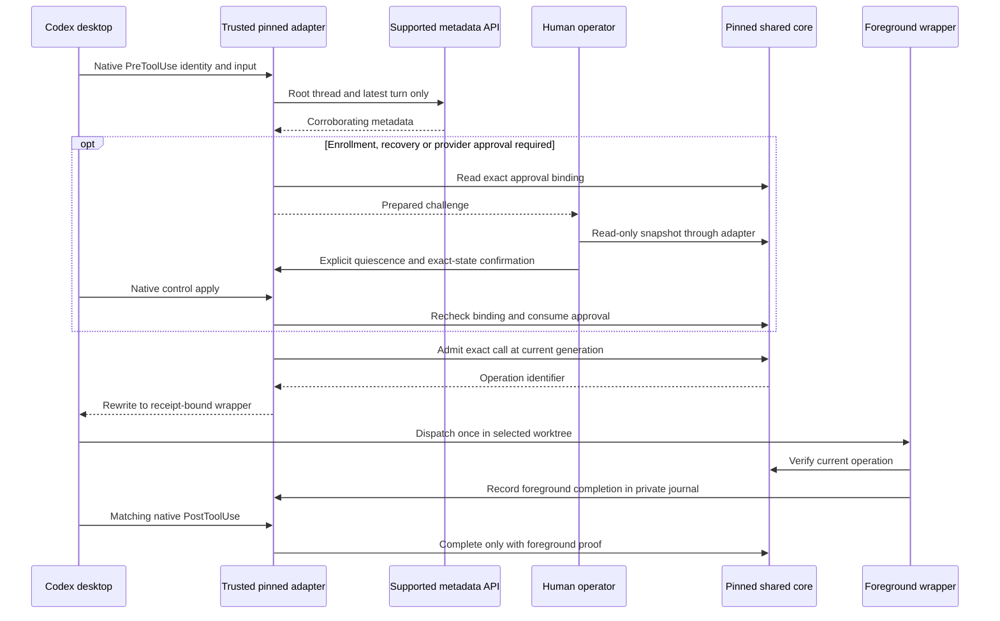

# Codex continuation adapter

Status: Discovery complete for the selected desktop scope with the explicit
collaboration-mode limitation below. Delivery gates remain required before
production activation; fixture qualification is not deployment acceptance.

## Scope and profile

Use `../PROFILE.md`, Python and Security modules, critical risk. The operator
requested continuation of an existing OpenCode-owned cycle in the existing
Codex desktop conversation, and authorized reviewed source changes, main-branch
merge and deployment. Retain the original cycle, pending merge, gate failures,
receipt, ownership history and source checkout. No replacement cycle, fabricated
OpenCode attribution, private Codex storage parsing, or guard removal is allowed.

This extends the existing canonical continuation contract; it does not create a
second lifecycle. The adjacent Codex control plane owns native observation and
translation. The lifecycle helper owns repository validation, admission,
writer generations, evidence, recovery and completion.

## Selected first release

The operator selected support for the existing desktop task and one explicitly
selected registered cycle. Other Codex hosts and guests are deferred; existing
OpenCode behavior remains compatible. This is not authorization for fleet rollout
or changing the desktop conversation's native home. On cycle closure, release the
selection. Selecting the next retained or new cycle requires fresh repository and
cycle validation, not reuse of a previous target by path prefix.

The first release must provide native-primary identity, selected-cycle admission,
matched completion, stale-generation refusal, truthful mixed attribution and
explicit operator recovery. It must not add automatic old-writer displacement,
provider fallback, fabricated source acceptance or new business authority.

The operator selected a manual terminal approval for occasional recovery. The
adapter prepares an opaque challenge bound to action, exact repository/cycle,
writer generation, outstanding operations, target session and activation. A human
runs the displayed operator command outside the agent; it rechecks the binding,
shows the action and requires explicit confirmation before storing a single-use
receipt. The agent never runs that approval command or manufactures its receipt.
An environment flag, TTY, stored consent text or model-supplied boolean is not
proof of native identity. This is a trusted operator assertion under the existing
cooperating-session threat model, not machine proof that a human typed a command.
Ordinary implementation and evidence operations remain automatic after legitimate
attachment; approval is not repeated for every gate or command.

## Established capabilities

The passive qualification on the deployed desktop executable established:

- Exact session, turn and call identifiers and model metadata are supplied by
  native pre/post hooks. Shell, patch, code-mode nested shell and MCP reads were
  observed. The native user separately reviewed and trusted the hook definition.
- A long-running shell remained without a post callback at an intermediate check,
  then received its matching post callback after completion. An initial transport
  result containing a session handle is not completion authority.
- Supported `thread/read(includeTurns=false)` returns the exact thread, provider
  and parent relationship without resuming it. The observed thread has no parent.
- Supported turn metadata agrees with the hook turn identifier, but a separate
  app-server projects the active turn as interrupted. Stored history is not live
  execution state. The live daemon control socket was unavailable.
- A bounded item read did not find the currently executing hook call. Do not use
  a historical item lookup as a proven substitute for native hook provenance.
- Native hook fields do not directly include provider or agent role in this
  runtime. Missing identity must not be inferred from the model name.
- One explicitly authorized child executed only `pwd` in a disposable directory.
  Its pre/post pair shared the primary session identifier but had a different
  turn identifier. A subsequent supported root-thread read returned the primary
  turn, not the child turn. This rejects session-only attribution; it does not
  establish that every different turn is a child or qualify writer admission.

These are local capability observations, not proof of write admission, all-tool
coverage, provider-transition approval, denial, recovery or cross-platform parity.

## Required behavior

1. A validated native Codex primary may inspect a selected registered cycle with
   its own identity; it must never impersonate a retained OpenCode session.
2. An exact native call receives a private, bounded receipt from the native
   adapter. The model does not supply provider/model/role facts or choose a
   historical receipt by recency. Missing, stale, contradictory or reused native
   provenance refuses before lifecycle writes.
3. A repository binding names one selected registered repository/worktree and
   exact conversation. The desktop conversation's native directory remains true,
   even when it is not itself a Git checkout. Do not pretend it is the target
   worktree. An explicit binding must not authorize any sibling repository merely
   because its path shares a prefix.
4. The existing writer is never displaced automatically. Existing generation,
   outstanding calls and provider-transition rules remain authoritative. Recovery
   requires the existing exact-state operator approval and explicit quiescence.
5. Every admitted call is bound to native identity, selected repository, cycle
   and writer generation. Final callback finishes only its own call. Missing or
   interrupted completion retains uncertainty; no timeout implies quiescence.
6. Child calls cannot acquire writer authority. Parent/session-family ambiguity
   refuses; a parent session identifier is not proof of a primary call. Plan
   prohibition is an instruction/operator boundary under the accepted limitation
   below; this adapter does not independently establish collaboration mode.
7. Historical OpenCode records and schemas 3/4/5 remain readable and unchanged.
   Mixed continuation attribution is explicit. Consumers that cannot represent
   Codex identity report that limitation rather than attributing it to OpenCode.
8. Native trust and operator approval remain native actions. Installation never
   writes trusted hashes, fabricates approval, or disables existing guards.

## Accepted collaboration-mode limitation

The operator explicitly accepted this limitation for continuing through the
selected desktop task. The shared lifecycle, cycle records, writer generations,
operation checks and approvals remain harness-agnostic; native observation and
transport remain adapter responsibilities. This decision does not claim support
for every Codex host or change existing OpenCode enforcement.

Actual desktop Plan-mode qualification allowed a read-only control check and
reported the configured Build role. The original denial requirement therefore
failed. Thread and turn metadata from the supported read-only interfaces expose
no collaboration-mode field in the qualified runtime. Permission-mode rejection
must not be described as independent Plan/Default enforcement. Retain the failed
native result even when the remaining tests pass.

For this release the primary follows actual collaboration-mode instructions:
Plan does not attach, recover, admit work or mutate lifecycle state. The operator
returns the task to Default before execution. Native guards continue to enforce
identity, child exclusion, exact selection, receipts, generation fencing and
manual recovery approval. No caller-supplied mode flag or fabricated native
metadata may replace the unavailable proof.

Accepted risk: an instruction violation in actual Plan mode may be admitted by
the adapter. Accountable owner: dotfiles operator. Review condition: before any
additional host/guest deployment, or when supported native collaboration-mode
metadata becomes available. Record the Operate gate as failed with this narrow
user-approved accepted-risk exception; do not label the Plan probe passed or use
the exception to waive unrelated failures. No periodic per-command approval is
introduced. The exception does not authorize violating Plan-mode instructions.

## Native identity validator contract

`validate_native_identity(hook, thread, latest_turn)` returns only session, turn,
call, model, provider and neutral Build role metadata. It confers no writer lease.
For this release, a supported desktop `thread/read` and a bounded
`thread/turns/list(limit=1, sortDirection="desc", itemsView="notLoaded")` must
corroborate the synchronous native hook. The exact root session, explicit null
parent, thread session identifier, latest root turn and model must agree. Provider
must be the supported native OpenAI provider; unknown or missing values refuse.
The stored turn status is deliberately not execution authority. Only the native
pre-tool callback establishes that this call is being attempted now.

IDs are bounded ASCII with a closed character set; models admit version
qualifiers. The hook must be PreToolUse with a bounded call ID, declared model,
and a recognized permission mode. A literal permission_mode=plan, children with
parent-session hooks, absent or contradictory identity and unknown permission
modes refuse. Permission mode is not collaboration mode. The returned neutral
Build role denotes the operator-selected execution policy for this adapter, not
a native attestation that the current collaboration mode is Default. Provider
and primary identity must still be corroborated; no OpenCode agent, session or
message is fabricated.

Fixture tests call the pure validator with synthetic records. Production callers
must obtain records from the pinned native hook and supported API; passing JSON
from a model, environment-only identity or a historical receipt is never an
alternative production entrypoint. Native identity is a prerequisite consumed by
admission, not a public mechanism for bypassing the continuation guard.

## Producer and consumer design

The desktop-only adapter is opt-in. Its private deployment descriptor pins the
native executable, native home, root conversation, actual conversation home,
producer revision and selected registered Git common directory. No descriptor is
accepted from a model-supplied command argument or a substitute environment-only
storage root. Selecting a target never rewrites the native conversation home.

A synchronous PreToolUse callback validates native identity, exact selection and
current continuation state. It creates a bounded, one-call receipt for the
observed tool and argument digest. Receipt issuance and consumption are private
adapter operations; arbitrary supplied identity JSON is not an admission API.
The shared helper must independently verify the configured producer, exact
receipt, target and current writer generation. A receipt is not accepted merely
because its content hash is internally consistent. Unsupported producer versions,
unknown tool paths, child calls, literal plan permission mode and missing
callbacks refuse managed writes. Actual collaboration Plan mode remains subject
to the accepted operator/instruction boundary.

For Bash, the native updated-input mechanism carries the opaque operation into a
qualified wrapper; the wrapper binds the original argument digest and starts the
requested foreground command. Environment transport is not authority: the helper
rechecks the live operation and native receipt. Direct file-tool admission is deferred in this first release; admitted foreground
shell commands may perform file edits. A matching post callback closes only that call;
interruption or missing completion retains uncertainty. No background mutation or
unqualified tool path is supported. Cooperative-session limitations stay explicit.

Root conversation metadata is read through the pinned supported app-server
interface with a three-second overall response deadline and two-MiB total response
cap. Thread reads never resume/load history, and latest-turn reads request exactly
one item-free turn. Duplicate keys, unexpected bodies, malformed frames, missing
fields and protocol/process failures refuse with content-free errors. The adapter
terminates only its own short-lived metadata-server process group.

Recovery approval uses the operator-selected manual terminal surface. Preparing a
challenge only reads the current exact state. Approval stores an action-bound,
single-use receipt after revalidation and explicit operator confirmation; it does
not itself claim the writer. The subsequent native call rechecks state and consumes
that receipt through the owning continuation transition. State changes invalidate
it. Provider transition and quiescence remain separate requirements; a generic
"ready" message does not approve either. The agent must never execute the operator
approval command itself.

Compatibility uses companion provenance while preserving original Cycle Record
history. Existing OpenCode identity validation and ordinary record-schema refusal
remain in place unless an exact qualified Codex path supersedes the applicable
check. Reports must expose mixed attribution or explicit unavailability, never
silently assign Codex work to retained OpenCode sessions.

## Private native receipt journal

The producer's companion journal contains only bounded identity metadata, the
native tool category, argument and deployment digests, an opaque receipt ID, the associated
core operation ID and state. It stores no tool arguments, output, prompts,
transcripts or credentials. Explicit initialization creates an owner-only
SQLite journal; absent read-only access creates nothing. Symlinks, hard-linked
files, unsafe modes, unknown schemas, oversized journals and invalid rows refuse.

An identity's exact session/turn/call tuple can issue only one receipt. States are
`issued`, `active`, `completed` and `uncertain`: only `issued -> active` and
`active -> completed|uncertain` are permitted. Activation binds one operation;
completion must match it. An uncertain receipt cannot silently become completed.
The core's generation and operation journal remain admission authority; a native
receipt alone is never a writer lease. Missing cross-journal completion requires
reconciliation, not a guessed successful outcome.

This private journal is part of the trusted local adapter, like the existing
native OpenCode evidence boundary. Its existence or self-consistent hashes do
not establish how facts were derived. Production issuance must call the native
validator with real hook/API records. Synthetic records, direct manual database
writes and unmanaged/adversarial same-user runtimes are not qualified native
provenance. Fixtures never enable that route in the installed CLI.

Bounded limits: 10,000 receipts, 16 KiB decoded record, and two seconds
for SQLite contention. The exact schema, including constraints and absence of
extra triggers/indexes, is validated before operations. The database uses DELETE
journaling only; WAL/SHM files refuse as incompatible. SQLite max_page_count
enforces an 8 MiB prospective main-database limit before commit. Aggregate
main/rollback-file size is checked against 32 MiB at admission and before commit;
this observation is not an operating-system quota on transient rollback I/O.
Successful commits delete the rollback journal and retain the pager-enforced
main-database bound. No claim of a hard peak filesystem quota is made. Capacity exhaustion refuses; no automatic pruning or
uncertain-operation retirement. A future explicit retirement procedure must
preserve core history and reject running/uncertain receipts before deleting any
native evidence. This release does not add background cleanup.

## Native transport canary

Before writer activation, `codex-continuation qualify --nonce HEX32` is a
separately trusted synchronous PreToolUse canary. It has no receipt-journal,
repository, lifecycle, subprocess or credential operation. It denies only the
exact prepared nonexistent command `codex-continuation-deny-HEX32`, and rewrites
only the exact fixed `printf` of `codex-continuation-original-HEX32` into the fixed
`printf` of `codex-continuation-rewritten-HEX32`. Other valid commands receive an
empty response, not blanket approval. Malformed/duplicate/oversized hook input
receives a bounded denial with no echoed input. The nonce is an identifier, not a
secret or an approval token.

The canary proves native denial and Bash rewrite transport on this executable.
It cannot prove writer authorization. Existing hooks are preserved; native trust
for the added command is requested from the operator, never written by the agent.
Only the two harmless prepared calls qualify this deployment step. Its cleanup
removes the exact canary entry and preserves unrelated hook edits.

## Remaining integration qualification gates

Before implementation, resolve and test the following producer/consumer contracts:

- Native call provenance: receipt issuance, custody, exact-call transport, replay
  rejection and closure. Hooks are the live event source; stored thread metadata
  can corroborate identity but cannot assert current process execution.
- Primary/child discrimination for parent-session hook payloads. A source label,
  absent agent field or permission mode alone must not confer primary authority.
- Explicit repository binding when conversation home is not a registered checkout.
- Qualify the selected manual operator approval producer and single-use consumer
  against changed state, replay, contradictory target and agent invocation. A
  model-supplied boolean or environment variable alone is not approval evidence.
- The exact supported tool paths, unsupported-path denial, asynchronous shell
  handling and whether any background mutation could outlive a post callback.
- Atomic deployment and rollback of native producer and helper consumer. A helper
  must refuse receipts from an unsupported producer revision.

Do not promote this document to ready from the passive probe alone. Choose concrete
interfaces only after these questions are answered with native evidence or an
explicitly accepted change to the existing cooperative-session trust model.

## Validation and delivery

Use disposable repositories for identity forgery, cross-repository binding,
literal plan-permission/child denial, stale receipts, two-writer contention, provider transition,
interruption, recovery, completion and preserved legacy record bytes. Keep the
existing OpenCode continuation conformance suite. Observe denial and successful
admission in the actual Codex runtime before operating on the retained cycle.

The scope excludes same-user manual/adversarial filesystem writes, as does the
existing canonical continuation contract; it must not be described as an OS
sandbox. That exclusion does not authorize the implementing agent to forge native
identity or approval. Source review precedes local deployment. Hosted checks at
the final SHA precede the authorized matching-head admin merge. Restart only when
needed, and preserve the same conversation.

## Visual Evidence

| Concern | Decision | Source/owner/change trigger |
|---|---|---|
| Boundary | required: trust table below | Lifecycle and control-plane owners; native source changes |
| Interaction | required: sequence diagram and transition tables below | Lifecycle owner; admission/completion changes |
| State | required: transition table below | Lifecycle owner; fencing or recovery changes |
| Data/trust | required: trust table below | Control-plane owner; receipt/privacy changes |
| Schema | required: descriptor, native envelope, receipt and approval journal contracts above | Lifecycle owner; representation changes |
| Dependency/deployment | required: producer/consumer deployment rule above | Distribution owner; rollout changes |
| Quantitative | not_applicable: no performance comparison | Validation owner |

Review question: which actor can approve ownership, admit an operation and prove
completion for this desktop task and selected cycle?

**Text Equivalent:** The native desktop supplies the callback. The trusted,
coupled adapter/core installation validates the selected deployment and uses
supported root-thread/latest-turn metadata for corroboration. If approval is
needed, a human confirms the exact current state and quiescence; native apply
still rechecks it in the core transaction. The core owns admission and writer
generation. The wrapper verifies the receipt and current operation, executes
once in the selected worktree, and records foreground completion. Only the
matching native post callback and that proof together complete the operation.
Missing proof or remaining descendants requires recovery, not inferred success.

| Receipt state | Allowed next state or action | Required condition |
|---|---|---|
| issued control | retained as control evidence | no shell operation is admitted |
| issued shell | active | core admission returned an exact operation |
| active, not started | claim once | deployment, input and current core operation match |
| active, started | record foreground completion | shell exited and its process group is empty |
| active, finished | completed | matching native post and successful core completion |
| active, no finished proof | uncertain | matching post or known wrapper failure |
| completed or uncertain | no execution replay | recovery is a separate core operation |

Canonical sources: this contract, `executable_codex-continuation` and the shared
continuation core. Owner: lifecycle bounded context. Update trigger: changed
identity, approval, receipt, completion or deployment relationships. Diagram
source and text are reviewed together. Rendered Mermaid review remains assigned
to the operator under the standing instruction; no rendered pass is claimed.

| Source | Permitted evidence | Not established |
|---|---|---|
| Native pre/post hook | Event identity, model, call completion for a qualified tool path | Provider, primary role, all-tool coverage |
| Supported thread API | Exact stored thread, provider and parent relationship | Live execution or live call admission |
| Operator approval | Exact bound recovery/provider decision | Machine-proven termination of an old writer |
| Shared continuation store | Repository, cycle, ownership generation and operation state | Native runtime facts absent from validated input |

**Text Equivalent:** Each source contributes only its own facts. Combining stored
metadata with native callbacks requires a proved binding; neither alone grants
ownership. Operator approval and generation fencing retain their existing roles.

| State | Required next evidence | Prohibited shortcut |
|---|---|---|
| Passive probe qualified | Concrete native receipt and approval contract | Treat observed hooks as write authorization |
| Adapter validated in fixtures | Native deny/admit/finish and recovery proof | Relabel synthetic identity as native |
| Native adapter qualified | Exact retained-cycle recovery approval | Reuse old OpenCode actor or replace its cycle |
| Owned at current generation | Per-call admission and matched completion | Retry a stale-generation operation |

**Text Equivalent:** Readiness proceeds from observation to a concrete contract,
then fixture and native qualification, then explicit recovery of the existing
cycle. Historical ownership and failures are preserved throughout.

## Deployment descriptor v1

The internal `load_deployment(path)` reader consumes a private, operator-reviewed
installation descriptor, never a path supplied in a model's lifecycle request.
The native installed hook will fix that location. The reader alone grants no
writer authority. Only the non-authorizing inspection CLI accepts a descriptor
path for reviewed qualification configuration; no writer CLI accepts one.

The exact keys are `schema_version` (integer 1), `revision` (literal
`codex-desktop-1`), `conversation_id`, `conversation_home`, `native_home`,
`native_executable`, `producer`, `core`, and `target`. Native executable, producer and core objects
contain exactly `path` and `sha256`; target contains exactly `worktree`,
`common_git_dir`, and `cycle_id`. IDs use the native bounded identifier domain.
All paths are absolute canonical existing paths, with no symbolic link component.
The descriptor and its containing directory are owned by the current user with
no group/other permissions; the descriptor is a regular single-link file. Its
maximum size is 16 KiB. Unknown fields, duplicate keys, boolean versions, unknown
revisions and absent fields refuse without echoing values.

The reader verifies all three pinned file digests through bounded reads (512 MiB per
file), canonical directories, exact Git root/common directory, and registration
of the selected worktree. Git reads use fixed arguments, a five-second aggregate
deadline, and discard inherited `GIT_*` overrides. The descriptor is rechecked
for replacement or mutation after validation. These checks prove installation
and repository binding only; the core must still verify the exact active cycle,
native call, current generation and operator approval. Conversation home remains
its actual directory and need not be a Git checkout. A sibling repository or
another registered worktree cannot replace the selected target by prefix match.

The two native canary calls have now passed on the selected desktop: the exact
denial was blocked by PreToolUse, and the exact rewrite returned only the prepared
rewritten marker with exit zero. This establishes transport, not writer admission.

## Native call envelope contract

The internal `validate_native_call(hook, deployment, thread, latest_turn)`
combines the separately validated descriptor with corroborated native metadata.
It produces identity, the deployment digest, a tool category and the digest of
the complete original tool-input object. No command, path or prompt is retained
in the envelope. This pure operation does not issue a receipt, invoke the core,
change ownership or execute a command.

For the first release the only executable transport is `Bash`. Its exact native
input must contain `command`, may contain `description`, `timeout`, and
`run_in_background`, and must not contain unknown fields. The command is a
non-empty bounded string; description is optional bounded text; timeout is an
optional positive integer; background must be absent or exactly false. The
canonical input is bounded to 64 KiB. Unknown tool transports refuse, rather than
receiving an unqualified writer operation. File changes can use foreground shell
commands after admission; direct patch/editor support is deferred until its
native argument and completion mapping is separately qualified.

The hook's session must equal the pinned conversation and `cwd` must equal its
real conversation home. Target-worktree execution is selected separately by the
wrapper and must not replace this native home fact. The thread and turn must pass
`validate_native_identity`. The envelope includes a digest of the entire validated
deployment so a receipt cannot survive a target, binary, revision or home change.
Canonical JSON uses sorted keys, compact separators, UTF-8, and rejects non-finite
numbers. Digests bind these validated inputs; they do not independently prove
native provenance. The installed synchronous hook remains the only production
producer. This internal function is not a JSON-to-authority CLI.

## Operator challenge journal contract

The native adapter's private journal also retains operator challenges. Preparation
requires the complete core-generated approval binding plus the current deployment
digest. The binding has exactly the existing core fields: action, cycle_id,
worktree_id, generation, state_digest, record_digest, session_key,
activation_digest, target_session_id, and mode. First-release actions are enroll,
attach, and recover; handover to another session is outside this release.

Preparation produces a random opaque challenge, never consent. The operator
surface must read it back, recompute the current core binding and deployment,
show the exact cycle/action and quiescence/provider consequences, and require an
explicit confirmation. Only that surface may change prepared to approved. Core
consumption requires the same full binding and deployment and changes approved
to consumed once. A stale, malformed, unapproved, substituted or consumed
challenge refuses. Failure between consumption and core commit is fail-closed;
it requires a new challenge after checking the current core state, not receipt
resurrection or inferred success. Native exact-state core checks remain mandatory
inside the core transaction even after companion receipt consumption.

The implementation's internal approval transition accepts already-recomputed
bindings for fixture testing; it is not exposed as an agent-callable approval API.
The deployed operator command must obtain that state itself. Neither tests nor
preparing a challenge count as operator consent. Bound: at most 128 retained
challenges, with no automatic pruning. This pre-release journal uses schema 3,
which records foreground completion separately from execution start. Schema 1
and 2 prototypes refuse without migration and carry no production authority.

## Trusted producer boundary

The operator-trusted synchronous hook is the producer under the existing
cooperative-session contract. Its stdin, pinned executable and corroborating
thread metadata are not an unforgeable origin credential. Direct/manual producer
invocation is unmanaged and unsupported, never a legitimate alternate lifecycle
route. This limitation does not permit a managed agent to fabricate a callback or
approval. Qualification must demonstrate that supported managed calls pass through
the trusted producer, children and literal plan-permission calls refuse before execution, unsupported
mutation transports refuse, and the helper rejects receipt-free or caller-identity
requests. No same-user forgery-resistance or OS-sandbox claim is made.

## Single-use shell execution claim

An active shell receipt is not a reusable command token. Before starting a
foreground command the wrapper must validate the current deployment and complete
original-input digest, ask the core to verify the still-running operation at the
current writer generation, then atomically claim that receipt's execution once.
The private journal records only a Boolean execution-started marker. A second
claim, substituted input/deployment/operation, non-shell receipt or terminal state
refuses without changing that marker. Claiming does not complete the operation;
only the matching native post callback may do so. A process failure after claiming
retains the operation for explicit recovery, never grants an automatic replay.
This internal claim primitive is not itself a core-generation check or a native
entrypoint; all described wrapper checks remain required before activation.

## Non-authorizing native observation mode

`inspect --deployment PATH --nonce HEX32` is a temporary qualification hook.
The operator reviews the exact fixed command and immutable source copy. It loads
the descriptor, validates supported native metadata and computes the call envelope,
but never creates a receipt, invokes the core, approves recovery or runs a requested
command. Other conversations receive no action. For the selected conversation,
it retains only known input-field names/types, unknown-field count, whether cwd
matches home, event/tool categories, a hashed call ID and a closed validation
result. It stores neither native IDs, actual cwd, commands, outputs nor transcripts.

Records are exclusive owner-only JSON files under `observations` beside the
private descriptor, capped at 128 entries. Malformed inputs, unsafe storage or
capacity errors never grant admission and leave ordinary commands unchanged.
Only the exact prepared inspection canary may be denied; even descriptor failure
in another conversation cannot deny an unrelated command.
For exactly `codex-continuation-inspect-HEX32`, a validated primary shell input
rewrites to a fixed `printf` marker; invalid identity/input denies that canary.
All other calls remain unchanged in this non-authorizing mode. Such observations
are qualification evidence only and must not be labelled managed-write denial.
The nonce is an identifier, not approval. Configuration/native trust is preserved
as for the earlier transport canary, and retirement removes only the added group.

## Shared-core integration seam

The existing OpenCode JSON CLI remains unchanged. The installed trusted producer
may invoke the same core transition function in-process through an internal
`native_context` parameter. That parameter is not parsed from command-line JSON,
environment identity or a public identity map. It supplies already corroborated
session/activation, exact selected repository basis, actual conversation-home
identity, and an operator-receipt verifier. The core still owns target/registry
validation, snapshots, transaction locking, generation, writer and pending-call
checks, and gate mutation admission. This is adapter dependency injection, not a
second lifecycle or an alternate public authorization API.

Repository basis is the selected registered checkout used to find shared state;
it is not presented as the Codex conversation home. Codex routes use a private
home identity derived from the actual native home, while OpenCode routes retain
their current worktree identity. Core approval compares its current snapshot
inside the transaction and invokes the native operator-receipt consumer there.
No receipt check replaces the core snapshot, and any failure rolls back the core.

Native inspection now confirms the selected executable emits a `command` string
and reports conversation `cwd` for both default and explicit execution workdirs.
Consequently the receipt binds the complete native hook input, not unexposed
unified-exec parameters. The foreground wrapper must always enter the selected
validated worktree explicitly. Outer tool workdir is never target authority.

## Control and shell execution split

Administrative controls (`control check`, `control attach`, `control prepare
<enroll|attach|recover>`, and `control apply <challenge>`) execute inside the
trusted synchronous native hook after identity validation. They call the same
core engine and return its bounded JSON using a fixed quoted printf rewrite.
A control-call reference identifies the native callback; it is not an admitted
shell operation or an OpenCode message. Direct invocation of the control CLI
without the hook refuses. Preparation is not approval. Apply derives action,
generation and mode from the exact stored approved challenge, then the core
rechecks and consumes it transactionally. Handover is outside this first release.

Other qualified foreground shell calls receive an issued native receipt, a core
admission at the current generation, and an active receipt bound to that returned
operation. The rewrite carries only the opaque receipt and original hook-input
payload to a fixed wrapper. The wrapper verifies deployment/input binding and
current core operation, claims execution once, enters the selected worktree and
starts a foreground shell with the operation environment. The environment alone
never passes the core guard. A matching native post callback completes the exact
operation; a missing callback or incomplete descendant group remains uncertain.
No direct file or MCP mutation admission is supported in this release.

Execution start is not completion evidence. The wrapper records foreground
completion only after its shell has exited and its process group has no remaining
members. Only that marker together with the matching native post callback may
complete the core operation. A failed launch, interrupted wrapper or missing
marker is uncertain even if a native post callback arrives. The marker alone
never closes the core operation. Escaped background descendants are outside the
cooperative foreground contract; this is not an operating-system sandbox.
For catchable SIGTERM, SIGINT and SIGHUP, the wrapper cleans only its owned
process group: TERM with a 0.3-second grace period, then KILL with a one-second
observation bound, reaping its direct child. Repeated catchable termination is
ignored during this bounded cleanup. Cleanup refusal must not prevent attempting
to record uncertainty. Neither cleanup nor a signal alone establishes successful
completion. Uncatchable termination can leave a pending operation and requires
operator-confirmed quiescence; escaped descendants are not claimed contained.

Installation fixes the descriptor at the user's managed local state location;
writer commands do not accept a descriptor/root/provider/identity argument.
The producer and helper are hash-pinned as a coupled installation. A changed
selection or binary makes old receipt use refuse. The retained cycle is not
selected until disposable native qualification and explicit recovery approval.

First-release admission is serial for native shell calls: while any core operation
remains running or uncertain, another shell command refuses. Polling the already
admitted unified-exec call is transport, not new admission. A private bounded
producer lock covers snapshot/admission/receipt activation, never command runtime.
Control checks and exact-state recovery preparation remain available. Thus a lost
post callback cannot silently permit the next command; it requires matched
completion or operator-approved recovery. This does not reduce the core's general
multi-operation capacity or change existing OpenCode behavior.

## Manual approval surface

`codex-continuation approve CHALLENGE` is an operator-only interactive terminal
command. The agent prepares and displays it but never executes it. Noninteractive
streams and known agent environment indicators refuse; these are defence in depth,
not proof of a human or a stronger threat model. The command loads only the fixed
selected deployment and an existing prepared challenge. Its read-only core view
uses a retained, validated native control receipt for that conversation and
deployment. It does not synthesize a callback or claim that retained identity is
a currently executing native event. This view permits only `check`.

The current core binding must equal the stored binding before the prompt and again
after the exact `approve CHALLENGE` response. The prompt displays the cycle,
worktree, action, generation, bounded previous/proposed activation values,
current writer identity/relation and outstanding-operation count. Those values
are derived in the same core snapshot transaction as the binding, not from a
separate historical lookup. A recorded legacy activation is labelled separately
when available; unavailable values stay null. The prompt explicitly asks the
operator to confirm quiescence of the old writer and its descendants. Changed
selection, binaries, cycle state or refusal leaves the challenge unapproved.
Successful approval changes only the companion journal. Actual ownership changes
require a later qualified native `control apply`, which verifies and consumes the
approval against the core's transaction-time snapshot. An approval consumed before
a later core failure is not silently restored; a new challenge is required.

The executable exposes native `hook` and opaque `dispatch` transport commands.
Direct `control` calls refuse with `native_hook_required`; their allowed native
hook rewrites only print the already computed bounded result. Dispatch errors
print only `dispatch_refused`. Coupled helper execution compiles the exact bytes
read and hash-validated from one descriptor; it never reopens the helper path
between validation and execution.

## Terminal selection

Final Push may remove the active pointer before its native post callback. The
core resolves that callback through its stored operation and closes ownership
only when the completed Cycle Record has no pending operations. Later callbacks
first verify terminal evidence without requiring a fresh Build identity or a
working native metadata service. The exact selected cycle row must be closed,
its writer null, and its
locator still identifies the selected registered worktree, all operations are
completed and its retained Cycle Record is completed for that worktree. Only
then is selection treated as released and the hook returns no action. No receipt
is issued for that later command. Missing, inconsistent or merely finalizing
evidence cannot release selection. History and the descriptor remain available
for inspection; selection of another cycle requires a new validated deployment.
