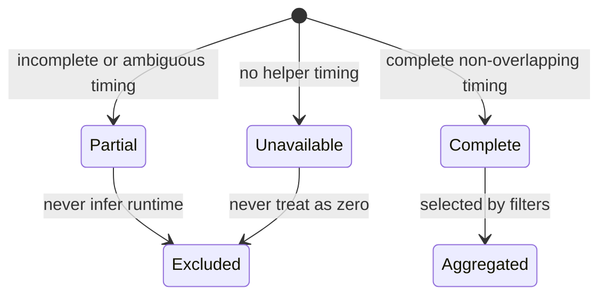
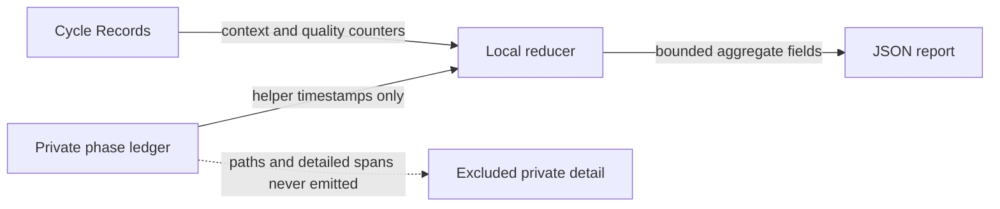

# DBSCTR Cycle Performance

**Status:** Ready
**Created:** 2026-08-29
**Last updated:** 2026-08-29

## Overview

DBSCTR measures autonomous runtime without confusing it with operator pauses or
calendar age. The first slice adds one source-local, privacy-safe summary over
helper-owned timing. It does not optimize execution or change lifecycle gates.

## Profile And Overrides

| Field | Value |
|---|---|
| Engineering Profile | `docs/specs/dbsctr_v3_lifecycle/PROFILE.md` |
| Risk | `elevated`: changes private telemetry semantics used for performance decisions |
| Delivery | Draft pull request and managed local deployment |
| Modules | Python, Security, Data, Analytics, ML/AI |
| Scope | Source-local autonomous-runtime summary and aggregate report |
| Non-goals | Execution optimization, OpenCode automatic hooks, federation, DKS repair, hosted telemetry, or gate reduction |

## Domain

| Term | Definition |
|---|---|
| Autonomous Interval | Complete helper-timestamped work or internal-wait interval attributed to DBSCTR execution. |
| Excluded Pause | Explicit operator or external-approval interval during which DBSCTR cannot proceed autonomously. |
| Autonomous Runtime | Union duration of Autonomous Intervals after excluding non-overlapping Excluded Pauses. |
| Calendar Elapsed | Cycle `created_at` through `completed_at`, including every pause. |
| Measurement Status | `complete`, `partial`, or `unavailable`; only complete samples enter runtime aggregates. |
| Attribution Coverage | Complete samples divided by completed cycles in the selected population. |
| Quality Equivalence | Identical required-gate applicability and evidence outcome with no added failure or remediation. |

The Lifecycle Cycle owns its source-local performance summary. The private phase
ledger supplies timing. Cycle Records supply context, risk, delivery, calendar
interval, Method Revision, gate counters, and exact harness identity when
available. Raw OpenCode rows are not a source for this summary.

## Behavior

### Complete autonomous timing

- Given a completed cycle has complete helper-timestamped Autonomous Intervals
- And every Excluded Pause is complete and does not overlap an active interval
- When the source-local performance report evaluates the cycle
- Then it reports `autonomous_runtime_ms` as the interval-union duration
- And reports calendar elapsed separately
- And marks the sample `complete`

### Preserve incomplete truth

- Given a completed cycle lacks timing, has an unfinished interval, has ambiguous
  attribution, or has overlapping active and excluded intervals
- When the performance report evaluates the cycle
- Then autonomous runtime is `unavailable`
- And measurement status is `partial` or `unavailable`
- And the sample does not enter mean, p50, or p90

### Aggregate comparable samples

- Given at least one complete sample matches the selected source-local filters
- When the operator requests cycle performance
- Then the report returns integer-millisecond mean, p50, and p90
- And returns completed, complete, partial, unavailable, and coverage counts
- And uses deterministic nearest-rank percentiles over sorted samples

### Keep quality visible

- Given complete timing exists for one or more cycles
- When the report aggregates performance
- Then it also reports gate failures, gate reopenings, and remediation rounds
- And no faster cohort is called quality-equivalent unless those outcomes do not
  regress and required-gate evidence remains equivalent

### Protect private evidence

- Given phase rows retain repository-relative ownership for collision checks
- When a performance summary is returned
- Then it contains no ownership path, prompt, response, command argument, URL,
  credential, environment value, absolute path, account identity, or raw row

## Interface

The first slice adds a read-only JSON command:

```text
dbsctrctl cycle-performance [--context ID] [--risk LEVEL]
  [--delivery-intent INTENT] [--method-revision REVISION] [--json]
```

The command reads completed local Cycle Records and the private phase ledger. It
does not create or migrate the ledger, mutate review state, scan `opencode.db`,
or federate sources. No filters means all retained source-local completed cycles.

The existing `phase-span` command additionally accepts `operator_wait` and
`external_wait` operations. Those operations are Excluded Pauses. Every other
operation is an Autonomous Interval. Existing operation values retain their
meaning and need no migration.

The response is schema version `1`:

```json
{
  "schema_version": 1,
  "filters": {},
  "counts": {
    "completed": 0,
    "complete": 0,
    "partial": 0,
    "unavailable": 0
  },
  "coverage_basis_points": 0,
  "autonomous_runtime_ms": {
    "mean": "unavailable",
    "p50": "unavailable",
    "p90": "unavailable"
  },
  "calendar_elapsed_ms": {
    "mean": "unavailable",
    "p50": "unavailable",
    "p90": "unavailable"
  },
  "quality": {
    "gate_failures": 0,
    "gate_reopenings": 0,
    "remediation_rounds": 0
  }
}
```

Empty populations return unavailable aggregates and zero counts. Calendar
aggregates include every selected completed cycle with a valid creation and
completion interval; autonomous aggregates include only complete timing. The
response contains aggregate values only; per-cycle timing remains private.

## Contracts

- Helper timestamps are authoritative; message persistence times are prohibited.
- Autonomous runtime uses an interval union, never a sum that double-counts
  nested or concurrent work.
- `operator_wait` and `external_wait` are the only Excluded Pause operations;
  every other Phase Span operation is autonomous.
- Explicit pauses must not overlap Autonomous Intervals. Overlap fails closed as
  partial rather than subtracting guessed time.
- Internal provider, tool, QA, and dependency waits remain in autonomous runtime.
- Autonomous and calendar percentiles use deterministic nearest rank:
  `ceil(p * n) - 1`, clamped to the sorted sample bounds. Means use integer floor
  division.
- Coverage is integer basis points: `complete * 10000 // completed`.
- Existing Phase Span and Cycle Record schemas remain readable. Missing new
  evidence normalizes to unavailable without migration.
- The command is read-only when no private ledger exists.
- Output stays bounded and excludes cycle identifiers and detailed spans.
- Report generation must not change gate results, review markers, cycle state, or
  optimization activation.

## Visual Evidence

| Concern | Decision | Review question | Canonical source | Owner/change trigger |
|---|---|---|---|---|
| Boundary | `not_applicable`: the Initiative context map is already tabular and no boundary choice depends on spatial layout | Which context owns each slice? | Initiative README | Context map changes |
| Interaction | `not_applicable`: one local read-only command has no multi-party interaction | How is the report requested? | Interface section | Command flow changes |
| State | `required: state diagram` | When may a timing sample enter aggregates? | Behavior and Contracts | Measurement states change |
| Data/trust | `required: flowchart` | Can private detailed timing reach aggregate output? | Interface and Privacy contracts | Source or output changes |
| Schema | `not_applicable`: the exact JSON example is clearer and normative | What fields are returned? | Interface JSON | Response schema changes |
| Dependency/deployment | `not_applicable`: the first slice is source-local and has no deployment topology decision | What runtime dependencies exist? | Profile and Overrides | A service or federation is added |
| Quantitative | `not_applicable`: sparse historical values are not a valid autonomous baseline | What result controls implementation? | Initiative baseline caveat | A comparable baseline exists |



**Text Equivalent:** A cycle with no helper timing is unavailable. Incomplete,
ambiguous, or overlapping timing is partial. Only complete, filter-matching timing
enters runtime aggregates; every other sample is excluded without becoming zero.



**Text Equivalent:** The local reducer reads Cycle Record context and quality
counters plus helper timestamps from the private phase ledger. It emits only the
bounded aggregate JSON contract. Ownership paths and detailed spans never enter
the report.

## Gate Ledger

| Gate | Capability | Applicability | Result | Authority/evidence | Exception | Owner |
|---|---|---|---|---|---|---|
| Domain | Measurement language and ownership | required | pending | This specification | - | Primary |
| Behavior | Complete, partial, empty, filtered, and privacy scenarios | required | pending | Focused tests | - | Primary |
| Spec | CLI and schema contract | required | pending | This specification | - | Primary |
| Contract | Timing, percentile, compatibility, and privacy invariants | required | pending | Focused tests | - | Primary |
| Test-driven implementation | Source-local report | required | pending | `tests/test_dbsctrctl.py` | - | Primary |
| Refactor | Minimal helper integration | required | pending | Diff review | - | Primary |
| Review/Integrate | Traceability and downstream validation | required | pending | Affected QA | - | Primary |
| Release | No versioned artifact publication | not_applicable | not_run | Engineering Profile | - | Primary |
| Deploy | Managed helper changes | required | pending | Chezmoi apply and live smoke | - | Primary |
| Operate | Live command availability and truthful empty/current result | required | pending | Runtime smoke | - | Primary |
| Maintain/Retire | Retention and backward-readable evidence | required | pending | Compatibility tests | - | Primary |

## Validation

```bash
uv run --group test pytest tests/test_dbsctrctl.py tests/test_dbsctr_lifecycle.py tests/test_opencode_control_plane.py -q
python3 -m py_compile dot_local/bin/executable_dbsctrctl
```
