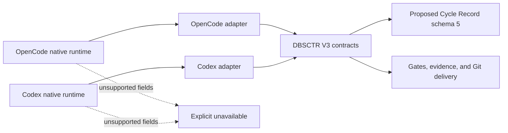
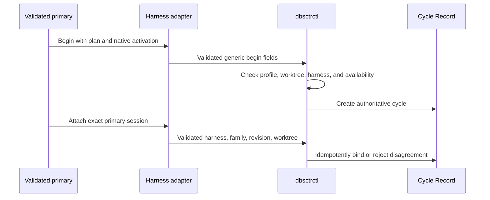
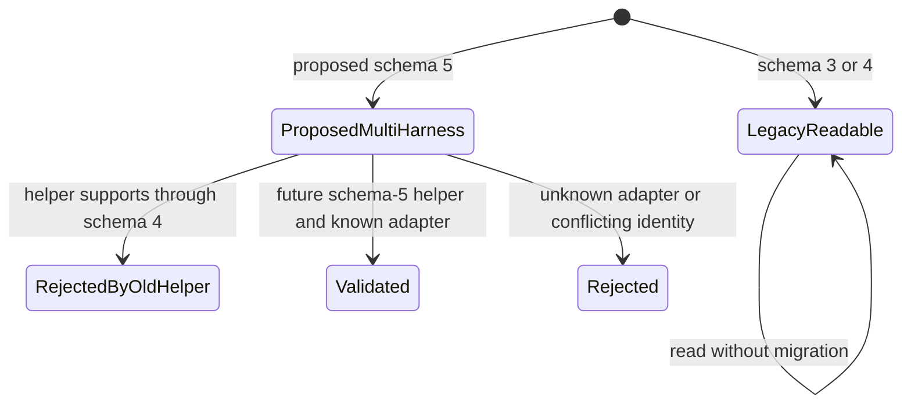
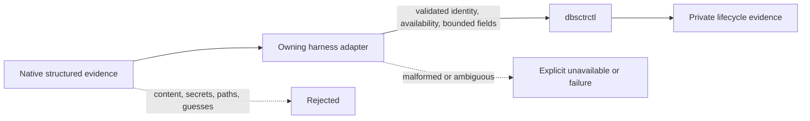
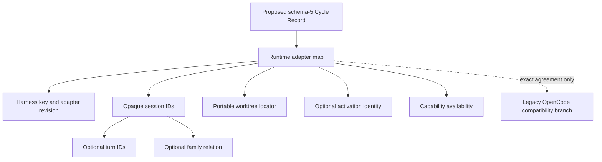

# DBSCTR Harness Adapters

**Status:** Contract captured; implementation not started
**Created:** 2026-08-29
**Last updated:** 2026-08-29

## Overview

DBSCTR V3 has one lifecycle kernel and multiple conforming harness adapters.
OpenCode remains supported through its existing typed adapter. Codex CLI becomes
a peer through a Codex-owned adapter. Harness differences never create alternate
gate, evidence, approval, Cycle Record, or delivery semantics.

## Profile And Overrides

| Field | Value |
|---|---|
| Engineering Profile | `docs/specs/dbsctr_v3_lifecycle/PROFILE.md` |
| Risk | Elevated: changes persisted runtime identity and mixed-version behavior |
| Delivery | Draft pull request and managed helper deployment after compatibility gates pass |
| Modules | Python, Security, Data, Analytics, ML/AI |
| Scope | Generic harness contract, proposed Cycle Record schema 5, OpenCode compatibility, Codex adapter conformance |
| Non-goals | New lifecycle phases, client UI/configuration, runtime installation, private-storage parsing, or forced record migration |

## Domain

| Term | Definition |
|---|---|
| Harness | Runtime that hosts agent interaction and supplies native identity, approval, health, history, and execution evidence. |
| Harness Adapter | Thin translation from one Harness into DBSCTR contracts; it owns no lifecycle state machine. |
| Harness Activation | Immutable harness, adapter, provider, model, agent, and revision facts bound to begin or attach where authoritative. |
| Session | Harness-native conversational or execution container. |
| Turn | Harness-native execution unit within a Session. |
| Session Family | Root, fork, and child relationships proven by the Harness. |
| Capability Availability | `available`, `unavailable`, `partial`, or `not_requested` for one adapter capability. |
| Conformance | Evidence that an adapter preserves lifecycle outcomes, safety, compatibility, and privacy. |

## Visual Evidence

| Concern | Decision | Review question | Canonical source | Owner/change trigger |
|---|---|---|---|---|
| Boundary | `required: lifecycle/harness flowchart` | Which behavior is lifecycle-owned versus harness-owned? | Domain and Interfaces | Lifecycle owner; ownership change |
| Interaction | `required: begin/attach sequence` | How does runtime identity enter a Cycle Record? | Behavior and Interfaces | Adapter operation change |
| State | `required: compatibility state diagram` | How are schema 3/4/5 records handled across helper versions? | Compatibility | Schema or migration change |
| Data/trust | `required: evidence flowchart` | Which native fields may become lifecycle evidence? | Privacy contracts | Evidence source change |
| Schema | `required: schema-5 relationship diagram` | How do records contain adapters and sessions? | Cycle Record Interface | Schema change |
| Dependency/deployment | `not_applicable`: each control plane owns concrete deployment | Which process deploys adapters? | Context map | Shared deployment added |
| Quantitative | `not_applicable`: no performance decision is made | Does an implementation language change improve runtime? | Non-goals | Benchmark decision added |



**Text Equivalent:** OpenCode and Codex own their native sessions, agents,
approvals, history, and adapter implementations. Both adapters invoke the same
DBSCTR contracts. DBSCTR owns current records, gates, evidence, and Git delivery;
schema 5 remains proposed until implementation gates pass. Unsupported native
fields become explicit unavailable values rather than inferred identity or
success.



**Text Equivalent:** A validated primary begins through its harness adapter with
an applicability plan and available activation identity. `dbsctrctl` validates
the profile, worktree, harness, and availability before creating the Cycle
Record. Attach validates the same harness, adapter revision, primary session
family, and worktree, then binds idempotently or rejects disagreement.



**Text Equivalent:** Schemas 3 and 4 remain readable and are not rewritten
implicitly. The captured contract proposes schema 5 for future multi-harness
records. Helpers supporting only through schema 4 would reject schema 5 before
mutation. A future schema-5 helper must accept only known, valid adapters and
reject conflicting identity.



**Text Equivalent:** Native structured evidence enters the owning harness
adapter. The adapter validates exact identity, capability availability, bounded
fields, and portable worktree locators. `dbsctrctl` accepts only conforming
evidence for private lifecycle records. Content, credentials, raw tool data,
absolute paths, guesses, malformed fields, and ambiguity are rejected or marked
explicitly unavailable.



**Text Equivalent:** A proposed schema-5 Cycle Record contains a runtime adapter
map keyed by harness. Each adapter declares its revision, opaque sessions,
optional turns and family relations, a portable worktree locator, optional
activation identity, and field-level availability. A legacy OpenCode branch may
coexist only when duplicate values agree exactly.

## Behavior

### Shared lifecycle

- Given any conforming Harness Adapter, when a cycle runs, then it uses the same
  Development Kernel, gate ordering, applicability, exceptions, evidence,
  worktree, and Final Push contracts.
- Given a harness provides a native equivalent, when the adapter implements the
  outcome, then DBSCTR does not prescribe the harness's internal mechanism.

### Exact identity

- Given a primary runtime supplies structured identity, when begin or attach
  records it, then harness ID, adapter revision, sessions, activation, and
  availability are validated together.
- Given identity is absent, ambiguous, child-only, or conflicting, when a
  lifecycle operation requires primary identity, then it fails closed.
- Given only paths, timestamps, panes, process IDs, model names, or configuration
  suggest identity, then DBSCTR records unavailable rather than inferring it.

### Mixed-version safety

- Given an older helper reads schema 5, when it validates the record, then it
  rejects the unknown schema before mutation, portabilization, correlation, or
  delivery.
- Given a schema-5 helper reads schema 3 or 4, when the legacy OpenCode record is
  valid, then it exposes a compatibility view without rewriting the record.
- Given an active legacy cycle exists, when new adapters deploy, then the cycle
  remains bound to its recorded schema, profile, and Method Revision.

### Availability

- Given an optional capability is unsupported, when the adapter reports it, then
  status and bounded reason are explicit and never become a passed authority.
- Given federation includes an unavailable source, when a complete-history claim
  is considered, then the claim fails or records an approved exception; it never
  treats absence as an empty source.

## Cycle Record Interface

The first implementation slice proposes schema version `5`. It is not an active
record schema until helper compatibility, conformance, and Method Revision gates
pass. The proposed runtime section contains a validated adapter map:

```json
{
  "schema_version": 5,
  "runtime": {
    "adapters": {
      "codex": {
        "schema_version": 1,
        "harness_id": "codex",
        "adapter_revision": "codex-adapter-1",
        "session_ids": ["opaque-session"],
        "turn_ids": ["opaque-turn"],
        "family_id": "opaque-family",
        "worktree": {"root": "cycle_worktree", "path": "."},
        "activation": {
          "provider_id": "openai",
          "model_id": "model",
          "agent_id": "primary",
          "core_revision": "revision",
          "overlay_revision": "unavailable"
        },
        "availability": {
          "session": "available",
          "turn": "available",
          "family": "available",
          "activation": "available",
          "history": "unavailable"
        }
      }
    }
  }
}
```

Required adapter fields are `schema_version`, `harness_id`, `adapter_revision`,
sorted unique `session_ids`, canonical `worktree`, and per-capability
`availability`. Turn, family, fork, activation, and native correlation fields are
optional only when their availability is explicit.

Schema 5 may also preserve a validated OpenCode compatibility branch while
OpenCode consumers migrate. Duplicate generic and legacy OpenCode identity must
agree exactly or the record is rejected.

## Generic Adapter Operations

| Operation | Required outcome |
|---|---|
| Begin | Bind cycle, profile, plan, worktree, harness, adapter revision, and available activation identity. |
| Attach | Idempotently bind one validated primary session family to the active cycle. |
| Phase span | Record bounded phase timing with explicit attribution availability. |
| Gate/evidence | Preserve applicability, result, authority, digest, and withholding semantics. |
| Initiative launch | Validate digest, slice, approval, execution owner, and target before cycle creation. |
| Approval | Return explicit approved, denied, rejected, or unavailable; never infer approval. |
| Runtime health | Return bounded harness health without changing lifecycle state. |
| Incident | Preserve source/fork identity and sanitized signal boundaries. |
| Review/history | Return bounded ordered pages and immutable continuation identity. |
| Telemetry/benchmark | Return sanitized versioned measurements with field-level availability. |
| Worker handoff | Return accepted destination identity without sharing mutable Cycle Record authority. |
| Federation | Preserve ordered source envelopes, explicit availability, and immutable captures. |

## Compatibility

- Method Revision and Cycle Record schema remain independent.
- The multi-harness semantic contract advances the current Method Revision only
  when implementation and compatibility tests pass; existing cycles retain their
  recorded revision.
- Schemas 3 and 4 remain readable without implicit migration.
- Schema 5 is the proposed requirement for future generic adapter identity so old
  helpers reject it rather than silently ignore unknown runtime semantics.
- Existing `runtime.opencode` records and typed OpenCode tools remain supported.
- Portabilization validates every adapter locator and retains no absolute path.
- No bulk migration or historical identity backfill occurs.

## Conformance

Every adapter runs the same fixtures for begin, attach, child rejection, identity
disagreement, unavailable metadata, gate ordering, approval denial, evidence
sanitization, portable locators, incident/review separation, federation partial
availability, and benchmark attribution. Runtime-specific tests remain in the
owning control-plane context; lifecycle fixtures own shared outcomes.

## Gate Ledger

| Gate | Applicability | Result | Authority | Owner |
|---|---|---|---|---|
| Domain | required | pending | Harness vocabulary and ownership | Primary |
| Behavior | required | pending | Shared, identity, compatibility, and availability scenarios | Primary |
| Spec | required | pending | This feature specification | Primary |
| Contract | required | pending | Schema-5 and adapter fixtures | Primary |
| Test-driven implementation | required | pending | `tests/test_dbsctrctl.py` and lifecycle tests | Primary |
| Refactor | required | pending | Generic readers without duplicated state machines | Primary |
| Review/Integrate | required | pending | Affected QA and independent review | Primary |
| Release | not_applicable: no separately published artifact | not_run | Engineering Profile | Primary |
| Deploy | required | pending | Managed helper and adapter deployment | Primary |
| Operate | required | pending | Legacy/current cycle and runtime smokes | Primary |
| Maintain/Retire | required | pending | Mixed-version rejection and rollback evidence | Primary |

## Validation

```bash
uv run --group test pytest tests/test_dbsctrctl.py tests/test_dbsctr_lifecycle.py tests/test_opencode_control_plane.py -q
python3 -m py_compile dot_local/bin/executable_dbsctrctl
git diff --check
```
