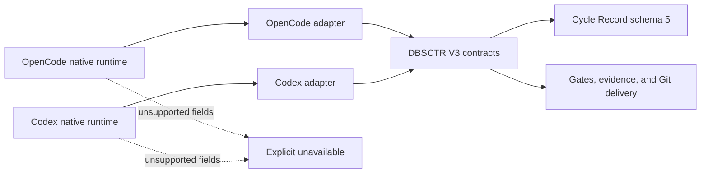
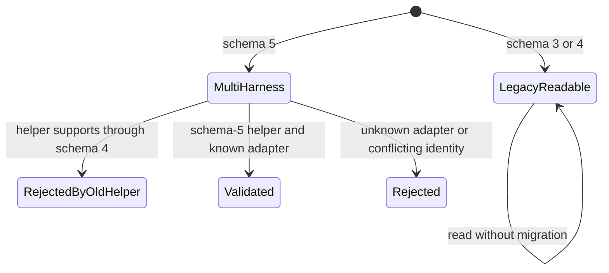
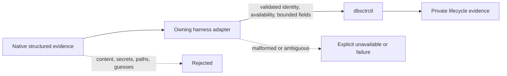
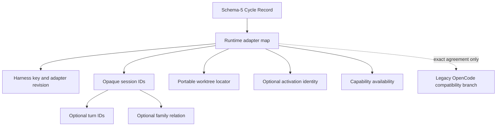

# DBSCTR Harness Adapters

**Status:** Delivered
**Created:** 2026-08-29
**Last updated:** 2026-08-29

## Overview

DBSCTR V3 has one lifecycle kernel and multiple conforming harness adapters.
OpenCode remains supported through its existing typed adapter. Codex CLI becomes
a peer through a Codex-owned adapter. Harness differences never create alternate
gate, evidence, approval, Cycle Record, or delivery semantics.

## Profile And Overrides

| Field | Value |
|---|---|
| Engineering Profile | `docs/specs/dbsctr_v3_lifecycle/PROFILE.md` |
| Risk | Elevated: changes persisted runtime identity and mixed-version behavior |
| Delivery | Draft pull request and managed helper deployment after compatibility gates pass |
| Modules | Python, Security, Data, Analytics, ML/AI |
| Scope | Generic harness contract, Cycle Record schema 5, OpenCode dual-write compatibility, and synthetic Codex conformance fixtures |
| Non-goals | New lifecycle phases, native Codex parsing or identity, client UI/configuration, runtime installation, private-storage parsing, or forced record migration |

## Domain

| Term | Definition |
|---|---|
| Harness | Runtime that hosts agent interaction and supplies native identity, approval, health, history, and execution evidence. |
| Harness Adapter | Thin translation from one Harness into DBSCTR contracts; it owns no lifecycle state machine. |
| Harness Activation | Immutable harness, adapter, provider, model, agent, and revision facts bound to begin or attach where authoritative. |
| Session | Harness-native conversational or execution container. |
| Turn | Harness-native execution unit within a Session. |
| Session Family | Root, fork, and child relationships proven by the Harness. |
| Capability Availability | Required status object for one adapter capability, with `available`, `unavailable`, `partial`, or `not_requested` plus a bounded reason when status is unavailable or partial. |
| Conformance | Evidence that an adapter preserves lifecycle outcomes, safety, compatibility, and privacy. |

## Visual Evidence

| Concern | Decision | Review question | Canonical source | Owner/change trigger |
|---|---|---|---|---|
| Boundary | `required: lifecycle/harness flowchart` | Which behavior is lifecycle-owned versus harness-owned? | Domain and Interfaces | Lifecycle owner; ownership change |
| Interaction | `required: begin/attach sequence` | How does runtime identity enter a Cycle Record? | Behavior and Interfaces | Adapter operation change |
| State | `required: compatibility state diagram` | How are schema 3/4/5 records handled across helper versions? | Compatibility | Schema or migration change |
| Data/trust | `required: evidence flowchart` | Which native fields may become lifecycle evidence? | Privacy contracts | Evidence source change |
| Schema | `required: schema-5 relationship diagram` | How do records contain adapters and sessions? | Cycle Record Interface | Schema change |
| Dependency/deployment | `not_applicable`: each control plane owns concrete deployment | Which process deploys adapters? | Context map | Shared deployment added |
| Quantitative | `not_applicable`: no performance decision is made | Does an implementation language change improve runtime? | Non-goals | Benchmark decision added |



**Text Equivalent:** OpenCode and Codex own their native sessions, agents,
approvals, history, and adapter implementations. Both adapters invoke the same
DBSCTR contracts. DBSCTR owns schema-5 records, gates, evidence, and Git delivery.
Unsupported native fields become explicit unavailable values rather than inferred
identity or success.

```mermaid
sequenceDiagram
    accTitle: Harness begin and attach
    accDescr: A validated primary submits an applicability plan and optional native harness identity to dbsctrctl begin. DBSCTR validates the plan, profile, worktree, and any supplied identity before creating the Cycle Record. A later attach validates harness, adapter revision, primary session family, and worktree before idempotently joining the cycle.
    participant P as Validated primary
    participant A as Harness adapter
    participant D as dbsctrctl
    participant R as Cycle Record
    P->>A: Begin with plan and optional identity
    A->>D: Validated generic begin fields
    D->>D: Check profile and worktree; validate identity if present
    D->>R: Create authoritative cycle
    P->>A: Attach exact primary session
    A->>D: Validated harness, family, revision, worktree
    D->>R: Idempotently bind or reject disagreement
```

**Text Equivalent:** A validated primary begins through its harness adapter with
an applicability plan and optional runtime identity. `dbsctrctl` always validates
the profile and worktree and validates harness identity only when supplied before
creating the Cycle Record. Attach requires and validates harness, adapter
revision, primary session family, and worktree, then binds idempotently or rejects
disagreement.



**Text Equivalent:** Schemas 3 and 4 remain readable and are not rewritten
implicitly. New multi-harness records use schema 5. Helpers supporting only
through schema 4 reject schema 5 before mutation. The schema-5 helper accepts only
known, valid adapters and rejects conflicting identity.



**Text Equivalent:** Native structured evidence enters the owning harness
adapter. The adapter validates exact identity, capability availability, bounded
fields, and portable worktree locators. `dbsctrctl` accepts only conforming
evidence for private lifecycle records. Content, credentials, raw tool data,
absolute paths, guesses, malformed fields, and ambiguity are rejected or marked
explicitly unavailable.



**Text Equivalent:** A schema-5 Cycle Record contains a runtime adapter
map keyed by harness. Each adapter declares its revision, opaque sessions,
optional turns and family relations, a portable worktree locator, optional
activation identity, and field-level availability. A legacy OpenCode branch may
coexist only when duplicate values agree exactly.

## Behavior

### Shared lifecycle

- Given any conforming Harness Adapter, when a cycle runs, then it uses the same
  Development Kernel, gate ordering, applicability, exceptions, evidence,
  worktree, and Final Push contracts.
- Given a harness provides a native equivalent, when the adapter implements the
  outcome, then DBSCTR does not prescribe the harness's internal mechanism.

### Create schema-5 records

- Given a new cycle starts with no runtime identity, when the schema-5 helper
  creates its Cycle Record, then `runtime.adapters` is an empty object.
- Given authoritative OpenCode identity is supplied during begin or attach, when
  the helper persists it, then it writes matching generic and legacy OpenCode
  branches in one record mutation.
- Given a schema-3 or schema-4 record already exists, when the schema-5 helper
  reads or mutates it, then its schema and runtime shape remain unchanged.

### Exact identity

- Given a primary runtime supplies structured identity, when begin or attach
  records it, then harness ID, adapter revision, sessions, activation, and
  availability are validated together.
- Given identity is absent, ambiguous, child-only, or conflicting, when a
  lifecycle operation requires primary identity, then it fails closed.
- Given only paths, timestamps, panes, process IDs, model names, or configuration
  suggest identity, then DBSCTR records unavailable rather than inferring it.

### Mixed-version safety

- Given an older helper reads schema 5, when it validates the record, then it
  rejects the unknown schema before mutation, portabilization, correlation, or
  delivery.
- Given a schema-5 helper reads schema 3 or 4, when the legacy OpenCode record is
  valid, then it exposes a compatibility view without rewriting the record.
- Given an active legacy cycle exists, when new adapters deploy, then the cycle
  remains bound to its recorded schema, profile, and Method Revision.

### Availability

- Given an optional capability is unsupported, when the adapter reports it, then
  status and bounded reason are explicit and never become a passed authority.
- Given federation includes an unavailable source, when a complete-history claim
  is considered, then the claim fails or records an approved exception; it never
  treats absence as an empty source.
- Given an adapter is present, when its availability is validated, then all five
  capability keys exist and each value has exactly `status` plus a required
  bounded reason only for `unavailable` or `partial`.

### Synthetic Codex conformance

- Given a synthetic `codex` adapter fixture, when schema validation runs, then it
  proves generic shape, availability, identity, and portable locator behavior
  without claiming native Codex provenance.
- Given this slice runs without installed Codex CLI, when implementation closes,
  then no Codex command, hook, app-server, authentication, session, resume, fork,
  or private runtime source is added or invoked.

## Cycle Record Interface

After this slice passes implementation, compatibility, deployment, and operation
gates, every newly created Cycle Record uses schema version `5`. A pre-attach
record contains `"runtime":{"adapters":{}}`. An adapter entry is added only with
authoritative identity and then requires a non-empty session set. The adapter
shape is:

```json
{
  "schema_version": 5,
  "runtime": {
    "adapters": {
      "codex": {
        "schema_version": 1,
        "harness_id": "codex",
        "adapter_revision": "codex-adapter-1",
        "session_ids": ["opaque-session"],
        "turn_ids": ["opaque-turn"],
        "family_id": "opaque-family",
        "worktree": {"root": "cycle_worktree", "path": "."},
        "activation": {
          "provider_id": "openai",
          "model_id": "model",
          "agent_id": "primary",
          "core_revision": "revision",
          "overlay_revision": "unavailable"
        },
        "availability": {
          "session": {"status": "available"},
          "turn": {"status": "available"},
          "family": {"status": "available"},
          "activation": {"status": "available"},
          "history": {"status": "unavailable", "reason": "synthetic_fixture"}
        }
      }
    }
  }
}
```

`runtime` and `adapters` are required objects in schema 5. The adapter map may be
empty only before authoritative attach. Accepted map keys and initial revisions
are `opencode` / `opencode-adapter-1` and `codex` / `codex-adapter-1`; the map key
must equal `harness_id`. This slice accepts `codex` only in synthetic conformance
fixtures. An adapter revision is immutable within one Cycle Record; a changed
managed revision cannot attach to that record.

Required adapter fields are `schema_version: 1`, `harness_id`,
`adapter_revision`, non-empty sorted unique opaque `session_ids`, canonical
portable `worktree`, and `availability`. Optional `turn_ids` are sorted unique
opaque values. `family_id` and `activation` are optional. Availability requires
exactly `session`, `turn`, `family`, `activation`, and `history`. Each value is an
object with `status`; `reason` is required for `unavailable` or `partial`, absent
for `available` or `not_requested`, ASCII, and 1 through 256 bytes.

Session IDs, turn IDs, and `family_id` use the existing opaque-ID grammar:
ASCII `[A-Za-z0-9][A-Za-z0-9._-]{0,127}`. Session and turn arrays contain at most
100 entries. Session IDs are non-empty for every present adapter; turn IDs may be
empty or absent. Arrays are sorted, unique, and contain strings only.

Availability and fields agree: present sessions require `session.available`;
present turns, family, and activation require their matching `available` status.
An absent optional field must not claim `available`. Synthetic Codex history is
`unavailable` with a reason and never becomes runtime evidence.

Schema 5 dual-writes `runtime.adapters.opencode` and `runtime.opencode` while
OpenCode consumers migrate. Validation maps fields as follows:

| Generic OpenCode field | Legacy OpenCode field |
|---|---|
| `session_ids` | `session_ids` |
| `activation` | `harness_activation` |
| `worktree.root` | `path_root` |
| `worktree.path` | `worktree` |

The legacy `directory` remains a validated OpenCode-only relative path. When
either OpenCode branch is present, both are required and every mapped value must
agree exactly before read or mutation. Otherwise both branches are absent, as in
pre-attach or Codex-only records. Unknown fields, disagreement, or an adapter
revision change rejects schema 5.

## Generic Adapter Operations

| Operation | Required outcome |
|---|---|
| Begin | Bind cycle, profile, plan, and worktree; create an empty adapter map when identity is absent, otherwise validate and bind the supplied adapter identity. |
| Attach | Idempotently bind one validated primary session family to the active cycle. |
| Phase span | Record bounded phase timing with explicit attribution availability. |
| Gate/evidence | Preserve applicability, result, authority, digest, and withholding semantics. |
| Initiative launch | Validate digest, slice, approval, execution owner, and target before cycle creation. |
| Approval | Return explicit approved, denied, rejected, or unavailable; never infer approval. |
| Runtime health | Return bounded harness health without changing lifecycle state. |
| Incident | Preserve source/fork identity and sanitized signal boundaries. |
| Review/history | Return bounded ordered pages and immutable continuation identity. |
| Telemetry/benchmark | Return sanitized versioned measurements with field-level availability. |
| Worker handoff | Return accepted destination identity without sharing mutable Cycle Record authority. |
| Federation | Preserve ordered source envelopes, explicit availability, and immutable captures. |

## Compatibility

- Method Revision and Cycle Record schema remain independent.
- The multi-harness semantic contract advances Method Revision from `3.28` to
  `3.29` only when implementation and compatibility tests pass; existing cycles
  retain their recorded revision.
- Schemas 3 and 4 remain readable without implicit migration.
- Schema 5 is required for new generic adapter identity so old
  helpers reject it rather than silently ignore unknown runtime semantics.
- Existing `runtime.opencode` records and typed OpenCode tools remain supported.
- Portabilization validates every adapter locator and retains no absolute path.
- `cycle-portabilize` remains an explicit reversible schema-3 to schema-4
  operation. It never upgrades schema 4 to schema 5.
- Schema-5 adapter worktrees use only canonical `cycle_worktree` or
  `primary_worktree` roots and normalized relative paths without traversal.
- Native Codex installation, parsing, authentication, hooks, app-server methods,
  session correlation, resume, fork, and history remain owned by later slices.
- No bulk migration or historical identity backfill occurs.

## Conformance

Every adapter runs the same fixtures for begin, attach, child rejection, identity
disagreement, unavailable metadata, gate ordering, approval denial, evidence
sanitization, portable locators, incident/review separation, federation partial
availability, and benchmark attribution. Runtime-specific tests remain in the
owning control-plane context; lifecycle fixtures own shared outcomes.

## Gate Ledger

| Gate | Applicability | Result | Authority | Owner |
|---|---|---|---|---|
| Domain | required | passed | Harness vocabulary and ownership | Primary |
| Behavior | required | passed | Shared, identity, compatibility, and availability scenarios | Primary |
| Spec | required | passed | This feature specification | Primary |
| Contract | required | passed | Schema-5 and adapter fixtures | Primary |
| Test-driven implementation | required | passed | `tests/test_dbsctrctl.py` and lifecycle tests | Primary |
| Refactor | required | passed | Generic readers without duplicated state machines | Primary |
| Review/Integrate | required | passed | Affected QA and independent review | Primary |
| Release | not_applicable: no separately published artifact | not_run | Engineering Profile | Primary |
| Deploy | required | passed | Managed helper and skill source identity | Primary |
| Operate | required | passed | Deployed schema-5 and legacy runtime smokes | Primary |
| Maintain/Retire | required | passed | Mixed-version rejection and rollback evidence | Primary |

## Validation

```bash
uv run --group test pytest tests/test_dbsctrctl.py tests/test_dbsctr_lifecycle.py tests/test_opencode_control_plane.py -q
python3 -m py_compile dot_local/bin/executable_dbsctrctl
git diff --check
```
