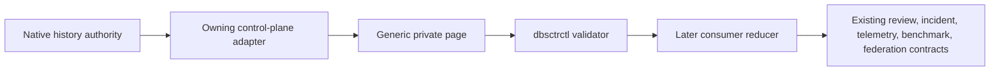
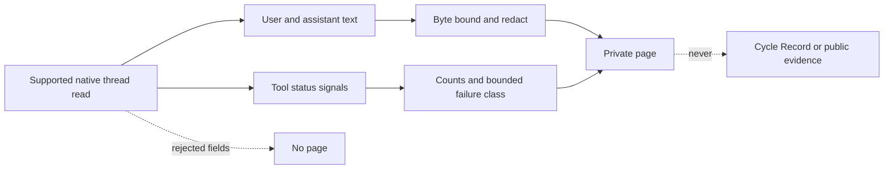
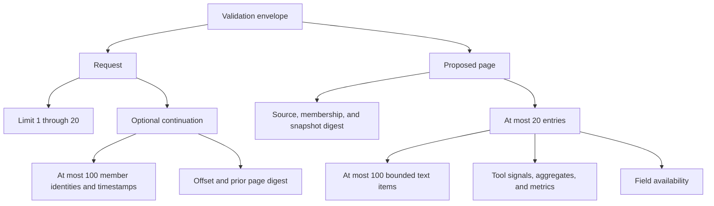
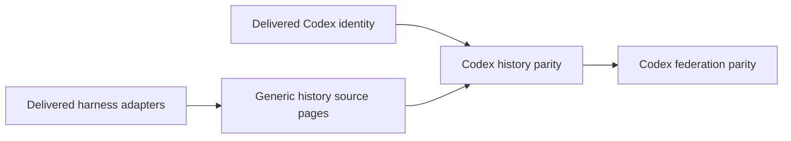

# Generic Harness History Source Pages

**Status:** Receipt ready
**Created:** 2026-08-31
**Last updated:** 2026-08-31

## Overview

DBSCTR validates one private, bounded, runtime-neutral history page before any
harness-specific adapter may connect native history to review, incident,
telemetry, benchmark, or federation consumers. The lifecycle kernel owns the
page, continuation, digest, privacy, and no-mutation contract. Each control plane
owns native parsing and operation-specific mappings in later slices.

## Profile And Overrides

| Field | Value |
|---|---|
| Engineering Profile | `docs/specs/dbsctr_v3_lifecycle/PROFILE.md` |
| Risk | Elevated: private conversation text crosses a runtime/lifecycle trust boundary |
| Delivery | Feature branch and draft pull request; deploy the managed helper after affected gates pass |
| Modules | Python, Security, Data, Analytics, ML/AI |
| Scope | Closed request/page schemas, immutable continuation, canonical digest, privacy validation, bounded local validator |
| Non-goals | Native runtime parsing, duplicated history storage, review or incident mutation, operation-specific reduction, federation, or hosted-provider delivery |

## Domain

| Term | Definition |
|---|---|
| History Source Request | Private stdin envelope selecting page size and optionally carrying the previous immutable continuation. |
| History Source Envelope | Private stdin object containing the incoming request and one proposed page for consistency validation. |
| History Source Page | Validated private page of bounded source entries, full snapshot membership, and exact source/snapshot identity. |
| Snapshot Membership | At most 100 newest native sessions fixed by opaque ID and updated timestamp on the first request. |
| Continuation | Private stdin-only source, snapshot, membership, offset, and prior-page identity needed to request the next page. |
| History Entry | Opaque family identity, timestamps, portable workspace, bounded text, tool signals, aggregates, and availability for one native session. |
| Consumer Reducer | Later control-plane mapping from a valid page into an existing review, incident, telemetry, benchmark, or federation contract. |

## Visual Evidence

| Concern | Decision | Review question | Canonical source | Owner/change trigger |
|---|---|---|---|---|
| Boundary | `required: lifecycle/source flowchart` | Which layer parses native history and which validates shared pages? | Architecture | Lifecycle owner; ownership change |
| Interaction | `required: continuation sequence` | How is a stable page continued without command-line private data? | Pagination | Lifecycle owner; request/page change |
| State | `not_applicable`: validator is stateless and continuation carries all state | What server state persists? | Non-goals | Persistent state added |
| Data/trust | `required: private data flowchart` | Which native data may cross and where is it rejected? | Privacy | Privacy field change |
| Schema | `required: page relationship diagram` | What are request, continuation, page, and entry relationships? | Schema artifact | Schema change |
| Dependency/deployment | `required: dependency flowchart` | Which later slices consume this foundation? | Initiative manifest | Dependency change |
| Quantitative | `not_applicable`: fixed safety bounds are invariants, not comparative evidence | Which metric selects a design? | Bounds | Comparative decision added |



**Text Equivalent:** The native runtime remains authoritative for history. Its
owning adapter parses only supported native output and emits a generic private
page. `dbsctrctl` validates the closed schema, continuation, digest, bounds, and
privacy without storing content. Later control-plane reducers map valid pages to
existing lifecycle consumers.

```mermaid
sequenceDiagram
    accTitle: Immutable private continuation
    accDescr: The caller sends a request through stdin. On the first request the source fixes at most 100 newest members in deterministic order and returns one page plus a private continuation. The caller sends that continuation through stdin. The owning adapter revalidates native membership and timestamps before proposing the next request-and-page envelope; the generic validator checks internal consistency and fails closed on disagreement.
    participant C as Local caller
    participant A as Harness adapter
    participant V as dbsctrctl validator
    C->>A: Request JSON on stdin; continuation null
    A->>A: Fix ordered membership and snapshot digest
    A->>V: Page JSON on stdin
    V-->>C: Bounded valid status and page digest
    C->>A: Request JSON on stdin with continuation
    A->>A: Revalidate native source, membership, timestamps, offset, prior digest
    alt unchanged
        A->>V: Next page JSON on stdin
        V-->>C: Bounded valid status and page digest
    else stale or malformed
        A-->>C: Unavailable with bounded reason
    end
```

**Text Equivalent:** Requests and continuations travel only through stdin. The
first request fixes at most 100 newest members in deterministic order and returns
one page plus a private continuation. A later request carries that continuation.
The owning adapter revalidates native source identity, membership, timestamps,
offset, and prior digest. The generic validator receives the incoming request and
proposed page together and checks their internal consistency. Drift or malformed
state fails without a valid result.



**Text Equivalent:** Only supported user and assistant text and bounded tool
status signals may enter a page. Text is byte-bounded and redacted. Tool data is
reduced to counts and bounded failure classes. Reasoning, credentials,
high-entropy tokens, URLs, absolute paths, commands, arguments, output,
environment, images, and unknown fields are rejected. Pages remain local and do
not become lifecycle evidence or hosted-provider tool output.



**Text Equivalent:** One validation envelope contains the incoming request and
proposed page. The request has a limit and optional continuation. The
continuation binds source identity, at most 100 member identities and timestamps,
offset, and prior page digest. Every page carries the same complete membership
and binds at most 20 entries to its exact slice. Each entry contains bounded
text, tool signals, aggregates, metrics, and field availability.



**Text Equivalent:** Delivered generic harness adapters precede the generic page
validator. Codex history parity requires both the generic validator and exact
Codex identity. Federation remains later.

## Behavior

- Given a first request, when the adapter enumerates native history, then it fixes
  the newest 100 sessions ordered by `updated_at` descending and `session_id`
  ascending, records truthful overflow, and computes the snapshot digest.
- Given a continuation, when the owning adapter finds native source identity,
  member ID, member timestamp, offset, snapshot digest, or prior page digest
  drift, then it returns `stale_continuation` without proposing a page.
- Given an envelope, when `dbsctrctl history-source-validate --envelope-json -`
  runs, then it validates exact keys, enums, identities, availability, canonical
  digests, lexical privacy, byte bounds, timestamp ordering, complete membership,
  request/page slice agreement, and total size.
- Given validation succeeds, then stdout contains only schema version, `valid`,
  and page digest; source entries and text are never echoed.
- Given validation fails, then stdout is empty, stderr contains one bounded
  machine-safe reason, exit status is nonzero, and no lifecycle or private state
  changes.
- Given a valid page, then later reducers may consume it only through stdin and
  must independently preserve their existing closed output and mutation
  contracts.

## Interface

The exact envelope, request, continuation, page, entry, text, tool-signal,
aggregate, metric, and
availability shapes are in
[`harness-history-source.schemas.json`](harness-history-source.schemas.json).
The validator command is:

```text
dbsctrctl history-source-validate --envelope-json -
```

`-` is the only accepted envelope source. JSON in command arguments or a
filesystem path is rejected. The validator reads at most 1 MiB, permits at most
20 entries and 100 text items per entry, and emits at most 256 bytes.

Canonical JSON is UTF-8 with lexicographically sorted object keys, comma and
colon separators, ASCII escaping enabled, and no insignificant whitespace.
`page_digest` is SHA-256 over the exact page object with keys `entries`,
`members`, `overflow`, `schema_version`, `snapshot_digest`, and `source`; outgoing
`continuation` and `page_digest` are omitted, so continuation can bind the
completed page without a circular digest. `snapshot_digest` is SHA-256 over the
exact object `{"members": MEMBERS, "overflow": BOOLEAN, "source": SOURCE}`.
Every page carries that complete ordered membership, including terminal pages.
Text limits are UTF-8 byte limits, not Unicode code-point limits. Token totals
are nonnegative integers. Cost totals are `null` or canonical nonnegative USD
decimal strings with at most six fractional digits; floats and exponents are
rejected. Every integer is at most `9007199254740991` (`2^53 - 1`) so Python,
JavaScript, and other ordinary JSON runtimes preserve one canonical value.

Availability contains exactly `status` and, only for `unavailable` or `partial`,
a bounded ASCII `reason`. Available and not-requested values have no reason.
`tokens.available` and `cost.available` require their corresponding metric;
`unavailable` requires `null`; `partial` may retain a nonnegative partial value.
Timestamps are nonnegative Unix seconds and `updated_at >= created_at`. Entry
session IDs must equal exactly the ordered membership slice selected by request
limit and incoming continuation offset. Outgoing continuation offset equals the
end of that slice and is null when the slice reaches membership length.

## Privacy And Security

- Generic pages are governed private local process transport.
- Owning adapters exclude reasoning and forbidden native item types before page
  construction. The generic validator applies the existing `SECRET_VALUE`,
  `HIGH_ENTROPY`, and `review_unsafe` lexical policies to text and rejects any
  remaining credential, high-entropy value, email, URL, POSIX absolute path,
  Windows drive-qualified path, UNC path, or control character. Literal
  `[REDACTED]` replacements are allowed.
- User and assistant text is retained only in bounded page memory and explicit
  downstream private stores; the validator never persists it.
- Reasoning, images, tool command/arguments/output/environment, account data,
  auth state, native storage paths, and raw protocol fields are never accepted.
- Continuations and opaque IDs travel only through stdin/stdout pipes and private
  process memory, never argv, Git, logs, Cycle Records, or evidence metadata.
- Unknown fields, duplicate JSON keys, invalid UTF-8, oversized input,
  request/page disagreement, availability/value disagreement, timestamp-order
  error, and digest mismatch fail closed. Native membership drift remains the
  owning adapter's required pre-envelope check.

## Consumer Boundary

This slice validates pages only. It does not claim review, incident, telemetry,
benchmark, or federation parity. A later control-plane slice must define exact
native mappings and reducer requests for each consumer. Benchmarks continue to
use existing immutable captures and explicit save/replay commands; a source page
does not invent a benchmark ID or result.

## Gate Ledger

| Gate | Applicability | Result | Authority | Owner |
|---|---|---|---|---|
| Domain | required | pending | Source-page and continuation vocabulary | Primary |
| Behavior | required | pending | Validation, privacy, stale, and no-mutation scenarios | Primary |
| Spec | required | pending | This specification and closed schema | Primary |
| Contract | required | pending | Positive and negative executable schema fixtures | Primary |
| Test-driven implementation | required | pending | Focused lifecycle helper tests | Primary |
| Refactor | required | pending | Reuse existing redaction, digest, and bounded-input helpers | Primary |
| Review/Integrate | required | pending | Affected QA and independent elevated-risk review | Primary |
| Release | not_applicable: no separately published artifact | not_run | Engineering Profile | Primary |
| Deploy | required | pending | Managed helper apply | Primary |
| Operate | required | pending | Live validator positive and privacy-negative smoke | Primary |
| Maintain/Retire | required | pending | Schema compatibility and retained-state no-mutation evidence | Primary |

## Validation

```bash
uv run --group test pytest tests/test_dbsctrctl.py tests/test_dbsctr_lifecycle.py -q
python3 -m py_compile dot_local/bin/executable_dbsctrctl
git diff --check
```
