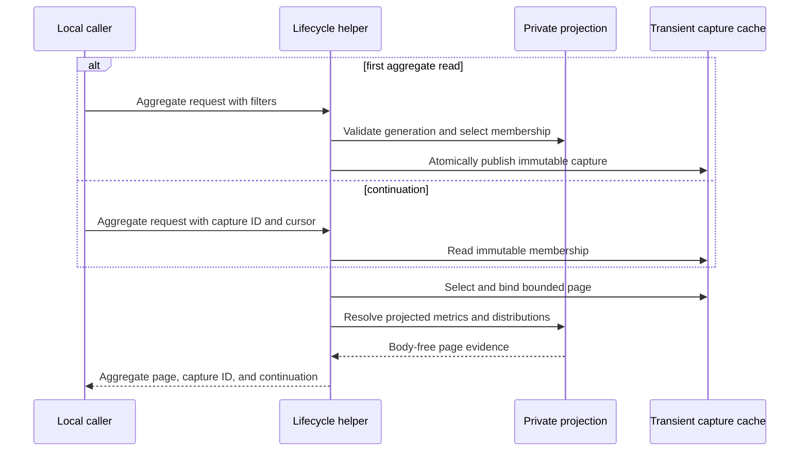

# History And Incident Query Performance

## Purpose

Return bounded History and Incident audit evidence without repeatedly scanning,
reducing, or emitting a full candidate population. The lifecycle helper owns
snapshot selection, immutable capture, pagination, reduction semantics, privacy,
and truthful overflow. OpenCode owns subprocess deadlines and model-visible
availability.

| Boundary | Lifecycle helper | OpenCode |
|---|---|---|
| Source access | Selects the immutable population and reads private local authorities | Has no direct database access |
| Reduction | Binds the page, bulk-reduces metrics, and validates summary schemas | Does not recompute lifecycle metrics |
| Availability | Returns valid local output or fails closed | Bounds the subprocess and maps operational failure to typed availability |
| Privacy | Omits private identities and raw text from summary modes | Prevents unavailable or rejected output from entering model context |
| Projection state | Owns private preparation, activation, compaction, invalidation, and retirement | Receives only sanitized availability |

## Ubiquitous Language

| Term | Definition |
|---|---|
| Immutable Page | Candidate identities selected under one validated snapshot, filter set, cursor, and limit before expensive reduction. |
| Aggregate Page | Metrics and distributions reduced only for one Immutable Page without candidate bodies or identifiers. |
| Incident Summary | Bounded counts by allowlisted tool, sanitized failure class, and recovery state without signal identity or evidence. |
| Availability Denominator | Separate available and unavailable member counts carried beside one metric. |
| Materialized Projection | Owner-private, body-free derived session, metric, ordering, and Incident classification state used by aggregate and summary reads. |
| Projection Generation | One immutable full or append-delta projection bound to source, schema, privacy, and row ceilings. |
| Projection Chain | An active generation and at most 15 immutable ancestors whose newest session rows and append-only part rows resolve one exact snapshot. |

## Required Behavior

**Scenario: Reduce only one immutable page**

- Given a validated History snapshot, filters, cursor, and limit
- When the caller requests `aggregate_only`
- Then the first request creates or reuses one immutable membership capture
- And continuation requests read that capture without rescanning the live source
- And the helper selects and binds the page before family telemetry or metric work
- And bulk-reduces only page sessions and their bounded families
- And returns no candidate, message, part, signal, or cycle identifiers

**Scenario: Preserve continuation truth**

- Given more eligible members exist after one Aggregate Page
- When the page is returned
- Then snapshot, ceilings, digest, filters, cursor, and continuation remain bound
- And a continuation cannot silently move to another population

**Scenario: Summarize overflowed Incident evidence**

- Given Incident Signal detail exceeds its bounded output
- When the caller requests `summary_only`
- Then the helper returns counts only by allowlisted tool, sanitized failure class,
  and recovered state
- And reports `signal_overflow=true` without estimating hidden frequency

**Scenario: Preserve existing detailed consumers**

- Given a caller omits `aggregate_only` or `summary_only`
- When History or Incident evidence is requested
- Then the existing candidate and detailed response contracts remain unchanged

**Scenario: Activate one exact projection generation**

- Given a source schema with stable `session_id`, `rowid`, and `time_created`
- When bounded maintenance reaches captured session, message, and part ceilings
- Then it records exact ordering keys and body-free eligibility, metric, and
  Incident classifications
- And atomically activates the generation only after source, schema, privacy,
  coverage, uniqueness, and ordering validation pass
- And stores no source body or model-visible evidence

**Scenario: Serve one ready projection without source payload scans**

- Given an active ready Projection Chain covers one snapshot
- When aggregate History or Incident summary selects evidence
- Then membership, page metrics, distributions, failure classes, and recovery
  come from the projection
- And the ready query reads no source body column
- And selected aggregate source metadata is validated in one bounded bulk query

**Scenario: Refuse an unavailable projection generation**

- Given the index is missing, preparing, corrupt, privacy-stale, source-incompatible,
  or behind the requested part ceiling
- When aggregate History or Incident summary requests population discovery
- Then the helper exits temporarily unavailable without scanning all source payloads
- And returns no partial population, aggregate, summary, or citation-like evidence

**Scenario: Invalidate private indexed identity**

- Given a privacy tombstone invalidates one indexed session family
- When the tombstone commits
- Then captures containing that family are deleted in the same privacy operation
- And the active generation is invalidated before another summary read
- And maintenance rebuilds without the forgotten family before activation

## Interfaces

The lifecycle CLI adds `--aggregate-only` to structured History telemetry and
`--summary-only` to Incident Scan. Aggregate mode reuses the existing
`--capture-id` continuation input; a first request without one persists an
owner-private transient capture under the existing 24-hour retention policy.
Provider adapters expose the corresponding `aggregateOnly` and `summaryOnly`
booleans. Both default to `false`.

`history-source-index-maintain` owns bounded projection preparation. It reads the configured
OpenCode source and owner-private lifecycle state, accepts no caller-supplied rows,
and returns only schema version, generation state, covered row ceiling, indexed
row count, and continuation-needed boolean. It never returns source IDs or bodies.
Aggregate and summary reads never synchronously build, extend, compact, or verify
a projection and never scan source payload columns.
One invocation reads at most 50,000 source rows and consumes at most five seconds
of monotonic maintenance time, whichever comes first. These bounds are fixed, not
caller configuration.

Maintenance output has exactly:

```json
{"schema_version":1,"state":"preparing","covered_part_ceiling":0,"indexed_rows":0,"continuation_needed":true}
```

`state` is `preparing` or `ready`; counts are non-negative signed 64-bit integers.
No generation, source, privacy, path, session, message, or part identity is output.
The command envelope remains version 1 independently of private sidecar schema 2.

Operational index unavailability has one local machine boundary: process status
`75`, empty stdout, and stderr exactly `source_index_unavailable\n`. Missing,
preparing, stale, incompatible, corrupt, and insufficiently covered generations
share this sanitized class. OpenCode owns later model-visible availability.

Aggregate History output preserves the existing schema identity and snapshot
envelope, sets `mode=aggregate`, and contains only:

| Field | Contract |
|---|---|
| Snapshot envelope | Existing snapshot, ceilings, database digest, exclusion digest, and sanitized filters |
| Page envelope | Requested limit/cursor, selected count, and immutable continuation |
| Cohort counts | Primary/child, review/non-review, correlation quality, active/completed, available/unavailable |
| Metrics | Available count, unavailable count, integer-floor mean, nearest-rank p50, and nearest-rank p90 |
| Distributions | Authoritative agent and model counts only |

Metrics cover elapsed milliseconds, tokens, tool calls, tool errors, child
sessions, and available delegation counts. A field with no authority is
unavailable rather than zero.

The exact schema is version 1:

```json
{
  "schema_version": 1,
  "mode": "aggregate",
  "capture_id": "<24 lowercase hex>",
  "snapshot": 0,
  "session_ceiling": 0,
  "part_ceiling": 0,
  "database_digest": "<sha256>",
  "exclusion_digest": null,
  "query": {
    "after": null,
    "before": null,
    "method_revision": null,
    "cycle_filter_applied": false,
    "state": null,
    "context": null,
    "project_digest": null,
    "reviewed_status": null,
    "archive_only": false
  },
  "limit": 25,
  "cursor": 0,
  "selected_count": 0,
  "continuation": null,
  "digest": "<sha256>",
  "cohort": {
    "sessions": {
      "relation": {"primary": 0, "child": 0, "unavailable": 0},
      "review": {"review": 0, "non_review": 0, "unavailable": 0},
      "telemetry_available": 0,
      "telemetry_unavailable": 0
    },
    "correlation_quality": {
      "exact": 0,
      "family": 0,
      "worktree": 0,
      "source": 0,
      "ambiguous": 0,
      "unavailable": 0
    },
    "cycle_states": {
      "active": 0,
      "blocked": 0,
      "abandoned": 0,
      "completed": 0,
      "unknown": 0
    }
  },
  "metrics": {
    "elapsed_ms": {"available_count": 0, "unavailable_count": 0, "mean": "unavailable", "p50": "unavailable", "p90": "unavailable"},
    "tokens": {"available_count": 0, "unavailable_count": 0, "mean": "unavailable", "p50": "unavailable", "p90": "unavailable"},
    "tool_calls": {"available_count": 0, "unavailable_count": 0, "mean": "unavailable", "p50": "unavailable", "p90": "unavailable"},
    "tool_errors": {"available_count": 0, "unavailable_count": 0, "mean": "unavailable", "p50": "unavailable", "p90": "unavailable"},
    "child_sessions": {"available_count": 0, "unavailable_count": 0, "mean": "unavailable", "p50": "unavailable", "p90": "unavailable"},
    "delegations": {"available_count": 0, "unavailable_count": 0, "mean": "unavailable", "p50": "unavailable", "p90": "unavailable"}
  },
  "distributions": {
    "agents": [{"value": "build", "count": 1}],
    "models": [{"value": "gpt-5.6-sol", "count": 1}]
  }
}
```

`selected_count` is the number of members on this page. Each `relation`, `review`,
correlation-quality, and telemetry partition totals `selected_count` independently.
Cycle-state counts count cycle records and may therefore exceed it. A retained
member lacking an explicit `review_session` value is review `unavailable`, not
`non_review`. `telemetry_available` means the member has a schema-valid telemetry
object; absence or invalid source authority counts as `telemetry_unavailable`.
Metric sources are, respectively,
`aggregates.elapsed_ms`, `telemetry.token_total`,
`aggregates.tool_call_count`, `aggregates.tool_error_count`,
an exact page-scoped bulk count of direct child sessions, and
`telemetry.delegation_count`. Truncated detailed child arrays are not a metric
authority. Only non-negative integers are available. Distribution rows count each
authoritative agent or model identity once per member, sort by descending count
then ascending `value`, and omit unavailable identities. Candidate, session, and
cycle ID arrays are absent. `cycle_filter_applied` says only whether a cycle filter
was supplied. The raw cycle ID is bound inside the private capture query and
aggregate digest but neither it nor a reversible standalone digest is returned.

Incident summary output preserves the existing bounded scan snapshot, sets
`mode=summary`, and contains registered-Incident count, total visible Signal
count, `signal_overflow`, and bounded count rows keyed only by allowlisted tool,
sanitized failure class, and recovered boolean.

The exact schema is version 1:

```json
{
  "schema_version": 1,
  "mode": "summary",
  "snapshot": 0,
  "session_ceiling": 0,
  "part_ceiling": 0,
  "database_digest": "<sha256>",
  "incident_count": 0,
  "incident_overflow": false,
  "signal_count": 0,
  "signal_overflow": false,
  "groups": [
    {"tool": "read", "failure_class": "tool_failed", "recovered": false, "count": 1}
  ]
}
```

Counts cover at most the first 100 validated rows in the existing detailed sort
order. The corresponding overflow boolean is true when the 101-row sentinel is
present; no hidden total is estimated. Group rows sum to `signal_count`, sort by
descending count then ascending tool, failure class, and recovered value, and
contain no evidence text.

The tool allowlist is the fixed names `apply_patch`, `bash`, `glob`, `grep`,
`question`, `read`, `skill`, `task`, `todowrite`, and `webfetch`, plus names that
match the exact safe syntax `^[A-Za-z0-9][A-Za-z0-9._:/-]{0,127}$` and begin with
`dbsctr_`, `dks_`, or `herdr_`. Every other name
becomes `unknown`. Failure classes are `timed_out`, `cancelled`,
`permission_denied`, `service_unavailable`, `invalid_output`, `tool_error`,
`tool_failed`, and `unknown`. Classification reads only a mapping-valued
`state.error`: `code` takes precedence over `name`. A string is normalized by
trimming ASCII whitespace, lowercasing ASCII letters, replacing each maximal run
of ASCII space, `.`, `-`, `/`, or `:` with `_`, and rejecting any remaining
character outside `[a-z0-9_]`. The result maps only exact `timeout`, `timed_out`, `timeout_error`,
`cancelled`, `canceled`, `abort_error`, `permission_denied`, `eacces`, `eperm`,
`service_unavailable`, `unavailable`, `invalid_output`, or `validation_error`
tokens. Otherwise status `error` maps to `tool_error`, status `failed` maps to
`tool_failed`, and every other value maps to `unknown`. Status normalization uses
the same algorithm. Raw error strings are never parsed for classification.
`recovered` retains the detailed-mode rule: a later successful or completed call
with the same validated private raw tool identity in the same session and bounded
snapshot. Recovery is computed before an output tool name is collapsed to
`unknown`, so unrelated unknown tools cannot recover one another.

## Reduction Contract

- Sort numeric available values ascending.
- Use zero-based nearest-rank index `ceil(p * n) - 1`, clamped to the available
  bounds, for p50 and p90.
- Use integer floor for mean.
- Carry available and unavailable denominators beside every metric.
- Permit singleton descriptive output; comparative activation requires at least
  five complete comparable members.
- Select page identities before expensive joins and use bulk queries per authority
  family. Per-candidate database queries are prohibited.
- An immutable reduction cache may reuse only exact snapshot, digest, filters,
  cursor, page, and method identity. Changed identity is a cache miss.

The first aggregate request selects eligible ordered membership from one active
Projection Chain, applies lifecycle and review filters, and persists membership in
the existing immutable capture store. It performs no source body read. Page
selection then reads capture membership and binds ordered hidden page IDs before
resolving projected metrics and bounded lifecycle telemetry. Continuations require
the returned capture ID and remain bound to the captured projection generation.
The subsequent metric work uses projection lookups and a fixed number of bounded
metadata queries whose count does not grow with page size. Aggregate digest identity includes mode
`aggregate-v1`, capture ID, snapshot, ceilings, database and exclusion digests,
canonical filters, limit, cursor, ordered hidden page IDs, and every selected source
identity. A cache is optional; when absent, these values still define immutable
continuation and digest validation.

### Materialized Projection Contract

The projection is the separate owner-private SQLite sidecar
`reviews/history-source-index.sqlite3` under lifecycle review state, mode `0600`,
with symlink and non-owner rejection. It is not part of Git, review
history, backup or federation payloads, transient capture output, or canonical
OpenCode state. Schema version 2 contains immutable full or append-delta
generations, cumulative session projections, safe categorical values, and
append-only part projections.

No title, prompt, response, command, URL, credential, environment value, body,
raw error, model output, message ID, part ID, cycle ID, or evidence text is stored.
Raw private session IDs and parent IDs remain owner-local and are never emitted.
Unknown tool identity is stored only as one generation-keyed digest. A private
disposition digest may match existing Incident state but is never emitted.

The exact private schema is:

```sql
CREATE TABLE index_meta (
  key TEXT PRIMARY KEY,
  value TEXT NOT NULL
) WITHOUT ROWID;
CREATE TABLE index_generations (
  generation_id TEXT PRIMARY KEY,
  base_generation_id TEXT REFERENCES index_generations(generation_id),
  depth INTEGER NOT NULL CHECK (depth BETWEEN 0 AND 15),
  state TEXT NOT NULL CHECK (state IN ('preparing','ready')),
  phase TEXT NOT NULL CHECK (phase IN ('sessions','messages','parts','finalizing','ready')),
  source_device INTEGER NOT NULL,
  source_inode INTEGER NOT NULL,
  schema_digest TEXT NOT NULL,
  privacy_epoch_digest TEXT NOT NULL,
  target_session_ceiling INTEGER NOT NULL,
  target_message_ceiling INTEGER NOT NULL,
  target_part_ceiling INTEGER NOT NULL,
  indexed_session_rowid INTEGER NOT NULL,
  indexed_message_rowid INTEGER NOT NULL,
  indexed_part_rowid INTEGER NOT NULL,
  finalized_session_rowid INTEGER NOT NULL,
  verified_part_rowid INTEGER NOT NULL,
  covered_session_ceiling INTEGER NOT NULL,
  covered_message_ceiling INTEGER NOT NULL,
  covered_part_ceiling INTEGER NOT NULL,
  session_row_count INTEGER NOT NULL,
  message_row_count INTEGER NOT NULL,
  part_row_count INTEGER NOT NULL,
  created_at INTEGER NOT NULL,
  updated_at INTEGER NOT NULL
);
CREATE TABLE index_sessions (
  generation_id TEXT NOT NULL REFERENCES index_generations(generation_id) ON DELETE CASCADE,
  session_id TEXT NOT NULL,
  session_rowid INTEGER NOT NULL,
  parent_session_id TEXT,
  created_at INTEGER NOT NULL,
  last_activity INTEGER NOT NULL,
  eligible INTEGER NOT NULL CHECK (eligible IN (0,1)),
  review_marker INTEGER NOT NULL CHECK (review_marker IN (0,1)),
  project_digest TEXT,
  source_digest TEXT NOT NULL,
  part_count INTEGER NOT NULL,
  tool_call_count INTEGER NOT NULL,
  tool_error_count INTEGER NOT NULL,
  provider_error_count INTEGER NOT NULL,
  child_count INTEGER NOT NULL,
  delegation_count INTEGER NOT NULL,
  token_total INTEGER,
  PRIMARY KEY (generation_id,session_id),
  UNIQUE (generation_id,session_rowid)
) WITHOUT ROWID;
CREATE INDEX index_sessions_membership
  ON index_sessions(generation_id,eligible,last_activity DESC,session_id);
CREATE TABLE index_session_values (
  generation_id TEXT NOT NULL,
  session_id TEXT NOT NULL,
  kind TEXT NOT NULL CHECK (kind IN ('agent','model')),
  value TEXT NOT NULL,
  PRIMARY KEY (generation_id,session_id,kind,value),
  FOREIGN KEY (generation_id,session_id)
    REFERENCES index_sessions(generation_id,session_id) ON DELETE CASCADE
) WITHOUT ROWID;
CREATE TABLE index_rows (
  generation_id TEXT NOT NULL REFERENCES index_generations(generation_id) ON DELETE CASCADE,
  part_rowid INTEGER NOT NULL,
  session_id TEXT NOT NULL,
  part_time INTEGER NOT NULL,
  part_updated INTEGER NOT NULL,
  source_digest TEXT NOT NULL,
  eligibility_flags INTEGER NOT NULL,
  tool_name TEXT,
  tool_key_digest TEXT,
  tool_state TEXT CHECK (tool_state IN ('success','failed','other')),
  failure_class TEXT,
  disposition_digest TEXT,
  PRIMARY KEY (generation_id,part_rowid)
) WITHOUT ROWID;
CREATE INDEX index_rows_ascending
  ON index_rows(generation_id,session_id,part_time,part_rowid);
CREATE INDEX index_rows_recovery
  ON index_rows(generation_id,session_id,tool_key_digest,part_time,part_rowid);
CREATE INDEX index_rows_incident
  ON index_rows(generation_id,tool_state,part_time DESC,part_rowid DESC);
CREATE TABLE active_generation (
  singleton INTEGER PRIMARY KEY CHECK (singleton=1),
  generation_id TEXT NOT NULL REFERENCES index_generations(generation_id)
);
```

`index_meta` contains exactly `schema_version=2`. Digests are lowercase SHA-256;
generation and session IDs use existing private opaque-ID validation. Every count,
ceiling, rowid, and timestamp is a non-negative signed 64-bit integer. Nullable
metric authority is unavailable, never zero. `eligibility_flags` records only the
fixed DBSCTR, Discovery, QA, and review marker classes. `tool_name` is the same
sanitized allowlisted output class used by Incident summary. `source_digest` binds
ordered source row identity and a body digest without retaining the body.

Eligibility bits are `1=DBSCTR`, `2=Discovery`, `4=QA`, and `8=review marker`;
unknown bits are invalid. A session is eligible when its exact first/last-16 flags
or safe agent value satisfies the existing detailed-mode seed rule. Project,
source, tool-key, and disposition digests use lowercase SHA-256 except the existing
24-hex disposition identity. Parent IDs are null or valid private opaque IDs.
Agent/model values use `^[A-Za-z0-9][A-Za-z0-9._:/-]{0,255}$`; failure classes use
the exact summary allowlist. A non-tool row has null tool fields. A failed tool row
has tool name, key digest, failure class, and disposition digest; a successful tool
row has tool name and key digest but no failure or disposition value. Session
counters are complete cumulative non-negative values at that generation; only
`project_digest` and `token_total` may be null for unavailable source authority.

A full generation has depth zero and contains every eligible source row through
its captured ceilings. An append-delta generation references the previously active
generation, contains only newly read part rows and complete cumulative session
rows for touched or new sessions, and has depth one greater than its parent. A
Projection Chain resolves each session from the newest generation that contains
it and unions append-only part rows across ancestors. At depth 15, maintenance
builds a new full generation before another extension. Immutable captures bind one
generation ID, so later activation never changes continuation metrics or membership.

Maintenance holds the existing exclusive review lock and reads at most 50,000
source rows total and consumes at most five monotonic seconds. Hidden phases read
session, message, and part rows in rowid order, then finalize touched session
projections. Maintenance parses source bodies only to derive marker bits, body
digests, safe model/tool categories, metric counters, failure classes, recovery
keys, and disposition digests. It commits each valid chunk atomically. A preparing
generation is never query-visible. Resumption requires exact source file, schema,
privacy, generation, phase, target, and prior cursor identity. `session_id`, rowid,
`time_created`, and `time_updated` are source identity authorities. Source
replacement, rowid regression, incompatible schema, invalid timestamp, duplicate
identity, or detected mutation discards preparation and requires rebuild.
`indexed_rows` in the maintenance envelope counts physical source rows committed
to the current preparation; `covered_part_ceiling` is the active ready ceiling, or
zero before first activation. Hidden phase and chain identities are never output.

Each row source digest is SHA-256 over the canonical tuple of source kind, rowid,
private session ID, created/updated times, and SHA-256 body digest. A session source
digest is SHA-256 over its canonical session identity followed by ordered message
and part source digests. Eligibility flags inspect the same bounded first-2048 body
prefix as detailed mode. Session scalar columns supply token/project/model values;
message rows supply model and provider-error values; part rows supply tool/error
counters and Incident classification; session parent relationships supply child
and delegation counts. Rebuild and delta finalization must produce byte-identical
session projections for the same source snapshot regardless of chunk boundaries.

The private source-file identity is device, inode, and schema digest; mutable size
and modification time are observations, not replacement identity. The schema
digest binds table and index definitions plus the selected column names and types.
An append-only source extends through one immutable delta generation. The active
generation remains readable while maintenance targets fixed newer ceilings. One
final transaction marks the delta ready and swaps the active pointer. Captures
bound to ancestors remain readable during and after catch-up. A request may use
the latest active covered snapshot while source writes continue; it never demands
the moving source maximum. Newer source rows appear only after the next activation.

Initial activation, extension, and compaction establish complete ordered coverage
by reaching a short final chunk in every phase. Primary keys, foreign keys, checks,
row counters, cursors, exact schema, source identity, and privacy identity validate
inside the activation transaction; no second full source scan is permitted.
Readers hold the existing shared review lock and use only an active ready chain.
Aggregate capture identity binds the private generation ID without emitting it.
An ancestor may be deleted only when it is outside the active chain and no
transient capture references it.

Finalization resolves exact first and last 16 boundary flags per touched session,
updates eligibility and cumulative counters, and stores complete session rows.
Ready aggregate membership, distributions, and source-heavy metric counters come
from the Projection Chain. Selected-page lifecycle correlation remains page-scoped.
One bounded source metadata query compares selected session counts and maximum
rowid/update timestamps with projection identity; ready aggregate and summary
paths never select a source body column. The OpenCode source remains canonical;
the projection is usable authority only while its generation identity validates.

Incident summary selects at most 101 projected failed rows in detailed sort order,
excludes private disposition digests, classifies only sanitized tool and failure
values, and resolves recovery through a later projected success with the same
private session and tool-key digest. It reads no raw state or error body. Detailed
Incident mode keeps its existing source path unchanged.

Privacy forgetting deletes dependent captures and invalidates any generation
containing the forgotten family in the same exclusive-lock operation. A changed
privacy epoch is always stale. Expired transient captures do not keep a generation
alive. Source disappearance or replacement leaves the projection unavailable; it does
not serve stale membership.

Schema version 1 is rebuildable cache state, not migrated authority. Upgrade and
rollback delete the sidecar and rebuild version 2 or version 1 respectively.
Detailed modes continue unchanged. Aggregate and summary modes return
`source_index_unavailable` until bounded maintenance activates a fresh compatible
generation. Retirement removes preparations and unreferenced ancestors after all
dependent captures expire or are deleted. On the representative source, the
version-2 sidecar must remain at or below 1 GiB.

The persisted capture is a derived read-side cache, not review, Incident, cycle,
or gate state. The lifecycle helper owns its owner-private directory, existing
exclusive review lock, atomic publish, 24-hour retention, exact query/source
identity, and deletion when source privacy tombstones invalidate a member. A
failed create publishes no capture and returns no partial page. Cleanup may remove
only expired, unreferenced captures. This bounded cache does not authorize a
review marker, Incident disposition, lifecycle transition, or other canonical
write, so the typed operation remains permission-classified as read-only.

## Privacy And Failure Contract

Summary modes contain no prompt, response, command, URL, credential, environment
value, absolute path, candidate identity, message identity, part identity, Signal
identity, cycle identity, or raw error. Failure classes and tool names come from
an allowlist; unknown values aggregate as `unknown` rather than retaining text.
Invalid snapshots, continuations, filters, or schemas fail closed. Missing source
authority remains explicit unavailable evidence.

Maintenance may parse private bodies only inside the source-local exclusive-lock
operation. Persisted body digests are one-way SHA-256 values and are never emitted.
Stored model and agent values must pass the existing safe identifier syntax;
stored tool names use the Incident output allowlist, while raw tool correlation
uses a generation-keyed digest. A schema violation, forbidden column, unsafe file,
or forbidden cleartext byte makes the projection unavailable rather than partially
readable.

`history-incident-query-performance.schemas.json` is the normative closed-schema
authority. Every object rejects unknown properties; integers are non-negative and
bounded to signed 64-bit range; digests and opaque values match their declared
patterns; arrays are bounded and unique. Prose invariants such as partition sums,
sort order, percentile formulas, digest derivation, and continuation greater than
cursor apply in addition to JSON Schema validation.

Incident summary validates all selected rows before sentinel counting. Any
malformed selected row fails the summary instead of being skipped. One hundred
valid rows means no overflow; 101 valid rows means count 100 and overflow true.

## Visual Evidence

| Concern | Decision | Review question | Canonical source | Owner/change trigger |
|---|---|---|---|---|
| Boundary | required: ownership table | Which context owns reduction versus subprocess availability? | Purpose and Interfaces | Ownership change |
| Interaction | required: sequence diagram | Does a ready query select and reduce from the projection without source payload scans? | Required Behavior and Reduction Contract | Query-order change |
| State | required: transient capture and projection-chain lifecycles | Can full build, delta build, activation, compaction, invalidation, continuation, expiry, and failed publication be distinguished? | Reduction Contract and state diagrams | Capture or projection lifecycle change |
| Data/trust | required: flowchart | Can private candidate or signal identity reach aggregate output? | Privacy And Failure Contract | Privacy-boundary change |
| Schema | required: field tables are the accessible canonical schema | Which fields are present in summary modes? | Interfaces | Response-shape change |
| Dependency/deployment | not_applicable: existing helper and typed adapters are extended | - | Purpose | Runtime dependency change |
| Quantitative | not_applicable: formulas are contracts, not comparative evidence | - | Reduction Contract | Formula change |



**Text Equivalent:** On a first aggregate read, the lifecycle helper validates one
ready Projection Chain and atomically persists immutable ordered membership. A
continuation reads that capture and the generation it binds. Both paths select one
page before resolving body-free projected metrics and bounded lifecycle evidence,
then return aggregate metrics, capture ID, and continuation without identities.



```mermaid
stateDiagram-v2
    accTitle: Transient aggregate capture lifecycle
    accDescr: A first read either atomically publishes a ready capture or leaves no capture; ready captures serve continuations until expiry or privacy invalidation, then cleanup removes them.
    [*] --> Preparing: first aggregate read
    Preparing --> Ready: atomic publish
    Preparing --> [*]: failure leaves no capture
    Ready --> Ready: continuation read
    Ready --> Expired: 24 hours elapsed
    Ready --> Invalid: privacy tombstone
    Expired --> [*]: cleanup
    Invalid --> [*]: cleanup
```

**Text Equivalent:** A first aggregate read prepares a capture. Successful atomic
publication makes it ready; failure leaves no capture. Ready captures serve
continuations until 24-hour expiry or privacy invalidation, after which cleanup
removes them.

```mermaid
stateDiagram-v2
    accTitle: Materialized projection chain lifecycle
    accDescr: Bounded maintenance builds a full or append-delta generation through session, message, part, and finalization phases. Validated coverage activates it atomically. Chains compact before depth sixteen; source, schema, privacy, or integrity drift invalidates them.
    [*] --> Preparing: start full or delta build
    Preparing --> Preparing: bounded phase chunk
    Preparing --> Ready: validate and atomically activate
    Preparing --> Invalid: identity or validation mismatch
    Ready --> Preparing: source append starts delta
    Ready --> Compacting: chain depth reaches fifteen
    Compacting --> Ready: activate new full generation
    Ready --> Invalid: source, schema, privacy, or integrity drift
    Invalid --> [*]: delete generation
    Ready --> [*]: retire unreferenced ancestor
```



**Text Equivalent:** Maintenance builds a full or append-delta generation through
bounded session, message, part, and finalization chunks. Complete source and
privacy coverage activates it atomically while older capture-bound ancestors stay
readable. A chain compacts into a full generation before depth sixteen. Source,
schema, privacy, coverage, or integrity drift invalidates preparation or the chain;
unreferenced invalid and ancestor generations are removed.


**Text Equivalent:** Bounded maintenance parses private source bodies locally and
stores only body-free derived projection rows. Aggregate and Incident reducers read
that projection and emit allowlisted metrics, counts, availability, overflow, and
continuation. Source bodies and private identities never enter aggregate output.

## Validation

- Fixtures prove page selection precedes metric and family reduction.
- SQL-trace evidence rejects per-candidate access and every ready-path source body read.
- Snapshot and continuation fixtures reject changed populations.
- Aggregate fixtures cover empty, singleton, unavailable, mixed, and five-member
  cohorts with exact mean/p50/p90 results.
- Incident fixtures prove allowlisted grouping, unknown collapse, truthful
  overflow, and absence of forbidden identities.
- Existing candidate and detailed-mode fixtures remain byte-compatible.
- Sidecar fixtures prove phased bounded resume, exact 16-row boundary parity,
  full and delta activation, capture-bound ancestor stability, depth-15 compaction,
  preparing-state unavailability, source replacement and rowid-regression rebuild,
  symlink and permission rejection, and forbidden-byte absence.
- Projection fixtures prove membership, metric, model/agent distribution, Incident
  failure/recovery, disposition, and digest parity with the detailed source path.
- Privacy fixtures prove forgetting invalidates dependent captures and generations
  before another read.
- On a representative large source, five post-warmup aggregate and Incident
  summary runs each complete with p95 below 30 seconds, no detailed-result drift,
  no source body in the sidecar, and a sidecar size at or below 1 GiB. Every
  maintenance invocation remains below five monotonic seconds and 50,000 rows.

## Gate Ledger

| Gate | Applicability | Result | Authority |
|---|---|---|---|
| Domain | required | pending | Lifecycle README and Initiative manifest |
| Behavior | required | pending | Page, summary, overflow, and compatibility scenarios |
| Spec | required | pending | Interfaces, reduction, privacy, and visual contracts |
| Contract | required | pending | Helper and OpenCode ownership boundary |
| Test-driven implementation | required | pending | Focused lifecycle helper fixtures |
| Refactor | required | pending | Query-count and duplicated-reducer review |
| Review/Integrate | required | pending | Diff, privacy, downstreams, and affected QA |
| Release | not applicable: no versioned artifact is published | not_run | Engineering Profile |
| Deploy | required | pending | Managed helper source identity |
| Operate | required | pending | Bounded live aggregate and Incident summary smoke |
| Maintain/Retire | required | pending | Detailed-mode compatibility and cache invalidation |

## Non-Goals

- Exporting raw History or Incident evidence.
- Replacing immutable pagination with one unbounded aggregate.
- Changing review completion, Incident mutation, or privacy dispositions.
- Claiming causal performance improvement from mixed cohorts.
- Mutating the OpenCode database or requiring a source-owned index or migration.
