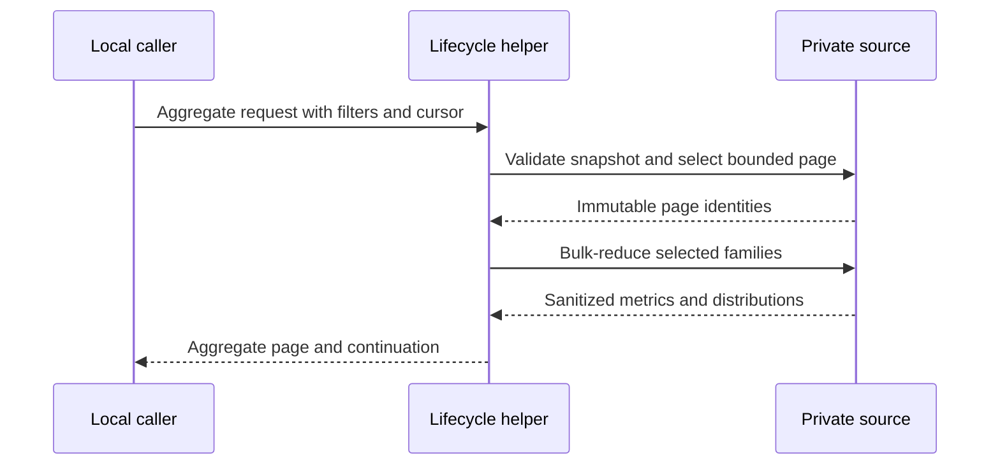
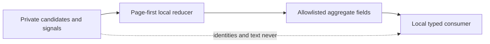

# History And Incident Query Performance

## Purpose

Return bounded History and Incident audit evidence without scanning or emitting a
full candidate population. The lifecycle helper owns snapshot selection,
pagination, reduction semantics, privacy, and truthful overflow. OpenCode owns
subprocess deadlines and model-visible availability.

## Ubiquitous Language

| Term | Definition |
|---|---|
| Immutable Page | Candidate identities selected under one validated snapshot, filter set, cursor, and limit before expensive reduction. |
| Aggregate Page | Metrics and distributions reduced only for one Immutable Page without candidate bodies or identifiers. |
| Incident Summary | Bounded counts by allowlisted tool, sanitized failure class, and recovery state without signal identity or evidence. |
| Availability Denominator | Separate available and unavailable member counts carried beside one metric. |

## Required Behavior

**Scenario: Reduce only one immutable page**

- Given a validated History snapshot, filters, cursor, and limit
- When the caller requests `aggregate_only`
- Then the helper selects and binds the page before session-family or metric work
- And bulk-reduces only page sessions and their bounded families
- And returns no candidate, message, part, signal, or cycle identifiers

**Scenario: Preserve continuation truth**

- Given more eligible members exist after one Aggregate Page
- When the page is returned
- Then snapshot, ceilings, digest, filters, cursor, and continuation remain bound
- And a continuation cannot silently move to another population

**Scenario: Summarize overflowed Incident evidence**

- Given Incident Signal detail exceeds its bounded output
- When the caller requests `summary_only`
- Then the helper returns counts only by allowlisted tool, sanitized failure class,
  and recovered state
- And reports `signal_overflow=true` without estimating hidden frequency

**Scenario: Preserve existing detailed consumers**

- Given a caller omits `aggregate_only` or `summary_only`
- When History or Incident evidence is requested
- Then the existing candidate and detailed response contracts remain unchanged

## Interfaces

The lifecycle CLI adds `--aggregate-only` to structured History telemetry and
`--summary-only` to Incident Scan. Provider adapters expose the corresponding
`aggregateOnly` and `summaryOnly` booleans. Both default to `false`.

Aggregate History output preserves the existing schema identity and snapshot
envelope, sets `mode=aggregate`, and contains only:

| Field | Contract |
|---|---|
| Snapshot envelope | Existing snapshot, ceilings, database digest, exclusion digest, and sanitized filters |
| Page envelope | Requested limit/cursor, selected count, and immutable continuation |
| Cohort counts | Primary/child, review/non-review, correlation quality, active/completed, available/unavailable |
| Metrics | Available count, unavailable count, integer-floor mean, nearest-rank p50, and nearest-rank p90 |
| Distributions | Authoritative agent and model counts only |

Metrics cover elapsed milliseconds, tokens, tool calls, tool errors, child
sessions, and available delegation counts. A field with no authority is
unavailable rather than zero.

Incident summary output preserves the existing bounded scan snapshot, sets
`mode=summary`, and contains registered-Incident count, total visible Signal
count, `signal_overflow`, and bounded count rows keyed only by allowlisted tool,
sanitized failure class, and recovered boolean.

## Reduction Contract

- Sort numeric available values ascending.
- Use zero-based nearest-rank index `ceil(p * n) - 1`, clamped to the available
  bounds, for p50 and p90.
- Use integer floor for mean.
- Carry available and unavailable denominators beside every metric.
- Permit singleton descriptive output; comparative activation requires at least
  five complete comparable members.
- Select page identities before expensive joins and use bulk queries per authority
  family. Per-candidate database queries are prohibited.
- An immutable reduction cache may reuse only exact snapshot, digest, filters,
  cursor, page, and method identity. Changed identity is a cache miss.

## Privacy And Failure Contract

Summary modes contain no prompt, response, command, URL, credential, environment
value, absolute path, candidate identity, message identity, part identity, Signal
identity, cycle identity, or raw error. Failure classes and tool names come from
an allowlist; unknown values aggregate as `unknown` rather than retaining text.
Invalid snapshots, continuations, filters, or schemas fail closed. Missing source
authority remains explicit unavailable evidence.

## Visual Evidence

| Concern | Decision | Review question | Canonical source | Owner/change trigger |
|---|---|---|---|---|
| Boundary | required: ownership table | Which context owns reduction versus subprocess availability? | Purpose and Interfaces | Ownership change |
| Interaction | required: sequence diagram | Is the page selected before expensive reduction? | Required Behavior and Reduction Contract | Query-order change |
| State | not_applicable: snapshots and cursors are immutable values, not workflow state | - | Interfaces | Durable-state change |
| Data/trust | required: flowchart | Can private candidate or signal identity reach aggregate output? | Privacy And Failure Contract | Privacy-boundary change |
| Schema | required: field tables are the accessible canonical schema | Which fields are present in summary modes? | Interfaces | Response-shape change |
| Dependency/deployment | not_applicable: existing helper and typed adapters are extended | - | Purpose | Runtime dependency change |
| Quantitative | not_applicable: formulas are contracts, not comparative evidence | - | Reduction Contract | Formula change |

**Text Equivalent:** A local caller supplies bounded filters and a cursor. The
lifecycle helper validates one snapshot, selects the page first, bulk-reduces only
the selected families, and returns aggregate metrics plus immutable continuation
without candidate identities.

**Text Equivalent:** Private candidates and Signals enter only the source-local
page-first reducer. The reducer emits allowlisted metrics, counts, availability,
overflow, and continuation to local typed consumers. Private identities and text
never enter aggregate output.

## Validation

- Fixtures prove page selection precedes metric and family reduction.
- Query-count evidence rejects per-candidate database access.
- Snapshot and continuation fixtures reject changed populations.
- Aggregate fixtures cover empty, singleton, unavailable, mixed, and five-member
  cohorts with exact mean/p50/p90 results.
- Incident fixtures prove allowlisted grouping, unknown collapse, truthful
  overflow, and absence of forbidden identities.
- Existing candidate and detailed-mode fixtures remain byte-compatible.

## Gate Ledger

| Gate | Applicability | Result | Authority |
|---|---|---|---|
| Domain | required | pending | Lifecycle README and Initiative manifest |
| Behavior | required | pending | Page, summary, overflow, and compatibility scenarios |
| Spec | required | pending | Interfaces, reduction, privacy, and visual contracts |
| Contract | required | pending | Helper and OpenCode ownership boundary |
| Test-driven implementation | required | pending | Focused lifecycle helper fixtures |
| Refactor | required | pending | Query-count and duplicated-reducer review |
| Review/Integrate | required | pending | Diff, privacy, downstreams, and affected QA |
| Release | not applicable: no versioned artifact is published | not_run | Engineering Profile |
| Deploy | required | pending | Managed helper source identity |
| Operate | required | pending | Bounded live aggregate and Incident summary smoke |
| Maintain/Retire | required | pending | Detailed-mode compatibility and cache invalidation |

## Non-Goals

- Exporting raw History or Incident evidence.
- Replacing immutable pagination with one unbounded aggregate.
- Changing review completion, Incident mutation, or privacy dispositions.
- Claiming causal performance improvement from mixed cohorts.
