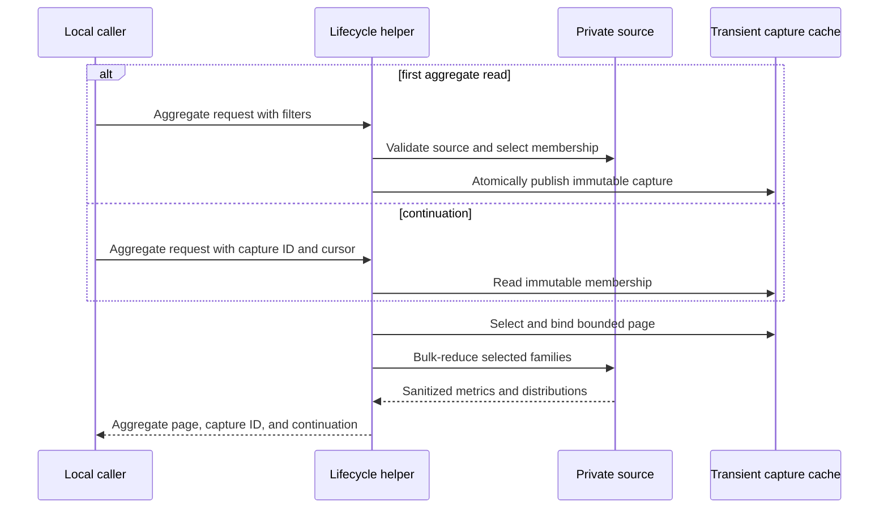
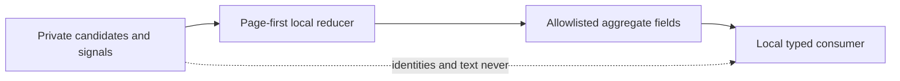

# History And Incident Query Performance

## Purpose

Return bounded History and Incident audit evidence without repeatedly scanning,
reducing, or emitting a full candidate population. The lifecycle helper owns
snapshot selection, immutable capture, pagination, reduction semantics, privacy,
and truthful overflow. OpenCode owns subprocess deadlines and model-visible
availability.

| Boundary | Lifecycle helper | OpenCode |
|---|---|---|
| Source access | Selects the immutable population and reads private local authorities | Has no direct database access |
| Reduction | Binds the page, bulk-reduces metrics, and validates summary schemas | Does not recompute lifecycle metrics |
| Availability | Returns valid local output or fails closed | Bounds the subprocess and maps operational failure to typed availability |
| Privacy | Omits private identities and raw text from summary modes | Prevents unavailable or rejected output from entering model context |

## Ubiquitous Language

| Term | Definition |
|---|---|
| Immutable Page | Candidate identities selected under one validated snapshot, filter set, cursor, and limit before expensive reduction. |
| Aggregate Page | Metrics and distributions reduced only for one Immutable Page without candidate bodies or identifiers. |
| Incident Summary | Bounded counts by allowlisted tool, sanitized failure class, and recovery state without signal identity or evidence. |
| Availability Denominator | Separate available and unavailable member counts carried beside one metric. |

## Required Behavior

**Scenario: Reduce only one immutable page**

- Given a validated History snapshot, filters, cursor, and limit
- When the caller requests `aggregate_only`
- Then the first request creates or reuses one immutable membership capture
- And continuation requests read that capture without rescanning the live source
- And the helper selects and binds the page before family telemetry or metric work
- And bulk-reduces only page sessions and their bounded families
- And returns no candidate, message, part, signal, or cycle identifiers

**Scenario: Preserve continuation truth**

- Given more eligible members exist after one Aggregate Page
- When the page is returned
- Then snapshot, ceilings, digest, filters, cursor, and continuation remain bound
- And a continuation cannot silently move to another population

**Scenario: Summarize overflowed Incident evidence**

- Given Incident Signal detail exceeds its bounded output
- When the caller requests `summary_only`
- Then the helper returns counts only by allowlisted tool, sanitized failure class,
  and recovered state
- And reports `signal_overflow=true` without estimating hidden frequency

**Scenario: Preserve existing detailed consumers**

- Given a caller omits `aggregate_only` or `summary_only`
- When History or Incident evidence is requested
- Then the existing candidate and detailed response contracts remain unchanged

## Interfaces

The lifecycle CLI adds `--aggregate-only` to structured History telemetry and
`--summary-only` to Incident Scan. Aggregate mode reuses the existing
`--capture-id` continuation input; a first request without one persists an
owner-private transient capture under the existing 24-hour retention policy.
Provider adapters expose the corresponding `aggregateOnly` and `summaryOnly`
booleans. Both default to `false`.

Aggregate History output preserves the existing schema identity and snapshot
envelope, sets `mode=aggregate`, and contains only:

| Field | Contract |
|---|---|
| Snapshot envelope | Existing snapshot, ceilings, database digest, exclusion digest, and sanitized filters |
| Page envelope | Requested limit/cursor, selected count, and immutable continuation |
| Cohort counts | Primary/child, review/non-review, correlation quality, active/completed, available/unavailable |
| Metrics | Available count, unavailable count, integer-floor mean, nearest-rank p50, and nearest-rank p90 |
| Distributions | Authoritative agent and model counts only |

Metrics cover elapsed milliseconds, tokens, tool calls, tool errors, child
sessions, and available delegation counts. A field with no authority is
unavailable rather than zero.

The exact schema is version 1:

```json
{
  "schema_version": 1,
  "mode": "aggregate",
  "capture_id": "<24 lowercase hex>",
  "snapshot": 0,
  "session_ceiling": 0,
  "part_ceiling": 0,
  "database_digest": "<sha256>",
  "exclusion_digest": null,
  "query": {
    "after": null,
    "before": null,
    "method_revision": null,
    "cycle_filter_applied": false,
    "state": null,
    "context": null,
    "project_digest": null,
    "reviewed_status": null,
    "archive_only": false
  },
  "limit": 25,
  "cursor": 0,
  "selected_count": 0,
  "continuation": null,
  "digest": "<sha256>",
  "cohort": {
    "sessions": {
      "relation": {"primary": 0, "child": 0, "unavailable": 0},
      "review": {"review": 0, "non_review": 0, "unavailable": 0},
      "telemetry_available": 0,
      "telemetry_unavailable": 0
    },
    "correlation_quality": {
      "exact": 0,
      "family": 0,
      "worktree": 0,
      "source": 0,
      "ambiguous": 0,
      "unavailable": 0
    },
    "cycle_states": {
      "active": 0,
      "blocked": 0,
      "abandoned": 0,
      "completed": 0,
      "unknown": 0
    }
  },
  "metrics": {
    "elapsed_ms": {"available_count": 0, "unavailable_count": 0, "mean": "unavailable", "p50": "unavailable", "p90": "unavailable"},
    "tokens": {"available_count": 0, "unavailable_count": 0, "mean": "unavailable", "p50": "unavailable", "p90": "unavailable"},
    "tool_calls": {"available_count": 0, "unavailable_count": 0, "mean": "unavailable", "p50": "unavailable", "p90": "unavailable"},
    "tool_errors": {"available_count": 0, "unavailable_count": 0, "mean": "unavailable", "p50": "unavailable", "p90": "unavailable"},
    "child_sessions": {"available_count": 0, "unavailable_count": 0, "mean": "unavailable", "p50": "unavailable", "p90": "unavailable"},
    "delegations": {"available_count": 0, "unavailable_count": 0, "mean": "unavailable", "p50": "unavailable", "p90": "unavailable"}
  },
  "distributions": {
    "agents": [{"value": "build", "count": 1}],
    "models": [{"value": "gpt-5.6-sol", "count": 1}]
  }
}
```

`selected_count` is the number of members on this page. Each `relation`, `review`,
correlation-quality, and telemetry partition totals `selected_count` independently.
Cycle-state counts count cycle records and may therefore exceed it. A retained
member lacking an explicit `review_session` value is review `unavailable`, not
`non_review`. `telemetry_available` means the member has a schema-valid telemetry
object; absence or invalid source authority counts as `telemetry_unavailable`.
Metric sources are, respectively,
`aggregates.elapsed_ms`, `telemetry.token_total`,
`aggregates.tool_call_count`, `aggregates.tool_error_count`,
an exact page-scoped bulk count of direct child sessions, and
`telemetry.delegation_count`. Truncated detailed child arrays are not a metric
authority. Only non-negative integers are available. Distribution rows count each
authoritative agent or model identity once per member, sort by descending count
then ascending `value`, and omit unavailable identities. Candidate, session, and
cycle ID arrays are absent. `cycle_filter_applied` says only whether a cycle filter
was supplied. The raw cycle ID is bound inside the private capture query and
aggregate digest but neither it nor a reversible standalone digest is returned.

Incident summary output preserves the existing bounded scan snapshot, sets
`mode=summary`, and contains registered-Incident count, total visible Signal
count, `signal_overflow`, and bounded count rows keyed only by allowlisted tool,
sanitized failure class, and recovered boolean.

The exact schema is version 1:

```json
{
  "schema_version": 1,
  "mode": "summary",
  "snapshot": 0,
  "session_ceiling": 0,
  "part_ceiling": 0,
  "database_digest": "<sha256>",
  "incident_count": 0,
  "incident_overflow": false,
  "signal_count": 0,
  "signal_overflow": false,
  "groups": [
    {"tool": "read", "failure_class": "tool_failed", "recovered": false, "count": 1}
  ]
}
```

Counts cover at most the first 100 validated rows in the existing detailed sort
order. The corresponding overflow boolean is true when the 101-row sentinel is
present; no hidden total is estimated. Group rows sum to `signal_count`, sort by
descending count then ascending tool, failure class, and recovered value, and
contain no evidence text.

The tool allowlist is the fixed names `apply_patch`, `bash`, `glob`, `grep`,
`question`, `read`, `skill`, `task`, `todowrite`, and `webfetch`, plus names that
match the exact safe syntax `^[A-Za-z0-9][A-Za-z0-9._:/-]{0,127}$` and begin with
`dbsctr_`, `dks_`, or `herdr_`. Every other name
becomes `unknown`. Failure classes are `timed_out`, `cancelled`,
`permission_denied`, `service_unavailable`, `invalid_output`, `tool_error`,
`tool_failed`, and `unknown`. Classification reads only a mapping-valued
`state.error`: `code` takes precedence over `name`. A string is normalized by
trimming ASCII whitespace, lowercasing ASCII letters, replacing each maximal run
of ASCII space, `.`, `-`, `/`, or `:` with `_`, and rejecting any remaining
character outside `[a-z0-9_]`. The result maps only exact `timeout`, `timed_out`, `timeout_error`,
`cancelled`, `canceled`, `abort_error`, `permission_denied`, `eacces`, `eperm`,
`service_unavailable`, `unavailable`, `invalid_output`, or `validation_error`
tokens. Otherwise status `error` maps to `tool_error`, status `failed` maps to
`tool_failed`, and every other value maps to `unknown`. Status normalization uses
the same algorithm. Raw error strings are never parsed for classification.
`recovered` retains the detailed-mode rule: a later successful or completed call
with the same validated private raw tool identity in the same session and bounded
snapshot. Recovery is computed before an output tool name is collapsed to
`unknown`, so unrelated unknown tools cannot recover one another.

## Reduction Contract

- Sort numeric available values ascending.
- Use zero-based nearest-rank index `ceil(p * n) - 1`, clamped to the available
  bounds, for p50 and p90.
- Use integer floor for mean.
- Carry available and unavailable denominators beside every metric.
- Permit singleton descriptive output; comparative activation requires at least
  five complete comparable members.
- Select page identities before expensive joins and use bulk queries per authority
  family. Per-candidate database queries are prohibited.
- An immutable reduction cache may reuse only exact snapshot, digest, filters,
  cursor, page, and method identity. Changed identity is a cache miss.

The first aggregate request may scan the live population once to validate source
identity, apply filters, and persist ordered membership in the existing immutable
capture store. It must not reduce metrics during that scan. Page selection then
reads capture membership and binds the ordered hidden page IDs before reading
message/part metric payloads or expanding family telemetry. Continuations require
the returned capture ID and never read the live population.
The subsequent metric work uses a fixed number of bulk authority queries whose
count does not grow with page size. Aggregate digest identity includes mode
`aggregate-v1`, capture ID, snapshot, ceilings, database and exclusion digests,
canonical filters, limit, cursor, ordered hidden page IDs, and every selected source
identity. A cache is optional; when absent, these values still define immutable
continuation and digest validation.

The persisted capture is a derived read-side cache, not review, Incident, cycle,
or gate state. The lifecycle helper owns its owner-private directory, existing
exclusive review lock, atomic publish, 24-hour retention, exact query/source
identity, and deletion when source privacy tombstones invalidate a member. A
failed create publishes no capture and returns no partial page. Cleanup may remove
only expired, unreferenced captures. This bounded cache does not authorize a
review marker, Incident disposition, lifecycle transition, or other canonical
write, so the typed operation remains permission-classified as read-only.

## Privacy And Failure Contract

Summary modes contain no prompt, response, command, URL, credential, environment
value, absolute path, candidate identity, message identity, part identity, Signal
identity, cycle identity, or raw error. Failure classes and tool names come from
an allowlist; unknown values aggregate as `unknown` rather than retaining text.
Invalid snapshots, continuations, filters, or schemas fail closed. Missing source
authority remains explicit unavailable evidence.

`history-incident-query-performance.schemas.json` is the normative closed-schema
authority. Every object rejects unknown properties; integers are non-negative and
bounded to signed 64-bit range; digests and opaque values match their declared
patterns; arrays are bounded and unique. Prose invariants such as partition sums,
sort order, percentile formulas, digest derivation, and continuation greater than
cursor apply in addition to JSON Schema validation.

Incident summary validates all selected rows before sentinel counting. Any
malformed selected row fails the summary instead of being skipped. One hundred
valid rows means no overflow; 101 valid rows means count 100 and overflow true.

## Visual Evidence

| Concern | Decision | Review question | Canonical source | Owner/change trigger |
|---|---|---|---|---|
| Boundary | required: ownership table | Which context owns reduction versus subprocess availability? | Purpose and Interfaces | Ownership change |
| Interaction | required: sequence diagram | Is the page selected before expensive reduction? | Required Behavior and Reduction Contract | Query-order change |
| State | required: transient capture lifecycle | Can first read, continuation, expiry, and failed publication be distinguished? | Reduction Contract and state diagram | Capture lifecycle change |
| Data/trust | required: flowchart | Can private candidate or signal identity reach aggregate output? | Privacy And Failure Contract | Privacy-boundary change |
| Schema | required: field tables are the accessible canonical schema | Which fields are present in summary modes? | Interfaces | Response-shape change |
| Dependency/deployment | not_applicable: existing helper and typed adapters are extended | - | Purpose | Runtime dependency change |
| Quantitative | not_applicable: formulas are contracts, not comparative evidence | - | Reduction Contract | Formula change |



**Text Equivalent:** On a first aggregate read, the lifecycle helper validates the
live source and atomically persists immutable ordered membership. A continuation
reads that capture without rescanning the source. Both paths select and bind one
page before bulk-reducing only its families, then return aggregate metrics,
capture ID, and continuation without candidate identities.

```mermaid
stateDiagram-v2
    accTitle: Transient aggregate capture lifecycle
    accDescr: A first read either atomically publishes a ready capture or leaves no capture; ready captures serve continuations until expiry or privacy invalidation, then cleanup removes them.
    [*] --> Preparing: first aggregate read
    Preparing --> Ready: atomic publish
    Preparing --> [*]: failure leaves no capture
    Ready --> Ready: continuation read
    Ready --> Expired: 24 hours elapsed
    Ready --> Invalid: privacy tombstone
    Expired --> [*]: cleanup
    Invalid --> [*]: cleanup
```



**Text Equivalent:** A first aggregate read prepares a capture. Successful atomic
publication makes it ready; failure leaves no capture. Ready captures serve
continuations until 24-hour expiry or privacy invalidation, after which cleanup
removes them.



**Text Equivalent:** Private candidates and Signals enter only the source-local
page-first reducer. The reducer emits allowlisted metrics, counts, availability,
overflow, and continuation to local typed consumers. Private identities and text
never enter aggregate output.

## Validation

- Fixtures prove page selection precedes metric and family reduction.
- Query-count evidence rejects per-candidate database access.
- Snapshot and continuation fixtures reject changed populations.
- Aggregate fixtures cover empty, singleton, unavailable, mixed, and five-member
  cohorts with exact mean/p50/p90 results.
- Incident fixtures prove allowlisted grouping, unknown collapse, truthful
  overflow, and absence of forbidden identities.
- Existing candidate and detailed-mode fixtures remain byte-compatible.

## Gate Ledger

| Gate | Applicability | Result | Authority |
|---|---|---|---|
| Domain | required | pending | Lifecycle README and Initiative manifest |
| Behavior | required | pending | Page, summary, overflow, and compatibility scenarios |
| Spec | required | pending | Interfaces, reduction, privacy, and visual contracts |
| Contract | required | pending | Helper and OpenCode ownership boundary |
| Test-driven implementation | required | pending | Focused lifecycle helper fixtures |
| Refactor | required | pending | Query-count and duplicated-reducer review |
| Review/Integrate | required | pending | Diff, privacy, downstreams, and affected QA |
| Release | not applicable: no versioned artifact is published | not_run | Engineering Profile |
| Deploy | required | pending | Managed helper source identity |
| Operate | required | pending | Bounded live aggregate and Incident summary smoke |
| Maintain/Retire | required | pending | Detailed-mode compatibility and cache invalidation |

## Non-Goals

- Exporting raw History or Incident evidence.
- Replacing immutable pagination with one unbounded aggregate.
- Changing review completion, Incident mutation, or privacy dispositions.
- Claiming causal performance improvement from mixed cohorts.
