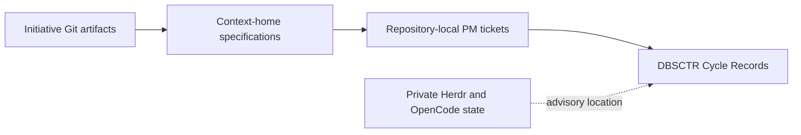
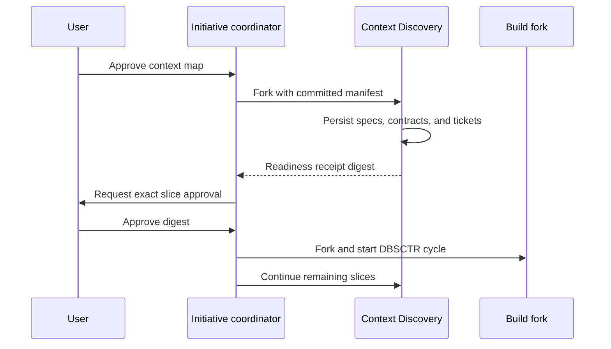

# Initiative Discovery

## Outcome

Large, multi-context intent becomes durable before compaction or implementation.
One coordinator can continue discovering the complete Initiative while approved,
dependency-safe delivery slices enter separate DBSCTR cycles.

## Domain

- An **Initiative** is one intent-led set of bounded contexts, delivery slices,
  dependency waves, and coordinated release groups.
- A **Material Statement** is a requirement, constraint, decision, risk, idea, or
  non-goal whose omission could change scope, behavior, safety, delivery, or
  validation.
- An **Initiative Manifest** is the coordinator repository's canonical JSON
  ledger for material statements, context homes, slices, dependencies, coverage,
  and stable lane state.
- A **Context Home** is the single repository that owns a bounded context's
  profile, specifications, and contracts.
- A **Delivery Slice** is the smallest specification-ready outcome that can enter
  one or more repository-local DBSCTR cycles without waiting for unrelated work.
- A **Readiness Receipt** binds one ready slice to its manifest, requirements,
  committed artifacts, tickets, dependencies, risk, and validation.
- A **Runtime Lane** privately correlates a stable Initiative lane with advisory
  OpenCode and Herdr identities. Runtime identity is never Git authority.

The Initiative coordinator owns cross-context decomposition and coverage.
Context homes own durable domain truth and contracts. PM Kernel tickets own
repository-local executable work. DBSCTR Cycle Records own implementation and
delivery evidence. Jira remains an optional projection.

## Behavior

### Capture before expansion

- Given the user supplies broad or multi-repository intent, when Discovery starts,
  then it enters Initiative capture before context implementation readiness.
- Every material statement receives a stable ID, kind, disposition, and artifact
  or slice coverage before another interview round expands the work.
- The workflow stores no additional raw transcript artifact. The user approves
  the extracted ledger as the completeness authority.

### Approve bounded contexts

- Given captured material spans several ownership boundaries, when the
  coordinator proposes context homes and dependencies, then no context lane
  launches until the user approves the map.
- Each bounded context has exactly one home repository. Consumer repositories
  reference immutable owned contracts rather than creating co-authoritative
  copies.

### Discover and build concurrently

- Given approved, ownership-disjoint contexts, when their dependencies permit,
  then the coordinator may fork independent Context Discovery sessions into
  child Herdr tabs without a policy concurrency cap.
- Given a delivery slice has complete specifications, owned contracts, stable
  tickets, validation, and disposed dependencies, when the user approves its
  exact readiness digest, then a new Build fork starts a repository-local DBSCTR
  cycle while the parent Discovery session continues remaining slices.
- Spikes are isolated evidence cycles. They continue until the named uncertainty
  is resolved or explicitly blocked and do not merge prototype code as production
  implementation.

### Coordinate questions

- The Initiative coordinator is the default user interface. It may answer child
  questions from already-authoritative artifacts and route those answers back.
- A child question requiring new user intent is batched by the coordinator. The
  user may enter a child tab directly, but its decision becomes authoritative only
  after durable checkpoint and Initiative reconciliation.

### Survive compaction and change

- Before compaction, OpenCode receives the current bounded Initiative or lane
  context. Normal turns also receive current durable context when available.
- A compressed summary never proves readiness. Validation, receipt creation, and
  launch re-read committed artifacts and reject stale digests.
- New material intent may tighten or reopen affected specifications, tickets,
  receipts, and dependent promotion gates. Readiness never remains stale silently.

### Complete truthfully

- Initiative Discovery is complete only when every material statement is ready,
  delivered, deferred, or rejected with coverage and no statement remains open or
  blocked.
- PM Kernel tickets are created only after their slice specification is ready.
  Their outcome, scope, acceptance, ownership, reads, dependencies, and validation
  are stable at creation; lifecycle evidence and approved revisions may evolve.

## Specification

The coordinator repository stores:

```text
docs/initiatives/<slug>/
  README.md
  MANIFEST.json
  receipts/<slice-id>.json
```

Context homes store `README.md`, a separate `PROFILE.md` for new or materially
revised contexts, optional `PRODUCT.md`, `features/*.md`, `contracts/*.md`, and
canonical PM Kernel tickets. Existing README-based profiles remain valid until
their context is deliberately migrated.

`dbsctrctl initiative-check --manifest PATH --json` validates the complete
manifest and returns its canonical SHA-256 digest plus ready slices.
`dbsctrctl initiative-receipt --manifest PATH --slice ID --json` emits a bounded
receipt only for a valid ready slice. These commands write no repository files.

`V3.38-1` is the one-time self-bootstrap cycle: it creates the manifest validator,
receipt, launch, and deployment boundaries that could not authorize themselves
before they existed. Its dependent lanes remain non-promotable in the manifest
until their implementation and deployment evidence is recorded. This exception
does not apply to later Initiatives or slices.

The OpenCode adapter resolves the target origin's symbolic `HEAD` and binds that
protected base branch into exact approval and cycle creation. It may fork the
current session across repositories only when the installed CLI exposes
`--fork`. It always reanchors the child to the target repository and durable
receipt, explicitly selects the provider-neutral Build primary, and never
attaches the coordinator runtime as Build evidence. Unsupported fork behavior
falls back to a fresh Build session with the same digest-bound handoff.

## Contracts

- Manifest JSON rejects duplicate keys, unknown fields, malformed IDs, duplicate
  identities, missing context homes, unknown dependencies, dependency cycles,
  uncovered material statements, and invalid terminal state.
- `complete` rejects open or blocked statements and nonterminal slices.
- `ready` slices require a promotable owning context, disposed context and slice
  dependencies, and at least one requirement, artifact, and ticket. Every
  requirement names an existing non-open, non-blocked material statement.
- Receipt artifacts are the deterministic union of slice artifacts and every
  required material statement's artifacts. The manifest, artifacts, and canonical
  tickets must be committed and clean at one source commit.
- Coordinator and context homes use canonical `owner/repository` identities.
  Receipt issuance verifies the exact GitHub source host and coordinator identity;
  launch verifies the target identity again inside `dbsctrctl begin`.
- Exact approval binds manifest commit/blob/digest, source and target repository
  identities, resolved protected base branch, cycle arguments, and the
  applicability-plan content digest. Begin consumes those expected identities
  and rejects approval-time mutation.
- Launch recovery preserves the approved delivery intent. A different intent is
  a new material request and requires fresh exact approval.
- Readiness receipts contain no transcript, prompt, secret, URL, machine path, or
  transient Herdr identity.
- A later manifest digest invalidates every earlier readiness receipt for an
  affected slice. No component silently loosens risk, dependencies, or coverage.
- Herdr remains execution and visibility only. Git artifacts and Cycle Records
  remain lifecycle authority.
- Context7 is Scout-only and receives only generic privacy-safe queries under the
  Initiative's standing bounded research approval. Explore remains local and
  read-only.
- Fleet-level concurrency has no numeric policy cap, but overlapping ownership,
  uncertain dependencies, critical risk, and repository delivery locks serialize
  work.

## Validation

- Manifest fixtures cover valid discovery, duplicate IDs, unknown requirements,
  dependency cycles, uncovered intent, stale readiness, and blocked completion.
- Profile fixtures cover new `PROFILE.md`, legacy README compatibility, and stale
  profile identity.
- OpenCode tests exercise current Herdr 0.8.2 tab, pane, agent, fork, blocked, and
  fallback contracts using argument-vector fakes plus one explicitly approved
  live smoke.
- Compaction fixtures prove durable context injection and launch rejection when
  context is absent or stale.

## Visual Evidence

| Concern | Decision | Review question | Canonical source | Owner/change trigger |
|---|---|---|---|---|
| Boundary | required: authority flowchart | Which system owns intent, specifications, work, execution, and runtime presentation? | Domain and Contracts | Lifecycle owner; authority changes |
| Interaction | required: session and promotion sequence | How can Discovery continue while a ready slice enters Build? | Behavior and Specification | Lifecycle owner; handoff changes |
| State | required: transition diagram | Which Initiative states may promote or complete? | Behavior and Contracts | Lifecycle owner; state changes |
| Data/trust | required: authority flowchart and Text Equivalent | Which durable and private identities cross boundaries? | Contracts | Lifecycle owner; persistence changes |
| Schema | not_applicable: the canonical JSON field contract and fixtures are clearer than an entity diagram | - | Specification and tests | Add only if relationships become persistent tables |
| Dependency/deployment | required: session and promotion sequence | Where do repository-local cycles and coordinated groups serialize? | Behavior and Contracts | Lifecycle owner; orchestration changes |
| Quantitative | not_applicable: no decision depends on measured comparative data | - | - | Add only with decision-grade data |



**Text Equivalent:** The coordinator repository owns material intent and
cross-context coverage. Each context home owns its profile, features, and
contracts. Implementation repositories own executable tickets and DBSCTR Cycle
Records. Private Herdr/OpenCode state locates sessions but cannot approve or
complete work.



**Text Equivalent:** After the user approves the context map, the coordinator
forks independent Context Discovery sessions. A session persists complete slice
artifacts and returns a digest-bound receipt. Only the user's exact approval
starts the Build fork and DBSCTR cycle; the coordinator and context parent remain
available for unfinished discovery.

```mermaid
stateDiagram-v2
    accTitle: Initiative and slice readiness states
    accDescr: Captured work progresses through discovery to ready and building; new intent can reopen it, while blocked work prevents completion until resolved, deferred, or rejected.
    [*] --> Captured
    Captured --> Discovering
    Discovering --> Ready
    Discovering --> Blocked
    Blocked --> Discovering
    Ready --> Building: exact approval
    Ready --> Discovering: material intent changes
    Building --> Delivered
    Delivered --> Discovering: contract reopens
    Captured --> Deferred
    Captured --> Rejected
    Delivered --> [*]
    Deferred --> [*]
    Rejected --> [*]
```



**Text Equivalent:** Captured work enters Discovery. Complete slices become
ready; exact approval moves them to Build. New material intent can reopen ready
or delivered work. Blocked work must return to Discovery or become explicitly
deferred or rejected before Initiative Discovery can complete.
