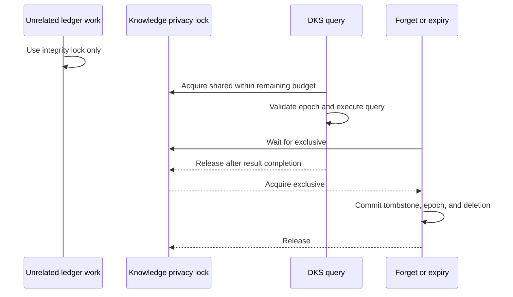

# Knowledge Query Privacy Isolation

## Ownership

`dbsctr_v3_lifecycle` owns the private-ledger privacy sequence, tombstones, and
dedicated knowledge privacy lock. Review, History, Incident, capture, and other
ledger operations retain their existing integrity lock. `dbsctr_knowledge_store`
consumes the privacy guard but cannot reinterpret forgetting or retention.

## Behavior

**Scenario: Ignore unrelated ledger contention**

- Given unrelated review, History, Incident, or capture work holds the private
  ledger integrity lock
- When DKS validates privacy and executes a read-only query
- Then the query uses the dedicated shared knowledge privacy lock
- And unrelated ledger work cannot delay privacy guard acquisition

**Scenario: Serialize a privacy mutation**

- Given forget, expiry, or capture deletion can change exported knowledge
- When the owner records its tombstone and advances the privacy sequence
- Then it holds the dedicated knowledge privacy lock exclusively through commit
- And no DKS query can return a cited result across that transition

**Scenario: Bound privacy contention**

- Given a privacy mutation already holds the dedicated lock
- When a DKS query cannot acquire its shared counterpart within the caller's
  remaining deadline
- Then the guard returns sanitized temporary unavailability
- And it does not execute the query program or expose lock or process identity

**Scenario: Preserve ledger integrity**

- Given a command changes both private-ledger rows and knowledge privacy state
- When it commits or rolls back
- Then it acquires integrity and privacy locks in one canonical order
- And failure releases both without partial tombstone, sequence, or payload state

## Interface

The existing `dbsctrctl knowledge-privacy-guard -- PROGRAM...` command remains the
consumer boundary. It receives the expected unsigned privacy sequence and digest,
acquires the dedicated privacy lock in shared mode within the caller's remaining
deadline, validates current state, and runs the argument vector without a shell.

Only operations that can add or remove an exported expiry or tombstone acquire the
dedicated lock exclusively. Ordinary review completion, incident state changes,
history scans, capture creation, and other non-privacy ledger work do not acquire
it. Commands requiring both locks use one source-defined canonical order and never
upgrade a held lock.

The guard emits no query content or private diagnostics. Operational evidence may
record only an allowlisted availability class and bounded duration.

## Contract

- A successful guarded result is bounded by one unchanged privacy sequence and
  digest from pre-execution validation through result completion.
- A privacy writer commits tombstone, sequence, digest, and owned payload deletion
  atomically before releasing the exclusive privacy lock.
- Lock waiting consumes the caller's remaining monotonic deadline; it has no
  independent unbounded wait.
- Timeout, malformed state, unsafe lock files, or lock-order failure executes no
  query and returns no citations.
- Existing ledger file ownership, modes, symlink rejection, transactionality,
  backup, restore, and forgotten-content non-resurrection remain unchanged.

## Validation

- A held unrelated integrity lock does not block a privacy-guarded fixture.
- A held exclusive privacy lock blocks query execution and settles at a short fake
  deadline without creating the program's marker.
- A guarded long-running query prevents a concurrent forget from committing until
  result completion.
- Commands requiring both locks prove canonical ordering, rollback, and process
  termination cleanup.
- Existing tombstone, capture deletion, incident forget, backup, restore, and
  knowledge export fixtures remain passing.

## Visual Evidence

| Concern | Decision | Review question | Canonical source | Owner/change trigger |
|---|---|---|---|---|
| Boundary | required: lock ownership flow | Which context owns privacy serialization? | Ownership and Interface | Privacy owner or consumer change |
| Interaction | required: query/writer sequence | Can unrelated ledger work block DKS, and can privacy mutation race a result? | Behavior and Contract | Lock or deadline change |
| State | required: privacy epoch transition | When does a new sequence become visible? | Contract | Tombstone transaction change |
| Data/trust | required: privacy boundary | Can private diagnostics or forgotten evidence escape? | Contract | Evidence schema change |
| Schema | not_applicable: no public data schema changes | - | Interface | Command schema change |
| Dependency/deployment | not_applicable: no new service or dependency | - | Engineering Profile | Runtime dependency change |
| Quantitative | required: bounded lock timing | Does privacy contention settle within the caller's remaining budget? | Validation | Deadline change |

**Text Equivalent:** Unrelated ledger operations do not acquire the knowledge
privacy lock and cannot delay DKS. A query holds the shared privacy lock from
epoch validation through result completion. A forget or expiry waits for the
exclusive lock, atomically commits its tombstone, sequence, digest, and deletion,
then releases it before later queries proceed.

## Gate Ledger

| Gate | Applicability | Result | Authority |
|---|---|---|---|
| Domain | required | pending | Lifecycle README and Initiative manifest |
| Behavior | required | pending | Unrelated contention, privacy mutation, timeout, and rollback scenarios |
| Spec | required | pending | Lock ownership, order, deadline, and visual contracts |
| Contract | required | pending | Privacy guard and tombstone transaction boundary |
| Test-driven implementation | required | pending | Focused process and lock fixtures |
| Refactor | required | pending | Shared lock helper and writer inventory review |
| Review/Integrate | required | pending | Privacy, compatibility, downstreams, and affected QA |
| Release | not applicable: no versioned artifact is published | not_run | Engineering Profile |
| Deploy | required | pending | Managed helper identity and fresh-process activation |
| Operate | required | pending | Live unrelated-contention and privacy-contention smokes |
| Maintain/Retire | required | pending | Lock compatibility, rollback, and ownership documentation |

## Non-Goals

- Weakening forget, expiry, tombstone, backup, restore, or non-resurrection rules.
- Replacing SQLite, adding a daemon, or adding a tracing backend.
- Allowing DKS to read private ledger bodies directly.
