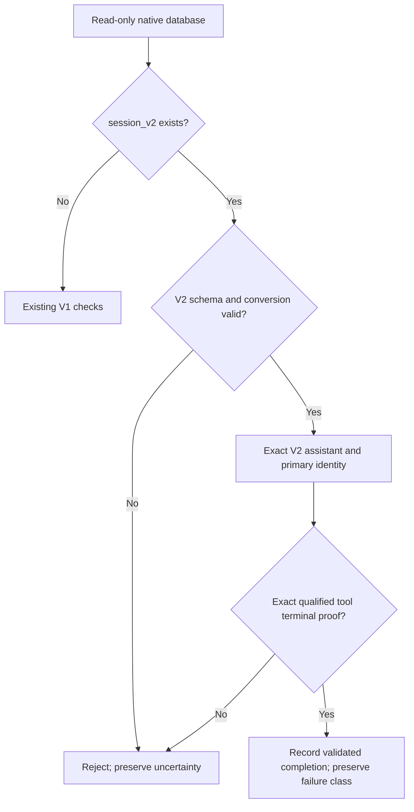

# OpenCode V2 Native Authority Compatibility

Status: specification ready; implementation and deployment unqualified.

## Domain and scope

Home: dbsctr_v3_lifecycle. Engineering Profile: ../PROFILE.md. Owner: dotfiles
maintainer. Risk: critical. Modules: Python, Security, Data, ML/AI. Deliver through
one reviewed draft PR; no installed helper change or live database migration in
this slice. Reuse existing lifecycle, private continuation store, Cycle Record
schemas and native database locator. Do not introduce a second lifecycle engine.

Native authority means the persisted session/message/tool evidence proving the
actor and outcome of one invocation. An event is a trigger, not authority.
V2 data lives in session_v2 and session_message; retained session/message/part
tables are historical V1 evidence once conversion completes. Call IDs can repeat
across messages and sessions. An omitted session-level agent is not Build consent.

Build owns dot_local/bin/executable_dbsctrctl, tests/test_opencode_v2_authority.py,
affected existing lifecycle/continuation tests and the lifecycle completion
changelog. Discovery owns normative contracts, profile and Initiative scope.
The TypeScript adapter, Herdr recovery, historical reporting projections,
distribution, desktop and live migration are later slices.

## Source evidence

The initiative V2-NATIVE-FINDINGS.md records source and synthetic native evidence
for 2.0.21. Assistant messages carry exact agent plus model.id/providerID.
Tool before/after hooks carry sessionID/messageID/id, but terminal state remains
running during execute.after. Durable event delivery permits a fresh database
check. Default Build can have null session-level agent. Reused provider call IDs
were observed safely in two synthetic sessions using session-qualified keys.

## Storage selection contract

Select schema from one read-only transaction on the existing configured database.
No DDL, checkpoint, migration or repair is permitted during authority reads.

1. If session_v2 is absent, preserve the existing V1 path and its supported
   legacy fixtures. Presence of session_message alone is not a V2 discriminator.
2. If session_v2 exists, use only V2 native session/message authority. Require
   session_message and their required columns, and real tables rather than views.
3. If V1 session also exists, require the exact native kv migration.v1-v2 value
   with phase completed before authorizing V2. Missing, malformed, running or
   failed conversion evidence rejects authority; never fall back to V1 rows.
4. On a fresh V2 database without V1 session, absence of that conversion marker
   is valid. Validate required columns and relationships for each requested row.
5. Missing rows, unknown schema, ambiguous identity, invalid JSON, duplicate
   fields or mismatched session/message relationships fail closed through existing
   bounded failure surfaces. Do not print database content or raw SQLite errors
   added by the new code.

Read only the requested identity and tool scalar fields, not complete histories
or arbitrary output bodies. New V2 queries use a two-second progress deadline and
read-only SQLite timeout. Limit native call candidates to 101; more than 100
qualifies as unavailable rather than truncating ambiguous evidence. Source
content remains local and never enters Git, hosted inference or logs.

## Identity and activation

Preserve session_for_message and harness_activation_for_message interfaces.
For V2, resolve session_id from session_message.id, require the joined session_v2
row, and enforce parent_id is null when primary identity is required.

For mutation/activation, require type assistant and exact persisted data.agent,
data.model.providerID and data.model.id. Never use a user-supplied agent/model or
default missing agent to Build. If session_v2.agent is non-null, require it to
match the assistant actor; null is allowed only with exact assistant evidence.
Preserve existing accepted Build IDs, core/overlay revisions and provider affinity.
For build-claude only, V2's canonical google-vertex provider is accepted where V1
uses google-vertex-anthropic; keep actual provider IDs in new activation evidence
and preserve historical activation bytes. Cross-provider transitions retain
their existing approval behavior; do not silently rewrite old activation records.

Read-only Plan/other-primary diagnostics derive their actor from the same V2
assistant record and gain no mutation rights. Child sessions remain denied.
Handover target checks use the newest persisted V2 assistant by seq and id plus
its owning session; require a supported Build actor, primary parentage and a
non-conflicting explicit session agent. No assistant evidence means no handover.
The existing receiving-session attach/activation checks remain required.

Update every direct native actor read in continuation_native, both handover
branches and continuation_legacy_operation_identity to use this shared selection
and identity logic. Retain Codex-specific authority and schema-5 conformance.

## Call identity and completion

The V2 adapter will supply a qualified operation call key:
`v2_` plus SHA-256 of UTF-8 `messageID + NUL + nativeCallID`. Existing V1 call IDs
remain unchanged. This fits the existing opaque-ID contract and operation-store
schema. The helper resolves the requested message and scans bounded tool items
for exactly one matching derived key; it never matches by call ID alone.

For V2 operation finish, validate persisted message ownership, exact qualified
call key and operation class before accepting completion. Required native tool
fields are type tool, id, name, state.status and time.created/time.completed.
Times must be finite numbers with 0 <= created <= completed < 2**53.

- File class: allow native write/edit/patch tools only. Completed requires
  persisted completed; native_error requires persisted error. Preserve the
  original failure classification. Neither trigger nor claim overrides storage.
- Shell class: require native shell and persisted completed, metadata.status
  completed, and no running status. A background/running result or unverified
  terminal condition leaves uncertainty and blocks transfer; this slice does not
  infer process termination from a completed tool envelope.
- Lifecycle class: require a dbsctr_ tool with persisted completed and exact
  actor/message/call ownership. Do not accept unrelated custom tools as lifecycle
  completion.
- Unsupported classes, unknown terminal state, duplicates and malformed evidence
  reject completion without clearing uncertainty. An explicit uncertain outcome
  preserves existing recovery behavior. No automatic ownership recovery is added.

Keep the current V1 completion path and its failed-file native proof unchanged.
For V2, completed is no longer sufficient as a bare caller assertion. Errors
outside the qualified failed-file path remain uncertain until qualified recovery;
future adapter work may propose separately reviewed terminal proof extensions.

## Behaviors and tests

- Given V1-only storage, existing activation and continuation contracts pass.
- Given completed V2 conversion with conflicting legacy rows, only current V2
  assistant identity is accepted; stale legacy data cannot authorize an actor.
- Given incomplete conversion, mutation and activation fail without modifying
  database bytes or falling back to legacy tables.
- Given null session agent and valid persisted assistant actor, exact V2 Build
  identity is resolved; missing or mismatched assistant evidence fails closed.
- Given a child session, attachment and writer transfer remain denied.
- Given duplicate native call IDs in different messages, qualified keys select
  only the operation's exact persisted message and tool.
- Given after-hook notification while persisted tool state is running, finish
  cannot complete the operation. A later valid terminal row permits completion.
- Given completed shell tool output reporting a background command still running,
  ownership remains non-transferable until separately verified recovery.
- Given missing/invalid/oversized/duplicate evidence, no guessed identity or
  completion is produced. Malformed source JSON never escapes as raw output.

Add synthetic V1, fresh-V2 and mixed-schema SQLite fixtures based on the observed
native contract. Test malformed input, view substitution, repeated IDs, agent
drift, canonical Vertex mapping, migration checkpoint, finite timestamp bounds,
background status and absence of writes. Run affected helper, legacy and
checkout-independent continuation, activation-route and Codex core tests. Use
pytest and Python compilation with existing dependencies. Native installed
adapter qualification and all-platform rollout remain later required gates.

## Gates and maintenance

Domain, Behavior, Spec, Contract, Test-driven implementation, Refactor,
Review/Integrate and Maintain/Retire are required. All results pending. Release
is not applicable because no separately versioned artifact is published. Deploy
and Operate are not applicable for this source-only compatibility slice: no
installed helper, running service, private live data or process is changed.
No Gate Exception is granted. Independent review is required where a qualified
reviewer is available; any availability gap must be recorded rather than hidden.

V1 support remains until controlled fleet retirement. New native schema drift
fails closed. The future control-plane port must make history/reporting consumers
truthfully unavailable until their V2 contracts pass, rather than presenting
retained V1 history as current V2 evidence. That retirement gate is not satisfied
by this helper slice. Preserve existing archives and recovery materials.

## Visual Evidence

| Concern | Decision | Authority/change trigger |
|---|---|---|
| Boundary | required: authority selection flow | Storage selection / trust-boundary change |
| Interaction | required: authority selection flow | Actor/finish validation ordering change |
| State | required: authority selection flow | Conversion or terminal-state semantics change |
| Data/trust | required: authority selection flow | Native source or failure-surface change |
| Schema | not_applicable: named tables and field contract are canonical | Storage/call contracts |
| Dependency/deployment | not_applicable: source-only slice; Initiative owns deployment chain | Initiative |
| Quantitative | not_applicable: bounds are invariants, not benchmark claims | Storage/call contracts |

**Text Equivalent:** A read-only transaction chooses V1 only without a V2 session
table. V2 schema and any required conversion checkpoint must validate; failures
never fall back to legacy rows. Exact assistant actor and primary parentage prove
identity. Matching message-qualified tool evidence proves terminal completion;
missing, running, background or ambiguous outcomes preserve uncertainty.
