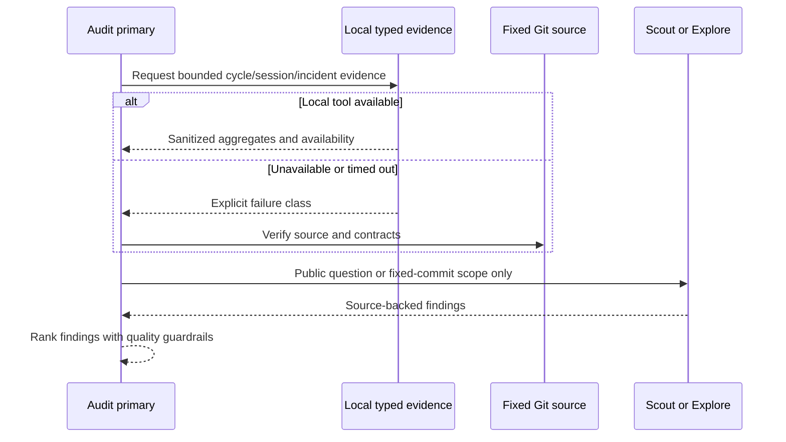
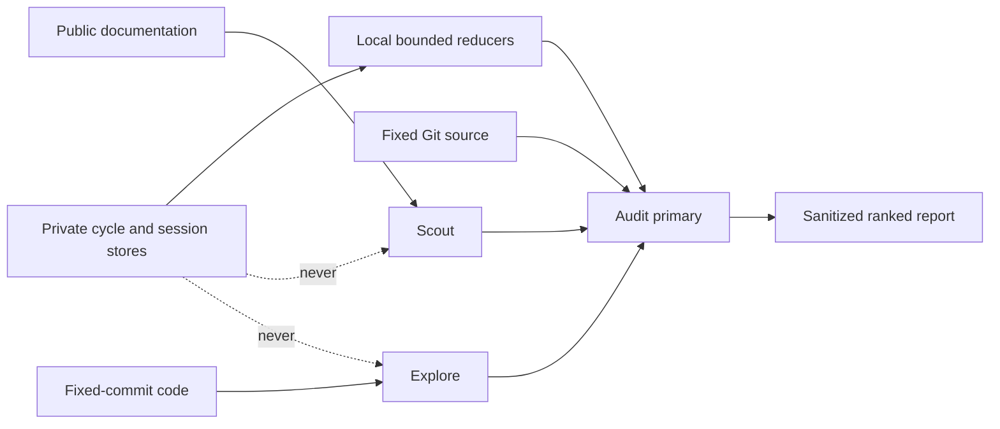

# DBSCTR Performance Audit

## Purpose

Provide one reproducible report-only workflow for finding unnecessary DBSCTR
cycle cost without weakening quality. The workflow combines source-local cycle
metrics, sanitized session history, incident signals, fixed-commit source, and
bounded external guidance. It distinguishes measured bottlenecks from plausible
unmeasured bloat and turns both into separately approvable delivery slices.

## Scope

The lifecycle context owns audit order, quality equivalence, prioritization, and
the final report. Adjacent contexts own their implementations:

- `opencode_control_plane`: session evidence, agent/model routing, subagents,
  cancellation, context growth, and typed runtime boundaries.
- `dbsctr_knowledge_store`: query locks, policy verification, retrieval deadlines,
  and fallback behavior.
- `dotfiles_ai_distribution`: immutable host/VM captures, source availability,
  retention, and trend replay.

The audit may inspect Discovery, begin/worktrees, context retrieval, agents and
models, phase locks, implementation, QA, gate evidence, deployment, delivery,
operations, review, and maintenance. It never implements its findings.

## Behavior

### Establish a comparable baseline

- Given retained Cycle Records and private phase evidence may be incomplete
- When a performance audit starts
- Then it requests source-local cycle performance for all contexts and the target
  context where known
- And reports autonomous and calendar values separately
- And carries coverage, unavailable samples, gate failures, reopenings, and
  remediation rounds beside every speed conclusion
- And records the fixed Git commit, Method Revision, sanitized filters, source
  availability, cohort composition, attribution quality, and coverage

### Use private session evidence safely

- Given the local review-history interfaces expose bounded sanitized metadata
- When the audit needs session, model, agent, token, tool, error, or delegation
  distributions
- Then it reads bounded history with one immutable snapshot and continuation
- And performs aggregate reduction locally
- And never sends candidate bodies, identifiers, paths, or private provenance to
  Scout, Explore, or another hosted agent
- And keeps private snapshot identities local rather than placing them in reports

### Fail over without retry bloat

- Given DKS, telemetry, Incident Scan, or a source may be unavailable or exceed a
  deadline
- When the first bounded call fails
- Then the audit records the exact availability class once
- And continues from authoritative source, specifications, fixed-commit inspection,
  or the successful sanitized history boundary
- And does not loop, bypass locks, query private databases directly, or call a
  broader scan merely to replace missing evidence

### Route independent research

- Given local architecture or current external guidance may materially affect a
  finding
- When the audit has an evidence gap
- Then it uses Explore for bounded fixed-commit local research and Scout for
  authoritative public documentation
- And uses no more than three independent concurrent subagents
- And checks for `graphify-out/graph.json` before loading Graphify
- And verifies any hosted claim that an artifact is absent with primary
  `dbsctr_inspect object` or `tree` evidence
- But it does not invoke a reviewer for generic verification

### Catalogue every surface

- Given measured data cannot cover every lifecycle cost
- When opportunities are synthesized
- Then each item is classified as `measured`, `source_backed_unmeasured`,
  `external_guidance`, or `assumption`
- And names the lifecycle surface, mechanism, evidence, confidence, expected
  effect, effort, quality risk, and acceptance measurement
- And obvious source-backed bloat remains visible even without timing data

### Prioritize without lowering quality

- Given a faster path could omit or weaken evidence
- When priorities are assigned
- Then correctness, safety, privacy, data-loss prevention, and required evidence
  remain invariant
- And P0/P1 favor reproduced stalls, repeated failures, duplicate exact work, and
  high-confidence bottlenecks
- And model, reviewer, or orchestration associations require comparable cohorts
  before activation

## Golden Path

1. Resolve the fixed Git commit and read the `dbsctr-cycle-speed` Initiative.
2. Request runtime health and `cycle-performance` for all and target contexts.
3. Request Incident Scan alone, never beside an optional failure-prone call.
4. Request bounded sanitized review history with a default page of 25; retain
   snapshot and continuations. Prefer aggregate and Incident summary modes when
   their dependent slices are available.
5. Request structured telemetry once. On timeout, use the successful history page
   and record telemetry unavailable.
6. Query DKS once. On contention or timeout, fall back immediately to fixed-commit
   source and record DKS unavailable.
7. Check for an existing Graphify graph before loading or querying Graphify.
8. Launch independent Explore and Scout lanes only for unresolved local or external
   facts. Never provide private telemetry to them.
9. Reduce counts, integer-floor mean, nearest-rank p50/p90, coverage, errors,
   tokens, tools, delegation, and quality outcomes locally.
10. Map all lifecycle surfaces and perform RCA on reproduced failures.
11. Rank the portfolio and define benchmark thresholds and quality guardrails.
12. Return the report without completing review pages or mutating lifecycle state.

## Report Contract

Every report contains these sections in order:

1. Executive findings
2. Evidence availability and cohort caveats
3. Cycle and session scorecards
4. Reproduced failure RCA
5. Complete optimization-surface map
6. Ranked opportunity portfolio
7. Model, reviewer, Scout, Explore, and orchestration recommendations
8. Quality guardrails and rejected shortcuts
9. Delivery slices with ownership, dependencies, validation, and success thresholds

Priority uses impact, observed frequency, confidence, effort, and quality risk.
Within one priority, findings sort by reproduced frequency, confidence, lower
quality risk, then lower effort. Percentiles use sorted zero-based index
`ceil(p * n) - 1`, clamped to the available bounds. Mean uses integer floor.
Singleton samples may be descriptive, but comparative activation requires at
least five comparable complete members.
The report must not collapse unavailable into zero or causal language into
correlation. Cost remains unavailable when provider billing evidence is absent or
non-authoritative.

## Quality Contract

- Required gates, authorities, validation, security, privacy, accessibility,
  compatibility, and recovery evidence remain unchanged.
- One exact validation result may be proposed for multiple gate references only
  when commit, normalized paths, command, authority, toolchain, and environment
  identities match. Gate decisions remain separate.
- Affected-scope selection may replace broader local repetition only when the
  configured full CI remains authoritative for repository-wide compatibility.
- Concurrency requires paired evidence, at least five post-warmup samples, at
  least 10 percent median gain, equivalent required-gate digests, and no added
  failures or remediation.
- Independent review remains conditional on explicit review, critical risk, or a
  named specialist lens. Primary integration review and QA remain required.

## Privacy And Mutation Boundary

The audit returns bounded aggregates and repository-relative source citations.
It excludes raw prompts, responses, tool payloads, commands, URLs, credentials,
environment values, absolute paths, account identity, and raw database rows. It
does not call review completion/history save, incident register/update/forget,
improvement claim/update, lifecycle mutation, delivery, or optimization activation.

## Visual Evidence Plan

| Concern | Decision | Reason |
|---|---|---|
| Boundary | `required: context table` | Ownership across four existing contexts controls delivery slices. |
| Interaction | `required: sequence diagram` | Ordered fallback and privacy-safe subagent routing are decision-relevant. |
| State | `not_applicable` | The audit is report-only and creates no durable workflow state. |
| Data/trust | `required: flowchart` | Private evidence must never reach hosted subagents or report detail. |
| Schema | `not_applicable` | The ordered Markdown report contract is sufficient. |
| Dependency/deployment | `not_applicable` | The skill uses existing local tools and adds no service. |
| Quantitative | `not_applicable` | Live values are evidence, not a stable chart baseline. |

**Text Equivalent:** The primary requests private evidence locally. Success returns
only sanitized aggregates; failure is recorded once and falls back to fixed Git
source. Hosted subagents receive only public questions or fixed-commit source
scope, never private evidence. The primary alone reconciles and ranks findings.

**Text Equivalent:** Private stores feed local reducers and the primary only.
Scout reads public documentation, Explore reads fixed-commit code, and neither
receives private data. The final output is a sanitized ranked report.

## Gate Ledger - Performance Audit V2

| Gate | Applicability | Result | Authority |
|---|---|---|---|
| Domain | required | pending | Lifecycle README and Initiative manifest |
| Behavior | required | pending | Evidence, fallback, reduction, and report scenarios |
| Spec | required | pending | Golden Path, report, privacy, and visual contracts |
| Contract | required | pending | Lifecycle and control-plane ownership validation |
| Test-driven implementation | required | pending | Skill contract and synthetic provider evaluation |
| Refactor | required | pending | Prompt duplication and fallback review |
| Review/Integrate | required | pending | Diff, privacy, downstreams, and affected QA |
| Release | not applicable: no versioned artifact is published | not_run | Engineering Profile |
| Deploy | required | pending | Managed skill identity and fresh-session load |
| Operate | required | pending | One report-only audit smoke with explicit availability |
| Maintain/Retire | required | pending | Compatibility and skill replacement ownership |

## Validation

- Focused lifecycle tests verify skill discovery, ordered evidence routing,
  fallback, privacy prohibitions, surface coverage, and report sections.
- OpenCode control-plane tests verify command discovery and current-agent routing.
- Chezmoi rendering, source identity, idempotence, and a fresh-session skill load
  verify deployment.
- The first audit report is compared with the 2026-08-29 baseline without claiming
  improvement until coverage and comparable cohorts are sufficient.
