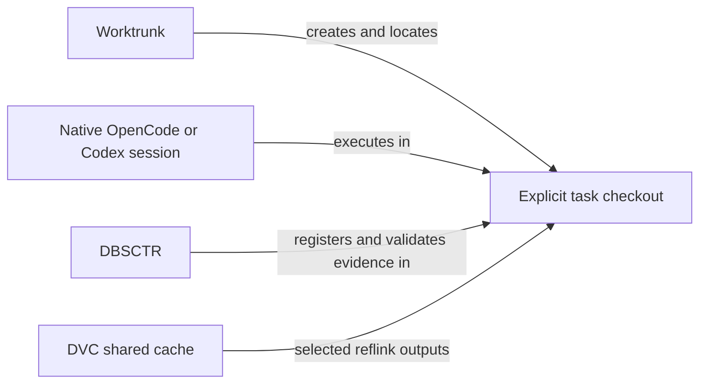

# Worktrunk-owned native workspaces

## Scope and authority

Owner: project maintainers. Context: dbsctr_v3_lifecycle, with the approved
OpenCode/Codex control-plane and dotfiles distribution downstreams. Risk: critical
because checkout ownership, authorization and retained data are affected.
Engineering Profile: `../PROFILE.md`. Status: revised source contract after
operator clarification; a fresh receipt/preflight and approval are required.
The earlier receipt is historical, not current implementation authority.
Delivery: source-only draft PR; live
cutover remains a separately qualified deployment. Applies to INT-022–INT-030 in
the OpenCode rolling-stable Initiative and its WORKTREE-BASELINE decision.
INT-031 established the interactive Initiative approval boundary. CHAT-APPROVED-BEGIN
extends only its consent transport with the explicit agent-confirmed path below.

This replaces allocation and transparent continuation, not the development gates.
Native Worktrunk manages Git worktrees; OpenCode and Codex own native sessions;
DVC owns versioned data; DBSCTR records and checks development evidence in the
explicit current checkout. No optional legacy allocation mode is permitted.

## Behavior

1. Given a task requiring writes, when Worktrunk creates its checkout, it uses a
   sibling `<primary>.worktrees/<sanitized-branch>` path. Existing paths cannot
   be clobbered and a sanitized-name collision fails visibly.
2. Given an independent writer, it uses a distinct task worktree. Neither native
   session selection nor lifecycle startup changes another checkout's branch.
3. Given a clean, explicit linked checkout, lifecycle registration records its
   repository, path, branch, base and HEAD without creating a worktree, changing
   directories, switching branches or assigning a hidden execution target.
4. Given the primary checkout, an unknown/unregistered directory, dirty initial
   state, incompatible base or unrelated ahead commits, registration refuses
   with an actionable explanation and preserves all files and refs.
5. Given unavailable Worktrunk, worktree management reports the dependency gap;
   no custom `git worktree add` fallback executes.
6. Given DVC metadata, a fresh worktree remains code-only. Explicit bootstrap
   points local cache configuration at the selected repository-scoped external
   cache and requires reflink, without pulling or populating datasets. Existing
   conflicting cache configuration or private cached data requires explicit
   migration, not overwrite or deletion.
7. Given a data task, targeted native DVC checkout/pull materializes only its
   requested targets. Shared cache contents remain immutable under workspace
   edits. Unsupported reflinks fail rather than silently allocating full copies.
8. Given completed work, preservation checks distinguish Git cleanliness from
   DVC durability and running processes. Removal uses Worktrunk only after
   operator authorization; it never garbage-collects the shared cache.
9. Given a historical cycle record, status/evidence inspection remains available.
   It does not reactivate the old allocator, routing or ownership-transfer engine.
   Active legacy work blocks its own cutover until separately reconciled.

## Interfaces and implementation boundaries

- Worktrunk user configuration owns the qualified path template
  `{{ repo_path }}.worktrees/{{ branch | sanitize }}`. Native list/switch/execute
  provide inventory, navigation and launch. No duplicate allocation wrapper or
  mutable worktree registry is introduced.
- Lifecycle begin/start interfaces become explicit-checkout CLI registration.
  Retire redundant custom DBSCTR tool wrappers and update skills coherently.
  Preserve existing Initiative
  receipt, applicability, Git/DVC evidence, gate and PR-delivery validation.
- CLI registration verifies the actual registered checkout and branch. Native
  session/message/call attribution is optional and unavailable unless independently
  verified; shell arguments or environment claims do not authenticate an actor.
  Root-level navigation sessions cannot claim a shell directory switch retargeted
  their native session. Native harness permissions/sandboxing govern execution.
  Return a native-worktree handoff when the primary checkout is selected.
- Retire custom allocator path selection, branch/worktree creation, direct
  cleanup allocation ownership and transparent file/shell path rewriting from
  supported new-work paths. Remove obsolete typed attach/bind/handover/recovery
  controls when their routing behavior is retired. Preserve ordinary tool
  permissions and existing data-loss checks; do not replace them with prompts
  that falsely claim native permission-policy enforcement.
- Keep historical record readers/schema support and precise unavailable results.
  Evidence paths in records are provenance only. Unknown versions fail closed.
- Keep specs, contracts, scoped QA, Gate Commits and protected-base draft delivery.
  Default-branch checkouts are not implementation targets. Do not adopt automatic
  Worktrunk merge/squash/rebase/deletion as a replacement for reviewed PRs.
- DVC bootstrap may be a narrow configuration adapter. It cannot create a second
  task-state machine, pull all data, share mutable DVC state/locks, copy ignored
  data wholesale or perform garbage collection. Cache selection is explicit and
  repository-scoped; relocation of current cache contents is out of scope.
- DVC-bearing checkout registration verifies the external cache selection and
  reflink-only configuration without hydrating data. Missing configuration gives
  an actionable bootstrap refusal, not an implicit private-cache default.
- `dbsctrctl workspace-remove-check --json` is a read-only eligibility check for
  Worktrunk's blocking managed user `pre-remove` hook. Reuse retained preservation
  checks for Git delivery, active cycles, DVC data and known running processes.
  No associated cycle is not itself an error; unmanaged task worktrees still need
  Git/data preservation checks. Missing/unclassifiable evidence refuses removal.
  Distinguish absent code-only outputs from modified or unique local outputs.
  Private cache data and unknown ignored user data require explicit disposition.
  The checker never removes a worktree, collects cache objects, changes branches
  or automatically terminates processes. Worktrunk performs the removal after
  the check and operator authorization. Hook bypass is not a supported agent path.
- Managed distribution declares Worktrunk and its configuration. Shell startup
  integration must use Worktrunk's supported mechanism. No implicit shell-file
  rewriting, hosted model invocation or production rollout during source delivery.
- Update active skill/agent guidance and affected tests in the same release group
  so no supported instructions still request the retired allocator or redirection.

## Transition and completion

### Both harnesses and native CLI permissions

Retire OpenCode's custom DBSCTR tool catalog and transparent continuation plugin,
and Codex's task continuation receipt/admission bridge. Retain native skills,
agent roles, provider affinity, managed state-root checks, signed updater behavior,
and independent history/identity hooks where still used. Dependency review must
separate Codex control-plane lifecycle hooks from its continuation executable;
they are not interchangeable. Codex Desktop is not newly managed by this change.

Both harnesses invoke the same CLI from an explicit task checkout. Preserve
gate validation and private evidence. Empty/unavailable native actor metadata is
valid for CLI execution and must not become a fake session, message or model.
Read-only/Plan roles retain native restrictions; standard Build does not acquire
an unrestricted permission profile to compensate for removed wrappers.

### Exact Initiative approval in the CLI

Operator decision: retain interactive CLI confirmation and add chat-approved
agent registration. Native shell approval remains a separate permission boundary;
supplied digests bind state but do not themselves constitute consent. This
applies to both supported harnesses and changes no actor-attribution authority.

`dbsctrctl begin ... --preflight` prepares the existing digest-bound launch plan
without creating a cycle or importing artifacts. The agent presents scope, risk,
delivery target and launch digest and asks for explicit approval of that plan.
After affirmative chat approval, Build may run registration in the selected
checkout with `--expected-launch-digest DIGEST --approval agent-confirmed`.
The flag records the caller's assertion that approval was obtained; the CLI
cannot independently verify the conversation. General continuation instructions,
shell grants and approvals of different/stale plans are insufficient.

Without that flag, the operator runs registration with the expected digest and
confirms in a terminal:

```text
BEGIN CYCLE_ID LAUNCH_DIGEST
```

Before prompting, validate the supplied receipt, plan, repository, checkout,
base and launch digest. Display the exact Initiative/slice, cycle, risk,
delivery target, relevant digests and proposed authority-import paths. Require
interactive stdin and an exact confirmation line in the default `interactive`
mode. Wrong input, EOF or noninteractive input refuses before cycle creation,
artifact import or checkout mutation. `agent-confirmed` does not read stdin and
is valid only for Initiative registration. No `--yes` or approval environment
variable is introduced. Agents must not create a pseudo-terminal or synthesize
operator input. Plan and subagents still cannot register cycles.

After confirmation, re-evaluate the same receipt, plan, repository, checkout,
HEAD, target base and import set. Any changed launch digest refuses and requires
a fresh preflight and confirmation. This check neither authenticates a native
session/message/call nor replaces native permissions. Do not introduce an
approval service, fork, MCP adapter or competing worktree registry.

New native Initiative records retain confirmation provenance in the same atomic
Cycle Record creation:

```json
{"initiative_approval":{"schema_version":1,"method":"interactive_cli","launch_digest":"<64 lowercase hex characters>","confirmed_at":"<UTC timestamp>"}}
```

For chat-approved launches only, `method` is `agent_confirmed`. Schema 1 otherwise
retains the same fields; no transcript, identity claim or chat text is stored.
This is deliberately reported consent, not cryptographic or independent proof.
Older helpers that only recognize `interactive_cli` cannot read new-method
records; deploy the CLI reader before enabling the new instructions. Rollback
must retain a compatible reader and never relabel existing approval history.

Native actor attribution remains unavailable. Existing approval history is not
rewritten into this new method. Read-only inspection/resumption of an already
registered, exactly matching cycle does not renew approval or require a second
registration. Passing `--resume-existing` when no record exists cannot bypass
confirmation. Ordinary non-Initiative registration gains no new interactive
requirement from this decision. Unavailable identity-dependent automation stays
explicitly unavailable rather than receiving an approval or actor bypass.

### In-place adoption

New-cycle registration stays clean-checkout-only. Adoption is a separate explicit
operator operation for an existing cycle: retain its path, identity, commits,
failed gates, evidence and dirty files. Require current Git membership, matching
cycle/checkout identity, a fresh state-bound preview and operator confirmation
that old writers and relevant operations are quiescent. Detect intervening changes
before applying. No implicit ownership claim from PID disappearance or timeout.

Retain original records and unresolved legacy operation evidence. Retirement of
old admission must not label unknown operations completed or erase their failure.
Adoption changes execution association, not task completion or prior approval
history. An interrupted transition must be recognizable and recoverable without
reapplying changes or deleting either preimage or dirty work.

Interface: `dbsctrctl workspace-adopt --cycle-id ID --preview --json` is read-only.
It reports eligibility, bounded reason codes, unresolved legacy-operation counts
and `state_digest`. The digest binds the Git common-directory/checkout identity,
branch, HEAD, original record bytes and relevant legacy admission rows. It is not
a snapshot of every dataset. Missing, malformed, busy or ambiguous state refuses.

Apply: `dbsctrctl workspace-adopt --cycle-id ID --expected-state DIGEST` requires
interactive operator confirmation of quiescence and retained uncertainty;
noninteractive execution refuses. Recheck the digest under the existing cycle
evidence lock immediately before applying. No automatic signaling, ownership
stealing or process termination is part of this command.

The authoritative mutation is one atomic Cycle Record replacement using existing
private-file/locking facilities. Before it, retain exact original bytes exclusively
at the common Git directory's private
`dbsctr/migrations/ID.RECORD_SHA256.native-before.json`. Fsync the backup before
record replacement. Backup plus unchanged record means not applied; a validated
new execution marker means applied. A conflicting backup or unverifiable marker
blocks. No separate persistent migration state machine is needed.

Add optional Cycle Record `execution` metadata (new records use schema 5;
adoption supports existing schemas 3, 4 and 5 without changing their schema number):

```json
{
  "schema_version": 1,
  "mode": "native_workspace",
  "origin": "registered",
  "attribution": {"status": "unavailable", "reason": "native_identity_not_collected"},
  "adoption": null
}
```

For adoption, origin is `adopted` and adoption contains `before_sha256`,
`state_digest` and the common-Git-directory-relative private `record_backup`
locator. Unknown versions or inconsistent origin/adoption fields refuse mutation.
Retain original runtime and created_by_dbsctr fields as historical provenance;
they no longer authorize native-workspace execution. Status/history consumers
distinguish historical actor data from current unavailable CLI attribution.
Gate failures, evidence and original Initiative approval are unchanged.

Legacy continuation rows remain retained evidence, not active native-workspace
authority. Retired mutation commands cannot reactivate them. New runtime helpers
refuse lifecycle writes to unadopted legacy cycles with `workspace_adoption_required`.
An adoption marker never proves an old operation succeeded. Subsequent work uses
the original active cycle in its existing checkout. Directory or data relocation
remains outside this operation. Renewed specification authority is separately
required when scope changed; adoption alone does not renew an Initiative receipt.
Schema-less, older or unknown records remain inspectable only where existing
readers support them; automatic adoption refuses with an explicit unsupported
schema reason. Inventory must establish coverage before any live rollout claim.

### Bounded launch-time busy check

One small native-launch supervisor may reserve the canonical checkout while its
managed foreground process runs, using an OS-released lock rather than stale PID
files. Concurrent managed launches for the same checkout refuse by default;
different checkouts remain independent. The guard never creates worktrees,
switches branches, changes session identity or admits individual tool operations.

An explicit operator override must not unlink or steal another launch's lock.
It must report bypass rather than exclusive ownership. Ordinary agents must not
silently request this override. Crash/restart tests must distinguish an exited
foreground client from background work that may still run. This is accident
prevention only: direct launches, native in-UI session changes and background
execution are outside its launch-only coverage. No writer-transfer state machine
is introduced.

Interface: `agent-worktree [--override-busy] -- opencode|codex [native arguments]`,
invoked in the selected checkout, including through Worktrunk's native `-x`.
Accept only the two supported harness commands, use argument vectors and preserve
native terminal I/O, exit status, environment and credential boundaries. Do not
rewrite session IDs or claim launch cwd equals a resumed session's execution
location. Help/version and non-session service operations are not task launches.

Use a checkout-specific nonblocking OS file lock beneath the private common Git
directory. Hold it while supervising the foreground process and release on exit.
Identify the checkout by its canonical Git administrative worktree directory,
not by branch name or a caller-supplied session label. Symlink aliases of one
checkout must share the same reservation; a branch change cannot create a new
reservation identity. Validate private lock paths and refuse symlink/ownership
ambiguity instead of following unsafe state.
Forward termination to the owned child without killing unrelated processes;
preserve ordinary interactive interrupt behavior. Diagnostics stay local and
bounded. PID text alone does not establish ownership or quiescence.
Noninteractive override refuses; interactive override requires explicit operator
confirmation and leaves any existing holder's lock intact. Report bypass without
claiming exclusivity. Never unlink another launch's lock file. The guard is
accident prevention, not an adversarial access-control boundary.

Historical contracts remain evidence, not the target implementation. Record the
specific keep/replace/retire decisions in the changelog. Do not silently rewrite
unfinished active-worktree-relocation authority or existing cycle records.

Completion requires every supported new-work entry point to use native
Worktrunk creation followed by lifecycle registration in the selected checkout.
No supported new-work path invokes the legacy allocator, creates a second
worktree, silently hydrates DVC data or redirects native session file operations.
An implementation finding that changes these contracts reopens readiness.

## Validation and gates

Reuse repository pytest/Bun/chezmoi authorities and native disposable fixtures.
Require failing-before/passing-after registration and routing regressions;
missing dependency, occupied path, primary-root refusal, native-location mismatch,
dirty checkout, unrelated commits, malformed records and failed DVC bootstrap
must leave original work intact. Exercise source adapters as well as helpers.
Test that ordinary new-cycle startup never invokes old allocation/redirect code.
Verify retained evidence, gate order and PR delivery on a native task checkout.

Existing isolated DVC and V2 API checks are supporting evidence, not deployment
qualification. Worktrunk 0.80.0 host creation, linked-root naming, collision
refusal, code-only checkout and execution cwd have passed native checks.
Actual UI interaction, guest platforms, historical migration and physical space
growth belong to later rollout qualification and cannot be reported as passed.

Add both-harness CLI regression tests: allowed and denied native shell actions,
truthful missing attribution, session-location behavior, retained gate failures,
and absence of redundant tool/receipt dependencies. Adoption tests cover dirty
work, stale preview, interrupted transition, uncertain legacy operations and
unchanged original cycle IDs. Busy-check tests cover simultaneous starts, separate
worktrees, process exit, signal handling and explicit override without lock theft.

Initiative approval checks cover read-only preflight, exact interactive input,
agent-confirmed registration without stdin or identity claims, retained approval
on resume, rejection outside Initiative registration, and mandatory launch digests;
noninteractive/wrong-input/EOF refusal, stale digests before and after prompting,
missing-record resume attempts, unchanged historical approval, atomic confirmation
provenance, and no cycle/artifact writes on refusal. Validate native shell
permissions separately; a mocked terminal in a test is not operator approval.

All Development Kernel gates, Review/Integrate and Maintain/Retire are required.
Release, Deploy and Operate are not applicable to this source-only delivery;
their rollout obligations remain explicitly open. No Gate Exceptions.

## Visual Evidence

| Concern | Decision |
| --- | --- |
| Boundary | Required: ownership flow below |
| Interaction | Required: Initiative approval handoff table below |
| State | Required: adoption transition table below; lifecycle gates are unchanged |
| Data/trust | Not applicable: cache immutability and explicit boundaries specified above |
| Schema | Not applicable: optional execution and approval metadata are specified inline; no relational schema change |
| Dependency/deployment | Not applicable: source-only; downstream rollout remains separate |
| Quantitative | Not applicable: no storage savings forecast or performance threshold claimed |

| Step | Owner | Guard and outcome |
| --- | --- | --- |
| Preflight | CLI, invoked by agent or operator | Validate fresh authority; return launch digest; create no cycle |
| Present | Agent | Show exact scope/risk/target/digest and ask for explicit chat approval or prepare operator command |
| Confirm | Operator in terminal or Build after explicit chat approval | Default exact `BEGIN` or `--approval agent-confirmed`; provenance distinguishes both |
| Recheck | CLI | Any authority, checkout or target change refuses and returns to preflight |
| Register | CLI | Atomically retain confirmation provenance in new record; native actor remains unavailable |
| Resume | Agent in native checkout | Use original cycle and preserved gates; no implied renewed approval |

Text Equivalent: the agent prepares preflight and presents the exact plan. The
operator confirms in chat and Build declares agent-confirmed consent, or the
operator confirms the digest interactively in the terminal. The
CLI rechecks authority before creating the record; changed state requires a new
preflight. The agent then resumes that cycle. Source: the approval contract above;
owner: project maintainers; update trigger: any approval or handoff change.



Text Equivalent: Worktrunk creates/locates the task checkout. Native OpenCode or Codex
executes there. DBSCTR registers the checkout and validates its evidence. DVC
provides only selected outputs through reflinks from a shared cache. No component
redirects a root session or maintains a competing allocator. Source: this contract;
owner: project maintainers; update trigger: any ownership or interface change.

| Observed adoption state | Allowed action | Result |
| --- | --- | --- |
| Legacy record, no preimage | Preview; apply with fresh digest and operator confirmation | Preserve preimage, atomically mark native execution |
| Valid preimage, unchanged legacy record | Fresh preview and confirmed retry | Reuse matching preimage; never overwrite it |
| Valid native execution marker | Inspect/resume original cycle | No repeated adoption or gate reset |
| Changed identity/digest, malformed state or conflicting preimage | Inspect and resolve | Refuse mutation; preserve all evidence and work |

Text Equivalent: adoption switches one record atomically only after retaining its
preimage. An interrupted pre-commit attempt leaves legacy behavior; a committed
marker identifies completion. Conflicting state refuses. No task-completion or
operation-success state is inferred. Source/owner: this contract/project maintainers;
update whenever adoption persistence or recovery semantics change.
