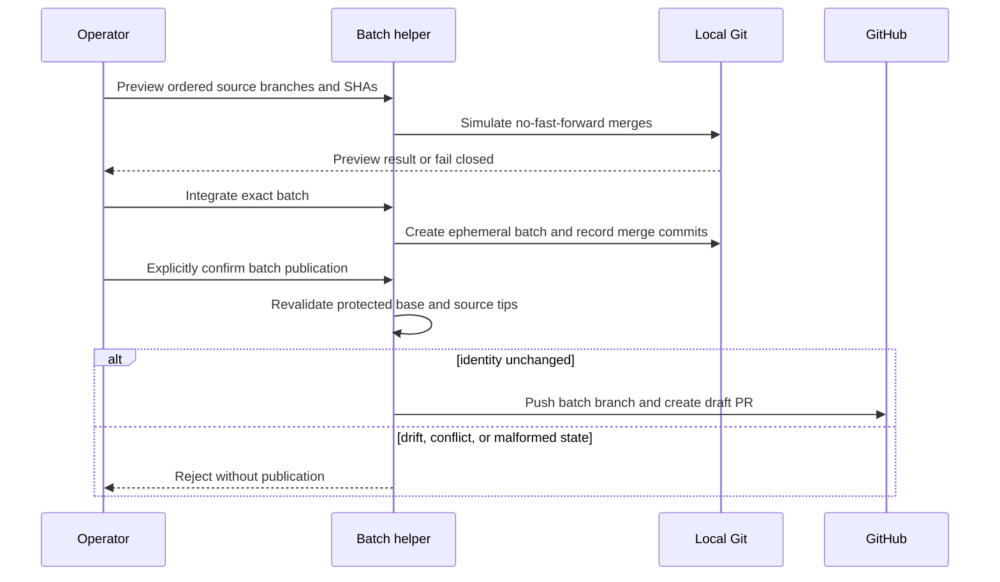
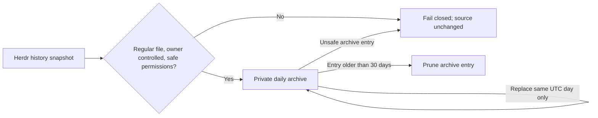

# DAI-020 Final Integration

## Cycle Profile

| Field | Value |
|---|---|
| Risk | Elevated: guarded branch integration, claim promotion, and private terminal-history retention |
| Delivery intent | Merge and deploy operator-controlled batch integration and local history maintenance after affected gates pass |
| Scope | Ephemeral `rnd/batch/<batch-id>` integration, P2/P3 promotion, `/dbsctr-integrate`, and local Herdr pane-history retention |
| Authority | Hermes may preview and integrate batch branches; only an explicit operator action may promote claims or publish a validated batch for review |

## Batch Integration And Promotion

- A batch is an ephemeral `rnd/batch/<batch-id>` branch created from a fetched
  `origin/main` SHA. Its private Git state records that base and each ordered
  source branch and SHA; malformed identifiers, source drift, duplicate sources,
  dirty worktrees, missing remotes, and conflicts fail closed.
- Given completed DBSCTR feature branches, an integration preview performs their
  ordered no-fast-forward merges without changing a durable branch. Integration
  performs the same merges on the batch branch and records each merge commit.
  Hermes may preview and integrate but never promotes a batch.
- Given an integrated batch whose recorded sources and protected base have not
  drifted, an operator may explicitly confirm that exact batch identifier and
  push its batch branch for normal draft-pull-request review. Publication never
  writes directly to `main`, force-pushes, marks a pull request ready, or merges it.
- Given a P2/P3 claim is still exactly `claimed`, an operator may explicitly
  confirm its worker identifier to atomically promote it to P1 and `discovery`.
  Promotion neither launches nor resumes a worker and cannot rewrite P0/P1,
  terminal, malformed, or already-active claims.
- `/dbsctr-integrate` exposes guarded preview, integration, claim-promotion, and
  batch-publication operations. It never treats automation or Hermes as the human
  confirmation required for promotion.

## Local Pane History

- Herdr pane history is enabled locally with a 10 MB scrollback bound. Daily
  maintenance copies only an owner-controlled regular history snapshot into a
  private local archive, keeps at most one snapshot per UTC day, and removes
  snapshots older than 30 days.
- Missing history is a no-op. Symlinks, foreign ownership, unsafe permissions,
  invalid archive entries, or copy/prune failures fail closed without changing
  the source snapshot; DBSCTR worktree cleanup still runs and the maintenance
  command reports aggregate failure.

## Validation

- Synthetic Git repositories prove no-fast-forward merges, ephemeral previews,
  duplicate rejection, exact recorded tips, and confirmation guards.
- Private-ledger fixtures prove atomic P2/P3 promotion and invalid-state rejection.
- Filesystem fixtures prove owner-only archives, symlink rejection, UTC-day
  replacement, and 30-day pruning. Full repository tests cover rendered config.

## Visual Evidence

| Concern | Decision | Review question | Canonical source | Owner/change trigger |
|---|---|---|---|---|
| Boundary | not_applicable: this feature remains within Git, the private ledger, and local history boundaries defined by the context README | - | Cycle Profile | Distribution owner |
| Interaction | required: guarded batch-publication sequence | Which checks and authority transitions precede publication? | Batch Integration And Promotion | Distribution owner; batch ordering or approval changes |
| State | required: guarded batch-publication sequence | Which failed checks stop mutation? | Batch Integration And Promotion | Distribution owner; batch state changes |
| Data/trust | required: private history archive flow | Which checks precede copying and pruning private terminal history? | Local Pane History | Distribution owner; archive trust or retention changes |
| Schema | not_applicable: private batch and claim schemas remain helper contracts | - | Context README interfaces | Distribution owner |
| Dependency/deployment | not_applicable: no new runtime topology is introduced | - | Cycle Profile | Distribution owner |
| Quantitative | not_applicable: 10 MB and 30-day limits are fixed invariants rather than comparative evidence | - | Local Pane History | Distribution owner |

**Text Equivalent:** Preview simulates ordered no-fast-forward merges without a
durable branch. Integration creates an ephemeral batch and records exact merge
commits. Publication requires explicit operator confirmation and revalidates the
protected base and every source tip; drift, conflict, or malformed state stops
without publication. Success pushes only the batch branch and creates a draft
pull request. The distribution owner updates this view when batch checks,
ordering, or publication authority changes.

**Text Equivalent:** Daily maintenance reads only an owner-controlled regular
history snapshot with safe permissions. It writes at most one private snapshot
per UTC day, may replace only that day's archive, and removes archive entries
older than 30 days. Unsafe source or archive identity, symlinks, ownership,
permissions, copy errors, or prune errors fail closed without changing the source.
The distribution owner updates this view when archive trust, identity, or
retention rules change.
