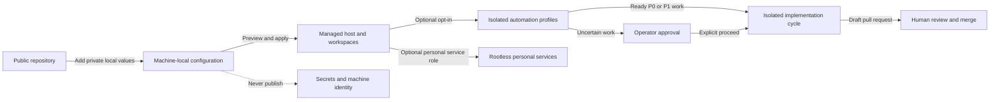

# dotfiles-ai Product Intent

## Users And Outcomes

Developers should be able to install one public configuration repository and
receive a working DBSCTR, OpenCode, Herdr, and opt-in Hermes R&D orchestration
environment without adopting the maintainer's personal paths, account
identifiers, or secrets.

The maintainer must be able to migrate an existing installation without losing
working configuration or allowing two chezmoi repositories to own the same
target files.

## Core Journeys

1. A developer copies the documented local TOML example, supplies machine-local
   values, initializes the independent chezmoi source, previews, and applies it.
2. OpenCode loads the managed control plane and DBSCTR tools from complete,
   rendered configuration.
3. Herdr runs on macOS with optional 1Password integration; absence of
   1Password never blocks Herdr or shell startup.
4. An existing user verifies parity, transfers ownership, and can roll back
   without deleting live configuration.
5. A developer opts into Hermes orchestration and receives continuous independent
   full-history lenses, including one dedicated review-session governance lens.
6. Evidence-ready noncritical workers may reach draft pull requests unattended;
   the operator uses Herdr for critical or uncertain sessions and manually reviews
   every resulting pull request.
7. An opted-in operator receives bounded CLI/JSON evidence about merged
   improvement effects while private runtime state conservatively adjusts worker
   cadence without changing source configuration or granting workers delivery
   authority.
8. An operator enters a client-specific Fedora VM, reattaches to persistent VM
   Herdr panes, and runs auto-approved OpenCode against only declared host paths.
9. Host R&D reviews sanitized evidence from all host and VM histories and hands
   ready implementation to a visible configured-workspace Build session without
   moving databases or credentials across trust boundaries.
10. An opted-in developer reaches each managed VM from authorized tailnet hosts
    with native Herdr remote attach while public configuration remains free of
    peer identity, policy, and enrollment secrets.
11. A developer or teammate keeps coherent automatic Gate Commits on an isolated
    feature branch and submits a draft pull request into the configured `main`
    branch; automation never commits or pushes cycle work directly to `main`.
12. P0/P1 claims enter autonomous Discovery when every material question is
    resolved and produce only an isolated implementation draft for review; P2/P3
    wait for promotion, and uncertain claims wait for the operator.
13. An operator combines completed feature branches on an ephemeral batch branch,
    reviews the exact merge commits, and explicitly publishes the batch for normal
    pull-request review without granting Hermes authority over `main`.
14. An operator can inspect bounded local Herdr pane history for the prior 30 days
    without publishing terminal content or weakening filesystem ownership checks.
15. An operator may select one personal Fedora workspace to remain available for
    rootless services while client-specific containers stay inside their client
    workspaces; project files never need to enter the service container.

## Visual Evidence

| Concern | Decision | Review question | Canonical source | Owner/change trigger |
|---|---|---|---|---|
| Boundary | required: product journey boundary flowchart | Where does the operator cross from portable setup into isolated automation and governed delivery? | Core Journeys and context README architecture | Product owner; journey or trust-boundary changes |
| Interaction | not_applicable: detailed approval ordering is canonical in the context README sequence | - | Context README Visual Evidence | Distribution owner |
| State | not_applicable: product outcomes do not define a separate state machine | - | Core Journeys | Product owner |
| Data/trust | required: product journey boundary flowchart | Which outcomes must preserve local identity and secrets? | Constraints And Trust | Product owner; privacy outcome changes |
| Schema | not_applicable: Product Intent owns outcomes rather than configuration schema | - | Context README contracts | Distribution owner |
| Dependency/deployment | not_applicable: deployment topology is canonical in the context README | - | Context README Visual Evidence | Distribution owner |
| Quantitative | not_applicable: success is verified by invariants and runtime checks, not a comparative dataset | - | Success Evidence | Product owner |

V3.35 corrects the orchestration name without changing a product journey or trust
boundary. The existing journey view and Text Equivalent remain current.

**Text Equivalent:** Public defaults become usable only after private local
values are supplied. Applying them creates managed host and workspace
environments; automation remains optional and isolated. Evidence-ready
P0/P1 Discovery may proceed automatically when evidence resolves every material
question, while uncertain work waits for the operator. Delivery ends at a draft pull request for human
review. One personal workspace may separately host rootless services without
mounting project files into those containers. Secrets and machine identity never
enter the public repository.
The product owner updates this view when a core journey, privacy boundary, or
approval outcome changes.

## Constraints And Trust

- Public Git history contains no credentials or machine-local identifiers.
- Tailnet policy, tags, peer names, and enrollment credentials remain external
  private state; shared Tailscale defaults are disabled.
- The real local TOML remains outside the Git checkout.
- macOS is the initial supported platform.
- Fedora Linux is supported only inside managed Lima client VMs; it is not a
  general standalone-host commitment.
- Existing personal configuration remains authoritative until live cutover
  validation passes.
- The writable source path is machine-local and never a public default or
  general navigation allowlist.
- Hermes owns scheduling, Kanban, and delegation; Herdr owns optional terminal
  presentation; OpenCode owns implementation; the DBSCTR ledger owns lifecycle
  coordination and approval state.
- Each lens has independent monthly-to-immediate cadence and one active review
  attempt; repeated systemic failures halt dispatch and require manual reset.
- Private session, project, and repository provenance never appears in public
  findings, branches, documentation, or pull requests.

## Success Evidence

- Isolated rendering passes with and without optional 1Password values.
- OpenCode resolves the expected agents, commands, skills, and DBSCTR tools.
- Herdr configuration and LaunchAgent plists parse and run without embedded
  credentials.
- Personal and `dotfiles-ai` chezmoi managed-target sets do not overlap after
  cutover.
- Enabled and disabled Hermes profiles, backlog mirrors, Herdr attachment, and
  review jobs are repeatable; materially uncertain Discovery pauses for input.
- Concurrent workers claim distinct opportunities durably, recover exact
  sessions without duplicate work, and cannot merge their draft pull requests.
- Every claim carries P0-P3 priority and candidate kind; feature claims carry a
  measurement plan. Worker/opportunity-bound readiness backed by that worker's
  successful lens manifest may advance P0/P1 to a review-only draft, while P2/P3,
  unsupported evidence, and materially uncertain work remain visible.
- Confirmed P2/P3 promotion atomically enters Discovery; batch previews and
  integration retain exact source SHAs while batch publication remains an
  explicit operator action and `main` remains pull-request protected.
- Herdr scrollback is bounded to 10 MB and private daily snapshots older than 30
  days are pruned without following symlinks or changing source history.
- A cycle started from `main` creates an isolated feature branch, while a cycle
  started in a dedicated clean teammate worktree may retain that feature branch;
  both publish only a draft pull request into configured `main`.
- Monthly cadence decisions are reproducible from sanitized evidence, preserve
  the human Discovery and delivery boundaries, and fail closed on malformed
  authoritative state.
- Client mounts, protected submodules, VM identity, restored auto-approved
  sessions, bounded federated evidence, and guest configuration revisions are
  verified on the real Lima runtime before sandbox deployment passes.
- Disabled Tailscale rendering, secret-safe one-off enrollment, direct SSH, and
  cross-host Herdr reattachment are verified before tailnet deployment passes.
