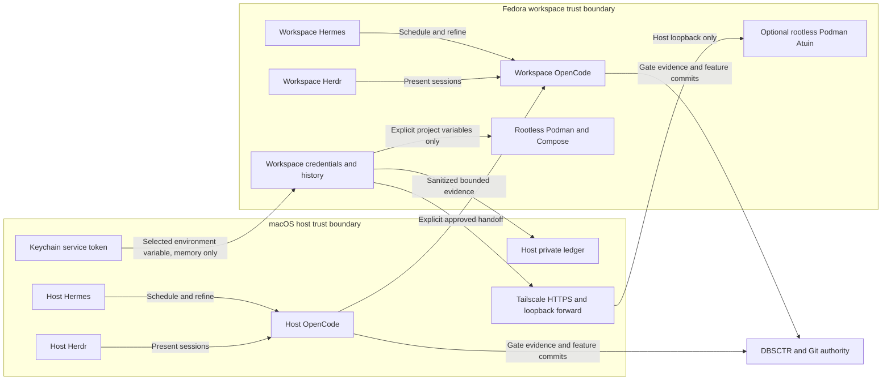
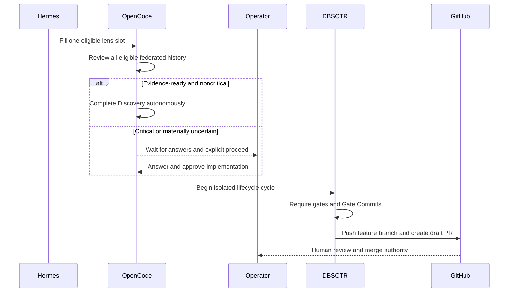

# dotfiles-ai Distribution

**Status:** DAI-021 continuous per-lens R&D delivered; DAI-004-F1 and DAI-012-F1 pending

## Engineering Profile

| Field | Value |
|---|---|
| Deliverable | Public standalone chezmoi source for DBSCTR, OpenCode, Herdr, and opt-in Hermes R&D orchestration |
| Languages/frameworks | Go templates, TOML, JSON, Markdown, Python, Bash, launchd plist |
| Modules | Python, Security, Cloud |
| Runtime/platform support | Apple Silicon macOS host; Fedora 44 aarch64 Lima guests on VZ; chezmoi; OpenCode; Herdr; launchd; Python `>=3.12` tests |
| Public compatibility | Stable local TOML keys and managed target paths; sanitized defaults |
| Trust/data classification | Public configuration; credentials and machine identifiers remain local |
| Operational owner | Project maintainers own releases, compatibility, and migration guidance |
| Product Intent | `docs/specs/dotfiles_ai_distribution/PRODUCT.md` |

### DAI-005 Cycle Overrides

| Field | Value |
|---|---|
| Risk | Elevated: replaces a live autonomous supervisor and permanently retires its runtime |
| Delivery intent | Deploy native launchd/OpenCode automation locally after affected gates pass |
| Scope | Opt-in scheduling, fresh worker spawning, exact-session recovery, provider-affine Build identities, Hermes retirement, and operator guidance |
| Overrides | Shared scheduling defaults remain disabled; this machine enables them locally; merge, release, and deployment remain human-controlled |

### DAI-004 Cycle Overrides

| Field | Value |
|---|---|
| Risk | Elevated: private analytics automatically controls local worker cadence |
| Delivery intent | Merge and deploy analytics, scheduler state, runner behavior, and operator commands locally |
| Scope | CLI/JSON effect summaries, monthly cadence ladder, concurrency cap, safety halt, and manual reset |
| Overrides | User TOML remains unchanged; cost is report-only; ordinary workers retain draft-only delivery and human Discovery |

### DAI-006 Cycle Overrides

| Field | Value |
|---|---|
| Risk | Elevated: changes recovery and health behavior for live autonomous workers |
| Delivery intent | Deploy the corrected runner locally after affected gates pass |
| Scope | Large-session recovery readiness, watchdog exit health, operator guidance, and one blocked-worker recovery |
| Overrides | Session identity remains exact; recovery may not weaken ambiguity rejection or inject a prompt |

### DAI-007 Cycle Overrides

| Field | Value |
|---|---|
| Risk | Elevated: creates filesystem and credential boundaries around unrestricted AI execution and migrates live repository paths |
| Delivery intent | Merge and deploy two local Fedora Lima client environments, host controls, and federated R&D transport |
| Scope | Two locally named VM profiles, VM Herdr, always-auto OpenCode, explicit mounts, protected submodules, host review federation, and configured implementation handoff |
| Overrides | Host OpenCode, Herdr, database, scheduling, and private ledger remain authoritative; VM credentials and databases remain isolated; egress is unrestricted by accepted design |

### DAI-008 Cycle Overrides

| Field | Value |
|---|---|
| Risk | Elevated: migrates public configuration and VM filesystem security contracts |
| Delivery intent | Deploy dynamic local workspace configuration after all gates pass |
| Scope | Arbitrary workspace names, mount mappings and access, optional Git protection and references, dynamic federation, and configured Build handoff |
| Overrides | Existing instance names and paths remain machine-local; schema version 2 intentionally replaces fixed keys without compatibility aliases |

### DAI-009 Cycle Overrides

| Field | Value |
|---|---|
| Risk | Elevated: extends the public machine-local workspace schema and manages executable command aliases |
| Delivery intent | Deploy dynamic workspace shell aliases locally after all gates pass |
| Scope | Optional per-workspace shell aliases, safe command reconciliation, invocation routing, tests, and operator guidance |
| Overrides | Alias names remain machine-local; existing files are never overwritten; schema version 3 replaces generated version 2 configuration on apply |

### DAI-010 Cycle Overrides

| Field | Value |
|---|---|
| Risk | Elevated: changes interactive guest startup and the OpenCode UI loaded by running sandbox environments |
| Delivery intent | Deploy portable terminal and OpenCode visual parity to every configured workspace |
| Scope | Explicit OpenCode theme, checksum-pinned Starship, guest-only Bash startup, personal Starship configuration, tests, and operator guidance |
| Overrides | Visual and startup parity is portable; macOS paths, Homebrew integrations, credentials, and workstation-only shell plugins remain host-only |

### DAI-011 Cycle Overrides

| Field | Value |
|---|---|
| Risk | Elevated: changes the live autonomous review data path and private history evidence retained on three runtimes |
| Delivery intent | Deploy reliable federated review and prove one controlled scheduled worker locally |
| Scope | Concurrent source capture, capture-backed continuation, typed-tool runtime normalization, regression coverage, live three-source validation, and explicit worker cleanup |
| Overrides | Federation has no aggregate adapter timeout; each source command retains its 120-second deadline and output bound; launch, Discovery, and delivery authority remain unchanged |

### DAI-013 Cycle Overrides

| Field | Value |
|---|---|
| Risk | Elevated: changes interactive shell history and deploys a network-synchronized client to every managed guest |
| Delivery intent | Deploy durable Atuin history to every configured Lima workspace |
| Scope | Checksum-pinned Atuin installation, guest-only non-secret configuration, Bash initialization, tests, and live validation in both configured workspaces |
| Overrides | Login and encryption keys remain local to each VM; one login is required after creating or rebuilding a VM |

### DAI-014 Cycle Overrides

| Field | Value |
|---|---|
| Risk | Elevated: changes every configured workspace alias and repairs interactive prompt/history hooks |
| Delivery intent | Deploy direct guest Herdr entry and compatible Atuin/Starship startup |
| Scope | Alias default routing, checksum-pinned Bash preexec support, prompt/history regression tests, and live workspace validation |
| Overrides | An alias with explicit arguments preserves them; direct `sandbox-vm shell` keeps the ordinary shell default |

### DAI-015 Cycle Overrides

| Field | Value |
|---|---|
| Risk | Elevated: enrolls isolated guests in an external identity network and exposes policy-controlled SSH |
| Delivery intent | Deploy optional Tailscale access to every configured Lima workspace and validate native remote Herdr |
| Scope | Default-off local TOML, checksum-pinned rootless Linux client, stdin-only one-off enrollment, Tailscale SSH, tests, and live two-workspace validation |
| Overrides | Public defaults and teammate configurations remain off; peer names derive from machine-local Lima identity; keys, tags, account identities, and tailnet policy never enter Git or rendered configuration |

The completed DAI-015 cycle-start applicability plan is retained for provenance
at [`_archive/DAI-015.plan.json`](_archive/DAI-015.plan.json); this README,
BACKLOG, and CHANGELOG own final results.

### DAI-016 Cycle Overrides

| Field | Value |
|---|---|
| Risk | Elevated: replaces live autonomous scheduling, introduces profile-local AI state in three trust environments, and automates guarded worktree deletion |
| Delivery intent | Deploy Hermes-first orchestration to the host and configured Lima workspaces after controlled cutover evidence |
| Scope | Hermes bootstrap and profiles, canonical backlog mirroring, Kanban refinement, direct resumable OpenCode Discovery, global completed-worktree maintenance, Herdr ownership repair, and native scheduler retirement |
| Overrides | Hermes owns orchestration only; DBSCTR remains lifecycle authority; generated skills and raw context stay profile-local; updates are manual; no disk-space gate, messaging integration, automatic Discovery answer, merge, release, or deploy |

### DAI-016-F1 Cycle Overrides

| Field | Value |
|---|---|
| Risk | Elevated: repairs live autonomous dispatch and proves it with a controlled real worker run |
| Delivery intent | Deploy the corrected runner locally and manually trigger one Hermes R&D pass after affected gates pass |
| Scope | Plugin-free OpenCode session discovery, argparse-safe supervisor launch, bounded cleanup, host history capture timeout, subprocess E2E coverage, and live round evidence |
| Overrides | Session identity remains exact; the E2E harness uses executable fakes, while operational proof requires Hermes to register one real native OpenCode session |

The completed DAI-016-F1 applicability plan is retained at
[`_archive/DAI-016-F1.plan.json`](_archive/DAI-016-F1.plan.json).

### DAI-020 Cycle Overrides

| Field | Value |
|---|---|
| Risk | Elevated: publishes guarded integration branches, advances selected queued claims, and retains private terminal history |
| Delivery intent | Merge and deploy operator-controlled batch integration, explicit promotion, and local history maintenance |
| Scope | Exact-SHA batch preview/integration, confirmed draft-PR publication, P2/P3 promotion, and owner-safe 30-day pane-history retention |
| Overrides | Hermes may preview and integrate but cannot confirm promotion or publication; no direct `main` write, force push, automatic launch, or public terminal history |

### DAI-021 Cycle Overrides

| Field | Value |
|---|---|
| Risk | Elevated: continuously dispatches parallel AI review and permits evidence-ready noncritical claims to reach draft pull requests autonomously |
| Delivery intent | Deploy per-lens scheduling, review-session attribution, telemetry, and five-minute Hermes fill operation locally after affected gates pass |
| Scope | Six source-controlled lenses, one lens per worker, all-source full-history review, per-lens yield/backoff, autonomous noncritical Discovery, and lens-governance telemetry |
| Overrides | Only `review_session_governance` may review prior autonomous review sessions; P0 or materially uncertain work blocks; Git merge, readiness, release, and deployment remain human-controlled |

### Provider-Native Evaluation Initiative Overrides

| Field | Value |
|---|---|
| Risk | Elevated: persists new private cross-source cycle projections and evaluates provider harness outcomes |
| Delivery intent | Define contracts on deployed DAI-011 commit `c24f7e5`; implement only after lifecycle and control-plane identity contracts pass |
| Scope | Existing weekly worker, immutable source captures, dedicated five-cycle report persistence, replay, retention, and operational evidence |
| Overrides | Keep weekly unhalted cadence; no second scheduler, source rescan, host-history cohort save, automatic tuning, or guest-to-host PR outcome bridge |

### DAI-023 Cycle Overrides

| Field | Value |
|---|---|
| Risk | Elevated: changes the storage root for sensitive Lima VM state |
| Delivery intent | Add an opt-in machine-local Lima home without changing teammate defaults |
| Scope | Sandbox configuration rendering, controller environment, validation, deployment, and rollback |
| Overrides | Empty shared default preserves native Lima behavior; configured homes must be absolute and are inherited by every controller-owned Lima command |

### DAI-024 Cycle Overrides

| Field | Value |
|---|---|
| Risk | Elevated: migrates live encrypted history service state and changes its VM, container runtime, startup, and loopback ingress |
| Delivery intent | Deploy rootless Podman Atuin to the selected personal Fedora workspace, retain stopped Colima rollback, and deliver a draft pull request |
| Scope | One machine-local Atuin workspace selector, private Lima forwarding, rootless Quadlet and named volume, external-home-aware guarded startup, cold migration, health/sync validation, and rollback |
| Overrides | Shared defaults select no server; exactly one configured workspace may be selected; public endpoint and client identity remain unchanged; Colima remains installed and retained until a later explicit retirement |

### DAI-025 Cycle Overrides

| Field | Value |
|---|---|
| Risk | Elevated: changes interactive renewal of organization-controlled Vertex user credentials |
| Delivery intent | Deploy the corrected helper locally and deliver a draft pull request |
| Scope | Hosted OAuth callback, configured-account validation, isolated ADC, regression coverage, and local verification |
| Overrides | Reauthentication requires one authorization-code copy/paste; no localhost callback or automatic browser launch is permitted |

### DAI-028 Cycle Overrides

| Field | Value |
|---|---|
| Risk | Elevated: forwards a reusable 1Password bearer token into auto-approved guest-user environments and changes every managed guest container runtime |
| Delivery intent | Deploy Podman development tooling, in-memory 1Password access, and isolated Vertex renewal to both configured Lima workspaces |
| Scope | Rootless Podman, pinned Docker Compose v2 provider, guest `docker` compatibility shim, Keychain-to-guest token forwarding, guest 1Password CLI, guest-local Vertex ADC, tests, migration, health, and rollback |
| Overrides | Colima remains a stopped compatibility fallback; guests receive the existing service-account scope by explicit operator decision; containers receive neither the service token nor Vertex ADC unless a project maps them explicitly |

## Bounded Context

`dotfiles_ai_distribution` owns portable defaults, local configuration shape,
rendered targets, installation, migration, rollback, and maintenance for the
DBSCTR/OpenCode/Herdr workbench. Adjacent contexts own lifecycle semantics,
OpenCode control-plane behavior, and shell authentication.

## Visual Evidence

| Concern | Decision | Review question | Canonical source | Owner/change trigger |
|---|---|---|---|---|
| Boundary | required: host/workspace trust flowchart | Which runtime owns orchestration, implementation, presentation, lifecycle, and credentials? | Bounded Context and Constraints in PRODUCT.md | Distribution owner; runtime or trust boundary changes |
| Interaction | required: approval-handoff sequence | Where must automation stop for human authority? | Autonomous R&D Worker and Collaborative Git Delivery | Distribution owner; approval or delivery flow changes |
| State | not_applicable: claim and cycle states are authoritative in the lifecycle specification | - | `dbsctr_v3_lifecycle` | Lifecycle owner |
| Data/trust | required: host/workspace trust flowchart | What may cross VM and host boundaries? | Federated Host R&D contracts | Distribution owner; federation changes |
| Schema | not_applicable: TOML and generated schema contracts remain authoritative text and tests | - | Interfaces And Contracts | Distribution owner |
| Dependency/deployment | required: host/workspace trust flowchart | Which managed components run on host and guests? | Engineering Profile and workspace contracts | Distribution owner; topology changes |
| Quantitative | not_applicable: limits such as retention and worker caps are independent invariants, not comparative evidence | - | Contracts and PRODUCT success evidence | Distribution owner |

DAI-024 adds the optional personal Atuin service and host loopback ingress shown
below. It does not change approval or delivery handoff, so the existing sequence
and its Text Equivalent remain current.

**Text Equivalent:** Host and workspace profiles have independent Hermes,
OpenCode, Herdr, history, and private state. Herdr presents sessions
but does not own lifecycle state. Only bounded sanitized evidence crosses from a
workspace to host review; only an explicitly approved implementation handoff
crosses from host to workspace. Both OpenCode runtimes produce feature-branch
evidence governed by DBSCTR and Git. The host may forward its Keychain-backed
1Password service token to a workspace shell as one environment value without
writing it to guest storage. Every workspace runs rootless Podman with a pinned
Docker Compose provider; containers receive only project variables explicitly
mapped by Compose. One machine-local workspace may additionally
host rootless Podman Atuin. Every client sends encrypted records through the
unchanged tailnet HTTPS endpoint; macOS forwards only from loopback, and the Atuin
container receives no project filesystem mount.

**Text Equivalent:** Hermes continuously fills eligible lens slots. OpenCode
reviews all eligible federated history and may complete Discovery without a
prompt only when evidence resolves every material question and risk is not
critical. Critical or materially uncertain work waits for explicit operator
approval. DBSCTR still requires an isolated gated cycle and can publish only a
feature branch with a draft pull request; the operator retains merge authority.

## Goals

- Reproduce the maintainer's working AI development configuration without
  committing machine-local identifiers or secrets.
- Keep optional 1Password integration fail-open for Herdr startup.
- Provide machine-local opt-in Hermes scheduling, context-isolated backlog
  refinement, and resumable OpenCode R&D workers.
- Review sanitized global history continuously, autonomously resolve bounded
  noncritical Discovery, and create only human-merge draft pull requests for this source.
- Keep automatic Gate Commits on feature branches and require draft pull requests
  into configured `main` for ordinary and autonomous DBSCTR delivery.

## Non-goals

- Installing OpenCode, Herdr, provider credentials, or unrelated developer tools;
  DAI-016 installs Hermes only when orchestration is explicitly enabled.
- Treating launchd, Herdr, or OpenCode status as DBSCTR lifecycle authority.
- Modifying repositories observed in global OpenCode history.
- Guessing unresolved Discovery answers or autonomously handling critical risk.
- Automatically merging, marking ready, releasing, or deploying.
- Supporting Windows.
- Supporting Linux as a general-purpose host; Fedora is supported only as the
  managed Lima guest runtime.

## Behavior

### Installation And Opt-in Scheduling

- Given a valid local TOML, when the source renders and applies, then complete
  OpenCode, DBSCTR, and Herdr targets contain no personal identifiers.
- Given `[data.dotfiles_ai.rnd].enabled=false`, when the source applies, then no
  Hermes profile, schedule, or worker is created and durable DBSCTR state remains.
- Given scheduling is enabled, when the source applies, then the host system
  profile and enabled workspace profiles use independent Hermes homes, credentials,
  skills, sessions, logs, cron state, and Kanban roots.
- Host OpenAI Codex authentication never crosses into a guest. Client and personal
  authenticate separately inside their own VM trust boundary.
- Hermes updates are manual. `hermes update --backup` and post-update health
  verification are operator-owned maintenance, not a scheduled job.

### Isolated Vertex Reauthentication

- Given an expired isolated Vertex ADC, when `vertex-reauth` starts interactive
  renewal, then gcloud uses its hosted authorization-code flow and never opens or
  binds a localhost OAuth callback.
- Given a configured Vertex account, when renewal succeeds, then gcloud validates
  the returned identity against that positional account before replacing ADC.
- Given ambient gcloud profiles or credential override variables, when renewal,
  quota-project repair, or credential checks run, then every gcloud invocation
  uses only the configured isolated directory with those overrides removed.
- Given `vertex-reauth --check`, when ADC can or cannot mint an access token, then
  the helper reports valid or reauthentication-required without opening a browser.
- Given an operator prefers automatic callback, when `vertex-reauth-browser` runs,
  then it preserves the same isolation and account validation while using gcloud's
  local browser callback without verification-code copy/paste.
- Given stale ADC still names the configured account, when either interactive
  renewal command runs, then explicit default scopes bypass gcloud's account-only
  cache and force a fresh OAuth exchange.

### Optional Lima State Root

- Given shared defaults or machine data with an empty Lima home, when the source
  renders and the sandbox controller runs, then Lima retains its inherited native
  storage behavior.
- Given an absolute machine-local Lima home, when any controller operation runs,
  then every `limactl` subprocess receives that path through `LIMA_HOME`.
- Given a relative or non-string Lima home, when sandbox configuration is
  validated, then the controller fails before invoking Lima.

### Optional Personal Atuin Service

- Given shared defaults select no Atuin workspace, when configuration renders,
  then no workspace receives server configuration, no dedicated port forward or
  host startup service exists, and existing client behavior remains unchanged.
- Given one configured workspace is selected, when its Lima configuration and
  guest profile render, then only that workspace forwards guest port `8888` to
  host `127.0.0.1:8889` and enables the rootless Podman Atuin service.
- Given an unknown or invalid Atuin workspace selector, when configuration is
  validated, then the controller fails before invoking Lima or Podman.
- Given the selected Atuin workspace uses an external Lima home, when
  configuration is validated, then that home must be contained by the configured
  state root whose sentinel guards host startup.
- Given the selected workspace boots, when the lingering user manager starts,
  then systemd starts pinned Atuin with closed registration and a Linux-native
  Podman named volume; no project path is mounted into the container.
- Given the selected workspace is configured, when guarded login startup runs,
  then it verifies the external-state sentinel and starts `limactl --foreground`
  with the configured external `LIMA_HOME`.
- Given Colima still serves production during migration, when Podman validation
  runs, then it uses host loopback port `8889`; the stable tailnet endpoint moves
  only after cold restore, health, authentication, decryption, and sync pass.
- Given Podman cutover fails, when rollback is requested, then Tailscale Serve can
  return to Colima on host port `8888` while clients retain unsynchronized local
  records.
- Given the selector is cleared, when managed reconciliation runs, then it stops
  and removes the owned Quadlet definitions, unloads and removes the owned
  LaunchAgent, removes only the exact Atuin forward, and retains the named volume.

### Canonical Backlog Refinement

- Given a configured discovery root, when reconciliation runs, then it considers
  only canonical Git paths `REPOSITORY/docs/specs/CONTEXT/BACKLOG.md` whose real
  paths stay beneath that root; symlink escapes, malformed tables, and bounded-scan
  overflow fail closed.
- The host system profile reads only its configured managed dotfiles repositories.
  A client profile scans repositories directly beneath its configured client root;
  the personal catalog scans its configured personal root and creates one
  project-local profile and Kanban board only for canonical Active work.
- Given a valid Active row, then repository identity, context, and backlog ID
  derive one idempotent Kanban identity. Git backlog fields remain authoritative;
  Hermes enrichment remains task metadata and never edits the source file.
- Given OpenCode changes a backlog, then the next bounded reconciliation updates
  or completes its mirrored task. Missing or incompatible active work blocks for
  review rather than disappearing. A temporarily malformed file preserves the
  last valid mirror.
- Personal refinement runs one project at a time. Raw backlog content, memory,
  generated skills, findings, and task details never cross host, client, or personal
  profile boundaries.

### Optional Workspace Tailnet Access

- Given shared defaults or an existing teammate configuration, when the source
  renders or applies, then Tailscale remains disabled and no guest network state
  changes.
- Given Tailscale and SSH are enabled locally, when an operator enrolls one
  configured workspace with a valid one-off auth key on stdin, then the
  controller installs checksum-pinned static clients, starts a private rootless
  userspace daemon, consumes the key without an argument or rendered file, and
  enables policy-controlled SSH for that guest.
- Given an invalid, empty, oversized, or non-auth key, when enrollment is
  requested, then it fails before installation or external registration.
- Given a configured workspace is enrolled, when either authorized macOS host
  resolves its machine-local SSH alias, then ordinary `herdr --remote` reaches
  that guest without Lima ports, copied private keys, or a Mac mini jump host.
- Given Tailscale is disabled after enrollment, then existing peer state is not
  deleted; retirement is an explicit operator action.

### Collaborative Git Delivery

- Given a developer begins a non-trivial cycle from configured `main`, when
  DBSCTR prepares delivery, then it creates an isolated cycle feature branch and
  rejects direct delivery to `main`.
- Given a teammate has a dedicated clean worktree on an existing feature branch,
  when DBSCTR starts there, then it records the current HEAD as the cycle baseline,
  permits existing commits ahead of `main`, and adds only cycle Gate Commits.
- Given either feature-branch workflow completes, when Final Push runs, then it
  pushes only that feature branch and creates a verified draft pull request into
  configured `main`, or reuses the same-repository branch's existing open draft
  without trying to create a duplicate or accepting a fork collision.
- Given configured `main` advances during a cycle, when Final Push runs, then the
  feature branch must contain one exact merge of current `main` and fresh evidence
  for every required gate before delivery can continue.
- Given the prepared worktree is dirty, when cycle setup is requested, then it
  reports the dirty paths and stops for explicit reconciliation rather than
  stashing, committing, discarding, or absorbing unrelated work automatically.

### Capability-Dependent Validation

- Given deterministic rendering runs without optional `limactl`, then source-level
  assertions pass independently and only the Lima integration test reports an
  explicit skip.
- OpenCode parser validation remains required in configured CI, which installs a
  pinned OpenCode version. Missing OpenCode or any nonzero parser result fails
  that separate integration test.
- Feature branches run one pull-request matrix; direct pushes run the same matrix
  only on `main`. Timing-sensitive concurrency fixtures use enough synthetic work
  to preserve their required ten-percent signal under hosted-runner contention.
- Given a bounded command exceeds its output limit, then cleanup preserves the
  intended bound error even if the child already exited or macOS denies the late
  process-group signal.
- The direct-launch E2E test renders the managed runner, executes fake OpenCode
  and DBSCTR binaries through real subprocess boundaries, and proves reserve,
  plugin-free session discovery, process start, exact registration, malformed-
  JSON rejection, and reservation/lens-attempt cleanup.

### Autonomous R&D Worker

- Given the five-minute Hermes fill schedule fires, then it reserves and launches
  each eligible lens sequentially until no slot remains; registered OpenCode
  workers continue in parallel without requiring Herdr.
- Failed dispatch releases its reservation without advancing cadence. Successful
  registration preserves exactly one active review attempt per lens; concurrent
  ticks cannot duplicate a lens slot.
- Session discovery invokes OpenCode's plugin-free CLI path because listing stored
  session metadata does not require project plugins. OpenCode's successful empty
  stdout means no stored sessions; non-empty malformed JSON is a bounded dispatch
  failure that releases the claimed reservation, starts no process, and leaves the
  lens pass eligible for retry.
- Hermes passes reservation, worker, and repository identities as global runner
  options before the `launch` action; generated supervisor instructions include
  the exact argparse-safe command and matching release command.
- Given earlier workers are active or awaiting Discovery, when the schedule
  fires, then one additional fresh worker still starts.
- Given launch or identity is ambiguous, then spawning fails closed, closes only
  an unchanged shell-only staging tab, and never starts a substitute worker.
- Given a worker applies its assigned lens, then it scans every history page from
  the host and every federated workspace, including reviewed evidence, without
  changing review markers; a pass yields only after one distinct claim persists.
- Six source-controlled version-1 lenses run independently: correctness/safety,
  reliability/recovery, performance/cost, operator experience,
  architecture/R&D meta, and `review_session_governance`. The first five exclude
  every session family linked to an autonomous improvement worker. Only
  `review_session_governance` selects those sessions and may propose lens changes.
- Every pass records its lens, outcome, immutable manifest, page count, selected
  session count, selected review-session count, excluded review-session count,
  unattributed-session count, source count, cadence, and exact next eligibility.
  A yield also records the exact registered session and claimed opportunity; legacy unbound passes cannot
  authorize autonomous readiness.
  The typed federation adapter removes out-of-scope candidates before returning
  a page; unattributed legacy evidence fails the pass. Validation rejects ordinary
  lens telemetry with selected review sessions and governance telemetry with
  excluded review sessions. The adapter writes one mode-`0600` terminal receipt
  derived from filtered pages; `lens-result` consumes only an exact matching
  manifest/scope/counter receipt and deletes it after durable recording.
- A pending parallel-lens attempt binds the exact registered OpenCode session.
  Result submission rejects an unbound attempt or a reused worker ID whose current
  session differs, even when its state and opportunity would otherwise qualify.
- `dbsctr-rnd health` reads scheduler activity without opening a write
  transaction. It distinguishes its output-envelope schema from scheduler-state
  schema 7, reports all six configured lenses, durable reserve and release counts,
  last sanitized outcomes, active-attempt count, and pass count; pre-launch and
  launch failures are distinguishable from an ordinary no-op.
- A yield resets only that lens and makes it immediately eligible for another
  pass. A no-yield waits one day; three daily no-yields move that lens to weekly,
  and four weekly no-yields move it to monthly. UTC quarter rollover restores
  daily cadence without changing another lens or any live claim.
- Every distinct claim stores exactly one P0-P3 priority. P1-P3 may enter
  Discovery under a durable `autonomous` readiness authorization only when its
  canonical receipt names the exact worker, session, and opportunity, declares routine or
  elevated risk and no unresolved material question, and cites that worker's
  immutable successful lens-pass manifest. Exact operator confirmation records
  `operator` authorization. P0, critical risk, unresolved questions, missing
  evidence, tampering, and replay block. Evidence-ready noncritical work may
  proceed through DBSCTR to a draft pull request, but never merge or deploy.
- `/dbsctr-backlog` never reprioritizes, advances, recovers, abandons, launches,
  or delivers a worker. An operator may explicitly confirm the exact worker ID of
  a P2/P3 claim still in `claimed`; promotion atomically changes it to P1 and
  `discovery` without launching or resuming a worker. Every other state fails
  closed. [`DAI-020.md`](DAI-020.md) owns the detailed contract.
- Given a worker starts one federated lens pass, then each available source scans
  its database exactly once into a private immutable capture and every continuation
  reads that capture without rescanning live history.
- The host capture excludes the active worker session and message family before
  persistence, so an autonomous review never reviews or invalidates itself.
- Given host and multiple federated workspaces are available, then their bounded
  capture commands run concurrently while the returned manifest remains in configured
  source order. One slow or invalid source cannot erase another source's result.
- Given a workspace may be stopped, then collection holds one owner-validated
  per-instance lifecycle lock, rechecks its current state, and restores only an
  instance that this collection started. Transitional states fail closed.
- Given a valid source takes longer than the generic analytics deadline, then the
  typed federation call waits for its source-bounded command instead of killing the
  aggregate operation. Host history capture has a 300-second bound for the larger
  local database; workspace history and lifecycle commands retain 120-second
  bounds, and every source retains the existing output bound.
- Given Discovery has unresolved material questions, then the worker waits until
  the operator resumes its exact OpenCode session in any host or VM Herdr pane and
  explicitly instructs it to proceed. Hermes never supplies that answer.
- Given autonomous readiness or explicit operator proceed and passing DBSCTR
  gates, then the worker pushes only its isolated feature branch and creates a
  draft pull request. It never merges, marks ready, releases, or deploys.

### Recovery And Completion

- Given a gateway or delegated worker stops, then Hermes Kanban reclaims the
  profile-local task and reconciles the authoritative DBSCTR worker/session before
  resuming `opencode -s SESSION`; an existing or ambiguous exact session blocks
  duplicate launch.
- Herdr presentation identity is optional and advisory. Host and guest Herdr stay
  available for interactive attachment but are absent from autonomous scheduling,
  recovery, and lifecycle proof.
- Given a worker is alive and idle, blocked, or awaiting Discovery, then the
  watchdog sends no prompt, answers no question, and selects no permission.
- Given reconciliation reports recovery failure, ambiguity, unknown state,
  pull-request failure, or exhausted blocked work, then it emits bounded profile-
  local diagnostics and leaves the claim blocked for explicit operator action.
- Every external watchdog and spawner dependency command has a 180-second
  deadline; expiry becomes a bounded runtime failure instead of retaining the
  reconciliation lock indefinitely.
- Given a draft pull request is merged or closed by a human, then the watchdog
  records the terminal outcome and leaves its Herdr tab under manual ownership.

### Longitudinal Analytics And Adaptive Cadence

- Given retained benchmark windows are incomplete, when analytics runs, then it
  reports `insufficient` and holds cadence rather than extrapolating.
- Given a complete monthly evaluation, cadence may move by at most one step among
  weekly, twice-weekly, and daily. It steps up only with at least two improved
  observed merges, no regressions, and no more than 20 percent failed outcomes;
  it steps down after any regression or at least 50 percent failed outcomes.
- Immutable merge and activation events are benchmark inputs, not cadence
  outcomes. After an activated merge's 30-day window closes, the ledger appends
  exactly one `effect_finalized` event keyed by attempt identity, benchmark
  definition version, and activation identity. It references its merge event and
  records improved, neutral, regressed, or insufficient without rewriting prior
  evidence. A uniqueness constraint prevents duplicate finalization.
- A monthly cohort contains each immutable failed or `effect_finalized` outcome
  event recorded after the prior evaluation cutoff and no later than the current
  cutoff, ordered by recorded time then opaque event ID. Failed outcomes are
  reverted, blocked, abandoned, and closed without merge; improved, neutral,
  regressed, and failed outcomes form the denominator. Insufficient, pending
  merges, and still-active work are reported but excluded. An empty denominator
  holds cadence. A blocked event remains a historical failure; explicit retry
  starts a new attempt identity, whose later finalized effect is distinct and
  never rewrites the prior monthly decision.
- Given three consecutive blocked, abandoned, or reverted outcomes or malformed
  authoritative state, spawning enters a persistent fail-closed halt. Only an
  explicit operator reset can resume it. One atomic reservation per eligible lens
  prevents duplicate review workers while allowing different lenses to run in parallel.
- Given Hermes invokes the fixed daily tick, the runner consults private
  scheduler state and either starts one worker or returns a bounded no-op reason.
  It never rewrites machine-local TOML or Hermes configuration to tune cadence.
- Given authoritative cost exists, analytics reports it. Cost and missing cost
  never change cadence, halt spawning, or weaken another safety rule.
- Given an ordinary R&D worker passes every DBSCTR gate, it still creates only a
  draft pull request. Adaptive scheduling never grants merge, release, deploy,
  Discovery-answering, or permission-selection authority.

### Provider-Native Five-Cycle Evaluation

- Given one weekly federated worker has captured each source once, when it finds
  five unused completed cycles eligible under one exact harness identity and
  rubric version, then it atomically saves one private report before transient
  source captures expire.
- One eligible member has structured source and cycle IDs, exact root-session
  correlation, one primary provider/model/agent/core/overlay identity,
  same-provider children, and available required metrics. Members are selected by
  completion time then cycle ID; context, risk, delivery, and child-agent
  distributions are recorded as confounders.
- Given a report is saved, then replay reads only its immutable member projections,
  source/capture/page/member digests, aggregates, availability, confounders, and
  recommendations. It never rescans a live database or depends on retained
  transient captures.
- Given two workers attempt the same eligible cohort, then the private writer lock
  derives one canonical report identity before considering prose. The winner
  commits once; the loser returns the existing report and does not select another
  cohort in that invocation.
- Given a source's `privacy_epoch_digest` changes after privacy forget, then the next
  available federated maintenance pass conservatively deletes every host report
  containing that source, its no-reuse rows, and affected backups before saving
  new evaluation. Explicit report forget provides immediate host-side deletion.
- Given a source is unavailable or its privacy epoch has not been revalidated
  within eight days, then every report containing that source is quarantined and
  replay fails closed. Revalidating the same digest restores replay; a changed
  digest deletes affected report and backup state transactionally.
- Given fewer than five eligible unused cycles exist, then the worker reports the
  count and waits for the next normal weekly run. It does not spawn another worker,
  change cadence, halt scheduling, or loosen eligibility.
- A report may recommend a prompt, model, agent, routing, or lifecycle change but
  cannot claim, implement, deploy, or schedule that change. A separate approved
  DBSCTR cycle remains required.

### Provider-affine Build Agents

- Given the operator selects `build-gpt` or `build-claude`, then the lowercase
  filename-derived ID selects that custom primary exactly. Selecting a model
  alone never changes the active primary agent.
- Given `build-claude` delegates, then only Bedrock `explore-bedrock`,
  `scout-bedrock`, or `builder-bedrock` may run, each on Claude Sonnet 5.
- Given the runtime remains native Plan, then OpenAI Plan permissions and
  subagents remain expected regardless of the model displayed.

### Dynamic VM Workspaces

- Given any locally named workspace, when Lima starts its configured instance,
  then Fedora 44 runs natively through VZ with a sparse disk and exposes only
  that workspace's declared host-to-guest mappings.
- Given a configured mount, its whole directory is read-only or writable as
  declared. A writable Git mount with `protect_git_submodules=true` keeps every
  declared submodule worktree and Git metadata directory root-mounted read-only
  before OpenCode may start.
- Given a protected submodule manifest is stale, a read-only overlay is absent,
  or unrestricted passwordless sudo is available, then sandbox startup fails
  closed before an auto-approved agent runs.
- The dedicated guest agent account may use passwordless sudo only for Lima's
  exact read of `/mnt/lima-cidata/param.env`; every other sudo command remains
  denied and root-owned provisioning remains the only privileged mutation path.
- Given the operator detaches, then VM Herdr keeps panes running. Given a clean
  VM stop and restart, then VM Herdr restores layout and resumes the exact
  OpenCode session with auto-approval still effective.
- Given a VM is dedicated to sandboxed agents, then every VM OpenCode session
  auto-approves permissions not explicitly denied. Host OpenCode behavior is
  unchanged.
- On every guest boot, a root oneshot waits for the declared virtiofs mounts,
  reapplies configured read-only overlays, verifies the one-command Lima sudo
  grant and general sudo denial, and only then
  publishes the boot-scoped readiness marker required by OpenCode.
- Given a workspace declares a shell alias, when chezmoi applies the host
  configuration, then that command enters the configured workspace exactly as
  `sandbox-vm shell WORKSPACE` and preserves additional arguments.
- Given a workspace shell alias is invoked without arguments, then it launches
  guest Herdr directly without showing an intermediate shell. Given arguments
  are supplied, then it executes those arguments unchanged instead.
- Given an alias is removed or renamed, when chezmoi reapplies, then only an old
  managed symlink still targeting `sandbox-vm` is removed. An existing unmanaged
  command blocks apply rather than being overwritten.
- Given a guest applies the managed source, then its Bash login shell initializes
  the same Starship prompt configuration as the personal dotfiles and OpenCode's
  supported TUI configuration selects the configured theme.
- Given any configured Lima guest applies the managed source, then Atuin is
  installed from a checksum-pinned release, Bash records history through Atuin,
  and `Ctrl-R` opens Atuin search against the configured HTTPS sync service.
- Given a guest has logged in once, when later updates reapply the source, then
  its VM-local login and encryption keys remain untouched and automatic sync
  continues every ten minutes. A new or rebuilt VM remains usable locally and
  requires an explicit per-VM login before remote sync succeeds.
- Given Atuin and Starship initialize in a guest Bash login shell, then the
  Atuin preexec/precmd hooks record history while Starship remains the active
  prompt. Their shared Bash hook dispatcher is checksum-pinned and loaded last.
- Given the same source applies on macOS, then guest shell targets remain ignored
  so the personal chezmoi source retains sole ownership of host terminal files
  and Atuin configuration.

### Guest Container Development And Credentials

- Given a new managed Fedora workspace, when Lima provisions it, then rootless
  Podman is installed explicitly and the guest user receives a checksum-pinned
  Docker Compose v2 provider plus a `docker` compatibility command.
- Given an existing workspace, when `sandbox-vm update WORKSPACE` reapplies the
  source, then the same user-owned Compose provider, compatibility command,
  1Password CLI, and configured Vertex helpers are installed idempotently without
  recreating the VM or changing its named volumes.
- Given a guest invokes `docker compose`, when the compatibility command routes
  it, then Docker Compose v2 targets the rootless Podman engine and existing
  project Make targets retain their Colima-compatible command surface.
- Given the host Keychain contains the configured service-account token, when a
  workspace shell or generated alias starts, then the controller validates and
  forwards only `OP_SERVICE_ACCOUNT_TOKEN` in process memory. It never writes the
  token to TOML, rendered config, argv, logs, host temporary files, or guest disk.
- Given the Keychain token is missing or invalid, when a workspace shell starts,
  then entry fails before Lima receives a credential and reports only actionable
  non-secret authentication guidance.
- Given a workspace shell has the token, when guest `op run` resolves project
  values, then only variables named by the project's Compose configuration enter
  containers; `OP_SERVICE_ACCOUNT_TOKEN` is never implicitly mapped.
- Given Vertex is configured on the host, when guest configuration renders, then
  it uses the same non-secret project, location, and account with a canonical ADC
  path on guest-private storage. `vertex-reauth` uses hosted code entry and proves
  the renewed token without relying on host credentials or mounted files.
- Given Colima compatibility is checked, when the Podman project stack is stopped,
  then the unchanged project command surface may run against Colima. Colima never
  becomes the Atuin authority while the Podman Atuin service is active.

### Federated Host R&D

- Given host R&D reviews history, then it scans the host database locally and
  invokes exporters inside federated workspaces concurrently with at most four
  bounded source tasks.
  Database files, transcripts, paths, secrets, and credentials never cross the
  VM boundary.
- Given a VM was stopped before collection, then the host may start it for the
  export and restores its prior stopped state afterward. A running VM remains
  running.
- Given evidence from multiple runtimes, then source IDs namespace opaque
  identities and each source retains independent snapshot, ceiling, database,
  and exclusion digests. Missing or malformed sources make the review explicitly
  incomplete rather than silently local-only.
- Given a federated continuation, then its source state binds the immutable capture
  ID, normalized query, source database identity, and next cursor. Changed capture,
  query, database, or page identity fails closed.
- Given Discovery is approved explicitly, then host R&D records one sanitized
  handoff and launches a visible Build session in the configured workspace Herdr. That VM's
  guest-owned `dotfiles-ai` clone owns the DBSCTR cycle, validation, branch, and
  draft pull request; observed projects remain read-only evidence sources.

## Interfaces And Contracts

- Shared `.chezmoidata.toml` defaults `[dotfiles_ai.rnd].enabled=false`.
- `vertex-reauth` derives its isolated `CLOUDSDK_CONFIG` from configured
  canonical `application_default_credentials.json`, rejects any other basename,
  removes ambient credential and active-profile overrides, and invokes gcloud's
  hosted authorization flow with
  `gcloud auth application-default login [ACCOUNT] --no-launch-browser`. A
  non-empty account is positional and therefore validated by gcloud; blank
  account retains interactive identity choice.
- `vertex-reauth-browser` delegates only to `vertex-reauth --browser`; this omits
  `--no-launch-browser` and therefore uses gcloud's automatic local callback. The
  hosted `vertex-reauth` command remains the fallback when browser tab state
  interferes with localhost.
- Both interactive modes pass gcloud's explicit default scope set (`openid`, user
  email, Cloud Platform, and Cloud SQL login). This preserves account validation
  while disabling gcloud's stale account-only credential cache shortcut.
- Successful renewal restores configured quota project and proves the new ADC can
  mint an access token. Login or token failure remains nonzero; quota-project
  repair failure remains a warning because token usability is authoritative.
- `[dotfiles_ai.sandbox]` contains `enabled`, `build_workspace`, optional
  `atuin_workspace`, optional
  absolute `lima_home`, resource
  ceilings, and an ordered `workspaces` list. Each workspace contains a unique
  `name`, unique `instance`, optional unique `shell_alias`, `federate`, and one or more mount mappings with
  `host`, `guest`, `writable`, `protect_git_submodules`, and optional reference
  metadata plus an optional relative reference subpath. Shared workspaces are
  empty and management is disabled.
- `atuin_workspace` defaults to empty and otherwise must equal exactly one
  configured workspace name. The generated schema is version `4`; the selected
  guest alone receives `server_enabled=true` and the `8889`-to-`8888` loopback
  forward.
- A non-empty `atuin_workspace` requires non-empty absolute `state.root` and
  `lima_home`, with the Lima home contained by the guarded state root.
- Shared defaults disable Lima management. Machine-local sandbox data declares
  instance names, host mount roots, protected repository and submodule manifest,
  resource ceilings, and repository-scoped identities without credentials.
- `lima_home` defaults to empty. A non-empty value must be absolute and becomes
  `LIMA_HOME` only inside the sandbox controller process; an inherited
  `LIMA_HOME` remains untouched when the setting is empty.
- `sandbox-vm shell WORKSPACE` enters the selected VM; ordinary guest `herdr`
  and `opencode` commands retain their native names. `sandbox-vm status|update` owns bounded
  host-to-VM operations; unknown instances and undeclared paths fail closed.
- Every managed guest has rootless Podman. New guests receive the Fedora `podman`
  package during Lima provisioning; existing guests must already satisfy that
  capability before update proceeds. User-owned installers pin Docker Compose v2
  and the 1Password CLI by version and checksum and enable the rootless Podman
  user socket. Podman selects the exact Compose provider path rather than provider
  discovery order.
- Guest `docker` is a compatibility shim over Podman, not Docker Engine. Compose
  dispatch uses the pinned provider; other arguments preserve boundaries and pass
  directly to Podman. Removing the shim and provider restores native Podman only
  without deleting images, containers, or named volumes.
- Generated sandbox schema version `5` contains the non-secret 1Password account
  and Keychain selectors plus guest Vertex project, location, and account. It
  contains no bearer token, resolved secret, ADC content, or host credential path.
- Workspace shell entry reads the service token from macOS Keychain and validates
  it with bounded 1Password CLI access before invoking `limactl --preserve-env`.
  The controller constructs a minimal forwarding environment and the token never
  enters command arguments. The token remains readable to same-user guest
  processes for that shell lifetime by accepted design.
- Guest Vertex ADC is always
  `~/.config/dotfiles-ai/gcloud-vertex/application_default_credentials.json`.
  It remains on the private Lima disk and is never rendered, mounted, copied, or
  committed. Hosted reauthentication is authoritative in guests.
- `sandbox-vm configure-atuin` owns the existing-instance migration for the
  selected workspace. It preserves prior stopped/running state around one
  noninteractive `limactl edit`, including recovery restart when editing fails.
  It preserves unrelated port forwards, rejects a conflicting host port `8889`,
  and removes only its exact owned rule during disable.
- The selected workspace LaunchAgent executes `limactl start --foreground`
  through the external-state sentinel guard and sets the configured absolute
  `LIMA_HOME`. This narrow launcher exists because Lima's generated autostart
  plist omits a non-default Lima home.
- A generated workspace alias with no arguments routes to
  `sandbox-vm shell WORKSPACE herdr`; explicit alias arguments replace `herdr`.
  The controller's direct shell command remains unchanged.
- VM updates pull the guest-owned `dotfiles-ai` source with `--ff-only`, apply
  Linux-compatible targets idempotently, and report that existing OpenCode
  processes retain their loaded config.
- Linux guests manage `.bashrc`, `.bash_profile`, `.common_profile`,
  `.config/starship.toml`, and non-secret `.config/atuin/config.toml`; macOS
  ignores those targets. Starship `1.26.0` and Atuin `18.17.1` are installed
  from checksum-pinned aarch64 Linux releases.
- Bash preexec `0.6.0` is installed from its pinned upstream commit and verified
  checksum, then sourced after Atuin and Starship to dispatch both hook arrays.
- `[dotfiles_ai.atuin].sync_address` is a machine-local HTTPS base URL propagated
  to every workspace. Authentication, session, and encryption material is never
  rendered, copied between trust boundaries, or committed.
- `[dotfiles_ai.atuin].server_enabled` is generated only for guest role selection
  and defaults false. When true, user systemd owns generated `atuin.service`, Quadlet pins
  `ghcr.io/atuinsh/atuin:18.17.1`, registration defaults closed, SQLite uses
  `sqlite:///config/atuin.db`, and `atuin-data.volume` remains on the Linux guest
  filesystem. The container receives no workspace mount. Quadlet content hashes
  trigger daemon reload and service restart; disable removes only the owned unit
  definitions and retains the data volume.
- `[dotfiles_ai.tailscale]` contains only `enabled` and `ssh`, both defaulting to
  false. It contains no auth key, tag, peer name, account, tailnet, or secret
  reference. Existing local TOML inherits the disabled shared defaults.
- `sandbox-vm tailscale-enroll WORKSPACE` exists only when VM management and
  Tailscale are enabled. It accepts one bounded `tskey-auth-*` value on stdin,
  verifies the official `1.98.9` arm64 archive checksum, installs user-owned
  binaries, and enables a lingering systemd user service using
  `--tun=userspace-networking` with private state and socket directories. It then
  invokes `tailscale up --auth-key=file:/dev/stdin` against that socket. The key
  never appears in argv, output, templates, local TOML, service data, or
  persistent files. SSH activation follows the local `ssh` boolean; general
  guest sudo, root SSH, kernel TUN, host routing, and DNS mutation remain absent.
- Enrollment uses the existing unique Lima hostname as the peer name and the
  auth key's provider-owned tag. Public source does not model private tags or
  tailnet policy. Failed enrollment reports only a generic command failure.
- `[dotfiles_ai.opencode].theme` renders into OpenCode's supported
  `~/.config/opencode/tui.json` and is propagated to guest Herdr visual
  configuration. Runtime KV state remains OpenCode-owned.
- `sandbox-vm review` accepts the bounded history filters plus limit, cursor,
  and typed continuation state. It returns schema version `2`, an
  ordered `sources` array, and one `manifest_digest`. Each source contains only
  `source_id`, `availability`, and either the existing sanitized history page or
  one bounded error class. Continuations submit each source's original snapshot,
  ceilings, database digest, exclusion digest, query digest, and capture ID. The manifest
  digest binds the ordered source envelopes and normalized requested filters.
- Initial source collection invokes `dbsctrctl review-history --capture` once.
  Later pages invoke the same interface with only `--capture-id`, limit, and
  cursor. Empty databases remain available sources with an immutable empty capture.
  These explicitly mutating private captures are tagged `federated`; unreferenced
  captures older than 24 hours are pruned when the next capture is created.
- The typed federation adapter retains the 256 KiB aggregate output bound but has
  no aggregate wall-clock timeout. `sandbox-vm` retains a 120-second deadline for
  each host or guest exporter and bounds concurrent source work to four tasks.
  The typed adapter reads the managed sandbox config independently and rejects a
  helper manifest whose source membership or order differs from configured federation.
- Deployment cannot claim federated R&D operational from unit tests or a direct
  helper call alone. The live gate must invoke the installed typed adapter, read
  host and every configured federated workspace through all continuations, verify
  stable source identities, then launch one controlled R&D worker, observe its
  complete-history phase, and explicitly abandon, forget, and close its test tab.
- Typed `dbsctr_vm_handoff` accepts schema version `1`, host claim identity,
  approved context, risk, affected repository-relative paths, validation, and
  explicit `proceed=true`. It asks before directly invoking fixed Lima and Herdr
  argument vectors; the general `sandbox-vm` CLI exposes no handoff command.
  Text fields use fixed size and unsafe-content bounds. It returns only the target
  source, Herdr presentation IDs, OpenCode session ID when available, and launch
  status.
- `sandbox-vm shell` resolves only configured workspace instances and preserves
  argument boundaries. Invoking `sandbox-vm` through a configured alias resolves
  that alias to one workspace and follows the same shell path. Alias values must
  be unique command-safe identifiers, cannot shadow `sandbox-vm`, and remain
  machine-local.
- Chezmoi reconciles alias symlinks under `~/.local/bin` from a private manifest.
  It never replaces an unmanaged path and removes a stale path only when it is
  still a symlink to the managed `sandbox-vm` executable.
- Machine-local `~/.config/dotfiles-ai/chezmoi.toml` may enable scheduling and
  supplies source path, profile-local discovery roots, and non-secret GitHub
  account/repository. Shared defaults remain disabled; Hermes mode fills lenses
  every five minutes while legacy native scheduling retains hour/minute fields.
- `~/.local/bin/dbsctr-rnd` provides deterministic backlog discovery, dispatch
  reservation/release/completion, reconciliation, `analytics`, and
  `reset-schedule`. `analytics --json` returns the bounded structured report;
  human output is the default. `--finalize-json` binds one retained benchmark to
  its merged attempt, while `--failure-json` accepts only an outcome matching the
  authoritative worker state (including a reverted merged attempt).
- `lens-plan --worker-id ID` returns exactly one assigned lens and whether it
  exclusively selects or excludes review sessions. `lens-result` requires a
  terminal manifest plus six bounded telemetry counters for parallel passes.
- Read-only typed `dbsctr_provider_evaluation` lists bounded report summaries or
  replays one exact report ID. Write-capable
  `dbsctr_provider_evaluation_save` accepts a rubric version, validated federated
  manifest digest, and bounded findings/recommendations; it asks the helper to
  resolve the private terminal receipt, derive, and atomically persist the cohort.
  It accepts no caller member list, metrics, or aggregates and remains denied to
  read-only and Builder subagents.
- `dbsctrctl provider-evaluation-save` and `provider-evaluation` are the helper
  authorities beneath those tools. Save executes under the existing private
  writer lock; ordinary reads never initialize, repair, or migrate state.
- Hermes cron agent jobs own refinement and OpenCode dispatch. Script-only jobs
  under each profile's private scripts directory own deterministic reconciliation
  and completed-worktree maintenance without model tokens.
- Native LaunchAgent labels `dev.dotfiles-ai.dbsctr-spawner` and
  `dev.dotfiles-ai.dbsctr-watchdog` are retired only after one controlled Hermes
  refinement and gateway restart/recovery pass.
- The DBSCTR private ledger owns opportunities, workers, recovery attempts,
  declared scope, pull-request outcomes, captures, and benchmark references. A
  separate mode-`0600` private scheduler SQLite ledger owns reservations,
  per-lens attempts, pass telemetry, sanitized outcome references, and cadence
  state. Launchd and Herdr are advisory.
- The private improvement ledger stores `none`, `autonomous`, or `operator`
  authorization and the canonical worker/opportunity-bound readiness receipt.
  Claimed P1-P3 require a matching immutable scheduler `yield` pass or exact
  confirmation before Discovery; P0 always requires exact operator confirmation.
- The DBSCTR private ledger adds separately versioned
  `provider_evaluation_reports`, `provider_evaluation_members`,
  `provider_evaluation_receipts`, and `provider_evaluation_sources` storage rather
  than reusing host-only `history_reports`. One transaction writes exactly five
  ordered member projections and their report, or none.
- Provider evaluation report schema `1` contains rubric name/version/digest, exact
  harness identity, ordered structured `source_id`/`cycle_id` members, completion
  time, telemetry and gate digests, ordered source capture/page/member digests,
  aggregates, per-field availability, confounders, findings, recommendations, and
  creation time. It contains no account/user role, email, client label, prompt,
  transcript, command argument, error message, URL, credential, or path.
- Rubric version `1` requires exact harness activation identity, exact root-cycle
  correlation, completion time, elapsed time, gate failure count, gate reopening
  count, and remediation-round count. Tool/error/delegation/provider-error/
  approval/retry/token/cost metrics are optional with explicit availability.
- Report identity hashes rubric version, exact harness identity, and ordered
  members. A uniqueness constraint prevents one cycle from appearing in another
  report under the same rubric and harness identity. Repeated save is idempotent;
  a changed payload under the same identity fails closed.
- The distribution-owned save interface accepts rubric identity and bounded
  findings/recommendations plus the final manifest digest, not members or
  aggregates. The typed adapter records a transient terminal receipt keyed by
  that digest from the first schema-v2 response, including single-page responses
  whose continuation state is null. Save completes any unseen pages from the
  immutable captures, validates source order and every
  manifest/page/member digest, derives eligible members and aggregates, and then
  writes under the private lock. Incomplete, expired, changed, or caller-shaped
  evidence fails without persistence.
- Report replay validates the stored payload and member projection without the
  live OpenCode databases or source captures. Backup, restore, semantic integrity,
  and explicit forget include the new report tables transactionally.
- `dbsctrctl review-privacy-epoch` returns one digest derived only from durable
  local forget/tombstone state. The terminal receipt records it at capture
  completion and revalidates it before save without rescanning the OpenCode
  database. Capture `exclusion_digest` remains
  worker-specific self-exclusion identity and never controls report deletion.
- Reports store each source privacy epoch digest. Changed-digest maintenance removes
  every report containing that source and purges affected backups; no-reuse rows
  are removed because source-local suppression prevents the forgotten cycle from
  reappearing. If the source is unavailable, propagation remains pending and is
  reported rather than guessed complete.
- Source-verification rows record only source ID, privacy epoch digest, availability,
  and verification time. Unavailable or older-than-eight-day state quarantines
  related reports at read time; replay never claims privacy currency from an
  expired source check.
- `dbsctr-rnd reset-schedule` is the only halt recovery command; it preserves
  outcome history and cadence while clearing the halt, stale reservations, and
  next-eligible cutoff.
- Scheduler state records the current cadence, last
  monthly evaluation, immutable outcome-event cutoff and counters, attempt/event
  identities, halt reason, and next eligible spawn time without private
  provenance. Hermes profile state and Kanban databases are mode-private and
  remain outside the public source.
- Commands use argument vectors and structured JSON. The runner never reads the
  OpenCode database or calls private review helpers directly.
- GitHub tokens stay in the `gh` credential store and enter only a child process
  environment for PR status checks.
- Public templates contain no usernames, home paths, account IDs, credentials,
  private repository names, or traceable review provenance.

## Validation Strategy

| Authority | Scope |
|---|---|
| `pytest` | DBSCTR, OpenCode, R&D runner, Herdr, auth, and public-safety contracts |
| `chezmoi data/cat/apply --dry-run` | Enabled/disabled local data and rendered targets |
| `opencode debug config/agent` | Exact primary IDs, models, permissions, and provider-local routes |
| `python -m py_compile`, `bash -n`, `plutil -lint` | Runner, loader, and LaunchAgents |
| Guest runtime probes | Rootless Podman, exact Compose provider, Docker shim, bounded Keychain forwarding, 1Password denial/success, Vertex hosted reauthentication, and absence of implicit container credentials |
| Runtime probes | LaunchAgent state and exit status, large-session exact recovery, one fresh worker, exact registration, no-op healthy watchdog, and retained Discovery boundary |
| Tailscale probes | Disabled rendering, bounded stdin, client/service health, peer registration, policy-denied unauthorized access, SSH commands, and Herdr detach/reattach from each authorized macOS host |

## Risks And Maintenance

- Atuin cutover is cold because SQLite WAL cannot be copied safely while active.
  Retain a checksummed stopped-volume backup and the stopped Colima profile until
  Podman restart, three-client sync, denied registration, and isolated restore
  pass. Never run both stores as writable production authorities.
- The selected Atuin workspace is intentionally always-on. Colima remains an
  installed rollback dependency until a later explicit retirement verifies no
  host Docker consumers remain.

- Current-user OpenCode workers are not sandboxed; explicit policy and OS
  permissions remain the security boundary.
- Writable mounts intentionally expose their declared client source trees to
  deletion or corruption by VM agents. Unmounted host paths remain inaccessible.
- VM agents may use unrestricted network egress and every credential supplied to
  that VM. Repository-scoped credentials are the normal remote-write boundary.
- Accepted risk `DAI-028-AR1`: every configured workspace shell receives the
  Keychain-backed 1Password service-account token, whose immutable scope includes
  one read-only automation vault and one read/write development vault. Any same-user
  process in an auto-approved guest can read either vault and alter development
  items while the shell lives. On 2026-08-16 the operator explicitly accepted
  write flexibility because read exposure already dominates confidentiality risk;
  the operator owns this integrity-risk decision.
  memory-only forwarding, no argv or disk persistence, bounded validation, and no
  implicit container mapping are compensating controls. Review before service-
  account replacement, vault-scope expansion, or guest auto-approval changes.
- Accepted risk `DAI-007-AR1`: a configured workspace provider credential can
  write every repository authorized by that provider account rather than only
  its intended mounted repository. The operator owns and approved this exception;
  VM isolation, denied sudo, protected read-only mounts, and provider-side
  repository authorization are compensating controls. Review by 2026-08-18 or
  before credential rotation, whichever comes first; replace it with a
  repository-scoped credential when available.
- Sparse VM disks consume host storage on demand and never shrink automatically;
  status and update operations must report host and instance allocation.
- Read-only submodule overlays on virtiofs are trusted only after runtime tests
  prove mount ordering, alternate-path resistance, denied writes, and persistence
  across reboot. Failure blocks auto mode.
- Herdr JSON and OpenCode session metadata may drift; reconciliation fails closed.
- Local identifiers can leak if templates are copied without conversion.
- Tailscale policy, tags, auth keys, and peer identity are external private
  authorities. The operator must use one-off pre-authorized tagged keys, preserve
  least-privilege SSH rules, revoke bootstrap credentials, and remove peers
  explicitly when retiring a workspace.
- The pinned static client requires a maintained upstream archive. Upgrade the
  version and checksum through an affected-scope cycle before support or security
  posture requires it; disabling the feature prevents new enrollment but does
  not uninstall or disconnect an existing peer.
- Disabling scheduling must preserve OpenCode sessions, ledger records, worktrees,
  claims, and pull requests.
- OpenCode config is loaded once; agent-ID changes require an OpenCode restart.
- Exact host shell replication is unsupported because workstation-only package,
  credential, and macOS path integrations do not belong inside isolated guests.
- Retirement removes Hermes jobs, gateway, executable, credentials, and runtime
  data only under this cycle's explicit destructive authorization.
