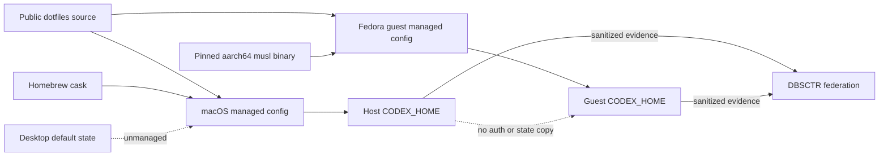

# Managed Codex CLI Distribution

**Status:** Distribution deployed; identity probe pending
**Created:** 2026-08-29
**Last updated:** 2026-08-30

## Overview

dotfiles-ai installs and configures Codex CLI beside OpenCode on the macOS host
and every managed Fedora Lima guest. Interactive invocation remains explicit.
Automation persists one runtime choice without conflating it with the native or
Hermes scheduling backend.

## Profile And Overrides

| Field | Value |
|---|---|
| Engineering Profile | `docs/specs/dotfiles_ai_distribution/PROFILE.md` |
| Risk | Elevated: installs executable code and routes authenticated workers across host/guest boundaries |
| Delivery | Draft pull request followed by staged host and guest deployment |
| Scope | Homebrew host install, pinned Fedora binary, dynamic `CODEX_HOME`, config projection, automation selector, rollback |
| Non-goals | Desktop management, auth copying, automatic runtime fallback, general Linux host support, or implicit state migration |

## Configuration

Public defaults own the release contract:

```toml
[dotfiles_ai.codex]
version = "0.151.0"
linux_asset_url = "https://github.com/openai/codex/releases/download/rust-v0.151.0/codex-aarch64-unknown-linux-musl.tar.gz"
linux_asset_sha256 = "c1cf2baf375e261c1469381a52dc2c8fd05b6fb45cfff83fed0988fd6c5369b6"

[dotfiles_ai.rnd]
backend = "native"       # native | hermes
runtime = "opencode"     # opencode | codex

[[dotfiles_ai.sandbox.workspaces]]
runtime = ""             # inherit rnd.runtime
```

Codex is always managed; no `enabled` flag or global interactive selector is
added. `rnd.backend` continues to select the scheduler. Runtime resolution is:

```text
non-empty workspace.runtime -> workspace.runtime
otherwise                   -> rnd.runtime
missing rnd.runtime         -> opencode
```

Only `opencode`, `codex`, and an empty workspace inheritance value are valid.
The selected runtime is persisted in worker and handoff identity. Executable
presence never selects a runtime and failure never falls back.

## State And Projection

`CODEX_HOME` is derived rather than configured:

```text
state.root configured -> <state.root>/codex
state.root empty      -> ~/.local/state/dotfiles-ai/codex
```

Chezmoi renders portable managed files beneath
`~/.config/dotfiles-ai/codex-managed/`. A post-apply projector validates the
external-volume sentinel when applicable, creates `CODEX_HOME` mode `0700`, and
projects only:

```text
config.toml
AGENTS.md
agents/**/*.toml
.dotfiles-ai-managed.json
```

`config.toml` carries the five inline identity command hooks; distribution does
not project a separate hook tree. Recursive agent paths preserve the portable
source hierarchy and remain subject to the same normalized-path, collision, and
digest ownership checks as top-level managed files.

The ownership manifest records schema version and SHA-256 for each managed file.
An existing target is replaceable only when its digest matches the manifest.
Unmanaged files, symlinks, missing sentinels, path escape, or changed ownership
fail before replacement.

Projection is a crash-recoverable transaction, not a multi-file atomic rename.
Before changing targets, the projector stages and verifies every new managed file
on the same filesystem, fsyncs each staged file and the staging directory, writes
an owner-only journal containing normalized target names, old state
`absent | digest`, and new digest via
fsynced temporary-file rename, then fsyncs the journal's parent directory. It
replaces each target with an atomic same-directory rename and fsyncs that target's
parent directory before continuing. The ownership manifest is written last by
the same file-fsync, rename, and parent-fsync sequence. Only then may the projector
remove the journal and staging tree and fsync their parent directories.

On recovery, a target matching its new digest is already complete. A target
matching its recorded old digest, or an absent target whose old state is
explicitly `absent`, is replaced from verified staging. Unexpected absence, any
other digest, missing required staged content, unsafe path, or ambiguous state
fails closed while retaining the journal. Recovery republishes and fsyncs the
manifest before cleanup. `auth.json`, sessions, logs, plugins, package metadata,
and unrelated files are never inspected, copied, or modified.

Changing `state.root` does not move or delete Codex state. Migration is a
separate operator-approved operation.

## Managed Launcher

Interactive and automated `codex` invocation resolves through
`~/.local/bin/codex`. On macOS the wrapper records and executes the
Homebrew-owned real binary resolved during apply. In Fedora it executes the
pinned binary under `~/.local/libexec/dotfiles-ai/codex`. The wrapper refuses a
missing binary, self-reference, version mismatch, or invalid `CODEX_HOME`, then
exports the derived CLI home and executes the real binary without shell
interpolation.

Managed shell PATH precedence must make `command -v codex` resolve to the
wrapper. The Codex desktop application does not launch through that shell
wrapper and therefore retains default `~/.codex`. Validation proves both paths.

## Visual Evidence

| Concern | Decision | Review question | Canonical source | Owner/change trigger |
|---|---|---|---|---|
| Boundary | `required: host/guest trust flowchart` | Which state and credentials remain local? | Trust Boundary | Distribution owner; boundary change |
| Interaction | `required: install/project/launch sequence` | What order prevents partial ownership or fallback? | Installation and Runtime Selection | Distribution owner; flow change |
| State | `required: managed-target transition table` | When may a projected file be created or replaced? | Projection contracts | Distribution owner; ownership change |
| Data/trust | `required: host/guest trust flowchart` | Can auth, sessions, paths, or desktop state cross? | Trust Boundary | Distribution owner; data flow change |
| Schema | `not_applicable`: exact TOML and manifest examples are clearer | What values are persisted? | Configuration and Projection | Schema change |
| Dependency/deployment | `required: platform deployment flowchart` | How do macOS and Fedora receive release-matched binaries? | Installation | Distribution owner; package change |
| Quantitative | `not_applicable`: no comparative metric controls deployment | Is one package path faster? | Non-goals | Benchmark decision added |



**Text Equivalent:** The public source renders independent host and guest
configuration. Homebrew installs the host executable and a pinned checksum-
verified binary installs in Fedora. Host and guest have separate Codex homes,
authentication, sessions, logs, and worker state. Only sanitized evidence and
approved handoffs cross boundaries. Desktop default state is unmanaged.

```mermaid
sequenceDiagram
    accTitle: Codex install, projection, and launch
    accDescr: Chezmoi validates configuration, installs or verifies the platform binary, stages managed files, writes a durable transaction journal, rejects unsafe targets, replaces each file atomically, publishes the ownership manifest last, and installs a PATH-preferred wrapper. An interrupted transaction completes forward on the next run only when every staged digest remains valid.
    participant O as Operator
    participant Z as Chezmoi apply
    participant I as Platform installer
    participant P as Config projector
    participant W as Managed wrapper
    participant C as Real Codex binary
    O->>Z: Preview and apply
    Z->>I: Install or verify exact release
    I-->>Z: Canonical binary and version
    Z->>P: Stage managed files and digests
    P->>P: Validate targets; sync transaction journal
    P->>P: Per-file atomic replacements; manifest last
    P-->>Z: Complete or retain recoverable journal
    Z-->>O: Apply result; no process restart
    O->>W: Explicit codex invocation
    W->>W: Derive CODEX_HOME and verify real binary
    W->>C: exec argument vector
```

**Text Equivalent:** The operator previews and applies chezmoi. The platform
installer verifies the exact executable. The projector stages managed files,
validates state and collisions, syncs a transaction journal, atomically replaces
each file, and publishes the ownership manifest last. An interrupted transaction
completes forward only from unchanged verified staging. Apply does not restart
processes. A later explicit `codex` call reaches the PATH-preferred wrapper, which
derives `CODEX_HOME`, verifies the real binary, and executes it as an argument
vector.

### Managed target transitions

| Current target | Proposed content | Result |
|---|---|---|
| Absent | Valid managed file | Create atomically, set mode, then record digest. |
| Manifest-owned and digest matches | New valid managed file | Replace atomically and update manifest last. |
| Manifest-owned but digest differs | Any | Refuse; operator resolves the local modification. |
| Unmanaged file or directory | Any | Refuse without overwrite or adoption. |
| Symlink, path escape, wrong owner, or unsafe mode | Any | Refuse before write. |
| External root unhealthy or sentinel invalid | Any | Refuse before target creation. |
| Valid unfinished transaction journal | Verified staged files | Complete forward, publish manifest last, then remove journal and staging. |
| Invalid or ambiguous transaction journal | Any | Fail closed and retain evidence for operator recovery. |

## Installation

Distribution is the second of two sequential pull requests. It starts only after
the host-foundation receipt is delivered and then owns package installation,
projection, wrapper activation, and managed guest rollout. Runtime-selector
schema and resolution are delivered here; Herdr, Hermes, and autonomous-worker
launch integration remains in `codex-worker-routing` after the identity probe.

### macOS

- Install the official `codex` Homebrew cask idempotently beside the existing
  OpenCode formula.
- Verify `codex --version` matches the source release contract before worker or
  host/guest parity activation.
- Install the PATH-preferred wrapper and prove it executes the Homebrew-owned real
  binary with the dedicated CLI `CODEX_HOME`.
- Render and project managed files without restarting Codex, OpenCode, Herdr, or
  Hermes automatically.

### Fedora Lima guest

- Download only the pinned official aarch64 musl archive over HTTPS.
- Verify exact SHA-256 before extraction or replacement.
- Stage under a guest-local temporary directory and atomically install the
  executable while retaining the prior executable until verification passes.
- Render a guest-local `CODEX_HOME`; never mount host Codex state or auth.
- Update all registered managed guests through the existing bounded update flow,
  preserving each guest's prior running state, and provision future managed
  guests automatically.
- Require each guest to authenticate locally before authenticated probes or
  workers; installation never logs in, injects a shared API key, or copies auth.

## Runtime Selection And Workers

- Interactive users invoke `opencode` directly or the managed `codex` wrapper by
  name.
- Native and Hermes schedulers resolve the same `rnd.runtime` value.
- A workspace override applies only to that workspace and is included in handoff
  identity.
- Worker state records runtime, exact executable version, session identity when
  available, and adapter revision.
- Resume rejects runtime mismatch, missing executable, duplicate identity, or
  ambiguous session ownership.
- Herdr presents the selected session but never becomes lifecycle authority.

## Rollback And Retirement

Source rollback reprojects the prior digest-owned managed files. It does not
delete private state. A failed package, projection, runtime, or identity probe
restores the prior executable/configuration where owned and leaves OpenCode
available. Retirement requires a separate decision and preserves `CODEX_HOME`
unless the operator explicitly approves private-state deletion.

## Release Evidence

The proposed Fedora release source is
<https://github.com/openai/codex/releases/tag/rust-v0.151.0>. The captured asset
URL and SHA-256 are implementation inputs that must be downloaded and reverified
before the installer or version parity can pass. Homebrew cask metadata is also
resolved fresh during implementation; a host/guest version mismatch blocks
cross-runtime activation.

## Gate Ledger

| Gate | Applicability | Result | Authority | Owner |
|---|---|---|---|---|
| Domain | required | passed | Configuration, ownership, and boundary language | Primary |
| Behavior | required | passed | Install, projection, selector persistence, isolation, and rollback scenarios | Primary |
| Spec | required | passed | This feature specification | Primary |
| Contract | required | passed | TOML, digest, checksum, and isolation tests | Primary |
| Test-driven implementation | required | passed | Distribution and Lima tests | Primary |
| Refactor | required | passed | Reused state-root, package, and VM-state patterns | Primary |
| Review/Integrate | required | passed | Affected QA and independent elevated-risk review | Primary |
| Release | not_applicable: source pins an upstream artifact but publishes none | not_run | Engineering Profile | Primary |
| Deploy | required | passed | Targeted host apply and exact-archive apply to every registered guest | Primary |
| Operate | required | passed | Host and guest `0.151.0`, wrapper, projection, cleanup, and VM-state smokes | Primary |
| Maintain/Retire | required | passed | Upgrade refusal, package/projection rollback, ordered guest rollback, and retained-state tests | Primary |

## Validation

```bash
uv run --group test pytest tests/test_codex_distribution.py tests/test_portable_distribution.py tests/test_lima_sandbox.py tests/test_herdr_launchagent.py tests/test_dbsctr_rnd.py -q
python3 -m py_compile dot_local/bin/executable_codex-project dot_local/bin/executable_codex-archive dot_local/bin/executable_codex-rollback dot_local/bin/executable_sandbox-vm
git diff --check
```

Hosted CI uses fake package and runtime commands and never authenticates Codex,
changes desktop state, starts real services, or requires Lima. Real package,
guest, projection, and isolation proof remains a controlled deployment gate.
Authenticated identity, worker, and recovery proof belongs to the dependent
slices and is not a distribution gate.
