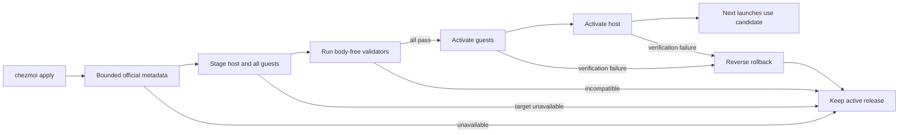

# Codex Rolling Stable Updates

**Status:** Ready

## Outcome

Every `chezmoi apply` checks the official Codex GitHub latest-stable release and
updates Codex on the Apple Silicon host and all registered managed Fedora guests
without changing OpenCode, Herdr, unrelated Homebrew packages, authentication,
`CODEX_HOME`, sessions, or the Codex desktop application. Compatible updates
activate for the next Codex launch; running processes are never restarted.

Codex moves from the unversioned Homebrew cask to the official release archives
on every managed platform. This prevents an unrelated Homebrew upgrade from
deleting the wrapper's recorded executable. The existing cask is no longer in
`Brewfile` or runtime resolution; uninstalling its retained installation is a
separate operator-approved cleanup after direct-binary validation.

Public configuration becomes `dotfiles_ai.codex.channel = "stable"`. Existing
local `version`, asset URL, and checksum keys remain parseable during migration
but no longer select executable code and are omitted from new examples. Any
channel other than `stable` fails render; there is no implicit beta, nightly,
downgrade, or per-workspace version selector.

## Terms

- **active release:** the exact verified binary currently selected by the managed
  wrapper.
- **candidate:** one stable GitHub release plus the required platform asset
  metadata obtained in a single bounded query.
- **release lock:** owner-private canonical JSON binding the active release,
  assets, validators, and prior rollback generation.
- **registered target:** the host or any workspace declared in the managed sandbox
  configuration, regardless of its history-federation setting.
- **soft update failure:** candidate discovery, staging, or validation failure
  while a healthy active release exists; apply succeeds and keeps every target on
  the active release.

## Release Authority

The updater requests at most 1 MiB from
`https://api.github.com/repos/openai/codex/releases/latest` over HTTPS with a
five-second connection timeout and 30-second total timeout. It accepts one JSON
object only when `draft=false`, `prerelease=false`, `name` is strict semver,
`tag_name` is exactly `rust-v<name>`, the version is strictly newer than the
healthy active release, and the response contains each required
asset exactly once:

| Platform | Asset |
|---|---|
| Apple Silicon macOS | `codex-aarch64-apple-darwin.tar.gz` |
| Fedora aarch64 | `codex-aarch64-unknown-linux-musl.tar.gz` |
| CentOS x86_64 self-update | `codex-x86_64-unknown-linux-musl.tar.gz` |

Each accepted asset requires the canonical release download URL, positive size
not exceeding 256 MiB, and GitHub `digest` exactly `sha256:<64 lowercase hex>`.
Redirects may end only at HTTPS GitHub-controlled release hosts. Duplicate keys,
duplicate assets, invalid controlling field types, invalid UTF-8, missing digest,
or non-stable versions reject the candidate; additive non-controlling GitHub
fields are ignored. The first accepted metadata is trusted
as official GitHub release authority; a later query that reuses a seen version
with different URL, size, or digest is a mutation and never activates.

The current migration candidate is `0.153.3` with published SHA-256:

| Platform | SHA-256 |
|---|---|
| macOS aarch64 | `02cdcbd874c1616f2cab6f602580329de1b00b26bf216d384b348519a9b356cd` |
| Linux aarch64 musl | `68ff7eb22937de4f6b44a30d66ba893daf280d21347408ffbf2501a28136bf19` |
| Linux x86_64 musl | `6ff9674bb00e14734c2748bc8788eab3cb6e5ac53ebde7e1e780b4ed7af48cba` |

## Private Lock

The host lock is
`~/.local/state/dotfiles-ai/codex-package/release-lock.json`; guests use the same
home-relative path. Parent directories are owner-only mode `0700`; lock,
transaction, and metadata files are regular owner-only mode `0600`, reject
symlinks, stay outside Git, and are written by fsync plus atomic rename. The
closed schema contains exactly:

```json
{
  "schema_version": 1,
  "channel": "stable",
  "release": "0.153.3",
  "tag": "rust-v0.153.3",
  "assets": {
    "darwin-aarch64": {"url": "<canonical>", "sha256": "<hex>", "size": 1},
    "linux-aarch64": {"url": "<canonical>", "sha256": "<hex>", "size": 1},
    "linux-x86_64": {"url": "<canonical>", "sha256": "<hex>", "size": 1}
  },
  "validator_revision": "codex-release-validator-1",
  "previous": null
}
```

`previous`, when present, has the same release/tag/assets/validator fields but no
nested `previous`. The lock never stores timestamps, paths, usernames, machine
identity, credentials, API response bodies, or authentication state. An existing
lock with unknown fields, unsafe values, a missing active binary, or mismatched
binary digest is unhealthy and cannot authorize a soft failure.

A healthy fleet means host and every registered guest lock select the same
release and platform digest and every active binary matches. “Latest unchanged”
still probes all target locks and binaries; only a healthy fleet may no-op or
soft-fail. Drift, missing target state, or mixed versions require repair from the
official active-release assets and fail closed if repair cannot stage everywhere.

One sibling `rejected-candidate.json` uses the same ownership, mode, fsync, and
symlink rules and contains exactly `schema_version`, `release`, `asset_sha256`,
`validator_revision`, and one allowlisted body-free reason. A matching rejected
version/digest/validator no-ops without another download. A newer candidate or
validator revision replaces it atomically; it never authorizes activation.

## Apply Flow

A `run_after_` chezmoi script invokes one bounded `codex-update-all` operation on
every apply. On macOS it is the sole host/registered-Fedora coordinator. On a
managed Fedora guest, ordinary apply verifies local state but never queries or
activates independently; only authenticated private `sandbox-vm codex-stage`,
`codex-activate`, and `codex-rollback` requests from the host transaction may
change its binary. A standalone CentOS remote-user apply updates that one isolated
user boundary locally and is not part of host/Fedora atomicity. No path recurses
into another chezmoi apply. The updater serializes through an owner-private lock
and performs:

Public and guest commands, fixed bounds, asset names, semantic validator fields,
activation/rollback order, body-free outcomes, and exit statuses are closed by
[`codex-rolling-stable.contract.json`](codex-rolling-stable.contract.json).

1. Validate the current release lock and active regular executable.
2. Query and validate latest stable metadata. If unchanged and every registered
   target matches, run bounded active health checks and exit successfully.
3. Download required archives into owner-private temporary directories and verify
   byte count, SHA-256, closed archive membership, executable type, and candidate
   `codex-cli <release>` output before any activation.
4. Snapshot host and every registered guest; preserve each guest's prior running
   state. Stage the candidate on every target without changing active binaries.
5. Run registered validators against each staged binary using that boundary's
   existing isolated `CODEX_HOME`. Validators emit body-free fixed status only,
   never log in or inspect private auth/session storage.
6. If every stage and validator passes, activate guests then host by atomic
   same-directory rename and publish matching private locks. Verify all active
   versions and wrapper resolution.
7. On any activation or verification failure, restore activated targets in
   reverse order, restore VM running state, and retain the prior lock everywhere.

The initial validator requires bounded version/help/config and stable app-server
schema capabilities used by managed hooks and identities. Later delivered
adapters register semantic validators; whole generated-schema digests are not a
rolling compatibility boundary. Unknown required fields, missing stable methods,
changed discriminator semantics, or a validator crash reject the candidate.

The active executable remains the regular file
`~/.local/libexec/dotfiles-ai/codex` on every platform. A process already running
that inode continues uninterrupted; the next launch uses the newly renamed file.
The wrapper validates the private lock, executable ownership/mode/digest, version,
and non-self-reference before exporting the existing dedicated `CODEX_HOME`.

## Failure And Recovery

- Metadata/network/download failure with a healthy active lock is soft: keep all
  active versions, emit one bounded warning, and let unrelated apply work finish.
- An unavailable registered guest is soft only before activation; no reachable
  target updates, preventing host/guest divergence.
- Bootstrap or an unhealthy active lock is fail-closed because no verified Codex
  exists to retain.
- Fleet drift is unhealthy even when the host binary works; inability to repair
  every registered target fails closed instead of reporting a soft no-op.
- Candidate incompatibility is sticky for that version/digest in private state so
  every apply does not redownload it; a changed digest for that version is a
  mutation, not a retry.
- Interrupted staging is removed on the next apply. Interrupted activation uses
  the private transaction and prior generation to roll back before another query.
- At most active and previous binaries are retained. Retirement deletes neither
  `CODEX_HOME` nor authentication and requires separate approval.
- Successful rollback is a soft retained outcome. Failed rollback exits nonzero,
  preserves the transaction for deterministic recovery, and never claims that
  targets are coherent.

## Behaviors

- Given every target is healthy and a compatible stable candidate exists, when
  chezmoi applies, then all registered targets activate one exact release and the
  next Codex launch works.
- Given metadata, a download, validator, or guest is unavailable, when a healthy
  release is active, then every target retains it and chezmoi completes with a
  bounded warning.
- Given any target fails after activation begins, when rollback runs, then every
  activated target restores the prior executable and lock in reverse order.
- Given rollback cannot restore one activated target, when apply exits, then it
  fails closed with a retained transaction and body-free `rollback_failed` reason.
- Given Codex is currently running, when a candidate activates, then no process is
  signalled or restarted and only later launches use it.
- Given Homebrew changes its Codex cask, when chezmoi applies, then that cask is
  irrelevant to managed wrapper resolution.

## Validation

- Fake release/API/archive fixtures cover strict metadata, redirects, mutation,
  bounds, checksums, archive escape, staged version, and sticky rejection.
- Host/guest fixtures cover unavailable targets, all-stage-before-activation,
  reverse rollback, VM-state restoration, lock crash recovery, and no divergence.
- Runtime checks prove wrapper/version/login-status isolation on host and every
  guest without exposing account/session content.
- Existing OpenCode, remote-user, Codex projection, and desktop-separation tests
  remain green.

## Visual Evidence

| Concern | Decision | Review question | Canonical source | Owner/change trigger |
|---|---|---|---|---|
| Boundary | required: transactional update flow | When can code cross from staged to active? | Apply Flow | Distribution owner; activation change |
| Interaction | required: apply sequence | How does apply remain usable when update infrastructure fails? | Failure And Recovery | Distribution owner |
| State | required: release lifecycle | Which states permit activation or rollback? | Apply Flow | Distribution owner |
| Data/trust | required: host/guest flow | What metadata crosses boundaries and what remains private? | Private Lock | Security owner |
| Schema | not_applicable: closed JSON example is clearer | Which lock fields persist? | Private Lock | Lock schema change |
| Dependency/deployment | required: transactional update flow | How is divergence prevented? | Apply Flow | Distribution owner |
| Quantitative | not_applicable: fixed safety bounds are invariants, not comparative evidence | Are update bounds enforced? | Release Authority | Distribution owner |



**Text Equivalent:** Chezmoi obtains bounded official release metadata, stages
one exact candidate on the host and all registered guests, and runs body-free
validators before changing active binaries. Successful validation activates
guests then host without restarting processes. Any later failure restores prior
versions in reverse order. Metadata, network, validator, or guest failure keeps a
healthy active release and allows unrelated apply work to finish.

## Quantitative Evidence

Build records one candidate version/digest set, metadata and archive byte bounds,
target counts, stage/activation/rollback counts, version parity, retained
generation count, update duration, and zero process restarts. It never records
release bodies, paths, private IDs, auth output, or session content.
