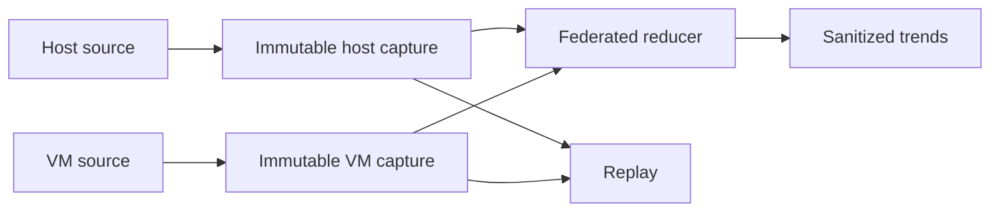

# Federated Cycle Performance Trends

## Ownership

`dotfiles_ai_distribution` owns privacy-safe host/VM aggregation, immutable source
captures, source availability, replay, retention, and trend operation. Source
contexts own local timing and session reducers.

## Contracts

- Capture each configured source once per compatible immutable query and page it
  without rescanning the source database.
- Preserve source ID, snapshot, ceilings, database digest, exclusion/privacy
  identity, continuation, and explicit availability.
- Aggregate mean, p50, p90, coverage, unavailable samples, failures, reopenings,
  remediation, tools, errors, tokens, and delegation only where authoritative.
- Separate host/VM, context, risk, delivery, Method Revision, and exact harness
  cohorts before comparison.
- Never send raw source members, prompts, tool payloads, paths, URLs, credentials,
  account identities, or database rows across the federation boundary.
- A partial source set is not a fleet trend and cannot activate an optimization.

## Operation

Trend audits prefer a query-compatible capture retained within policy. A new
capture is created only when no compatible immutable source exists. Replays use
the capture rather than a live rescan. Source failure remains visible and does
not silently reuse stale values.

## Acceptance

Fleet reports complete within bounded deadlines, perform one source scan per
capture, replay without source access, and preserve quality counters. Activation
requires comparable cohorts and no quality regression.

## Visual Evidence

| Concern | Decision | Reason |
|---|---|---|
| Boundary | `not_applicable` | The approved Initiative context map defines ownership. |
| Interaction | `required: flowchart` | Capture-once and replay behavior controls source load. |
| State | `not_applicable` | Existing capture availability and retention states remain authoritative. |
| Data/trust | `required: flowchart` | Only sanitized immutable summaries may cross source boundaries. |
| Schema | `not_applicable` | Existing capture and federation schemas remain unchanged. |
| Dependency/deployment | `not_applicable` | Configured host and VM sources are unchanged. |
| Quantitative | `not_applicable` | Sparse current timing is not a stable chart baseline. |

**Text Equivalent:** Each host or VM source is scanned once into an immutable
capture. Federation and later replay read captures, not source databases, and
emit only sanitized trends with explicit source availability.
