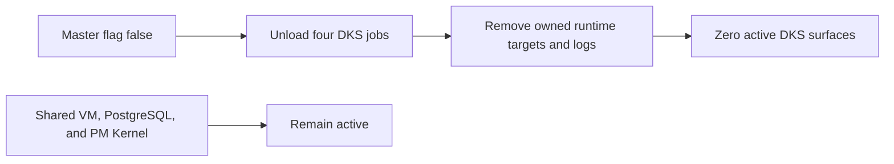

# DKS Feature Retirement

## Ownership And State

`dotfiles_ai_distribution` owns the master `knowledge_store.enabled` flag,
host runtime convergence, managed DKS files, LaunchAgents, logs, and restart.
Shared `personal-sandbox`, PostgreSQL, PM Kernel data, forwarding, and backups
remain active and outside this retirement.

| State | Runtime outcome |
|---|---|
| `enabled=false` | No DKS LaunchAgent, process, installed tool, OpenCode tool target, config, runtime cache, log, or host API key remains active |
| `enabled=true` before redesign | Chezmoi rendering fails before apply; no service starts |
| Cleanup incomplete | DKS remains unloaded and unavailable; apply exits nonzero with bounded residual classes |
| Future controlled environment | Blocked until a separately approved receipt contract and environment design are delivered |

The existing boolean remains the sole off switch. A future enable path requires
a second environment approval receipt, but this cycle deliberately defines no
accepted receipt. This avoids inventing a weak token before the test environment
is selected. Source-controlled code, specs, tests, migrations, and Git branches
remain available.

Disablement unloads the reconcile, embedding, code-embedding, and reranker jobs
before removing their owned plists, binaries, generated OpenCode tool target,
machine config, caches, and logs. It removes only DKS Keychain/API-key material;
database, model, and private corpus deletion belongs to the dependent knowledge
retirement slice. Ignored targets are actively removed rather than assumed gone.

The current Mac mini machine-local config changes only
`data.dotfiles_ai.knowledge_store.enabled` to false. Subordinate values may remain
for source compatibility but cannot override the master flag. A fresh OpenCode
process is required after tool removal.

## Failure, Recovery, And Validation

Disable first and delete second. Any residual artifact or loaded label fails
visibly without re-enabling DKS. Rollback is intentionally unavailable on this
host until future controlled-environment approval; source reversion alone cannot
restart DKS. Validate disabled and attempted-enabled rendering, exact label/process
absence, target removal, direct-source routing, shared VM/PostgreSQL/PM health,
bounded residual output, and idempotent repeated apply.

All kernel and completion gates except Release are required. Deploy changes the
machine-local flag and applies only owned targets. Operate proves zero DKS jobs,
processes, and callable tools while shared infrastructure remains healthy.

## Visual Evidence

| Concern | Decision | Review question |
|---|---|---|
| Boundary | required: retirement flow | What remains shared and active? |
| Interaction | required: retirement flow | Does cleanup ever restart DKS? |
| State | required: transition table above | What does each flag state permit? |
| Data/trust | not_applicable: state deletion belongs to DKS | - |
| Schema | not_applicable: existing TOML boolean remains | - |
| Dependency/deployment | required: retirement flow | Which host resources are removed? |
| Quantitative | not_applicable: required runtime count is zero | - |

**Text Equivalent:** Setting the master flag false unloads all four DKS jobs,
then removes owned runtime targets and logs. Shared VM, PostgreSQL, PM Kernel,
and Git source remain. Owner: distribution maintainer. Change trigger: managed
target, enablement, or shared-infrastructure change.
