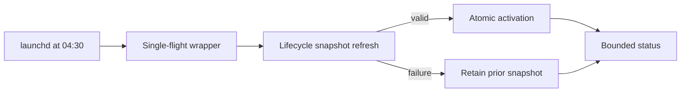

# History Projection Refresh Schedule

## Ownership

`dotfiles_ai_distribution` owns host enablement, the daily launchd schedule,
single-flight execution, resource policy, logs, disablement, and rollback. The
lifecycle context owns `history-source-index-refresh`, snapshot correctness,
privacy, sidecar schema, activation, and status semantics.

## Behavior

**Scenario: Refresh without operator prompting**

- Given host-local history projection refresh is enabled
- When local time reaches 04:30 each day
- Then launchd starts one low-priority refresh without a model or agent
- And an already-running refresh makes the new invocation exit successfully

**Scenario: Preserve the prior snapshot on failure**

- Given one ready projection exists
- When refresh times out, loses source authority, exceeds storage bounds, or fails
- Then the process exits nonzero with bounded diagnostics
- And the prior ready snapshot and its captures remain unchanged

**Scenario: Recover after sleep or restart**

- Given the machine is asleep at 04:30 or restarts later
- When launchd next evaluates the calendar job
- Then at most one refresh runs
- And status remains truthful if no run occurs

**Scenario: Disable safely**

- Given the owner disables refresh
- When managed configuration applies
- Then launchd unloads and removes only the owned job
- And the active projection remains readable until separately retired

## Interface

Public configuration adds:

```toml
[history_projection]
enabled = false
refresh_hour = 4
refresh_minute = 30
refresh_timeout_seconds = 3600
```

Bounds are hour `0..23`, minute `0..59`, and timeout `900..7200`. The managed
host enables the feature explicitly; public defaults remain safe for machines
without an OpenCode source. The installed artifacts are:

- `~/Library/LaunchAgents/dev.dotfiles-ai.history-projection-refresh.plist`
- one managed load/unload script

The job invokes only `dbsctrctl history-source-index-refresh`, uses an owner-private
single-flight lock, has no network or provider dependency, and runs with background
process type and low I/O priority. It records bounded timestamps, duration, state,
captured age, final size, and machine-safe failure class. Logs contain no source
path, IDs, bodies, commands, credentials, or raw database errors.

04:30 local avoids the existing 03:00 maintenance window, Sunday 03:15 database
backup, and 09:15 review work. The 15-minute DKS reconciler remains independent;
low-priority execution and single-flight locking prevent this schedule from
changing DKS authority or cadence.

## Recovery And Maintenance

- A 60-minute timeout terminates only the refresh process group; lifecycle cleanup
  removes preparation on the next run.
- Three consecutive failures remain visible in status and logs but do not disable
  the job or remove the prior snapshot.
- Rollback unloads the LaunchAgent and restores prior managed configuration; it
  does not delete projection or OpenCode data.
- Vulnerability and runtime intake follow the distribution Engineering Profile;
  no new dependency or service is added.

## Visual Evidence

| Concern | Decision | Review question | Canonical source | Owner/change trigger |
|---|---|---|---|---|
| Boundary | required: owner flow | Does distribution schedule without owning snapshot semantics? | Ownership | Context change |
| Interaction | required: refresh flow | Can failure replace the prior snapshot? | Behavior | Refresh command change |
| State | required: enabled/disabled/running states | Can disablement or overlap delete projection state? | Recovery | Scheduler change |
| Data/trust | required: text equivalent | Can private source data enter logs or configuration? | Interface | Evidence change |
| Schema | required: TOML block | Are schedule bounds explicit? | Interface | Config change |
| Dependency/deployment | required: owned artifact list | Which files and job are installed? | Interface | Target change |
| Quantitative | required: schedule and timeout | Are cadence and runtime bounded? | Interface | Timing change |



**Text Equivalent:** At 04:30 launchd starts one low-priority single-flight
wrapper. The lifecycle refresh either validates and atomically activates a new
snapshot or fails while retaining the prior one. Distribution exposes bounded
status and can unload only the owned schedule.

## Validation

- Rendered plist and TOML fixtures prove default-off behavior and exact 04:30
  calendar scheduling when enabled.
- Process fixtures prove single-flight skip, 60-minute termination, bounded logs,
  prior-snapshot retention, restart, disablement, and rollback.
- A controlled live run proves load identity, low-priority execution, successful
  status, and no overlapping process.

## Gate Ledger

| Gate | Applicability | Result | Authority |
|---|---|---|---|
| Domain | required | pending | Distribution Profile and Initiative manifest |
| Behavior | required | pending | Schedule, overlap, failure, restart, and disablement scenarios |
| Spec | required | pending | TOML, plist, logging, timeout, and visual contracts |
| Contract | required | pending | Lifecycle refresh and status boundary |
| Test-driven implementation | required | pending | Render and process fixtures |
| Refactor | required | pending | Existing launchd helper reuse review |
| Review/Integrate | required | pending | Diff, privacy, downstreams, and affected QA |
| Release | not applicable: no versioned artifact is published | not_run | Engineering Profile |
| Deploy | required | pending | Managed config, plist, and loaded-job identity |
| Operate | required | pending | Controlled refresh and status smoke |
| Maintain/Retire | required | pending | Disablement, rollback, logs, and retained snapshot |

## Non-Goals

- Owning projection schema, source parsing, privacy, activation, or query output.
- Running an agent, hosted provider, DKS query, backup, or source mutation.
- Deleting a usable projection when refresh or scheduling fails.
