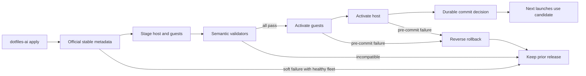

# OpenCode Rolling Stable Updates

**Status:** Ready

## Outcome

Every full `dotfiles-ai` apply checks the official latest stable OpenCode release
and converges one compatible version on Apple Silicon macOS, every registered
Fedora aarch64 guest, and standalone CentOS x86_64 applies. OpenCode leaves the
Homebrew formula runtime boundary and uses official release assets at the existing
managed direct-binary path. Current OpenCode/Herdr processes are never restarted;
later launches use the atomically replaced inode.

This cycle is elevated risk. It owns package discovery, private locks, semantic
validation, host/guest activation, rollback, wrapper resolution, and migration
from host `1.18.29` plus delivered guest `1.18.25`. It does not change OpenCode
configuration, models, agents, permissions, sessions, credentials, or DBSCTR
semantics.

Fedora currently executes a root-owned `/usr/local/libexec/opencode` provisioned
by Lima. First migration verifies its exact delivered `1.18.25` version and
executable digest, snapshots it as rollback authority without modifying it, then
installs the candidate at user-local `~/.local/libexec/dotfiles-ai/opencode` and
switches the managed wrapper. Unknown root binaries fail closed. After all guest
wrappers and user-local binaries pass fleet validation, the Lima provisioning
rule stops installing/updating OpenCode; removal of the retained root binary is a
separate retirement action. Rollback before commit restores wrapper selection to
the verified root binary; later rolling generations use user-local active/previous
files only.

## Release Contract

The updater uses bounded HTTPS metadata from
`https://api.github.com/repos/anomalyco/opencode/releases/latest`, accepting only
a non-draft/non-prerelease strict `v<semver>` tag and these exact unique assets:

| Platform | Asset | Current `1.18.29` SHA-256 |
|---|---|---|
| macOS aarch64 | `opencode-darwin-arm64.zip` | `fe764f7f360c584a83e18dd5f23fb1a6b2725f5ee8854b0252fe558f7798e946` |
| Linux aarch64 | `opencode-linux-arm64.tar.gz` | `70baf769395ca4e7a68924026530c390eace194f3b7e4919d4efcb2aa2eed3c0` |
| Linux x86_64 | `opencode-linux-x64.tar.gz` | `ea800b7ff56226b70952126c9fc1e2517ca4c4b5682fd9d3f9e87449697a1194` |

Metadata is at most 1 MiB and assets at most 256 MiB. URL, size, and GitHub
`sha256:` digest form one canonical candidate digest. Same-version mutation,
downgrade, duplicate/missing assets, unsafe redirects, archive traversal,
symlinks, extra members, wrong executable type, and incompatible semantics fail
before activation. A private rejection record prevents repeated downloads until
version or validator revision changes.

## State And Transaction

The package root is `~/.local/state/dotfiles-ai/opencode-package`; active binary
is the regular owner executable `~/.local/libexec/dotfiles-ai/opencode`. Closed
owner-only release locks bind release, platform, asset metadata, extracted binary
digest, target count/set digest, validator revision, and one previous generation.
No lock stores paths, usernames, credentials, sessions, config bodies, prompts,
or command output.

The implementation reuses or extracts the proven Codex transaction primitives:
no-follow owner/mode validation, complete-or-delete backup, all-target staging,
guest-then-host activation, durable phase journal, commit-decision recovery,
idempotent all-target rollback, bounded helper bootstrap, exact guest response,
and same-inode concurrent wrapper launch. Shared code is preferred only when it
reduces duplication without coupling Codex/OpenCode policy or state.

`chezmoi apply` invokes one always-run `opencode-update-all`. Darwin coordinates
all registered guests regardless federation. Managed Fedora applies validate
local health but mutate only through host stage/activate/rollback requests.
Standalone CentOS updates its own user boundary. A compatible update failure is
soft only when the current private fleet attestation matches configuration and
all active binaries remain verified. Bootstrap, drift, rollback failure, and
unknown state fail nonzero.

## Semantic Validator

Before staging succeeds, the candidate must:

- return exact semantic version and bounded nonempty help;
- parse the rendered managed `opencode.json` through supported debug/config
  commands without reading credential files;
- retain configured `plan`/`build` agents and headless command shapes;
- preserve configured DBSCTR typed-tool permission keys without invoking a
  project-scoped tool outside its repository context;
- preserve headless `--version`, `debug config`, and session-list command shapes;
- emit only body-free validator status.

Additive output is accepted only when required fields and meanings remain.
Missing/renamed methods, config rejection, role/tool loss, unknown required
discriminators, output overflow, timeout, or crash rejects the candidate.

## Behaviors

- Given a compatible stable candidate and healthy targets, when full AI apply
  runs, then every target stages before activation and later launches use one
  release.
- Given update infrastructure or a target is unavailable and the prior fleet
  attestation is healthy, when apply runs, then all targets retain the prior
  release and unrelated apply work succeeds with a bounded warning.
- Given activation starts and verification fails before commit decision, when
  rollback runs, then attempted targets restore in reverse order.
- Given commit decision is durable and finalization loses a response, when apply
  or wrapper recovery runs, then it completes commit idempotently rather than
  creating mixed versions.
- Given an OpenCode process is active, when a release activates, then the process
  is not signalled and continues its opened inode.

## Validation

- Fake metadata/archive/redirect fixtures cover release trust and bounds.
- Lock/journal fixtures cover modes, symlinks, mutation, bootstrap, crash windows,
  commit recovery, rollback failure, target-set changes, and concurrent launch.
- Fake host/guest orchestration proves all-stage-before-activation, exact responses,
  helper bootstrap, VM-state restoration, and no divergence.
- Existing OpenCode control-plane, distribution, remote-user, Lima, and Codex
  rolling tests remain green.
- Migration fixtures prove root-owned `1.18.25` is read-only rollback authority,
  unknown root binaries are rejected, wrapper cutover is atomic, and provisioning
  retirement occurs only after fleet validation.
- Live Deploy/Operate proves host and every guest version, resolved config/roles,
  current-process preservation, and the previously failing full AI apply.

## Gate Ledger

| Gate | Applicability | Result | Authority | Owner |
|---|---|---|---|---|
| Domain | required | pending | Candidate, lock, fleet, validator, and transaction vocabulary | Primary |
| Behavior | required | pending | Update, retention, rollback, recovery, and process scenarios | Primary |
| Spec | required | pending | This specification | Primary |
| Contract | required | pending | Release, lock, validator, and guest schemas | Primary |
| Test-driven implementation | required | pending | Distribution/Lima/control-plane tests | Primary |
| Refactor | required | pending | Proven transaction primitive reuse | Primary |
| Review/Integrate | required | pending | Affected QA and elevated-risk review | Primary |
| Release | not applicable: no published artifact | not_run | Engineering Profile | Primary |
| Deploy | required | pending | Host/all-guest transactional migration | Primary |
| Operate | required | pending | Version/config/process/full-apply smoke | Primary |
| Maintain/Retire | required | pending | Mutation, rollback, EOL, and formula retirement | Primary |

## Visual Evidence

| Concern | Decision | Review question | Canonical source | Owner/change trigger |
|---|---|---|---|---|
| Boundary | required: fleet update flow | When can staged code activate? | State And Transaction | Distribution owner |
| Interaction | required: fleet update flow | How does failure retain availability? | Behaviors | Distribution owner |
| State | required: fleet update flow | Which phase rolls back or commits? | State And Transaction | Transaction change |
| Data/trust | required: fleet update flow | What metadata crosses guest boundaries? | Release Contract | Security owner |
| Schema | not_applicable: closed lock/result fixtures are clearer | - | State And Transaction | Schema change |
| Dependency/deployment | required: fleet update flow | Why must bridge wait? | Outcome | Dependency change |
| Quantitative | not_applicable: bounds are invariants | - | Release Contract | Metric decision |

**Text Equivalent:** Full AI apply discovers one official stable OpenCode release,
stages it on host and guests, and runs body-free semantic validators. Only complete
staging permits guest-then-host activation. A durable commit decision completes
idempotently; earlier failures restore attempted targets. Existing processes are
not restarted and healthy fleets retain their prior release on soft failures.

## Quantitative Evidence

Build records candidate version/digest, target/stage/activation/rollback counts,
fixed byte/time bounds, version parity, and zero process restarts. It records no
source paths, configuration bodies, credentials, session identity, or tool output.
