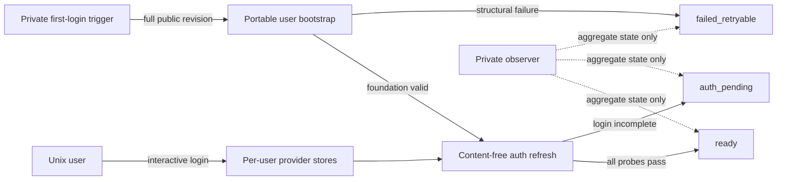

# Remote User Rollout Runtime

## Outcome

RWUE-005A supplies the public user-owned runtime required before private
infrastructure can converge two remote users. It bootstraps one immutable
reviewed `dotfiles-ai` revision, refreshes content-free authentication state, and
rejects an unusable local remote-workspace client before any cloud or SSH action.

The stable Engineering Profile is
[`../PROFILE.md`](../PROFILE.md). Product Intent remains
[`../PRODUCT.md`](../PRODUCT.md).

## Scope And Boundaries

- `remote-user-bootstrap bootstrap REVISION` runs as the invoking user, validates
  an owned non-symlinked home, clones or verifies the public source, verifies the
  full commit, installs pinned chezmoi user-locally, creates only non-secret local
  configuration, and invokes the existing foundation apply.
- `remote-user-foundation refresh-auth` first validates the recorded foundation,
  managed targets, expected binaries, and owned configuration. Structural or
  integrity failure records `failed_retryable`.
- After structural validation, refresh invokes the content-free agent readiness
  probe. Incomplete OpenAI, Vertex, Codex, or 1Password login records
  `auth_pending`; complete probes record `ready`.
- `remote-workspace doctor` requires executable `mise`, gcloud, SSH, Herdr, an
  existing configured repository, and a usable root `mise.toml` before success.
- `remote-workspace remote-dev -- iap` changes to the configured repository and
  forwards `remote-dev -- iap` to `mise run` regardless of caller directory.
- No operation starts interactive authentication, accepts a credential argument,
  prints provider output, or includes private identity in public source.

Private first-login trigger installation, aggregate observation, cloud preview,
shared-VM deployment, user participation, and personal overlay apply belong to
RWUE-005 in the private coordinator repository. Personal Yazi targets belong to
RWUE-003 in the separately owned personal source.

## Domain

- `PortableBootstrap`: user-owned source and chezmoi preparation for one full
  `FoundationRevision`.
- `FoundationIntegrity`: recorded revision, owned source/configuration,
  managed-target manifest, and expected executable/configuration checks.
- `AuthStateRefresh`: content-free transition from `foundation_ready` to
  `auth_pending`, `ready`, or `failed_retryable`.
- `PortableClientDoctor`: local fail-closed prerequisite check before remote
  mutation.
- `CallerDirectory`: arbitrary directory that must not control mise task
  discovery.

## Behavior

### User-Owned Immutable Bootstrap

- **Given** an owned mounted home and a full reviewed public revision
- **When** `remote-user-bootstrap bootstrap REVISION` runs
- **Then** source clone or verification, pinned chezmoi installation, render, and
  apply run without root ownership
- **And** retry uses exactly the recorded revision
- **And** failure records only a safe state and exits nonzero.

### Authentication Remains Interactive And User-Owned

- **Given** the foundation is valid and one provider is not authenticated
- **When** `remote-user-foundation refresh-auth` runs
- **Then** state becomes `auth_pending`
- **And** no login starts and no provider output is retained.

- **Given** the foundation is valid and every content-free probe succeeds
- **When** authentication state refresh runs
- **Then** state becomes `ready`.

### Runtime Damage Is Retryable, Not Authentication Pending

- **Given** a recorded foundation has a missing, wrong-version, unowned, or
  symlinked required target
- **When** authentication state refresh runs
- **Then** state becomes `failed_retryable`
- **And** no provider probe or interactive command starts.

### Client Preflight Fails Before Mutation

- **Given** `mise` is missing or the configured repository lacks root
  `mise.toml`
- **When** `remote-workspace doctor` runs
- **Then** it exits nonzero before gcloud mutation, SSH, or Herdr
- **And** its diagnostic names only the missing prerequisite class.

### Task Discovery Is Repository-Bound

- **Given** the configured repository contains root `mise.toml`
- **When** `remote-workspace remote-dev -- iap` runs outside that repository
- **Then** it executes `mise run remote-dev -- iap` from the configured repository
- **And** preserves `iap` as the first task argument.

## Trust And Compatibility

- Public defaults contain no employer, client, project, user, machine, tailnet,
  endpoint, repository path, account, or credential identity.
- Revision must be a full 40-character commit and must resolve in the configured
  public source before apply.
- Home, source, configuration, state, and lock ancestors must be owned and must
  not cross a symlink boundary.
- Credential stores, provider output, prompts, responses, sessions, and history
  are never copied, parsed into state, or printed.
- Existing macOS and Fedora aarch64 renders remain unchanged.
- Rollback preserves authentication, sessions, history, personal overlays, and
  unrelated files.

## Visual Evidence Plan

| Concern | Decision | Review question | Canonical source |
|---|---|---|---|
| Boundary | `required: ownership flow` | Which side owns portable versus private rollout behavior? | Diagram below |
| Interaction | `required: bootstrap and refresh sequence` | What can run automatically, and what remains interactive? | Diagram below |
| State | `required: explicit state transitions` | Which failures retry and which wait for the user? | Behavior and diagram |
| Data/trust | `required: ownership flow` | Where can credentials and private identity exist? | Trust And Compatibility |
| Schema | `not_applicable` | Existing versioned foundation state is extended without a new shared schema | Foundation state contract |
| Dependency/deployment | `required: ownership flow` | Why must this slice precede private rollout? | Diagram below |
| Quantitative | `not_applicable` | No decision relies on comparative measurements | Validation |

**Text Equivalent:** Private infrastructure supplies one immutable public
revision to a user-owned bootstrap. Structural failure is retryable. A valid
foundation runs content-free authentication checks: incomplete login waits in
`auth_pending`, while complete checks reach `ready`. Each Unix user performs
interactive login directly into private stores. The private observer receives
only aggregate state.

## Gate Ledger And Validation

RWUE-005A is elevated risk. Domain, Behavior, Specification, Contract,
Test-Driven Implementation, Refactor, Review/Integrate, Deploy, Operate, and
Maintain/Retire are required. Release is not applicable because no versioned
artifact is published. DVC is not applicable unless metadata changes
unexpectedly.

Validation must include:

- red-first bootstrap, state-transition, ownership, symlink, version, doctor,
  caller-directory, and rollback tests;
- full affected pytest and Python 3.12, 3.13, and 3.14 CI;
- rendered macOS, Fedora aarch64, and CentOS x86_64 compatibility;
- shell syntax, exact release checksums, and public identity scans;
- disposable CentOS x86_64 first bootstrap, retry, empty second apply,
  `auth_pending`, `ready`, failure, update, and rollback proof; and
- no shared VM, live provider login, or private endpoint access in this slice.

## Readiness

The scope, repository ownership, interfaces, state transitions, safety boundary,
and validation are ready. Implementation requires the reconciled cross-repository
Begin behavior in protected source plus a fresh Initiative receipt and exact
digest-bound approval.
