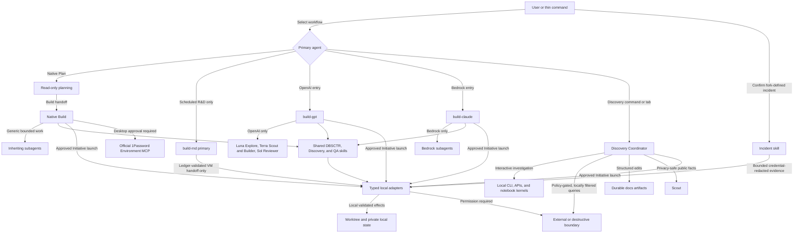
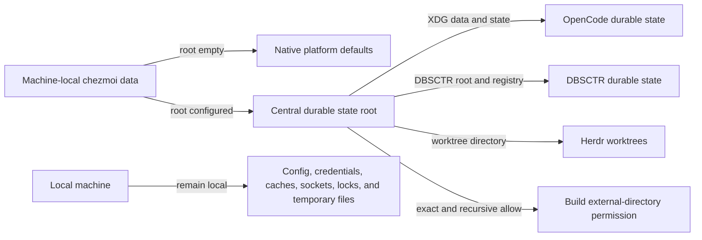

# OpenCode Control Plane

**Status:** OCP-30 delivered to Git without live apply; OCP-27/OCP-28 provider-native harness deployed
**Discovery readiness:** Complete
**Provider-native harness:** Delivered; GPT activation passed and unavailable Opus 5 invocation remains a provider-local follow-up

## Engineering Profile

### Defaults

| Field | Value |
|---|---|
| Deliverable | Managed OpenCode providers, agents, commands, permissions, skills, and routing |
| Languages/frameworks | JSON/JSONC configuration, Markdown agent prompts, Python contract tests |
| Modules | ML/AI |
| Runtime/platform support | OpenCode on the managed macOS host and managed Fedora 44 Lima guests; Python `>=3.12` tests |
| Public compatibility | Preserve native Plan-to-Build and provider-affine Build workflows; retire provider entries that current authentication cannot use |
| Trust/data classification | Local configuration and public provider metadata; credentials remain outside the repository |
| Operational owner | Dotfiles owner maintains deployment and OpenCode compatibility |

### OCP-16 Cycle Overrides

| Field | Value |
|---|---|
| Risk | Elevated: adds an external documentation boundary and changes typed cycle-begin authorization |
| Delivery intent | Deploy managed OpenCode configuration, Scout permissions, lifecycle routing, and tests locally |
| Scope | Scout-only Context7 with optional environment credential; standing authorization for validated typed begin in Build |
| Overrides | Plan remains read-only; Context7 is non-authoritative and optional; destructive and external writes remain permission-gated |

### OCP-19 Cycle Overrides

| Field | Value |
|---|---|
| Risk | Elevated: grants a native-Build workflow bounded claim and draft-PR delivery interfaces |
| Delivery intent | Deploy the managed worker command, typed coordination adapters, and narrow permissions locally |
| Scope | Global review, holistic research, atomic claim, Discovery pause, explicit proceed, isolated DBSCTR cycle, and draft PR |
| Overrides | Only `chezmoi-dotfiles-ai` is writable; private provenance is withheld; no automatic merge, release, deployment, or Discovery answer |

### OCP-26 Cycle Overrides

| Field | Value |
|---|---|
| Risk | Elevated: makes auto-approval durable inside client VMs and exposes bounded remote-history adapters |
| Delivery intent | Deploy Linux-compatible OpenCode configuration and VM-only policies with host behavior unchanged |
| Scope | VM config rendering, always-auto restored sessions, VM Herdr integration, local history export, and configured-workspace handoff |
| Overrides | OS controls and repository-scoped credentials remain authoritative; no per-subagent remote executor is claimed |

### Provider-Native Harness Initiative Overrides

| Field | Value |
|---|---|
| Risk | Elevated: changes global model selection, agent prompts, provider routing, and private evaluation identity |
| Delivery intent | Delivered and deployed managed provider-affine OpenCode configuration on integrated DAI-011 commit `c24f7e5` |
| Scope | Exact provider entry commands, Opus 5 high, provider-native prompts, strict provider affinity, exact telemetry identity, and report-only five-cycle evaluation |
| Overrides | OpenAI and Bedrock billing routes never mix automatically; no account, role, email, or client label enters telemetry; unavailable Opus inference becomes an operational follow-up rather than fallback |

### OCP-32 Cycle Overrides

| Field | Value |
|---|---|
| Risk | Elevated: changes durable-state locations and lifecycle record compatibility |
| Delivery intent | Draft pull request without live state migration or managed deployment |
| Scope | Optional centralized state root, LaunchAgent environments, Herdr worktrees, OpenCode permissions, and DBSCTR schema-4 portability |
| Overrides | Empty configuration preserves native defaults; existing SQLite stores retain their formats; live relocation requires a separately validated cutover and rollback |

### OCP-33 Cycle Overrides

| Field | Value |
|---|---|
| Risk | Elevated: changes managed model routing for global title generation and read-only OpenAI exploration |
| Delivery intent | Merge source through a pull request without applying managed configuration |
| Scope | Route `small_model` and `explore-openai` to GPT-5.6 Luna while retaining Terra for Scout and Builder and Sol for primary review |
| Overrides | Luna remains bounded to disposable titles and read-only source discovery; primary verification and same-provider failure recovery remain authoritative |

### OCP-35 Cycle Overrides

| Field | Value |
|---|---|
| Risk | Elevated: restarts interactive agents from durable external state |
| Delivery intent | Deploy exact-session recovery to the managed Herdr server |
| Scope | Persisted active-session manifest, exact wrapper launch, duplicate prevention, and fail-closed startup recovery |
| Overrides | Existing panes and sessions remain authoritative; recovery never creates substitute sessions or reconstructs layouts |

### OCP-36 Cycle Overrides

| Field | Value |
|---|---|
| Risk | Elevated: exposes 1Password Environment operations to host OpenCode through the desktop application's approval boundary |
| Delivery intent | Deploy the official host-local 1Password MCP configuration and deliver a draft pull request |
| Scope | Absolute executable selection, macOS-only rendering, Environment capability boundary, focused tests, resolved configuration, fresh MCP connection, and restart guidance |
| Overrides | The MCP never manages Password Manager vaults/items or service-account access, never returns Environment secret values, and does not replace existing `op` CLI workflows |

### OCP-37 Cycle Overrides

| Field | Value |
|---|---|
| Risk | Elevated: priority processing changes latency and doubles published OpenAI token rates |
| Delivery intent | Deploy managed Fast model routing and deliver a draft pull request |
| Scope | Route OpenAI Plan, Build, Reviewer, Explore, Scout, Builder, explicit GPT entry, and disposable small-model work to GPT-5.6 Fast counterparts |
| Overrides | Existing Sol/Luna/Terra role allocation, reasoning effort, provider affinity, and fallback boundaries remain unchanged |

### OCP-38 Cycle Overrides

| Field | Value |
|---|---|
| Risk | Elevated: migrates private OpenCode history across an identity and VM boundary |
| Delivery intent | Rehearse on disposable snapshots, deploy one validated pruned database to a client guest, and deliver a draft pull request |
| Scope | Consistent SQLite backup, exact project selection, path rebasing, credential scrubbing, relationship validation, guest rollback, and direct Tailscale Herdr access |
| Overrides | The host database remains read-only; the replaceable guest database is backed up before cutover; unrelated projects, credentials, and sessions never enter the guest |

### OCP-39 Cycle Overrides

| Field | Value |
|---|---|
| Risk | Elevated: changes the inherited environment of a persistent Herdr server and every child pane |
| Delivery intent | Deploy scoped centralized-state routing without restarting active Herdr panes, then deliver a draft pull request |
| Scope | Remove generic XDG paths from the Herdr LaunchAgent while preserving explicit state roots and OpenCode wrapper routing |
| Overrides | Existing panes remain active; the managed plist takes effect at the next natural server start; no data moves or permissions change |

### OCP-40 Cycle Overrides

| Field | Value |
|---|---|
| Risk | Elevated: unrestricted coordinator Bash can mutate local or external systems and bypass the structured `docs/**` edit boundary |
| Delivery intent | Deploy the managed Discovery coordinator permission and deliver a draft pull request |
| Scope | Interactive local CLI, API, notebook-kernel, and private-system investigation during single-context and Initiative Discovery |
| Overrides | Native CLI/API access is preferred over browser automation; source edits remain out of role, and external, destructive, costly, or irreversible actions still require explicit user confirmation |

### OCP-43 Cycle Overrides

| Field | Value |
|---|---|
| Risk | Routine: changes only reversible managed compaction retention |
| Delivery intent | Merge source through a pull request without applying managed configuration |
| Scope | Preserve 65,536 recent tokens verbatim after automatic compaction |
| Overrides | Optimize the global budget for the normal Sol route; keep OpenCode trigger, pruning, and turn defaults |

### OCP-45 Cycle Overrides

| Field | Value |
|---|---|
| Risk | Elevated: longer active Sol context can materially increase latency and token cost |
| Delivery intent | Deliver a draft pull request, merge after explicit approval, then apply and verify the managed OpenCode target |
| Scope | Correct base and Fast GPT-5.6 Sol metadata to the provider's 1,050,000 context, 922,000 input, and 128,000 output limits |
| Overrides | Preserve the 65,536-token recent tail and inherit OpenCode's automatic trigger, 20,000-token safety reserve, pruning, and turn defaults |

## Overview

The OpenCode control plane owns global providers, agents, commands, permissions,
skills, and Graphify routing. It keeps OpenAI and Amazon Bedrock workflows
provider-affine while removing unused Claude Code, Meridian, Headroom, and OMO
surfaces.

For this initiative, `dbsctr_v3_lifecycle` owns shared lifecycle and evaluation
semantics, while `dotfiles_ai_distribution` owns federated capture transport,
weekly scheduling, private report persistence, and operational deployment.

## Visual Evidence

| Concern | Decision | Review question | Canonical source | Owner/change trigger |
|---|---|---|---|---|
| Boundary | required: provider-affine control flowchart | Which surfaces own routing, permissions, lifecycle, and provider selection? | Overview and Contracts | Control-plane owner; ownership or permission changes |
| Interaction | required: provider-affine control flowchart | How do Plan, Build, and bounded subagents hand work off? | Plan and Build behavior | Control-plane owner; handoff or delegation changes |
| State | required: optional centralized-state flowchart and lifecycle Incident state diagram | Which durable paths and private Incident states change, and what remains native by default? | OCP-32 behavior and V3.39 lifecycle contracts | Control-plane owner; state-root or Incident persistence changes |
| Data/trust | required: provider-affine control flowchart and lifecycle Incident sequence | Where are local, redacted model-visible, external, and provider boundaries enforced? | Permission, provider-affinity, and V3.39 Incident contracts | Control-plane owner; trust boundary changes |
| Schema | not_applicable: JSON configuration and typed adapter schemas remain authoritative | - | Managed configuration and tests | Control-plane owner |
| Dependency/deployment | required: provider-affine control flowchart | Which managed surfaces are loaded into OpenCode? | Engineering Profile and File contracts | Control-plane owner; loaded surface changes |
| Quantitative | not_applicable: evaluation metrics are persisted evidence, but this specification makes no comparative decision from a current dataset | - | Evaluation contracts | Control-plane owner |

V3.35 corrects delivered status and evidence wording without changing provider
routing, trust boundaries, or control-plane topology. The existing view and Text
Equivalent remain current.

**Text Equivalent:** Thin commands select a native, Discovery, or provider-affine primary.
Plan is read-only and hands bounded scope to Build. Native Build uses generic
inheriting subagents. A separate `build-rnd` primary runs only managed
`/dbsctr-improve` sessions and alone may request the ledger-validated VM handoff;
ordinary Build and every other agent deny that launcher. The Discovery Coordinator may investigate through unrestricted
local Bash using native CLIs, APIs, and notebook kernels, writes durable artifacts
through a `docs/**`-scoped structured edit tool, and uses Scout only for privacy-safe
public facts. Governed private result bodies remain local; only locally filtered,
privacy-safe metadata enters model context. Unrestricted Discovery Bash can reach
the external boundary under prompt and standing policy rather than OpenCode command
matching. `build-gpt` routes read-only Explore to Luna, Scout and
Builder to Terra, and explicit review to Sol while remaining entirely within
OpenAI; `build-claude` uses only Bedrock subagents. All primaries load shared
lifecycle skills and typed local adapters. The Discovery Coordinator and primary
Build agents may request an approved Initiative launch; Plan and all subagents
must hand it off. Validated local effects may reach the worktree or private local
state; external or destructive effects remain
permission-gated for Build and confirmation-gated by policy for unrestricted
Discovery Bash. An operator-confirmed Incident fork may send only bounded,
credential-redacted Incident Evidence through typed adapters to the active model
and private local state. Host Build may request official 1Password Environment
operations, but the desktop app retains approval and the MCP never returns secret
values or manages Password Manager vaults. The control-plane owner updates this view when routing,
delegation, loaded skills, adapters, permissions, or provider boundaries change.

**Text Equivalent:** With no configured root, every component keeps its native
location. With a root, OpenCode and lifecycle workers receive XDG and DBSCTR
locations. Herdr receives explicit component roots and its worktree directory,
but not generic XDG paths that would redirect unrelated pane tools. Build receives
only the root and subtree permissions. Configuration, credentials, caches,
sockets, locks, and temporary files remain local. This repository change does not
move live data or restart a running OpenCode process.

**Text Equivalent:** The source OpenCode database is opened read-only and copied
with SQLite's backup API so committed WAL data is included. The disposable copy
keeps exactly the configured client projects, their complete session-related rows,
and matching event streams. It rebases only declared host path prefixes, removes
host-global credentials and unrelated event streams, then requires SQLite and
semantic relationship checks before replacing a separately backed-up client guest
database. Any failed guest smoke check restores that backup.

## Goals

- Keep native Plan and Build, plus provider-affine `build-gpt` and `build-claude`.
- Keep direct Bedrock Claude and raw LM Studio models.
- Make workflow commands inherit the selected primary agent.
- Allow local Build commands by default while gating external or destructive writes.
- Give Builder subagents bounded write access without Git, deployment, or external paths.
- Install only OpenCode-compatible skills, once.
- Preserve Graphify CLI, skill, graph, hooks, and health-gated query-first routing.
- Remove Claude Code, Meridian, Headroom, OMO, and their runtime state completely.
- Bind provider-specific DBSCTR entry commands to both the intended primary and
  exact model instead of relying on model selection to change the active agent.
- Optimize each primary for its provider's current prompting guidance without
  weakening executable validation or provider isolation.
- Use Luna for low-impact, high-volume OpenAI work without weakening source
  verification, implementation, or review tiers.
- Expose official 1Password Environment workflows on the managed macOS host while
  retaining desktop approval and secret non-disclosure.

## Non-goals

- No new orchestration framework, review agent, custom MCP server, or benchmark suite.
- No Graphify package changes.
- No removal of Bedrock Claude or raw LM Studio.
- No changes to V1 `dbsctr` or `discovery`.
- No Bedrock reviewer, cross-provider fallback, human-review workflow, automatic
  prompt tuning, or provider-account telemetry.

## Ubiquitous Language

| Term | Meaning |
|---|---|
| Control Plane | Managed OpenCode config, agents, commands, permissions, skills, and routing. |
| Provider Affinity | Delegation remains inside the active primary's provider family. |
| Local Build Command | In-worktree command without external, destructive, deploy, publish, or Git-write effects. |
| Runtime Residue | Unmanaged config, package, service, authentication, cache, or backup from a removed integration. |
| Graph Health Gate | Freshness and relevance check before trusting a Graphify query. |
| Provider Entry Command | Command that atomically selects a provider-affine primary and its exact model. |
| Provider Overlay | Conditional prompt guidance loaded only for the selected provider family. |
| Integration Evidence | Tests, contracts, diff coherence, and downstream checks; not a generic request for the model to review itself again. |
| Evaluation Cohort | Five comparable completed cycles evaluated under one versioned rubric without automatic remediation authority. |
| Scoped Runtime Environment | Component-specific state variables exported only to the runtime that owns their paths, rather than inherited by every child process. |
| Discovery Coordinator | User-facing primary that investigates and coordinates Discovery, persists durable `docs/**` artifacts, and requests exact approval before launching a ready slice. |

## Behavior

### Provider-neutral commands

Given any selected primary, when `/dbsctr`, `/discovery`, or `/qa` runs, then
the command uses that primary and does not force OpenAI.

### Plan and Build permissions

Given a Plan primary, edits are denied and Bash requires approval. Given a Build
primary, local commands run by default while known external, destructive,
deployment, publishing, and Git-write commands require approval.

### Interactive Discovery permissions

Given the Discovery Coordinator needs live local or private-system evidence, when
it investigates a bounded question, then unrestricted Bash is available for the
native CLI, API, or notebook-kernel path. It does not use browser automation as a
shell proxy when a direct interface exists. Its structured edit permission remains
limited to `docs/**`, but Bash is not a filesystem or side-effect sandbox; external,
destructive, costly, irreversible, and material scope-expansion actions retain the
user-confirmation boundary. Governed private result bodies remain local and only
locally filtered, privacy-safe metadata or bounded typed-adapter output may enter
hosted-model context.

### Scoped centralized state

Given a machine configures a centralized state root, when launchd starts Herdr,
then the server and its panes receive explicit DBSCTR, Hermes, and state-root
variables but no generic XDG data or state home. When the managed OpenCode wrapper
or a lifecycle worker starts, it still receives the configured XDG paths. An
active Herdr server remains undisturbed and adopts the corrected environment at
its next natural start.

### Bounded Jira reads

Given a user explicitly supplies a Jira key or URL, the global and native Plan
Bash maps allow direct ACLI account-status, work-item view, and comment-list
reads. Broader JQL research remains ask-gated and denies pagination, browser, and
filter forms. Other direct ACLI commands, absolute paths, common wrappers,
and shell chaining or redirection remain denied. Writing behavior and consent are
owned by `writing_skills`; this control plane owns only the coarse permission
boundary.

### Native Plan-to-Build handoff

Given native Plan completes planning, its built-in exit path targets the native
`build` agent. Native Build therefore remains enabled. `build-gpt` and
`build-claude` are lowercase filename-derived custom-primary IDs selected through
the agent control or exact `--agent` value; changing only the model does not
change the active agent.

### Bounded Builder

Given a provider-local Builder subagent, it may edit owned in-worktree files and
run focused checks, but cannot use external directories, delegate, write Git
state, deploy, publish, or perform external writes.

### Provider affinity

Given an OpenAI primary, it delegates only to OpenAI optimized agents. Given
`build-claude`, it delegates only to Bedrock optimized agents. No fallback
crosses providers silently.

### Exact provider entry

Given the user invokes `/dbsctr-gpt`, when OpenCode starts the workflow, then it
selects `build-gpt` with `openai/gpt-5.6-sol-fast`. Given the user invokes
`/dbsctr-claude`, then it selects `build-claude` with
`amazon-bedrock/global.anthropic.claude-opus-5` at high reasoning effort. The
existing provider-neutral `/dbsctr` command continues to inherit the selected
primary.

### Provider-native review behavior

Given GPT work is routine or elevated, when the primary validates it, then it
uses executable evidence without a routine reviewer. Given GPT work is explicit
review work or critical, `reviewer-openai` remains available with a bounded
read-only brief. Given Claude Opus 5 work at any risk, the prompt relies on the
model's native self-correction plus executable evidence and does not instruct a
reviewer subagent or enforce human review.

### No cross-client fallback

Given a provider model, credential, or optimized subagent is unavailable, when a
workflow cannot use its selected route, then it reports unavailability and never
switches between OpenAI and Bedrock automatically. Opus 5 configuration may be
delivered before live account access is available; the missing live inference is
tracked as a bounded operational follow-up and does not restore Opus 4.8.

### Exact private evaluation identity

Given sanitized lifecycle telemetry is available, when provider-native effects
are evaluated, then it records allowlisted provider, model, agent,
`session_relation`, core revision, provider-overlay revision, gate outcomes,
remediation, tools, elapsed time, tokens, and cost. It never records an AWS
account, account/user role, email, client label, prompt, transcript content,
credential, URL, or path.

Exact telemetry is a separately versioned nested envelope, not federation schema
version `2`. Telemetry schema `2` adds bounded provider/model/agent ID sets,
`session_relation` (`primary` or `child`), core and overlay revisions, per-field
availability, and existing aggregate metrics. Legacy telemetry remains readable
with every unavailable field explicit. The helper, VM exporter, and typed adapter
validate the same exact schema before federation transports it unchanged.

For new cycles, the loaded OpenCode runtime supplies one immutable harness
activation identity containing exact primary agent/model/provider and the
core/overlay revisions it loaded. Validated begin or attach records that identity;
an on-disk digest observed after process start is not runtime evidence. Every
attached root session must agree. Missing, conflicting, unmanaged, or historical
identity without authoritative retained evidence remains `unavailable`; timestamp
or deployment-history guesses are forbidden.

Given five comparable completed cycles are available, when the R&D worker runs,
then it produces a report-only evaluation and labels simultaneous model and
prompt changes as confounded. Any prompt, model, agent, or routing change starts
a separately approved DBSCTR cycle.

The evaluator extends DAI-011's deployed federation contract rather than creating
another scan path: each source is captured once, pages replay by immutable
`capture_id`, source capture remains concurrent and manifest-ordered, and
an eligible evaluation atomically persists its own sanitized five-member cohort
and report before unreferenced transient captures expire. Evaluation runs at the
next eligible weekly worker execution without changing or halting its cadence.

The typed adapter privately records a transient terminal capture receipt keyed by
the existing manifest digest. It contains ordered source/capture/query/exclusion
identity, a distinct source-local `privacy_epoch_digest`, and page/member digests,
completes missing pages from immutable captures, and supports single-page passes
where continuation `source_state` is `null`. Federation manifest schema `2` and
its pagination response remain unchanged. Capture `exclusion_digest` continues to
bind worker self-exclusion and is never interpreted as privacy-forget state.

One report member is one completed DBSCTR cycle, represented as structured
`source_id` plus `cycle_id`, never a colon-joined host identifier. Eligibility
requires one exact root-session cycle correlation, one primary provider/model/
agent/core/overlay identity, same-provider children, and complete required
metrics. The first five unused eligible cycles for one exact harness identity are
ordered by completion time then cycle ID. Risk, context, and delivery distributions
are report confounders rather than nondeterministic selection rules.

### ChatGPT OAuth model exposure

Given OpenAI uses ChatGPT OAuth, only models and reasoning-effort variants
supported by that route are exposed. Native Plan and `build-gpt` use base
GPT-5.6 Sol with medium effort by default, while the user may select another
supported effort variant. No agent or provider override claims unavailable Pro
reasoning mode. The ChatGPT OAuth backend rejects base Sol requests containing
`reasoning.mode: "pro"` with `unsupported_value`.

Given managed defaults are rendered, `small_model` resolves to GPT-5.6 Luna for
automatic title generation. This setting does not claim to route compaction,
summary generation, implementation, or review through Luna.

### Managed compaction retention

Given managed defaults are rendered, automatic compaction preserves up to
65,536 tokens from the most recent turns verbatim. OpenCode continues to own the
automatic trigger, safety reserve, pruning, and turn-count defaults. Older
conversation content remains summary-backed, so durable specifications and cycle
evidence remain authoritative for requirements and raw evidence outside the
recent tail.

Given either `openai/gpt-5.6-sol` or `openai/gpt-5.6-sol-fast` is resolved, its
managed provider metadata reports a 1,050,000-token context window partitioned
into at most 922,000 input tokens and 128,000 output tokens. With OpenCode
1.18.25's inherited 20,000-token reserve, automatic compaction begins at roughly
902,000 input tokens instead of the stale roughly 252,000-token threshold. The
Fast identity continues to select priority processing; model routing and
reasoning effort do not change.

Given provider metadata later becomes authoritative at or above these limits,
the managed override may be retired after rendered and resolved configuration
prove that removing it preserves the same limits. If the provider lowers a
limit, managed metadata must be corrected before use rather than allowing
requests beyond the supported boundary.

Given `build-gpt` delegates bounded source discovery, `explore-openai` uses
GPT-5.6 Luna with low reasoning effort and remains read-only. Scout and Builder
continue to use GPT-5.6 Terra with medium effort, and Reviewer continues to use
GPT-5.6 Sol with medium effort. The primary verifies source-backed exploration
results and retries a failed optimized route once on its active OpenAI flagship;
no failure changes provider family.

The accepted baseline is the prior Terra route with identical Explore prompt and
permissions. Contract tests must prove that only the model identity changes.
Current provider metadata prices Luna at one tenth of Terra's input, cached-input,
and output token rates; no latency or quality improvement is claimed without
separate measured evidence. Reassess the route when OAuth entitlement changes,
the model is deprecated, or observed retries materially offset the cost benefit.

### Removed integrations

Given deployment completes, Claude Code, Meridian, Headroom, OMO, their wrappers,
providers, services, packages, skills, authentication, state, backups, and
historical project documentation are absent. Bedrock Claude remains available.

### Graphify preservation

Given an existing graph, architecture work checks graph freshness and relevance,
queries it when useful, verifies findings against source, and falls back to
source search when stale or weak. Full Graphify creation, update, query, and Git
hook behavior remains available without a duplicate project plugin.

### Private DBSCTR review

Given `/dbsctr-review` runs under any selected primary, it loads the unversioned
review skill and uses a read-only typed scan. Persisting the sanitized private
report asks through a separate typed completion permission. The completion tool
writes only DBSCTR operational review state and grants no repository mutation.

Given a review spans pages, when the first page captures a snapshot, then typed
continuations and completion preserve that snapshot and reject changed sanitized
candidate metadata. Session prose without structured lifecycle authority reports
`unknown` rather than a guessed terminal state.

Given detailed reports exceed 90 days, completion or explicit maintenance prunes
them while compact private reviewed-ID tombstones preserve review progress.
Candidates expose independent Cycle Record states and page-local urgency without
inventing an aggregate state.

Given `/incident` runs in an OpenCode fork, it loads the unversioned Incident
skill and uses a read-only typed scan before asking separately to register or
update private Incident state. Registration requires the invoking child session,
bounded credential-redacted evidence, and operator-confirmed classification.
The typed write grants no repository mutation or automatic remediation.

Given `/dbsctr-review` scans the operational inbox, it presents registered
Incidents and unclaimed automatic Signals before ordinary Review Candidates.
Incident lifecycle writes remain separate from ordinary review completion and
remain denied to Plan and subagents.

### Autonomous R&D worker

Given a fresh scheduled `build-rnd` primary session, when its managed worker command
runs, then it applies exactly one assigned lens to all eligible global sanitized
review evidence, compares it with the
private improvement ledger, this repository's specs/source/tests and GitHub
state, and authoritative external documentation through Scout when useful.

Given a defensible distinct opportunity, when the worker claims it atomically,
then it records lens telemetry and runs Discovery in the same session. Explicit
autonomous readiness may durably authorize noncritical P1-P3 work only when no
material question remains; exact operator confirmation is recorded separately.
P0, critical, and uncertain work waits for the operator.

Given autonomous readiness or explicit proceed and completed Discovery, when the worker begins DBSCTR,
then it edits only the helper-owned isolated worktree for this source and may use
the typed claim and draft-PR delivery interfaces. Builder and read-only subagents
remain denied those writes.

Given any agent other than `build-rnd`, when it considers a VM implementation
handoff, then `dbsctr_vm_handoff` is denied rather than probed. The tool is only
the final approved step of `/dbsctr-improve`; it is not a dry run, capability
probe, Initiative launcher, or ordinary host Build operation.

Given no distinct finding under the assigned lens, then the worker records
no-yield and its exact telemetry. Typed federation removes review-worker session
families before returning ordinary-lens pages; only `review_session_governance`
receives attributed review sessions, and legacy unattributed sessions fail
closed into neither scope. No lens manufactures a proposal merely to finish a run.

Given typed cycle begin runs, stable OpenCode tool context records the initiating
session and worktree in the Cycle Record. Optional Herdr launch metadata remains
advisory, uses no-focus launch, and never changes lifecycle state or cleanup.

Given an approved Build implementation is handed to a managed VM, the adapter
uses the lowercase Herdr agent identity `dbsctr-handoff` and the managed
OpenCode `run --agent build --interactive` contract. The Build authority remains
hard-coded rather than caller-controlled, and handoff requires the distribution
context's exact host/guest OpenCode version parity.

Given `build-rnd` requests that handoff, before permission or VM access the
adapter requires `DBSCTR_RND_WORKER_ID` to equal the requested worker, reads one
authoritative worker from the ledger, and requires the invoking session,
Discovery state, operator or autonomous authorization, Discovery report, exact
declared paths, and autonomous readiness risk to match. Missing, placeholder,
stale, or mismatched evidence fails without running parity or Herdr. Approval is
bound to the resolved workspace and VM instance; after approval the adapter
rereads the worker ledger, runs parity, and requires the instance to remain
unchanged before any `limactl` call.

Given a Build session remains rooted in the source checkout, typed reconciliation
may name an isolated linked worktree. The adapter canonicalizes both paths and
requires an exact Git top-level beneath the managed DBSCTR worktree root and the
same Git common directory before invoking the lifecycle helper; outside-root and
foreign repositories fail before reconciliation.

Given `/dbsctr-review` is asked to inspect history, a separate read-only typed
tool includes reviewed candidates through bounded composable filters and fixed
cohort replay. A schema-validated history-save tool has standing authority only
for sanitized private reports and cohort manifests; it never changes operational
review markers or repository state and remains denied to Builder subagents.
The save tool optionally forwards the source history page's `limit` and `cursor`
so complete-page cohorts can use source-bound exact-member revalidation; callers
that omit them retain strict whole-snapshot validation.

### Runtime Health And Compact Analytics Interfaces

OCP-17 runtime health and OCP-18 compact analytics are current after deployment.
The typed adapters preserve the helper's authoritative history, telemetry, and
benchmark contracts.

Given a validated Build primary attaches its current runtime to an active cycle,
the typed control plane accepts an explicit cycle worktree, canonicalizes it
beneath `DBSCTR_WORKTREE_ROOT`, and keeps it as that session's cycle-tool target.
The helper persists only validated runtime identity; an unrelated OpenCode launch
path is not added to the Cycle Record. Subsequent cycle-scoped typed operations
route to the target without requiring an OpenCode relaunch. Herdr health remains
advisory metadata for the actual launch context and is one of `healthy`,
`missing`, `ambiguous`, or `unavailable`; malformed Herdr output fails closed and
never changes a Cycle Record, gate result, or improvement state.

Runtime attachment requires structured message identity that resolves through
the authoritative OpenCode database to a parentless primary session and exactly
matches the supplied session ID. The attachment command accepts no database
override. Child Builder sessions fail at the helper boundary even if a shell
wrapper bypasses textual command matching; supplying a primary message can only
idempotently attach that primary.

`dbsctr_runtime_health` invokes only structured `herdr pane current`. Outside a
Herdr runtime or when the command is unavailable it returns `unavailable`; a
valid absent pane returns `missing`; malformed output or mismatched OpenCode
session/worktree identity returns `ambiguous`; and an exact current pane returns
`healthy` with bounded presentation IDs and normalized agent status. It emits no
path, command error, or private content and performs no write. The Herdr probe
has a two-second timeout and 64 KiB output cap, and compares canonical existing
worktree paths so equivalent macOS/symlink spellings do not create false health.
The probe runs in its own process group so timeout terminates descendants that
retain output pipes.

Given a caller requests compact history or benchmark evidence after the matching
helper interface is finalized and deployed, typed adapters
expose bounded capture summary, ordered member drill-down, exact replay, telemetry
availability, and versioned benchmark results from finalized helper JSON
contracts. Schemas reject unknown arguments, invalid cursors, oversized requests,
and malformed helper output. No adapter returns an unbounded member collection.
The read-only tools are `dbsctr_history_capture`, `dbsctr_history_telemetry`, and
`dbsctr_benchmark`. They execute argument vectors without a shell, cap combined
helper output at 256 KiB with a 30-second timeout, reject unsafe path/URL content,
and validate the returned contract before exposure. Legacy history without a
telemetry envelope is normalized only to explicit `unavailable` fields; adapters
never infer a value or classification.

Plan, Reviewer, Explore, Scout, and Builder agents cannot attach runtimes or
write analytics state. Read-only analytics access and permissioned private-state
writes remain separate tools. OpenCode adapters never duplicate helper lifecycle,
capture, attribution, or benchmark state machines.

### Scout-only current documentation

Given a Scout-class subagent needs current dependency documentation, when it
uses Context7, then OpenCode connects to the managed remote MCP endpoint and
exposes only `context7_*` tools to Scout-class agents. Primary, Builder,
Reviewer, and Explore agents cannot use those tools.

Given `CONTEXT7_API_KEY` is non-empty, Context7 requests use it through runtime
environment substitution. Given it is absent, Context7 remains usable through
its anonymous service and no credential is required. The key is never stored in
Git, rendered source, agent prompts, logs, or tool arguments.

Context7 results are research hints. Scout verifies material claims against
project source or authoritative upstream documentation and reports uncertainty.

### Approved 1Password Environment operations

Given OpenCode runs on the managed macOS host and the official desktop MCP is
enabled, when the primary Build agent invokes a `1password_*` Environment tool,
then OpenCode asks for tool permission, starts exactly
`/usr/local/bin/1password-mcp`, and the 1Password desktop app owns authentication,
Environment selection, approval, and lock expiry. All other agents inherit a
global deny for these tools.

Given the same source renders in a Fedora Lima guest, when OpenCode loads its
configuration, then no 1Password MCP entry exists because the desktop application
and its local authorization boundary are absent.

Given an agent needs Password Manager vault items, service-account access grants,
or plaintext Environment values, when it considers this MCP, then it reports the
capability mismatch and uses a separately approved `op` CLI or operator workflow.
The MCP never claims to retrieve Environment secret values.

### Standing typed cycle begin

Given Build invokes `dbsctr_begin` with an applicability plan, when OpenCode
dispatches the typed tool, then it runs without another permission prompt. The
helper still validates the committed profile, upstream, worktree safety, ahead
commits, plan, risk, and arguments before creating local cycle state.

Plan continues to deny `dbsctr_begin` and returns a Build Handoff. Direct
destructive operations, external writes, deployment, DVC push, and non-DBSCTR
Git push retain their existing permission boundaries. Optional Herdr launch
remains explicit through `launch=true` and never becomes lifecycle authority.

### Initiative slice launch

Given an Initiative slice has a fresh readiness receipt and exact approval, when
the Discovery Coordinator or a native or provider-affine primary Build agent
invokes `dbsctr_initiative_launch`, then OpenCode asks for the digest-bound launch
and the adapter retains its repository, plan-digest, ownership, and mutation
checks. Plan and all subagents deny the launcher. They return a handoff instead of
probing a denied tool or substituting `dbsctr_vm_handoff`, which remains a distinct
sanitized VM implementation workflow.

Given the primary orchestrator operates on a helper-created isolated worktree,
OpenCode allows external-directory access beneath the native worktree root and,
when configured, the exact centralized state root. Provider-specific Build
primaries inherit those generated global paths rather than replacing them with a
native-only rule. Plan and every subagent retain their existing restrictions;
Builder agents remain confined to the worktree where they were launched.

Given a Build primary deploys the standalone AI dotfiles source, it may read and
edit only the machine-local `~/.config/dotfiles-ai/**` config and persistent
state directory outside the worktree. Plan and subagents remain denied, and no
personal chezmoi, credential, or arbitrary external path is exposed.

Given a workspace mount declares non-empty reference metadata, when chezmoi
renders OpenCode configuration, then it exposes the host or guest path under the
configured reference name. A mount without reference metadata is omitted. The
absolute path never enters shared defaults or generated documentation.

### Sandboxed Client Runtime

Given OpenCode runs inside a managed client VM, its VM profile auto-approves
every permission not explicitly denied, uses only VM-local configuration,
credentials, plugins, MCP state, and session database, and cannot access the
host OpenCode database or unmounted host paths.

Given Herdr restores a VM pane after restart, OpenCode resumes the exact session
under the same always-auto VM policy even though Herdr's native resume argv omits
the original `--auto` flag. Host OpenCode permissions remain unchanged.

Given the managed host Herdr server restarts, when a persisted active-session
manifest names an existing empty pane, existing directory, and exact session in
the configured OpenCode database, then recovery launches
`~/.local/bin/opencode --session SESSION` in that pane. Sessions already running
are skipped. Missing state, invalid manifest entries, missing directories,
unknown sessions, occupied panes, launch failures, or identity mismatches are
reported and never create substitute sessions. Herdr's persisted layout remains
authoritative; recovery does not create, close, or rearrange panes.
While Herdr runs, its owner snapshots exact foreground OpenCode pane, directory,
and session argv atomically once per minute. A restart therefore restores the
latest observed active set, including sessions opened after deployment.

Native Task subagents remain child sessions in their owning OpenCode server and
filesystem. The control plane does not claim per-subagent VM isolation; host and
VM OpenCode servers are separate runtimes.

Given an operator migrates host OpenCode history into a replaceable managed guest,
when the migration candidate is built, then the host database is opened read-only
and SQLite creates a consistent backup at a new path. The candidate keeps only
the exact declared project roots and their complete session graph, rewrites only
declared path prefixes, retains event streams whose aggregate is a retained
session, and removes host-global account and credential rows.

Given a project root is absent or duplicated, a required table or column is
unknown, an output already exists, a path remains under a declared old prefix,
or a retained session has a dangling parent, workspace, message, part, or event
relationship, when migration runs, then it fails without changing the source or
guest database and reports only bounded counts and field names.

Given the disposable candidate passes validation, when guest cutover occurs,
then the guest OpenCode and Herdr writers are stopped, its existing database is
backed up, the candidate is installed with owner-only permissions, and a fresh
guest process lists representative root and child sessions. Failed startup,
integrity, count, path, or resume checks restore the guest backup.

Given the client VM is running and Tailscale SSH is available, when a remote operator
attaches, then `herdr --remote HOST` connects directly to the guest Herdr server;
an intermediate host Herdr session and shell alias are not required for that path.

Given host R&D requests VM history, a VM-local adapter scans only its local
database and returns one size- and time-bounded sanitized source envelope. The
host adapter accepts only configured instance IDs and fixed commands, namespaces
opaque identities by source, and rejects raw paths, URLs, transcript content,
unknown schema fields, changed continuation identity, and oversized output.
Independent source captures run concurrently with at most four workers and remain
ordered in the manifest. The typed aggregate call has no wall-clock timeout;
each source exporter retains its own 120-second deadline and the aggregate output
remains bounded. Every continuation is served from the source's immutable private
capture instead of rescanning its live OpenCode database.
The typed adapter independently reads the managed sandbox configuration and
rejects changed source membership or order. Federated reads explicitly create
private transient captures; unreferenced captures expire after 24 hours.

Given an approved and ledger-validated host handoff, the configured Build workspace OpenCode receives only the sanitized
context and approval identity plus instructions to start a distinct VM-owned
DBSCTR draft-PR cycle. The typed call returns only bounded Herdr launch
acceptance and presentation identity; cycle and draft-PR progress remain
guest-authoritative and are observed separately. It never attaches a VM runtime
to the host cycle or shares a Cycle Record across machines.

Given Hermes starts an R&D worker, OpenCode launches directly in the profile's
declared repository and returns one native session ID before improvement
registration. Herdr workspace, tab, and pane IDs are optional presentation fields,
not registration preconditions. A gateway restart re-reads the DBSCTR worker and
exact OpenCode session before any `opencode -s SESSION` recovery; an existing,
duplicate, missing, or ambiguous session blocks rather than starting substitute
work. Hermes may deliver the session ID for manual attachment but may not send a
Discovery answer, `proceed`, permission selection, merge, release, or deployment
instruction. Host, client, and personal OpenCode runtimes retain separate databases,
credentials, permissions, and Cycle Records.

The typed read interface is `dbsctr_review_federated`; it accepts the existing
history filters plus cursor and limit and returns the validated federated source
manifest schema version `2`. Continuation state binds its capture ID and normalized filter query, and the typed
boundary recomputes the manifest digest and correlates each state with its source
page. The separate read-only `dbsctr_lens_summary` interface asks every configured
source to inspect one complete immutable capture under a versioned lens and exact
review-session scope. It returns complete fixed distributions and at most 20
deterministic evidence projections per source, recomputes the terminal manifest
and telemetry, and writes a private lens receipt only for all-source success.
The existing provider-affine control flow remains current because this adds a
validated local adapter without changing provider routing. The typed write interface is `dbsctr_vm_handoff`; it accepts one
schema-versioned sanitized approved report and asks before launching the VM
session. Only the dedicated `build-rnd` primary exposes it under `ask`; ordinary
Build, provider-affine primaries, Plan, Discovery, and every subagent deny it.

## Contracts

- Host restart recovery reads only schema-versioned entries containing exact
  `pane_id`, `directory`, and `session_id` values. It validates session identity
  against the configured SQLite database and invokes the absolute managed
  OpenCode wrapper so external XDG state does not depend on pane `PATH`.
- Recovery accepts only canonical Herdr pane and OpenCode session identifiers,
  shell-quotes the validated wrapper argv, bounds Herdr API calls, and replaces
  captures atomically.
- VM handoff authorization is fail-closed before permission and VM access: the
  environment worker, request worker, ledger worker/session/state/authorization,
  persisted Discovery report, exact scope paths, and autonomous readiness risk
  must agree. Shape-valid placeholders carry no authority.
- The Herdr LaunchAgent must not export `XDG_DATA_HOME` or `XDG_STATE_HOME`.
  It retains `DOTFILES_AI_STATE_ROOT`, explicit DBSCTR paths, and `HERMES_HOME`;
  the OpenCode wrapper and scoped lifecycle LaunchAgents remain the owners of
  centralized XDG paths.
- Applying a changed Herdr plist while a server is active must not restart or
  boot out the server. The corrected environment becomes effective at the next
  natural login, reboot, or otherwise operator-approved server replacement.

- `$schema` remains `https://opencode.ai/config.json` and rendered config passes
  the current schema/runtime parser.
- `compaction.preserve_recent_tokens` is `65536`; `auto`, `prune`, `tail_turns`,
  and `reserved` remain omitted so OpenCode defaults govern them.
- Base and Fast GPT-5.6 Sol resolve to context `1050000`, input `922000`, and
  output `128000`; current inherited reserve behavior yields an approximately
  `902000`-token automatic compaction threshold.
- Direct provider `anthropic` is denied; `amazon-bedrock` is not.
- Raw `lmstudio` remains configured; `headroom` and `headroom-lmstudio` do not.
- Native Plan remains the startup default and native Build stays enabled as the
  built-in Plan exit target.
- `gpt-5.6-sol-pro`, `Plan-GPT-Pro`, `Plan-GPT-Pro-Max`, and `Build-GPT-Pro`
  are absent while ChatGPT OAuth excludes Pro reasoning mode.
- Native Plan and `build-gpt` resolve to `openai/gpt-5.6-sol-fast` with `medium`
  as their default effort; OpenAI Explore uses Luna Fast low, while Scout and
  Builder use Terra Fast medium. Fast model identities select OpenAI priority
  processing; they do not replace reasoning-effort variants.
- `build-claude` resolves to `amazon-bedrock/global.anthropic.claude-opus-5`
  with high reasoning effort; Bedrock optimized subagents remain on Sonnet 5
  medium. Opus 4.8 is retired rather than retained as fallback.
- `/dbsctr-gpt` and `/dbsctr-claude` bind exact primary and model identities;
  `/dbsctr` remains provider-neutral.
- `reviewer-openai` is available only to `build-gpt` for explicit or critical
  review. `build-claude` has no reviewer permission and no human-review mandate.
- A failed optimized subagent may retry once on its active same-provider flagship;
  no failure, quota, credential, or model-access condition changes provider family.
- Provider telemetry uses exact allowlisted runtime identity without provider
  account or billing-client metadata.
- Provider-neutral commands contain no fixed `agent` field. `/dbsctr-gpt` fixes
  `agent: build-gpt` and `model: openai/gpt-5.6-sol-fast`; `/dbsctr-claude` fixes
  `agent: build-claude` and
  `model: amazon-bedrock/global.anthropic.claude-opus-5`.
- `/dbsctr-review` contains no fixed agent field and loads its exact skill.
- `/incident` contains no fixed agent field and loads `dbsctr-incident`.
- `dbsctr_review` is read-only and allowed; `dbsctr_review_complete` asks before
  writing private operational state and remains denied to Builder subagents.
- `dbsctr_incident_scan` is read-only and allowed. `dbsctr_incident_register`,
  `dbsctr_incident_update`, and `dbsctr_incident_forget` ask before changing the
  private ledger and remain denied to Plan and subagents.
- `dbsctr_review_history` is read-only and allowed. `dbsctr_review_history_save`
  is allowed only for validated private history reports and remains denied to
  Builder subagents.
- `dbsctr_begin` is allowed for Build without an internal approval callback;
  Plan denies it, and the helper remains the authoritative safety boundary.
- The helper-owned DBSCTR worktree root is an allowed external directory for the
  Build primary orchestrators only; the global default is deny and the rule does
  not broaden arbitrary home-directory, Plan, or subagent access.
- The standalone `~/.config/dotfiles-ai/**` directory is allowed for Build
  primaries only so managed machine-local deployment values and source-specific
  persistent state can be maintained; the personal chezmoi config and all other
  external paths remain denied.
- `dotfiles_ai.state.root` is optional and empty by default. When set, managed
  LaunchAgents receive `DOTFILES_AI_STATE_ROOT`, XDG data/state homes, the DBSCTR
  state/worktree roots, and existing DBSCTR R&D file locations beneath that root.
  Herdr receives `<root>/herdr/worktrees`; native paths remain unchanged when the
  setting is absent or empty.
- A configured centralized root adds exact-root and recursive-subtree OpenCode
  external-directory allows after the broad deny for Build primaries. It does not
  broaden Plan or bounded subagents and does not remove native DBSCTR worktree
  access needed by legacy cycles.
- Existing OpenCode, DBSCTR review, and R&D SQLite stores remain SQLite. This
  change introduces no database engine. OCP-38 permits only a read-only SQLite
  backup into a new disposable file and requires a fresh guest OpenCode process
  after validated cutover.
- The migration tool accepts one source and new output file plus exact
  `HOST=GUEST` project mappings and optional declared path-prefix mappings. It
  refuses symlinks, an existing output, an unsupported schema, missing or
  duplicate projects, and any source/output identity collision.
- Project deletion must cascade through every declared project/session foreign
  key. Event sequences have no session foreign key, so the tool separately keeps
  only aggregates belonging to retained sessions. It rejects dangling
  `session.parent_id`, `session.workspace_id`, and `part.session_id` semantics
  that SQLite cannot enforce.
- `account`, `account_state`, `control_account`, and `credential` are always empty
  in the candidate. Migration and schema records remain intact. Raw transcript,
  title, event, token, path, credential, and URL values never enter logs or Git.
- Every declared old path prefix is absent from `project.worktree`,
  `project_directory.directory`, and `session.directory` after rebasing. Unknown
  historical paths remain explicit validation failures when covered by a
  declared prefix; content inside opaque JSON payloads is reported only as a
  count and is not rewritten speculatively.
- Live cutover is a separate reversible deployment step. It requires source and
  candidate digests, a guest backup, owner-only database permissions, exact
  selected-project and session counts, and post-start smoke evidence. The source
  database is never deleted or modified.
- Workspace mounts may declare optional reference names and descriptions. A
  declared reference renders its host path on macOS and guest path in the owning
  VM; mounts without reference metadata are not advertised to OpenCode.
- When references are configured, global external-directory permissions keep
  the broad deny first and append distinct exact-root and recursive-subtree
  allows. These patterns cannot be deduplicated against OpenCode's generated
  `path/*` reference rule, so last-match resolution grants the named repository
  without opening any sibling or arbitrary external path.
- Context7 is a managed remote MCP server. Its tools are globally disabled and
  enabled only for Scout-class agents. Its API key is optional and environment-
  backed when available.
- The `1password` MCP is local and macOS-only. Its command is the absolute array
  `["/usr/local/bin/1password-mcp"]`, preventing a same-named third-party PATH
  executable from shadowing the desktop launcher selected by 1Password setup. The
  desktop app must have Labs MCP Server and MCP client integration enabled.
- Official 1Password MCP capability is limited to Environments: authenticate,
  create/rename/list Environments, list/append variables, and manage local env-file
  mappings. It neither returns secret values nor creates, copies, or grants access
  to Password Manager vaults/items. Existing Keychain service-token and `op run`
  contracts remain separate.
- ACLI permissions allow direct auth-status, work-item view, and comment-list
  reads; bounded JQL search asks, and unbounded/browser/filter forms are denied.
  Prompt contracts further restrict fields, limits, consent, and privacy.
- Skill names visible to OpenCode are unique.
- Unversioned lifecycle commands load DBSCTR V3; V1 is removed and V2 source is
  archived outside deployed skill paths.
- Runtime cleanup is irreversible and was explicitly approved.

### Initiative Discovery Orchestration

`/discovery` routes to an interactive coordinator with unrestricted Bash and a
`docs/**`-scoped structured edit tool. The coordinator prefers native CLI, API,
and notebook-kernel interfaces over browser automation, while user confirmation
remains required for external, destructive, costly, irreversible, or materially
expanded effects. It keeps governed private result bodies local and admits only
locally filtered, privacy-safe evidence to model context. A global OpenCode plugin reads
repository-relative Initiative manifests, invokes deterministic validation, and
injects only the durable path, digest, state, and ready-slice IDs into normal and
pre-compaction context. Invalid manifests block readiness rather than falling
back to compressed prose.

`dbsctr_initiative_launch` validates a fresh readiness receipt before requesting
approval bound to `initiative:slice:digest`. Herdr 0.8.2 creates a background tab
and starts a named OpenCode agent in its root pane. The adapter capability-probes
OpenCode `--fork`; supported parents fork into the target worktree, while older
clients start fresh. Both paths receive the same content-free receipt prompt.
Herdr identities remain private advisory correlation only.

The Discovery Coordinator and primary `build`, `build-gpt`, and `build-claude`
agents ask for Initiative launch. Plan and every subagent deny it. Tool absence is
an authorization boundary, not a capability probe, and `dbsctr_vm_handoff` is not
a fallback or alias.

### DKS query availability

`dks_context` settles within its existing 35-second subprocess deadline. Valid
project-scoped citation metadata is returned as explicitly untrusted
`availability=available` data. Recognized operational failure and timeout return
sanitized typed unavailability without citations, raw output, paths, process or
lock identities, or source content. Malformed successful output remains a
fail-closed contract error. Typed unavailability never authorizes automatic
cross-project or filesystem search.

## Validation Strategy

| Authority | Scope | Command | Availability |
|---|---|---|---|
| OpenCode parser | Resolved config and agents | `opencode debug config` | Required |
| JSON parser | Source/rendered config | `jq empty` | Required |
| Focused tests | Control-plane invariants | `pytest tests/test_opencode_control_plane.py` | Required |
| Chezmoi | Deployment and removals | dry-run, apply, status | Required |
| Graphify | Skill, hooks, query | version, hook status, targeted query | Required |
| Package/service inventory | Removed runtime | npm, pipx, launchctl, path checks | Required |
| MCP runtime | Context7 connection and role isolation; host-only official 1Password connection, absolute executable, Environment boundary, and guest absence | `opencode mcp list`, rendered host/guest config, plus fresh probes | Required |
| Typed begin | Prompt-free Build dispatch, helper-worktree access, and denied Plan dispatch | Focused tool/config tests plus fresh Build probe | Required |
| ACLI boundary | Key-scoped read allowlist, ask-gated JQL, Plan parity, wrapper/mutation denial, and bounded prompt contract | Writing and control-plane tests plus rendered config | Required when changed |
| Provider entry | Exact command, primary, model, effort, same-provider retry, unsupported-model failure, and provider-local task permissions | Focused config tests plus fresh GPT probe | Required after implementation |
| Opus availability | Exact Opus 5 request through the configured Bedrock route | Live smoke when account access permits | Follow-up when unavailable; no fallback |
| Evaluation identity | Privacy-safe exact identity, historical backfill, cohort replay, and report-only authority | Focused helper and adapter fixtures | Required after DAI-011 reconciliation |
| Runtime activation | Loaded identity survives fresh/restarted sessions and rejects on-disk/runtime drift or attached-root disagreement | Fresh process and stale-process fixtures | Required after implementation |
| Initiative context | Normal turns and compaction receive a freshly validated Git anchor; stale readiness cannot launch; the coordinator has interactive Bash without broader structured edits | Agent permission, plugin, helper, fork/fallback, typed-approval fixtures, and fresh shell smoke | Required when Initiative orchestration changes |
| DKS query availability | Available citations, typed operational unavailability, timeout cleanup, and malformed-success rejection | Focused Bun-backed control-plane fixtures plus live scheduled-reconcile smoke | Required when DKS tool behavior changes |
| Centralized state | Native-default and configured-root rendering, plist validity, exact permissions, schema-4 relocation, schema-3 compatibility, and explicit rollback | Focused Herdr, control-plane, and `dbsctrctl` tests | Required before migration |
| Client history migration | Read-only consistent copy, exact selection, path rebasing, identity scrubbing, event retention, semantic relationship checks, and rollback | Focused migration tests, disposable live-data rehearsal, SQLite checks, and guest smoke | Required for OCP-38 |

## Risks

- Bash patterns are guardrails, not an OS sandbox.
- Discovery Coordinator Bash is unrestricted and can bypass its structured
  `docs/**` edit boundary. Its role prompt and the standing confirmation policy,
  not OpenCode command matching, guard source, external, destructive, costly, and
  irreversible effects.
- A same-user host agent may request 1Password Environment mutations. The desktop
  app's explicit approval and lock state remain the authorization boundary; review
  prompts before approving writes and disable the MCP integration to revoke access.
- ACLI allow patterns cannot validate every flag or same-user shell indirection;
  direct read-only skill commands and least-privileged Jira credentials remain
  necessary controls.
- Runtime deletion cannot be rolled back without reinstalling removed tools.
- Removing the duplicate Graphify project integration must not remove its global
  skill, graph, or hooks.
- OpenCode provider behavior may change across upgrades; focused contract tests
  prevent unsupported aliases from silently returning.
- VM auto approval magnifies every mounted path and credential. OS mount policy,
  denied sudo, and credential scope are required controls rather than Bash
  permission patterns.
- Multi-source review availability depends on Lima and compatible helper/schema
  revisions. Missing sources are explicit and never silently omitted.
- Typed handoff asks for approval and common raw Lima command forms are denied to
  OpenCode Bash, but same-user command policies are guardrails rather than an OS
  authorization boundary. The VM filesystem boundary remains the security
  control against host access.
- A copied OpenCode database can contain private transcripts, paths, tokens, and
  credentials. OCP-38 keeps migration files private, emits only aggregate counts,
  scrubs global identity rows, and never persists migrated data in Git.
- OpenCode's schema and event projection can change between versions. Migration
  fails on an unsupported shape and must be rehearsed with the source version
  before a newer guest process is allowed to migrate a separate copy.
- OpenCode cannot retarget native `plan_exit` to a custom primary; `build-gpt`
  and `build-claude` therefore require exact manual agent selection and a new
  message. Changing only the model leaves native Plan active.
- Context7 is externally operated and may be unavailable, rate-limited, stale,
  or incomplete; Scout reports degradation and falls back to authoritative
  sources without blocking unrelated work.
- DAI-011 is integrated at `c24f7e5`. Provider-native telemetry must extend its
  schema-v2 manifest, immutable source captures, no-rescan continuations,
  four-worker source bound, per-exporter deadlines, and 24-hour unreferenced
  capture retention without introducing another federation path.
- Opus 4.8-to-5 migration and prompt changes are confounded in early cohorts;
  reports must not attribute causality to either change alone.
- AWS authentication can succeed while model-list permission is denied. Live
  invocation availability remains separate evidence and never authorizes
  cross-provider fallback.

## Gate Ledger - Provider-Native Harness Initiative

| Gate | Capability | Applicability | Result | Authority/evidence | Exception | Owner |
|---|---|---|---|---|---|---|
| Domain | Provider-affine harness and evaluation language | required | passed | This bounded-context specification | - | Primary |
| Behavior | Exact routing, provider-native review, isolation, and unavailable-model behavior | required | passed | Given/When/Then scenarios and focused tests | - | Primary |
| Spec | Commands, models, prompts, telemetry, cohorts, and staged ownership | required | passed | README and BACKLOG | - | Primary |
| Contract | Identity, privacy, fallback, compatibility, and authority invariants | required | passed | 219 affected tests, one skipped | - | Primary |
| Test-driven implementation | Red/green provider, prompt, telemetry, and privacy evidence | required | passed | Helper, sandbox, lifecycle, runner, and control-plane tests | - | Primary |
| Refactor | Thin shared core and conditional provider overlays | required | passed | Diff, compilation, and externalized Bun build | - | Primary |
| Review/Integrate | Preserve DAI-011 and verify evidence without routine re-review prompts | required | passed | Integrated diff, affected QA, and final independent review with no findings | - | Primary |
| Release | Publish a versioned artifact | not_applicable | not_run | No release requested | - | User |
| Deploy | Apply managed OpenCode configuration | required | passed | Targeted chezmoi apply, empty second dry-run, source identity, resolved config | - | Primary |
| Operate | Verify routing, telemetry, and available live providers | required | passed | Fresh GPT activation passed; Opus SSO adapter follow-up recorded without fallback | - | Primary |
| Maintain/Retire | Retire Opus 4.8 and review five-cycle reports | required | passed | Opus 4.8 absent; first real report tracked after five eligible cycles | - | Primary |
