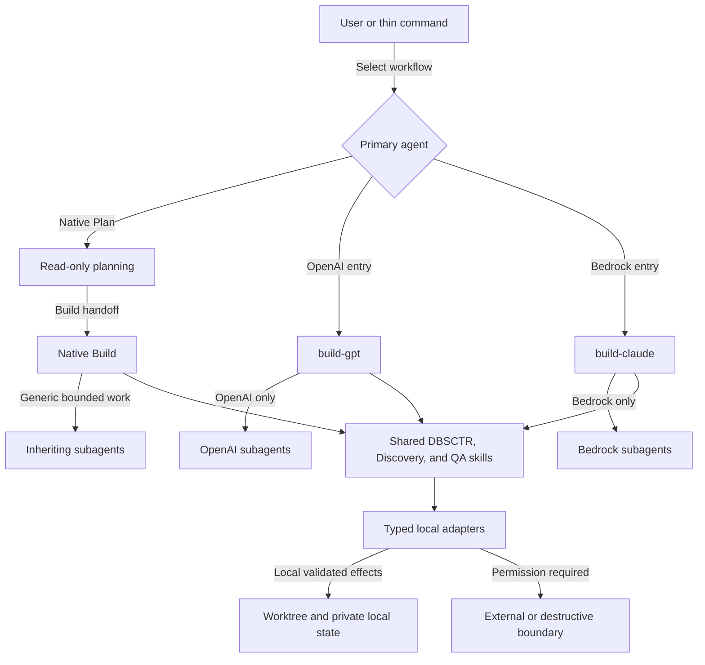
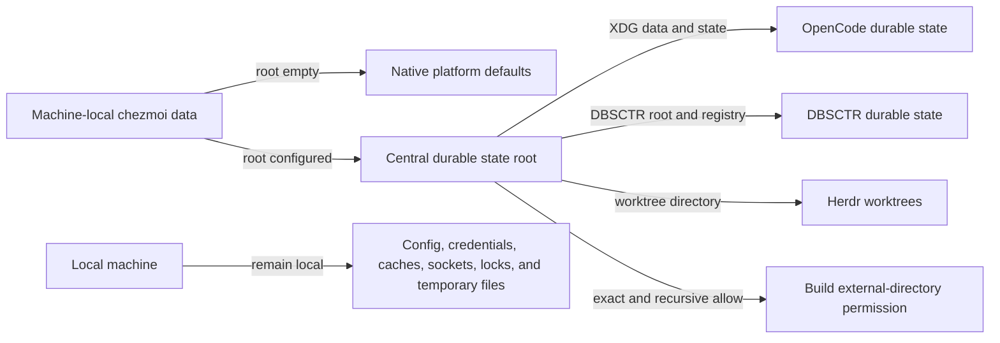

# OpenCode Control Plane

**Status:** OCP-30 delivered to Git without live apply; OCP-27/OCP-28 provider-native harness deployed
**Discovery readiness:** Complete
**Provider-native harness:** Delivered; GPT activation passed and unavailable Opus 5 invocation remains a provider-local follow-up

## Engineering Profile

### Defaults

| Field | Value |
|---|---|
| Deliverable | Managed OpenCode providers, agents, commands, permissions, skills, and routing |
| Languages/frameworks | JSON/JSONC configuration, Markdown agent prompts, Python contract tests |
| Modules | ML/AI |
| Runtime/platform support | OpenCode on the managed macOS host and managed Fedora 44 Lima guests; Python `>=3.12` tests |
| Public compatibility | Preserve native Plan-to-Build and provider-affine Build workflows; retire provider entries that current authentication cannot use |
| Trust/data classification | Local configuration and public provider metadata; credentials remain outside the repository |
| Operational owner | Dotfiles owner maintains deployment and OpenCode compatibility |

### OCP-16 Cycle Overrides

| Field | Value |
|---|---|
| Risk | Elevated: adds an external documentation boundary and changes typed cycle-begin authorization |
| Delivery intent | Deploy managed OpenCode configuration, Scout permissions, lifecycle routing, and tests locally |
| Scope | Scout-only Context7 with optional environment credential; standing authorization for validated typed begin in Build |
| Overrides | Plan remains read-only; Context7 is non-authoritative and optional; destructive and external writes remain permission-gated |

### OCP-19 Cycle Overrides

| Field | Value |
|---|---|
| Risk | Elevated: grants a native-Build workflow bounded claim and draft-PR delivery interfaces |
| Delivery intent | Deploy the managed worker command, typed coordination adapters, and narrow permissions locally |
| Scope | Global review, holistic research, atomic claim, Discovery pause, explicit proceed, isolated DBSCTR cycle, and draft PR |
| Overrides | Only `chezmoi-dotfiles-ai` is writable; private provenance is withheld; no automatic merge, release, deployment, or Discovery answer |

### OCP-26 Cycle Overrides

| Field | Value |
|---|---|
| Risk | Elevated: makes auto-approval durable inside client VMs and exposes bounded remote-history adapters |
| Delivery intent | Deploy Linux-compatible OpenCode configuration and VM-only policies with host behavior unchanged |
| Scope | VM config rendering, always-auto restored sessions, VM Herdr integration, local history export, and configured-workspace handoff |
| Overrides | OS controls and repository-scoped credentials remain authoritative; no per-subagent remote executor is claimed |

### Provider-Native Harness Initiative Overrides

| Field | Value |
|---|---|
| Risk | Elevated: changes global model selection, agent prompts, provider routing, and private evaluation identity |
| Delivery intent | Delivered and deployed managed provider-affine OpenCode configuration on integrated DAI-011 commit `c24f7e5` |
| Scope | Exact provider entry commands, Opus 5 high, provider-native prompts, strict provider affinity, exact telemetry identity, and report-only five-cycle evaluation |
| Overrides | OpenAI and Bedrock billing routes never mix automatically; no account, role, email, or client label enters telemetry; unavailable Opus inference becomes an operational follow-up rather than fallback |

### OCP-32 Cycle Overrides

| Field | Value |
|---|---|
| Risk | Elevated: changes durable-state locations and lifecycle record compatibility |
| Delivery intent | Draft pull request without live state migration or managed deployment |
| Scope | Optional centralized state root, LaunchAgent environments, Herdr worktrees, OpenCode permissions, and DBSCTR schema-4 portability |
| Overrides | Empty configuration preserves native defaults; existing SQLite stores retain their formats; live relocation requires a separately validated cutover and rollback |

## Overview

The OpenCode control plane owns global providers, agents, commands, permissions,
skills, and Graphify routing. It keeps OpenAI and Amazon Bedrock workflows
provider-affine while removing unused Claude Code, Meridian, Headroom, and OMO
surfaces.

For this initiative, `dbsctr_v3_lifecycle` owns shared lifecycle and evaluation
semantics, while `dotfiles_ai_distribution` owns federated capture transport,
weekly scheduling, private report persistence, and operational deployment.

## Visual Evidence

| Concern | Decision | Review question | Canonical source | Owner/change trigger |
|---|---|---|---|---|
| Boundary | required: provider-affine control flowchart | Which surfaces own routing, permissions, lifecycle, and provider selection? | Overview and Contracts | Control-plane owner; ownership or permission changes |
| Interaction | required: provider-affine control flowchart | How do Plan, Build, and bounded subagents hand work off? | Plan and Build behavior | Control-plane owner; handoff or delegation changes |
| State | required: optional centralized-state flowchart | Which durable paths move when a state root is configured, and what remains native by default? | OCP-32 behavior and contracts | Control-plane owner; state-root or persistence changes |
| Data/trust | required: provider-affine control flowchart | Where are local, external, and provider boundaries enforced? | Permission and provider-affinity contracts | Control-plane owner; trust boundary changes |
| Schema | not_applicable: JSON configuration and typed adapter schemas remain authoritative | - | Managed configuration and tests | Control-plane owner |
| Dependency/deployment | required: provider-affine control flowchart | Which managed surfaces are loaded into OpenCode? | Engineering Profile and File contracts | Control-plane owner; loaded surface changes |
| Quantitative | not_applicable: evaluation metrics are persisted evidence, but this specification makes no comparative decision from a current dataset | - | Evaluation contracts | Control-plane owner |

V3.35 corrects delivered status and evidence wording without changing provider
routing, trust boundaries, or control-plane topology. The existing view and Text
Equivalent remain current.

**Text Equivalent:** Thin commands select a native or provider-affine primary.
Plan is read-only and hands bounded scope to Build. Native Build uses generic
inheriting subagents; `build-gpt` uses only OpenAI subagents; `build-claude` uses
only Bedrock subagents. All primaries load shared lifecycle skills and typed local
adapters. Validated local effects may reach the worktree or private local state;
external or destructive effects remain permission-gated. The control-plane owner
updates this view when routing, delegation, loaded skills, adapters, permissions,
or provider boundaries change.

**Text Equivalent:** With no configured root, every component keeps its native
location. With a root, managed LaunchAgents receive XDG and DBSCTR locations,
Herdr receives a worktree directory, and Build receives only the root and subtree
permissions. Configuration, credentials, caches, sockets, locks, and temporary
files remain local. This repository change does not move live data or restart a
running OpenCode process.

## Goals

- Keep native Plan and Build, plus provider-affine `build-gpt` and `build-claude`.
- Keep direct Bedrock Claude and raw LM Studio models.
- Make workflow commands inherit the selected primary agent.
- Allow local Build commands by default while gating external or destructive writes.
- Give Builder subagents bounded write access without Git, deployment, or external paths.
- Install only OpenCode-compatible skills, once.
- Preserve Graphify CLI, skill, graph, hooks, and health-gated query-first routing.
- Remove Claude Code, Meridian, Headroom, OMO, and their runtime state completely.
- Bind provider-specific DBSCTR entry commands to both the intended primary and
  exact model instead of relying on model selection to change the active agent.
- Optimize each primary for its provider's current prompting guidance without
  weakening executable validation or provider isolation.

## Non-goals

- No new orchestration framework, review agent, MCP server, or benchmark suite.
- No Graphify package changes.
- No removal of Bedrock Claude or raw LM Studio.
- No changes to V1 `dbsctr` or `discovery`.
- No Bedrock reviewer, cross-provider fallback, human-review workflow, automatic
  prompt tuning, or provider-account telemetry.

## Ubiquitous Language

| Term | Meaning |
|---|---|
| Control Plane | Managed OpenCode config, agents, commands, permissions, skills, and routing. |
| Provider Affinity | Delegation remains inside the active primary's provider family. |
| Local Build Command | In-worktree command without external, destructive, deploy, publish, or Git-write effects. |
| Runtime Residue | Unmanaged config, package, service, authentication, cache, or backup from a removed integration. |
| Graph Health Gate | Freshness and relevance check before trusting a Graphify query. |
| Provider Entry Command | Command that atomically selects a provider-affine primary and its exact model. |
| Provider Overlay | Conditional prompt guidance loaded only for the selected provider family. |
| Integration Evidence | Tests, contracts, diff coherence, and downstream checks; not a generic request for the model to review itself again. |
| Evaluation Cohort | Five comparable completed cycles evaluated under one versioned rubric without automatic remediation authority. |

## Behavior

### Provider-neutral commands

Given any selected primary, when `/dbsctr`, `/discovery`, or `/qa` runs, then
the command uses that primary and does not force OpenAI.

### Plan and Build permissions

Given a Plan primary, edits are denied and Bash requires approval. Given a Build
primary, local commands run by default while known external, destructive,
deployment, publishing, and Git-write commands require approval.

### Bounded Jira reads

Given a user explicitly supplies a Jira key or URL, the global and native Plan
Bash maps allow direct ACLI account-status, work-item view, and comment-list
reads. Broader JQL research remains ask-gated and denies pagination, browser, and
filter forms. Other direct ACLI commands, absolute paths, common wrappers,
and shell chaining or redirection remain denied. Writing behavior and consent are
owned by `writing_skills`; this control plane owns only the coarse permission
boundary.

### Native Plan-to-Build handoff

Given native Plan completes planning, its built-in exit path targets the native
`build` agent. Native Build therefore remains enabled. `build-gpt` and
`build-claude` are lowercase filename-derived custom-primary IDs selected through
the agent control or exact `--agent` value; changing only the model does not
change the active agent.

### Bounded Builder

Given a provider-local Builder subagent, it may edit owned in-worktree files and
run focused checks, but cannot use external directories, delegate, write Git
state, deploy, publish, or perform external writes.

### Provider affinity

Given an OpenAI primary, it delegates only to OpenAI optimized agents. Given
`build-claude`, it delegates only to Bedrock optimized agents. No fallback
crosses providers silently.

### Exact provider entry

Given the user invokes `/dbsctr-gpt`, when OpenCode starts the workflow, then it
selects `build-gpt` with `openai/gpt-5.6-sol`. Given the user invokes
`/dbsctr-claude`, then it selects `build-claude` with
`amazon-bedrock/global.anthropic.claude-opus-5` at high reasoning effort. The
existing provider-neutral `/dbsctr` command continues to inherit the selected
primary.

### Provider-native review behavior

Given GPT work is routine or elevated, when the primary validates it, then it
uses executable evidence without a routine reviewer. Given GPT work is explicit
review work or critical, `reviewer-openai` remains available with a bounded
read-only brief. Given Claude Opus 5 work at any risk, the prompt relies on the
model's native self-correction plus executable evidence and does not instruct a
reviewer subagent or enforce human review.

### No cross-client fallback

Given a provider model, credential, or optimized subagent is unavailable, when a
workflow cannot use its selected route, then it reports unavailability and never
switches between OpenAI and Bedrock automatically. Opus 5 configuration may be
delivered before live account access is available; the missing live inference is
tracked as a bounded operational follow-up and does not restore Opus 4.8.

### Exact private evaluation identity

Given sanitized lifecycle telemetry is available, when provider-native effects
are evaluated, then it records allowlisted provider, model, agent,
`session_relation`, core revision, provider-overlay revision, gate outcomes,
remediation, tools, elapsed time, tokens, and cost. It never records an AWS
account, account/user role, email, client label, prompt, transcript content,
credential, URL, or path.

Exact telemetry is a separately versioned nested envelope, not federation schema
version `2`. Telemetry schema `2` adds bounded provider/model/agent ID sets,
`session_relation` (`primary` or `child`), core and overlay revisions, per-field
availability, and existing aggregate metrics. Legacy telemetry remains readable
with every unavailable field explicit. The helper, VM exporter, and typed adapter
validate the same exact schema before federation transports it unchanged.

For new cycles, the loaded OpenCode runtime supplies one immutable harness
activation identity containing exact primary agent/model/provider and the
core/overlay revisions it loaded. Validated begin or attach records that identity;
an on-disk digest observed after process start is not runtime evidence. Every
attached root session must agree. Missing, conflicting, unmanaged, or historical
identity without authoritative retained evidence remains `unavailable`; timestamp
or deployment-history guesses are forbidden.

Given five comparable completed cycles are available, when the R&D worker runs,
then it produces a report-only evaluation and labels simultaneous model and
prompt changes as confounded. Any prompt, model, agent, or routing change starts
a separately approved DBSCTR cycle.

The evaluator extends DAI-011's deployed federation contract rather than creating
another scan path: each source is captured once, pages replay by immutable
`capture_id`, source capture remains concurrent and manifest-ordered, and
an eligible evaluation atomically persists its own sanitized five-member cohort
and report before unreferenced transient captures expire. Evaluation runs at the
next eligible weekly worker execution without changing or halting its cadence.

The typed adapter privately records a transient terminal capture receipt keyed by
the existing manifest digest. It contains ordered source/capture/query/exclusion
identity, a distinct source-local `privacy_epoch_digest`, and page/member digests,
completes missing pages from immutable captures, and supports single-page passes
where continuation `source_state` is `null`. Federation manifest schema `2` and
its pagination response remain unchanged. Capture `exclusion_digest` continues to
bind worker self-exclusion and is never interpreted as privacy-forget state.

One report member is one completed DBSCTR cycle, represented as structured
`source_id` plus `cycle_id`, never a colon-joined host identifier. Eligibility
requires one exact root-session cycle correlation, one primary provider/model/
agent/core/overlay identity, same-provider children, and complete required
metrics. The first five unused eligible cycles for one exact harness identity are
ordered by completion time then cycle ID. Risk, context, and delivery distributions
are report confounders rather than nondeterministic selection rules.

### ChatGPT OAuth model exposure

Given OpenAI uses ChatGPT OAuth, only models and reasoning-effort variants
supported by that route are exposed. Native Plan and `build-gpt` use base
GPT-5.6 Sol with medium effort by default, while the user may select another
supported effort variant. No agent or provider override claims unavailable Pro
reasoning mode. The ChatGPT OAuth backend rejects base Sol requests containing
`reasoning.mode: "pro"` with `unsupported_value`. OpenAI Explore, Scout, and
Builder remain on GPT-5.6 Terra.

### Removed integrations

Given deployment completes, Claude Code, Meridian, Headroom, OMO, their wrappers,
providers, services, packages, skills, authentication, state, backups, and
historical project documentation are absent. Bedrock Claude remains available.

### Graphify preservation

Given an existing graph, architecture work checks graph freshness and relevance,
queries it when useful, verifies findings against source, and falls back to
source search when stale or weak. Full Graphify creation, update, query, and Git
hook behavior remains available without a duplicate project plugin.

### Private DBSCTR review

Given `/dbsctr-review` runs under any selected primary, it loads the unversioned
review skill and uses a read-only typed scan. Persisting the sanitized private
report asks through a separate typed completion permission. The completion tool
writes only DBSCTR operational review state and grants no repository mutation.

Given a review spans pages, when the first page captures a snapshot, then typed
continuations and completion preserve that snapshot and reject changed sanitized
candidate metadata. Session prose without structured lifecycle authority reports
`unknown` rather than a guessed terminal state.

Given detailed reports exceed 90 days, completion or explicit maintenance prunes
them while compact private reviewed-ID tombstones preserve review progress.
Candidates expose independent Cycle Record states and page-local urgency without
inventing an aggregate state.

### Autonomous R&D worker

Given a fresh scheduled native-Build session, when its managed worker command
runs, then it applies exactly one assigned lens to all eligible global sanitized
review evidence, compares it with the
private improvement ledger, this repository's specs/source/tests and GitHub
state, and authoritative external documentation through Scout when useful.

Given a defensible distinct opportunity, when the worker claims it atomically,
then it records lens telemetry and runs Discovery in the same session. Explicit
autonomous readiness may durably authorize noncritical P1-P3 work only when no
material question remains; exact operator confirmation is recorded separately.
P0, critical, and uncertain work waits for the operator.

Given autonomous readiness or explicit proceed and completed Discovery, when the worker begins DBSCTR,
then it edits only the helper-owned isolated worktree for this source and may use
the typed claim and draft-PR delivery interfaces. Builder and read-only subagents
remain denied those writes.

Given no distinct finding under the assigned lens, then the worker records
no-yield and its exact telemetry. Typed federation removes review-worker session
families before returning ordinary-lens pages; only `review_session_governance`
receives attributed review sessions, and legacy unattributed sessions fail
closed into neither scope. No lens manufactures a proposal merely to finish a run.

Given typed cycle begin runs, stable OpenCode tool context records the initiating
session and worktree in the Cycle Record. Optional Herdr launch metadata remains
advisory, uses no-focus launch, and never changes lifecycle state or cleanup.

Given a Build session remains rooted in the source checkout, typed reconciliation
may name an isolated linked worktree. The adapter canonicalizes both paths and
requires an exact Git top-level beneath the managed DBSCTR worktree root and the
same Git common directory before invoking the lifecycle helper; outside-root and
foreign repositories fail before reconciliation.

Given `/dbsctr-review` is asked to inspect history, a separate read-only typed
tool includes reviewed candidates through bounded composable filters and fixed
cohort replay. A schema-validated history-save tool has standing authority only
for sanitized private reports and cohort manifests; it never changes operational
review markers or repository state and remains denied to Builder subagents.
The save tool optionally forwards the source history page's `limit` and `cursor`
so complete-page cohorts can use source-bound exact-member revalidation; callers
that omit them retain strict whole-snapshot validation.

### Runtime Health And Compact Analytics Interfaces

OCP-17 runtime health and OCP-18 compact analytics are current after deployment.
The typed adapters preserve the helper's authoritative history, telemetry, and
benchmark contracts.

Given a validated Build primary attaches its current runtime, the typed control
plane persists only the helper-validated runtime identity and returns normalized
Herdr health as advisory operational metadata. Health is one of `healthy`,
`missing`, `ambiguous`, or `unavailable`; malformed Herdr output fails closed and
never changes a Cycle Record, gate result, or improvement state.

Runtime attachment requires structured message identity that resolves through
the authoritative OpenCode database to a parentless primary session and exactly
matches the supplied session ID. The attachment command accepts no database
override. Child Builder sessions fail at the helper boundary even if a shell
wrapper bypasses textual command matching; supplying a primary message can only
idempotently attach that primary.

`dbsctr_runtime_health` invokes only structured `herdr pane current`. Outside a
Herdr runtime or when the command is unavailable it returns `unavailable`; a
valid absent pane returns `missing`; malformed output or mismatched OpenCode
session/worktree identity returns `ambiguous`; and an exact current pane returns
`healthy` with bounded presentation IDs and normalized agent status. It emits no
path, command error, or private content and performs no write. The Herdr probe
has a two-second timeout and 64 KiB output cap, and compares canonical existing
worktree paths so equivalent macOS/symlink spellings do not create false health.
The probe runs in its own process group so timeout terminates descendants that
retain output pipes.

Given a caller requests compact history or benchmark evidence after the matching
helper interface is finalized and deployed, typed adapters
expose bounded capture summary, ordered member drill-down, exact replay, telemetry
availability, and versioned benchmark results from finalized helper JSON
contracts. Schemas reject unknown arguments, invalid cursors, oversized requests,
and malformed helper output. No adapter returns an unbounded member collection.
The read-only tools are `dbsctr_history_capture`, `dbsctr_history_telemetry`, and
`dbsctr_benchmark`. They execute argument vectors without a shell, cap combined
helper output at 256 KiB with a 30-second timeout, reject unsafe path/URL content,
and validate the returned contract before exposure. Legacy history without a
telemetry envelope is normalized only to explicit `unavailable` fields; adapters
never infer a value or classification.

Plan, Reviewer, Explore, Scout, and Builder agents cannot attach runtimes or
write analytics state. Read-only analytics access and permissioned private-state
writes remain separate tools. OpenCode adapters never duplicate helper lifecycle,
capture, attribution, or benchmark state machines.

### Scout-only current documentation

Given a Scout-class subagent needs current dependency documentation, when it
uses Context7, then OpenCode connects to the managed remote MCP endpoint and
exposes only `context7_*` tools to Scout-class agents. Primary, Builder,
Reviewer, and Explore agents cannot use those tools.

Given `CONTEXT7_API_KEY` is non-empty, Context7 requests use it through runtime
environment substitution. Given it is absent, Context7 remains usable through
its anonymous service and no credential is required. The key is never stored in
Git, rendered source, agent prompts, logs, or tool arguments.

Context7 results are research hints. Scout verifies material claims against
project source or authoritative upstream documentation and reports uncertainty.

### Standing typed cycle begin

Given Build invokes `dbsctr_begin` with an applicability plan, when OpenCode
dispatches the typed tool, then it runs without another permission prompt. The
helper still validates the committed profile, upstream, worktree safety, ahead
commits, plan, risk, and arguments before creating local cycle state.

Plan continues to deny `dbsctr_begin` and returns a Build Handoff. Direct
destructive operations, external writes, deployment, DVC push, and non-DBSCTR
Git push retain their existing permission boundaries. Optional Herdr launch
remains explicit through `launch=true` and never becomes lifecycle authority.

Given the primary orchestrator operates on a helper-created isolated worktree,
OpenCode allows external-directory access only beneath
`~/.local/state/dbsctr/worktrees/**` without another prompt. Only native Build,
`build-gpt`, and `build-claude` receive that allow rule. Plan and every subagent deny
external-directory access; Builder agents remain confined to the worktree where
they were launched.

Given a Build primary deploys the standalone AI dotfiles source, it may read and
edit only the machine-local `~/.config/dotfiles-ai/**` config and persistent
state directory outside the worktree. Plan and subagents remain denied, and no
personal chezmoi, credential, or arbitrary external path is exposed.

Given a workspace mount declares non-empty reference metadata, when chezmoi
renders OpenCode configuration, then it exposes the host or guest path under the
configured reference name. A mount without reference metadata is omitted. The
absolute path never enters shared defaults or generated documentation.

### Sandboxed Client Runtime

Given OpenCode runs inside a managed client VM, its VM profile auto-approves
every permission not explicitly denied, uses only VM-local configuration,
credentials, plugins, MCP state, and session database, and cannot access the
host OpenCode database or unmounted host paths.

Given Herdr restores a VM pane after restart, OpenCode resumes the exact session
under the same always-auto VM policy even though Herdr's native resume argv omits
the original `--auto` flag. Host OpenCode permissions remain unchanged.

Native Task subagents remain child sessions in their owning OpenCode server and
filesystem. The control plane does not claim per-subagent VM isolation; host and
VM OpenCode servers are separate runtimes.

Given host R&D requests VM history, a VM-local adapter scans only its local
database and returns one size- and time-bounded sanitized source envelope. The
host adapter accepts only configured instance IDs and fixed commands, namespaces
opaque identities by source, and rejects raw paths, URLs, transcript content,
unknown schema fields, changed continuation identity, and oversized output.
Independent source captures run concurrently with at most four workers and remain
ordered in the manifest. The typed aggregate call has no wall-clock timeout;
each source exporter retains its own 120-second deadline and the aggregate output
remains bounded. Every continuation is served from the source's immutable private
capture instead of rescanning its live OpenCode database.
The typed adapter independently reads the managed sandbox configuration and
rejects changed source membership or order. Federated reads explicitly create
private transient captures; unreferenced captures expire after 24 hours.

Given an approved host handoff, the configured Build workspace OpenCode receives only the sanitized
context and approval identity plus instructions to start a distinct VM-owned
DBSCTR draft-PR cycle. The typed call returns only bounded Herdr launch
acceptance and presentation identity; cycle and draft-PR progress remain
guest-authoritative and are observed separately. It never attaches a VM runtime
to the host cycle or shares a Cycle Record across machines.

Given Hermes starts an R&D worker, OpenCode launches directly in the profile's
declared repository and returns one native session ID before improvement
registration. Herdr workspace, tab, and pane IDs are optional presentation fields,
not registration preconditions. A gateway restart re-reads the DBSCTR worker and
exact OpenCode session before any `opencode -s SESSION` recovery; an existing,
duplicate, missing, or ambiguous session blocks rather than starting substitute
work. Hermes may deliver the session ID for manual attachment but may not send a
Discovery answer, `proceed`, permission selection, merge, release, or deployment
instruction. Host, client, and personal OpenCode runtimes retain separate databases,
credentials, permissions, and Cycle Records.

The typed read interface is `dbsctr_review_federated`; it accepts the existing
history filters plus cursor and limit and returns the validated federated source
manifest schema version `2`. Continuation state binds its capture ID and normalized filter query, and the typed
boundary recomputes the manifest digest and correlates each state with its source
page. The typed write interface is `dbsctr_vm_handoff`; it accepts one
schema-versioned sanitized approved report and asks before launching the VM
session. Plan, read-only agents, and Builder subagents deny handoff. Native Build
and provider-affine Build primaries may invoke it only after explicit proceed.

## Contracts

- `$schema` remains `https://opencode.ai/config.json` and rendered config passes
  the current schema/runtime parser.
- Direct provider `anthropic` is denied; `amazon-bedrock` is not.
- Raw `lmstudio` remains configured; `headroom` and `headroom-lmstudio` do not.
- Native Plan remains the startup default and native Build stays enabled as the
  built-in Plan exit target.
- `gpt-5.6-sol-pro`, `Plan-GPT-Pro`, `Plan-GPT-Pro-Max`, and `Build-GPT-Pro`
  are absent while ChatGPT OAuth excludes Pro reasoning mode.
- Native Plan and `build-gpt` resolve to `openai/gpt-5.6-sol` with `medium` as
  their default effort; OpenAI optimized subagents remain on Terra.
- `build-claude` resolves to `amazon-bedrock/global.anthropic.claude-opus-5`
  with high reasoning effort; Bedrock optimized subagents remain on Sonnet 5
  medium. Opus 4.8 is retired rather than retained as fallback.
- `/dbsctr-gpt` and `/dbsctr-claude` bind exact primary and model identities;
  `/dbsctr` remains provider-neutral.
- `reviewer-openai` is available only to `build-gpt` for explicit or critical
  review. `build-claude` has no reviewer permission and no human-review mandate.
- A failed optimized subagent may retry once on its active same-provider flagship;
  no failure, quota, credential, or model-access condition changes provider family.
- Provider telemetry uses exact allowlisted runtime identity without provider
  account or billing-client metadata.
- Provider-neutral commands contain no fixed `agent` field. `/dbsctr-gpt` fixes
  `agent: build-gpt` and `model: openai/gpt-5.6-sol`; `/dbsctr-claude` fixes
  `agent: build-claude` and
  `model: amazon-bedrock/global.anthropic.claude-opus-5`.
- `/dbsctr-review` contains no fixed agent field and loads its exact skill.
- `dbsctr_review` is read-only and allowed; `dbsctr_review_complete` asks before
  writing private operational state and remains denied to Builder subagents.
- `dbsctr_review_history` is read-only and allowed. `dbsctr_review_history_save`
  is allowed only for validated private history reports and remains denied to
  Builder subagents.
- `dbsctr_begin` is allowed for Build without an internal approval callback;
  Plan denies it, and the helper remains the authoritative safety boundary.
- The helper-owned DBSCTR worktree root is an allowed external directory for the
  Build primary orchestrators only; the global default is deny and the rule does
  not broaden arbitrary home-directory, Plan, or subagent access.
- The standalone `~/.config/dotfiles-ai/**` directory is allowed for Build
  primaries only so managed machine-local deployment values and source-specific
  persistent state can be maintained; the personal chezmoi config and all other
  external paths remain denied.
- `dotfiles_ai.state.root` is optional and empty by default. When set, managed
  LaunchAgents receive `DOTFILES_AI_STATE_ROOT`, XDG data/state homes, the DBSCTR
  state/worktree roots, and existing DBSCTR R&D file locations beneath that root.
  Herdr receives `<root>/herdr/worktrees`; native paths remain unchanged when the
  setting is absent or empty.
- A configured centralized root adds exact-root and recursive-subtree OpenCode
  external-directory allows after the broad deny for Build primaries. It does not
  broaden Plan or bounded subagents and does not remove native DBSCTR worktree
  access needed by legacy cycles.
- Existing OpenCode, DBSCTR review, and R&D SQLite stores remain SQLite. This
  change introduces no database engine, performs no live copy, and requires a
  fresh OpenCode process after later managed deployment.
- Workspace mounts may declare optional reference names and descriptions. A
  declared reference renders its host path on macOS and guest path in the owning
  VM; mounts without reference metadata are not advertised to OpenCode.
- When references are configured, global external-directory permissions keep
  the broad deny first and append distinct exact-root and recursive-subtree
  allows. These patterns cannot be deduplicated against OpenCode's generated
  `path/*` reference rule, so last-match resolution grants the named repository
  without opening any sibling or arbitrary external path.
- Context7 is a managed remote MCP server. Its tools are globally disabled and
  enabled only for Scout-class agents. Its API key is optional and environment-
  backed when available.
- ACLI permissions allow direct auth-status, work-item view, and comment-list
  reads; bounded JQL search asks, and unbounded/browser/filter forms are denied.
  Prompt contracts further restrict fields, limits, consent, and privacy.
- Skill names visible to OpenCode are unique.
- Unversioned lifecycle commands load DBSCTR V3; V1 is removed and V2 source is
  archived outside deployed skill paths.
- Runtime cleanup is irreversible and was explicitly approved.

## Validation Strategy

| Authority | Scope | Command | Availability |
|---|---|---|---|
| OpenCode parser | Resolved config and agents | `opencode debug config` | Required |
| JSON parser | Source/rendered config | `jq empty` | Required |
| Focused tests | Control-plane invariants | `pytest tests/test_opencode_control_plane.py` | Required |
| Chezmoi | Deployment and removals | dry-run, apply, status | Required |
| Graphify | Skill, hooks, query | version, hook status, targeted query | Required |
| Package/service inventory | Removed runtime | npm, pipx, launchctl, path checks | Required |
| MCP runtime | Context7 connection, anonymous fallback, optional authenticated request, and role isolation | `opencode mcp list` plus fresh Scout/non-Scout probes | Required |
| Typed begin | Prompt-free Build dispatch, helper-worktree access, and denied Plan dispatch | Focused tool/config tests plus fresh Build probe | Required |
| ACLI boundary | Key-scoped read allowlist, ask-gated JQL, Plan parity, wrapper/mutation denial, and bounded prompt contract | Writing and control-plane tests plus rendered config | Required when changed |
| Provider entry | Exact command, primary, model, effort, same-provider retry, unsupported-model failure, and provider-local task permissions | Focused config tests plus fresh GPT probe | Required after implementation |
| Opus availability | Exact Opus 5 request through the configured Bedrock route | Live smoke when account access permits | Follow-up when unavailable; no fallback |
| Evaluation identity | Privacy-safe exact identity, historical backfill, cohort replay, and report-only authority | Focused helper and adapter fixtures | Required after DAI-011 reconciliation |
| Runtime activation | Loaded identity survives fresh/restarted sessions and rejects on-disk/runtime drift or attached-root disagreement | Fresh process and stale-process fixtures | Required after implementation |
| Centralized state | Native-default and configured-root rendering, plist validity, exact permissions, schema-4 relocation, schema-3 compatibility, and explicit rollback | Focused Herdr, control-plane, and `dbsctrctl` tests | Required before migration |

## Risks

- Bash patterns are guardrails, not an OS sandbox.
- ACLI allow patterns cannot validate every flag or same-user shell indirection;
  direct read-only skill commands and least-privileged Jira credentials remain
  necessary controls.
- Runtime deletion cannot be rolled back without reinstalling removed tools.
- Removing the duplicate Graphify project integration must not remove its global
  skill, graph, or hooks.
- OpenCode provider behavior may change across upgrades; focused contract tests
  prevent unsupported aliases from silently returning.
- VM auto approval magnifies every mounted path and credential. OS mount policy,
  denied sudo, and credential scope are required controls rather than Bash
  permission patterns.
- Multi-source review availability depends on Lima and compatible helper/schema
  revisions. Missing sources are explicit and never silently omitted.
- Typed handoff asks for approval and common raw Lima command forms are denied to
  OpenCode Bash, but same-user command policies are guardrails rather than an OS
  authorization boundary. The VM filesystem boundary remains the security
  control against host access.
- OpenCode cannot retarget native `plan_exit` to a custom primary; `build-gpt`
  and `build-claude` therefore require exact manual agent selection and a new
  message. Changing only the model leaves native Plan active.
- Context7 is externally operated and may be unavailable, rate-limited, stale,
  or incomplete; Scout reports degradation and falls back to authoritative
  sources without blocking unrelated work.
- DAI-011 is integrated at `c24f7e5`. Provider-native telemetry must extend its
  schema-v2 manifest, immutable source captures, no-rescan continuations,
  four-worker source bound, per-exporter deadlines, and 24-hour unreferenced
  capture retention without introducing another federation path.
- Opus 4.8-to-5 migration and prompt changes are confounded in early cohorts;
  reports must not attribute causality to either change alone.
- AWS authentication can succeed while model-list permission is denied. Live
  invocation availability remains separate evidence and never authorizes
  cross-provider fallback.

## Gate Ledger - Provider-Native Harness Initiative

| Gate | Capability | Applicability | Result | Authority/evidence | Exception | Owner |
|---|---|---|---|---|---|---|
| Domain | Provider-affine harness and evaluation language | required | passed | This bounded-context specification | - | Primary |
| Behavior | Exact routing, provider-native review, isolation, and unavailable-model behavior | required | passed | Given/When/Then scenarios and focused tests | - | Primary |
| Spec | Commands, models, prompts, telemetry, cohorts, and staged ownership | required | passed | README and BACKLOG | - | Primary |
| Contract | Identity, privacy, fallback, compatibility, and authority invariants | required | passed | 219 affected tests, one skipped | - | Primary |
| Test-driven implementation | Red/green provider, prompt, telemetry, and privacy evidence | required | passed | Helper, sandbox, lifecycle, runner, and control-plane tests | - | Primary |
| Refactor | Thin shared core and conditional provider overlays | required | passed | Diff, compilation, and externalized Bun build | - | Primary |
| Review/Integrate | Preserve DAI-011 and verify evidence without routine re-review prompts | required | passed | Integrated diff, affected QA, and final independent review with no findings | - | Primary |
| Release | Publish a versioned artifact | not_applicable | not_run | No release requested | - | User |
| Deploy | Apply managed OpenCode configuration | required | passed | Targeted chezmoi apply, empty second dry-run, source identity, resolved config | - | Primary |
| Operate | Verify routing, telemetry, and available live providers | required | passed | Fresh GPT activation passed; Opus SSO adapter follow-up recorded without fallback | - | Primary |
| Maintain/Retire | Retire Opus 4.8 and review five-cycle reports | required | passed | Opus 4.8 absent; first real report tracked after five eligible cycles | - | Primary |
