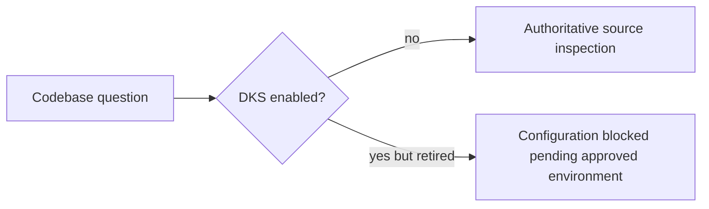

# DKS Disabled Routing

## Ownership And Behavior

`opencode_control_plane` owns model-visible DKS tool exposure, permission, and
routing. `dotfiles_ai_distribution` owns the machine feature flag and later
removes installed runtime artifacts. DKS source remains in Git for a future
controlled environment.

- Given `knowledge_store.enabled=false`, when OpenCode configuration renders,
  then `dks_context` is denied and instructions route directly to authoritative
  source without attempting DKS.
- Given the old tool file remains until host convergence, when a model requests
  it, then permission denies execution; absence is not treated as an error or an
  empty citation result.
- Given DKS is disabled, when performance audit or codebase routing runs, then it
  does not probe DKS, retry it, start a service, or include DKS latency as zero.
- Given a future config sets `enabled=true`, rendering remains blocked by the
  distribution retirement contract until controlled-environment approval is
  separately delivered.

The implementation changes only conditional OpenCode permission/routing and
tests. It does not delete data, stop shared infrastructure, or change detailed
source-inspection behavior. Existing privacy rules continue to prohibit private
evidence from hosted providers.

## Validation And Gates

Rendered enabled/disabled fixtures prove no disabled tool permission or routing.
Fresh-process debug output and tool inventory prove the disabled managed host cannot
invoke DKS. Existing Plan, provider, source-inspection, and privacy tests remain
passing. Kernel, Review/Integrate, Deploy, Operate, and Maintain/Retire gates are
required; Release is not applicable.

## Visual Evidence

| Concern | Decision | Review question |
|---|---|---|
| Boundary | required: routing flow | Can disabled OpenCode reach DKS? |
| Interaction | not_applicable: one conditional route | - |
| State | not_applicable: distribution owns persistent enablement | - |
| Data/trust | required: routing flow | Can private data reach a disabled tool? |
| Schema | not_applicable: no result schema changes | - |
| Dependency/deployment | not_applicable: existing managed config is reused | - |
| Quantitative | not_applicable: disabled attempts must be zero | - |

**Text Equivalent:** With DKS disabled, questions proceed directly to source and
the DKS tool cannot execute. A future enable request remains blocked until a
controlled environment is approved. Owner: OpenCode control-plane maintainer.
Change trigger: feature-flag, tool-registration, or routing-policy change.
