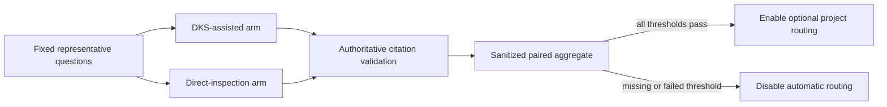

# DKS Routing Value Gate

## Ownership

`opencode_control_plane` owns automatic DKS routing and its activation decision.
`dbsctr_knowledge_store` owns retrieval correctness and projection operation.
Direct `Glob`, `Grep`, and fixed-object inspection remain authoritative fallback
capabilities rather than DKS implementation details.

## Behavior

**Scenario: Compare equivalent retrieval paths**

- Given fixed representative broad questions, one fixed source revision, one
  model and agent identity, and a healthy warmed DKS projection
- When the value harness runs paired DKS-assisted and direct-inspection arms
- Then both arms verify final citations against the same authoritative source
- And the report preserves paired completion latency, citation correctness, tool
  errors, tool calls, and token cost without query or source content

**Scenario: Keep automatic routing enabled**

- Given complete paired evidence has no citation correctness regression or added
  tool errors
- And DKS-assisted p95 is below five seconds and paired median completion time is
  at least ten percent lower than direct inspection
- When the activation decision is evaluated
- Then automatic optional DKS routing may remain enabled for the qualified project

**Scenario: Disable routing that adds no value**

- Given evidence is incomplete or any required threshold fails
- When the activation decision is evaluated
- Then automatic DKS routing is disabled fail closed
- And direct authoritative inspection, the rebuildable projection, and manual DKS
  CLI operation remain available

**Scenario: Reject incomparable evidence**

- Given source revision, questions, model, agent, routing policy, warmup state, or
  validation differs between paired arms
- When the value report is validated
- Then it cannot authorize automatic routing
- And no mixed or historical timing is substituted for a paired result

## Interface

The benchmark definition binds:

- at least five post-warmup paired runs for every representative question;
- one fixed Git revision and expected citation set;
- one exact model, agent, tool, runtime, and routing-policy identity;
- randomized arm order with identical question text and output validation;
- DKS-assisted completion including its citation call and authoritative source
  verification;
- direct completion beginning with authoritative `Glob`, `Grep`, or fixed-object
  inspection; and
- monotonic end-to-end duration, citation correctness, tool-error count, tool-call
  count, and model input/output token counts.

The sanitized aggregate contains identities by digest, sample counts, availability,
paired median and p95 durations, correctness and error deltas, tool-call and token
deltas, threshold decisions, and one activation result. It contains no question
text, response text, citation body, path, command argument, URL, credential,
process identity, or raw error.

## Contract

- Automatic routing is project-scoped and defaults disabled without current
  passing evidence for the exact routing-policy identity.
- Passing requires no citation correctness regression, no added tool errors, DKS
  p95 below five seconds, and at least ten percent lower paired median completion
  time.
- Missing, unavailable, stale, mixed, or malformed evidence fails closed as
  disabled, never as zero cost or passing.
- A failed gate changes only automatic routing. It does not delete projection data,
  stop reconciliation, weaken privacy, or remove manual diagnostics.
- Any routing, timeout, model, tool, source-profile, or validation change invalidates
  prior activation evidence.

## Validation

- A deterministic fixture proves paired-order handling and nearest-rank p95.
- Threshold boundary fixtures prove equality, regression, missing evidence, and
  added errors disable routing.
- Identity-drift fixtures reject source, model, agent, tool, and routing changes.
- Privacy fixtures reject text, paths, arguments, raw errors, and process identity.
- A real fixed-source run records at least five post-warmup pairs before activation.

## Visual Evidence

| Concern | Decision | Review question | Canonical source | Owner/change trigger |
|---|---|---|---|---|
| Boundary | required: activation ownership | Which context may enable automatic routing? | Ownership and Contract | Routing owner change |
| Interaction | required: paired benchmark flow | Are DKS and direct arms comparable and source-verified? | Behavior and Interface | Harness change |
| State | required: enabled/disabled decision | What invalidates activation evidence? | Contract | Identity or threshold change |
| Data/trust | required: sanitized evidence | Can query, response, source, or runtime-private content enter Git? | Interface | Evidence schema change |
| Schema | required: aggregate field contract | Does every threshold have explicit evidence? | Interface and Contract | Aggregate schema change |
| Dependency/deployment | not_applicable: no new dependency or service | - | Engineering Profile | Harness dependency change |
| Quantitative | required: paired thresholds | Does automatic routing measurably beat direct inspection? | Behavior and Contract | Threshold change |

**Text Equivalent:** Fixed representative questions run through DKS-assisted and
direct-inspection arms with identical source, model, agent, tool, and routing
identities. Both verify citations against authoritative source. Sanitized paired
evidence enables optional project routing only when correctness and error behavior
are equivalent, p95 is below five seconds, and median completion is at least ten
percent faster. Otherwise automatic routing is disabled.

## Gate Ledger

| Gate | Applicability | Result | Authority |
|---|---|---|---|
| Domain | required | pending | Control-plane README and Initiative manifest |
| Behavior | required | pending | Compare, enable, disable, and incomparable scenarios |
| Spec | required | pending | Harness, aggregate, identity, and visual contracts |
| Contract | required | pending | Fail-closed activation and invalidation rules |
| Test-driven implementation | required | pending | Deterministic paired fixtures and real fixed-source run |
| Refactor | required | pending | Existing benchmark and routing helper reuse review |
| Review/Integrate | required | pending | Diff, privacy, thresholds, downstreams, and affected QA |
| Release | not applicable: no versioned artifact is published | not_run | Engineering Profile |
| Deploy | required | pending | Managed routing identity and activation state |
| Operate | required | pending | Post-activation availability and fallback smoke |
| Maintain/Retire | required | pending | Evidence expiry, invalidation, disablement, and manual CLI retention |

## Non-Goals

- Claiming general model-quality improvement from retrieval timing alone.
- Making DKS authoritative or removing direct source verification.
- Retiring the DKS projection solely because automatic routing fails.
- Recording raw prompts, responses, citations, paths, or tool errors.
