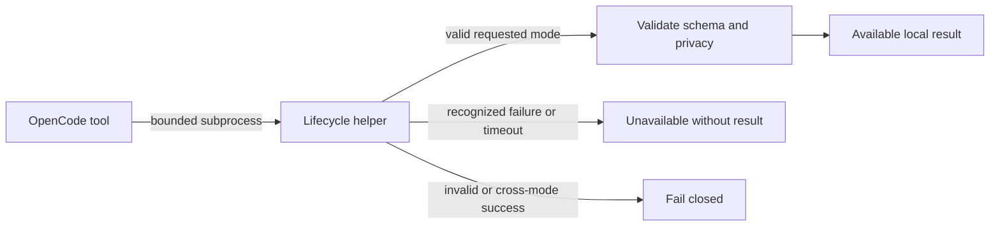

# History And Incident Query Recovery

## Ownership

`opencode_control_plane` owns bounded History and Incident subprocess execution,
process-group cleanup, schema validation, and typed availability. The lifecycle
context owns snapshots, pages, reductions, privacy, and overflow semantics.

## Behavior

**Scenario: Return validated aggregate evidence**

- Given the lifecycle helper returns valid aggregate or summary output within its deadline
- When OpenCode validates the requested mode
- Then it returns the matching local typed result without candidate identities
- And detailed evidence remains unavailable to hosted subagents

**Scenario: Preserve timeout as unavailability**

- Given a History or Incident subprocess exceeds its bound
- When OpenCode terminates the process group
- Then the tool settles with typed `timed_out` unavailability
- And it never converts the timeout into an empty cohort or zero counts

**Scenario: Reject a cross-mode response**

- Given aggregate mode receives detailed candidates or summary mode receives Signal identities
- When OpenCode validates the response
- Then it fails closed as invalid output
- And does not expose the rejected payload to the model

## Interface

The existing History and Incident tools add optional aggregate/summary modes.
Available results retain the lifecycle response under an explicit availability
classification. Operational failure contains no result member:

```json
{"schema_version":1,"availability":"unavailable","reason":"timed_out","retryable":true}
```

`reason` is one of `timed_out`, `source_unavailable`, or `service_unavailable`.
Timeout, exit, signal, stderr, path, process, database, snapshot, candidate, and
Signal identities never enter unavailable output. Invalid successful output is a
thrown trust-boundary error, not ordinary unavailability.

Aggregate and detailed schemas are validated separately. A requested mode must
match the returned mode, forbidden identity fields are rejected recursively, and
configured output/page bounds remain enforced.

## Compatibility And Dependencies

Detailed History and Incident modes remain unchanged. This slice depends on
`history-incident-query-core` and reuses subprocess cleanup and availability
conventions delivered by `runtime-query-recovery`. It adds no database access,
hosted evidence route, service, dependency, or automatic retry.

## Visual Evidence

| Concern | Decision | Review question | Canonical source | Owner/change trigger |
|---|---|---|---|---|
| Boundary | required: tool-boundary flow | Which owner validates reduction versus availability? | Ownership and Interface | Ownership change |
| Interaction | required: tool-boundary flow | Does every subprocess outcome settle without false empty data? | Behavior | Timeout change |
| State | not_applicable: availability is one response classification | - | Interface | Persistent-state change |
| Data/trust | required: tool-boundary flow | Can raw or detailed private output reach hosted context? | Interface | Trust-boundary change |
| Schema | required: JSON example and field rules are canonical | Can cross-mode output pass validation? | Interface | Schema change |
| Dependency/deployment | not_applicable: existing runtime and tools are reused | - | Compatibility And Dependencies | Dependency change |
| Quantitative | not_applicable: deadlines are compatibility bounds, not comparison data | - | Behavior | Deadline change |



**Text Equivalent:** OpenCode starts a bounded lifecycle subprocess. Valid output
must match the requested aggregate, summary, or detailed schema and privacy rules.
Recognized operational failure or timeout becomes typed unavailability without a
result. Invalid successful output fails closed and is not exposed.

## Validation

- Fake aggregate and summary processes prove valid available results.
- Short-deadline fixtures prove process-group cleanup and typed timeout.
- Empty, malformed, oversized, detailed-in-summary, and identity-bearing outputs
  fail closed.
- Operational failures never include raw diagnostics or result data.
- Existing detailed-mode fixtures remain unchanged.
- Hosted subagent prompts contain no private detailed or snapshot evidence.

## Gate Ledger

| Gate | Applicability | Result | Authority |
|---|---|---|---|
| Domain | required | pending | Control-plane README and Initiative manifest |
| Behavior | required | pending | Available, timeout, invalid, and compatibility scenarios |
| Spec | required | pending | Interface, privacy, dependency, and visual contracts |
| Contract | required | pending | Lifecycle helper and model boundary validation |
| Test-driven implementation | required | pending | Bun-backed control-plane process fixtures |
| Refactor | required | pending | Shared subprocess and schema-validator review |
| Review/Integrate | required | pending | Diff, privacy, downstreams, and affected QA |
| Release | not applicable: no versioned artifact is published | not_run | Engineering Profile |
| Deploy | required | pending | Managed OpenCode adapter identity and apply evidence |
| Operate | required | pending | Fresh-process aggregate, summary, and timeout smoke |
| Maintain/Retire | required | pending | Detailed-mode compatibility and rollback |

## Non-Goals

- Changing lifecycle reduction or Incident semantics.
- Sending detailed evidence or private snapshot identity to hosted subagents.
- Retrying timed-out or unavailable scans automatically.
- Treating missing evidence as an empty population.
