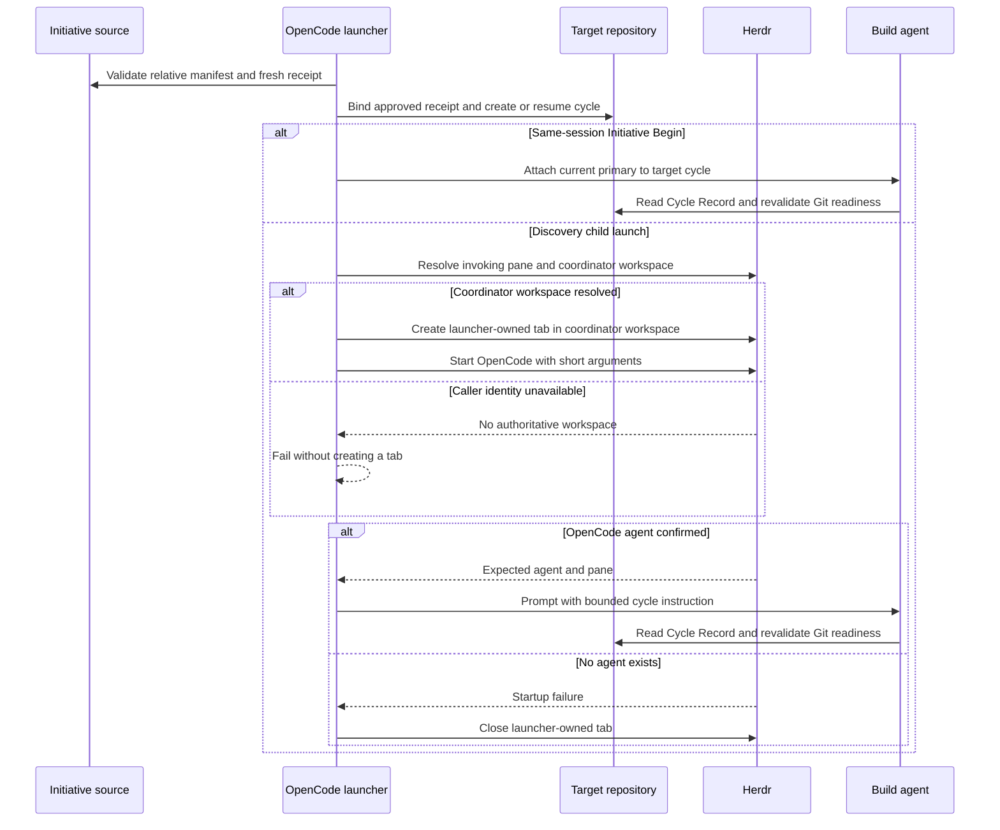

# Initiative Launch Atomicity

## Outcome

A DBSCTR Build launch, including an approved Initiative slice launched from a
coordinator checkout into a separate context-home repository, completes without
absolute manifest paths, truncated terminal input, false launch success,
abandoned shell tabs, or placement in a Herdr workspace unrelated to the
coordinator.

## Domain

- The **Initiative source** is the Git checkout containing the coordinator-owned
  repository-relative manifest.
- The **target repository** is the context home where DBSCTR creates or resumes
  the implementation cycle.
- A **launcher-owned tab** is a Herdr tab created for one launch attempt and not
  yet proven to contain the requested OpenCode agent.
- A **pending launch** has a confirmed OpenCode agent that is not yet ready to
  accept or complete the bounded cycle instruction.
- The **coordinator workspace** is the live Herdr workspace containing the
  OpenCode pane that invokes a DBSCTR launch. UI focus is not workspace
  authority.

The OpenCode control plane owns source and target validation plus Herdr launch
orchestration. The Initiative manifest and DBSCTR Cycle Record remain lifecycle
authority. Herdr identities and terminal state remain advisory.

## Behavior

### Resolve the coordinator checkout

- Given the manifest is in a checkout other than the invoking OpenCode session,
  when the Discovery coordinator launches a ready slice, then it supplies
  the Initiative source separately from the repository-relative manifest path.
- The adapter validates the source GitHub origin against the receipt's
  coordinator repository before approval and revalidates the receipt from the
  same source after approval.
- Absolute manifest paths remain invalid. Omitting the source retains the
  invoking worktree as the source for same-checkout launches.

### Continue a Build-led Discovery session

- Given a primary Build runs Discovery outside the Initiative context home, when
  it begins an approved cross-repository slice through explicit Initiative Begin,
  then it supplies the coordinator checkout and context-home checkout separately.
- The adapter resolves the relative manifest in the coordinator checkout, the
  applicability plan and cycle in the context-home checkout, and validates both
  GitHub origins against the receipt before and after approval.
- Given those checks pass, Initiative Begin binds the same receipt and approval,
  attaches the current runtime to the target cycle, and creates no Herdr tab or
  OpenCode child. Omitting both checkout overrides preserves same-repository
  behavior.
- Cross-repository child creation remains exclusive to the Discovery coordinator.

### Preserve coordinator workspace affinity

- Given any ordinary or Initiative DBSCTR launch is invoked from a live Herdr
  pane, when the adapter creates the Build tab, then it creates one new tab
  explicitly in that pane's current workspace regardless of which workspace the
  Herdr UI focuses before or during launch.
- Given a fork attempt falls back to a fresh session, when the replacement tab
  is created, then it retains the same coordinator workspace.
- Given the live caller pane or its workspace cannot be resolved, when launch is
  requested, then the adapter reports launch failure and creates no tab in the
  focused or any other workspace.
- Existing sessions launched into another workspace are not moved or closed by
  this behavior.

### Launch without terminal-size coupling

- Given a readiness receipt contains enough artifacts to exceed Herdr's terminal
  input boundary, when the adapter launches Build, then the shell command contains
  no receipt JSON or initial prompt.
- After Herdr confirms the OpenCode agent, the adapter submits one bounded,
  content-free cycle instruction through `herdr agent prompt`.
- The child reads the receipt already bound to the Cycle Record and revalidates
  Git readiness before implementation.

### Roll back incomplete launch attempts

- Given `herdr agent start` fails before an OpenCode agent exists, when the
  adapter handles the failure, then it closes only the tab created for that
  attempt and reports launch failure.
- Given a fork attempt is unsupported, when the adapter falls back to a fresh
  session, then it closes the failed fork tab before creating the replacement.
- Given Herdr confirms an OpenCode agent but startup or prompt submission is
  blocked, when the adapter returns, then it retains that real session and reports
  `launch_pending` with its advisory identity.
- Malformed or identity-mismatched Herdr success output never becomes
  `launched`.

## Interface And Contract

`dbsctr_initiative_launch` accepts optional `initiativeSourceRepository` and
`targetRepository`. Initiative mode on `dbsctr_begin` accepts the same optional
fields inside its `initiative` object. The source must be a readable Git checkout
whose GitHub origin matches the fresh receipt's `coordinator_repository`; the
target must be a readable Git checkout whose GitHub origin matches the receipt's
context-home `repository`. `manifestPath` remains
`docs/initiatives/<slug>/MANIFEST.json` and is resolved in the source checkout.
The applicability plan, default branch, cycle-occupancy check, and cycle creation
are resolved in the target checkout. Omitting both fields uses the invoking
same-repository Build worktree for source and target.

Approval remains bound to manifest digest, blob, commit, coordinator repository,
context-home repository, plan digest, base branch, cycle identity, risk, and
delivery intent. The machine-local source path is not durable authority or part
of shared evidence. Receipt, source origin, target origin, plan, and default
branch are revalidated after approval.

The shell launch contains only the target worktree, optional parent-session fork
arguments, and the Build agent selection. A successful return requires valid
Herdr JSON naming the expected pane. The subsequent agent prompt contains only
the cycle identity and instructions to read authoritative local state; it never
contains receipt arrays or manifest contents.

Before creating any tab, the shared launch path resolves the invoking pane with
`herdr pane current --current`, validates its `workspace_id`, and supplies that
identity through `herdr tab create --workspace <workspace_id>`. The returned tab,
root pane, and confirmed agent must belong to that workspace. Missing, malformed,
or mismatched identity fails closed; Herdr UI focus is never a fallback. This
contract applies to ordinary `dbsctr_begin` with `launch=true` and
`dbsctr_initiative_launch`. Initiative mode on `dbsctr_begin` creates no tab.

Failure cleanup is limited to the launcher-owned tab. Cleanup failure remains a
launch failure and is reported rather than hidden. Once an OpenCode agent is
confirmed, the adapter does not destroy it automatically.

## Validation

- Focused Bun-backed adapter tests cover separate source and target checkouts,
  source/target origin mismatch, approval revalidation, and both launcher entry
  points. The `dbsctr_begin` schema exposes both fields only inside its explicit
  Initiative object, and a cross-checkout Begin creates no Herdr call.
- Herdr fixtures prove receipt JSON is absent from terminal launch input, a
  bounded agent prompt follows confirmed startup, malformed success fails closed,
  failed attempts close their tabs, fork fallback closes its first tab, and only
  confirmed agents can remain pending.
- Herdr fixtures expose different caller and focused workspaces, prove every tab
  creation includes the caller workspace, prove fork fallback keeps that
  workspace, and prove missing, malformed, or mismatched workspace identity
  creates no retained tab.
- Managed deployment must be source-identical, and a fresh OpenCode process must
  load the expanded tool schema before a live isolated launch smoke. The smoke
  starts in one disposable workspace while another is focused, verifies the new
  tab remains with its coordinator, and removes only the disposable tab.

## Gate Ledger

| Gate | Applicability | Result | Exception |
|---|---|---|---|
| Domain | required | passed | none |
| Behavior | required | passed | none |
| Spec | required | passed | none |
| Contract | required | passed | none |
| Test-driven implementation | required | passed | none |
| Refactor | required | passed | none |
| Review/Integrate | required | passed | none |
| Release | not_applicable: no versioned artifact will be published | not_run | none |
| Deploy | required | passed | none |
| Operate | required | passed | none |
| Maintain/Retire | required | passed | none |

## Visual Evidence

| Concern | Classification | Review question | Evidence |
|---|---|---|---|
| Boundary | required: sequence | Which checkout validates the manifest, which repository owns implementation, and which workspace owns presentation? | Initiative launch sequence below |
| Interaction | required: sequence | How is coordinator workspace affinity preserved, and when can a tab be retained or rolled back? | Initiative launch sequence below |
| State | not_applicable: the behavior scenarios fully enumerate created, pending, launched, and failed outcomes | Could an omitted legal state change implementation? | Behavior scenarios |
| Data/trust | not_applicable: receipt content stays in existing local typed-tool and Cycle Record boundaries | Does this change data classification or retention? | Interface contract |
| Schema | not_applicable: one optional tool argument does not create persistent schema | Is a persistent entity changed? | Tool interface |
| Dependency/deployment | not_applicable: existing OpenCode, Herdr, Chezmoi, and DBSCTR topology is unchanged | Is deployment ordering non-obvious? | Validation section |
| Quantitative | not_applicable: no decision depends on comparative measurements | Is measured comparison required? | - |

**Text Equivalent:** The adapter reads the repository-relative manifest from the
explicitly selected coordinator checkout and binds the approved receipt to a
cycle in the selected context-home repository. Same-session Initiative Begin
attaches the current Build primary to that cycle without using Herdr. Discovery
child launch resolves the invoking Herdr pane and creates a new tab explicitly in
that pane's workspace, independent of UI focus. It starts OpenCode without
receipt content in the shell command and prompts only a confirmed Build agent. If
the workspace cannot be resolved, it creates no tab; if no agent exists after
startup failure, it closes only the tab it created.
