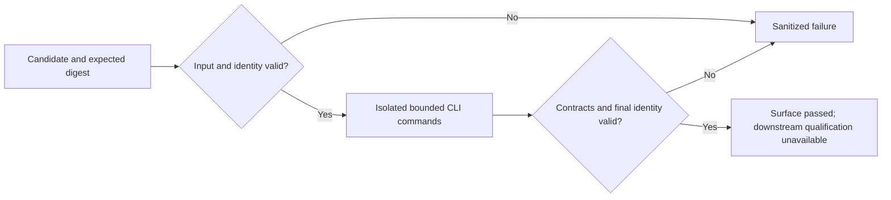

# OpenCode V2 Native Surface Qualification

Status: specified; implementation pending.

## Domain and ownership

This bounded first Build slice provides a repeatable, isolated CLI surface probe
for the V2 migration initiative. It does not establish continuation compatibility
or activate a runtime. Home: opencode_control_plane; owner: dotfiles maintainer.
Engineering Profile: ../PROFILE.md. Risk: critical, inherited from the migration
whose admission evidence it supplies. Modules: Python, Security, ML/AI.
No separate Product Intent is needed for this internal validation utility.

Discovery owns this specification and migration scope. Build owns only
tests/probe_opencode_v2.py, tests/test_opencode_v2_probe.py and its completion
changelog entry. Existing README is reviewed without changing normative truth;
this feature is the canonical contract. Native continuation and production
consumers remain in subsequent slices.

## Interface and trust

Command: `python tests/probe_opencode_v2.py --binary PATH --sha256 HEX
--expected-version VERSION --scratch DIRECTORY`.

The caller supplies an already acquired, trusted upstream binary and its verified
binary SHA-256; this probe does not acquire releases or invent artifact trust.
Version must be a strict non-prerelease V2 semantic version. Reject malformed
digests, non-regular/symlink binary inputs, digest mismatch, missing/non-directory
scratch and an unsafe scratch root before executing anything. Create a fresh
owner-private child of scratch for each run. The candidate pathname and digest
must be checked again after probing to detect replacement during validation.
No claim of hostile same-user OS confinement is made.

Use an explicit environment allowlist: isolated HOME, OPENCODE_TEST_HOME,
OPENCODE_CONFIG_DIR, XDG_CONFIG_HOME, XDG_DATA_HOME, XDG_STATE_HOME,
XDG_CACHE_HOME and TMPDIR; bounded standard executable PATH, shell, TERM and
NO_COLOR. Do not inherit credentials, proxy tokens, runtime identities, database
overrides, live server URLs, HERDR state, NODE_OPTIONS or Python injection flags.
All candidate executions use the isolated working directory and no stdin.

The only allowed invocations are --version, --help, debug --help, session --help,
service --help and debug paths db. Do not start a server, model request, session,
plugin, deployment, package manager or migration. Never invoke an installer.

Each subprocess has a 30-second deadline and a combined 128 KiB output ceiling.
Use concurrent bounded pipe draining or an equivalent bounded mechanism; do not
buffer unbounded output and truncate afterward. On timeout/overflow terminate
and reap only the owned process group, preserving the original failure class.
Cleanup must not signal an unrelated process or follow substituted scratch links.

## Checks and exact result

Every invocation must exit zero. Version output, stripped, must equal
`opencode vVERSION`. Root help must expose --standalone, --server, --auto and
--session. Debug help must expose agents, config and paths; session help must
expose list, export and import; service help must expose start, stop, restart
and status. Compare complete help tokens, not substring matches.

Database-path output must be the exact absolute path beneath the isolated
XDG_DATA_HOME ending in opencode/opencode.db. A successful paths query must not
create that database. The probe does not claim that all other commands or paths
are side-effect free merely because these checks passed.

Emit one bounded JSON object on stdout, with no raw candidate output, scratch
paths, usernames, session identity or credentials:

```json
{
  "schema_version": 1,
  "candidate": {"version": "2.0.21", "sha256": "<64 lowercase hex>"},
  "status": "passed",
  "checks": {
    "identity": "passed",
    "version": "passed",
    "root_help": "passed",
    "debug_help": "passed",
    "session_help": "passed",
    "service_help": "passed",
    "isolated_database_path": "passed"
  },
  "continuation": "unavailable",
  "migration": "unavailable",
  "deployment": "unavailable",
  "reason": null
}
```

Check statuses are passed, failed or not_run. Overall status is passed or failed.
Exit zero only for overall passed; otherwise exit one. Allowed reason values:
invalid_input, candidate_mismatch, spawn_failed, timeout, output_limit,
command_failed, version_mismatch, help_contract, database_path, cleanup_failed.
Invalid inputs use a null candidate instead of echoing unvalidated values.
Failed checks stop later candidate invocations; later checks remain not_run.
Always report continuation, migration and deployment as unavailable. Argument
parser help is informational; malformed invocations use the same sanitized
invalid_input result rather than argparse output containing supplied secrets.

## Behaviors and validation

- Given a trusted V2 candidate, when the probe runs, every command executes with
  isolated roots and only the allowlisted environment.
- Given a wrong digest or symlink candidate, execution never starts.
- Given changed candidate bytes or identity during probing, success is refused.
- Given an error, timeout or excessive output, bounded failure is emitted and
  the owned child is reaped; failure output cannot reveal candidate content.
- Given a database override in the invoking environment, the candidate still
  resolves the isolated database and the override never reaches the child.
- Given a candidate exposing similar but different help tokens, qualification
  fails rather than treating substring coincidence as compatibility.
- Given surface success, no consumer can interpret this result as native
  continuation, history migration or deployment qualification.

Use existing pytest, synthetic executables and temporary directories. Meaningful
negative checks cover secret-bearing parent environment, symlinks/digest drift,
wrong version/path/help, nonzero exit, timeout, output overflow, replacement and
sanitized failure. No hosted model or live database fixture is required.
Run the real staged macOS V2 candidate after unit checks. Other platforms remain
explicitly unqualified until their native probes execute. Do not install tools.

## Gate ledger

Domain, Behavior, Spec, Contract, Test-driven implementation, Refactor and
Review/Integrate are required, pending. Maintain/Retire is required, pending:
document candidate drift, unavailable downstream capabilities and how subsequent
slices replace this partial evidence with full qualification. Release is not
applicable: no separately published artifact. Deploy and Operate are not
applicable: this tests-only utility does not change managed installations or
operate persistent services. Native candidate execution is test evidence, not
production deployment. No gate exceptions are approved.

## Visual Evidence

| Concern | Decision | Canonical source / change trigger |
|---|---|---|
| Boundary | required: probe flow | Interface and trust / execution boundary change |
| Interaction | required: probe flow | Checks / command or failure ordering change |
| State | required: probe flow | Exact result / result-state change |
| Data/trust | required: probe flow | Interface and trust / output or environment change |
| Schema | not_applicable: the exact result object is clearer than an ER model | Exact result |
| Dependency/deployment | not_applicable: no service or deployed integration | Ownership |
| Quantitative | not_applicable: time/output bounds are invariants, not benchmark claims | Interface and trust |



**Text Equivalent:** The caller supplies a verified binary; the probe validates
identity before execution. Only bounded help/version/path commands run in isolated
roots. Any failure stops subsequent commands. Identity is checked again before
sanitized success. Neither success nor failure establishes continuation,
migration or deployment readiness.
