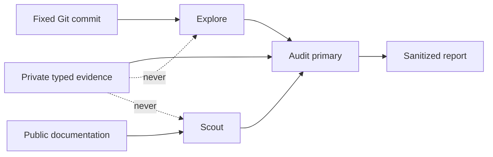

# Performance Audit Orchestration

## Ownership

`opencode_control_plane` owns the audit command, skill discovery, provider-local
agent routes, bounded subprocess behavior, and sanitized session evidence exposed
to the lifecycle audit. The lifecycle context owns conclusions and priority.

## Contracts

- The current primary orchestrates the audit; commands do not silently switch
  agent or provider.
- Private session evidence stays in the primary. Hosted subagents receive only a
  bounded public research question or fixed-commit repository scope.
- Explore is for local architecture gaps. Scout is for current authoritative
  external guidance. At most three independent lanes run concurrently.
- A hosted claim that a source or artifact is absent is advisory until the
  primary verifies it against the fixed commit with `dbsctr_inspect object` or
  `tree`.
- DKS is attempted once. Graphify is loaded only after a graph-existence check.
- Incident Scan runs independently from optional DKS or external research so a
  sibling failure cannot cancel required evidence.
- History and incident subprocesses have bounded deadlines and process-group
  cleanup. Timeout remains explicit rather than becoming an empty result.
- The audit prefers aggregate History and Incident summary modes when available;
  candidate fallback defaults to pages of 25 with immutable continuation.
- `reviewer-openai` remains available only for explicit review, critical work, or
  a named specialist lens. A routine final double-check is not a reviewer task.
- Model and reasoning changes require comparable-cycle evaluation. The default
  primary remains GPT-5.6 Sol Fast medium; Explore remains Luna Fast low; Scout
  and bounded Builder remain Terra Fast medium unless evidence supports change.
- Prompt instructions state each rule once and compact at meaningful milestones.

## Evidence Interpretation

Reviewer presence, model identity, token count, tool count, and elapsed time are
associations. Reports include cohort composition, active/completed state, review
session count, timing coverage, and attribution quality before recommending a
route change. Missing provider cost is unavailable, never authoritative zero.

## Acceptance

- The reusable command loads the canonical skill under the invoking primary.
- Focused tests prove no private telemetry is placed in subagent prompts.
- Tool failure tests prove one optional failure does not cancel required local
  evidence.
- A/B activation requires no regression in gate failures, remediation, CI,
  escaped defects, or required-evidence availability.

## Visual Evidence

| Concern | Decision | Reason |
|---|---|---|
| Boundary | `not_applicable` | Existing lifecycle and control-plane ownership is explicit in prose. |
| Interaction | `required: flowchart` | Conditional local, Scout, and Explore routing affects privacy and latency. |
| State | `not_applicable` | The report-only audit adds no runtime state machine. |
| Data/trust | `required: flowchart` | Private telemetry must remain outside hosted subagent prompts. |
| Schema | `not_applicable` | Existing typed-tool schemas remain authoritative. |
| Dependency/deployment | `not_applicable` | Existing managed OpenCode deployment is reused. |
| Quantitative | `not_applicable` | Model associations require cohorts rather than a static chart. |

**Text Equivalent:** Private typed evidence reaches only the audit primary.
Explore receives fixed-commit local scope, Scout receives public questions, and
their findings return to the primary for a sanitized report.

## Gate Ledger - Performance Audit V2

| Gate | Applicability | Result | Authority |
|---|---|---|---|
| Domain | required | pending | Control-plane README and Initiative manifest |
| Behavior | required | pending | Routing, isolation, timeout, and absence-verification scenarios |
| Spec | required | pending | Orchestration, privacy, model, and visual contracts |
| Contract | required | pending | Lifecycle audit and hosted-agent boundary validation |
| Test-driven implementation | required | pending | Control-plane fixtures and synthetic provider evaluation |
| Refactor | required | pending | Prompt and adapter duplication review |
| Review/Integrate | required | pending | Diff, privacy, downstreams, and affected QA |
| Release | not applicable: no versioned artifact is published | not_run | Engineering Profile |
| Deploy | required | pending | Managed command/skill identity and fresh-process load |
| Operate | required | pending | One bounded orchestration smoke |
| Maintain/Retire | required | pending | Existing audit compatibility and replacement ownership |
