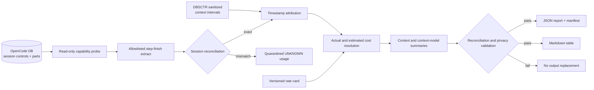

# OpenCode Inference Cost Reporting

## Overview

This bounded context turns local OpenCode usage metadata and DBSCTR lifecycle
metadata into auditable cost summaries by bounded context. The MVP reports the
cost side of AI ROI and the distribution needed for budgeting; it does not
claim ROI until a separately governed outcome or benefit numerator exists.

### Context Boundaries

| Context | Ownership |
|---|---|
| `opencode_inference_cost` | Derived cost resolution, descriptive statistics, reconciliation, and report schema. |
| `dbsctr_v3_lifecycle` | Cycle/context semantics, history capture, sanitization, attribution availability, and source lifecycle. |
| `opencode_control_plane` | Typed OpenCode adapters, permissions, provider/model activation identity, and local runtime routing. |
| `dotfiles_ai_distribution` | Federated capture transport, scheduled execution, private persistence, and deployment. |

This context consumes the other contracts and does not duplicate their scanners,
captures, permissions, retention state machines, or deployment paths.

## Engineering Profile

| Concern | Bounded-context default |
|---|---|
| Accountable owner | AI Tooling |
| Deliverable | Internal local CLI report with JSON and Markdown output |
| Applicable modules | Python, data, analytics, ML, security |
| Runtime | Existing Python `>=3.12` dotfiles/DBSCTR toolchain; no new service or scheduler |
| Sources | Read-only OpenCode database plus sanitized DBSCTR cycle/history metadata |
| Data classification | Internal developer telemetry; prompt, response, title, tool argument, credential, and repository-path content is prohibited |
| Canonical interfaces | Versioned report schema and `inference-cost-report` CLI contract |
| Compatibility | Unknown source schemas fail with a capability report; existing databases are never migrated |
| Reliability | Source totals reconcile to attributed, multi-context, and unknown totals; missing cost remains null |
| Recovery | Read-only rerun; outputs are replaced atomically after validation |
| Quality authorities | Repository-configured tests, lint, type checks, and sanitized fixture databases |
| Release | Git-versioned internal tool; no package publication in the MVP |
| Deploy/operate | Manual local execution only |
| Maintenance/retirement | AI Tooling owns source-schema adapters, rate-card dates, deprecation, and deletion guidance |

### Current Cycle Overrides

| Concern | Value |
|---|---|
| Affected scope | Replace session-grain extraction with read-only canonical step-finish usage, timestamped DBSCTR context intervals, schema-v2 report output, synthetic tests, and lifecycle artifacts; no database mutation, rate expansion, scheduler, dashboard, or ROI benefit model |
| Risk | `elevated`: private developer telemetry and decision-facing financial estimates |
| Delivery intent | Transfer this specification to the dotfiles/DBSCTR repository, then implement through a feature branch and draft pull request |

## Goals

- Produce one table of token counts, actual cost, estimated cost, model mix, and
  descriptive statistics per bounded context.
- Quantify attribution and monetary coverage so missing metadata cannot look
  like zero usage or zero cost.
- Preserve source provenance and rate-card effective dates.
- Make repeated runs deterministic over the same source snapshot.

## Non-goals

- Reading or classifying prompts, responses, titles, or tool arguments.
- Allocating ambiguous usage proportionally across contexts.
- Treating public list-price estimates as invoices.
- Calculating ROI without an independently governed benefit numerator.
- Forecasting, anomaly alerts, dashboards, scheduling, or remote publication.
- Changing the OpenCode or DBSCTR source databases.

## Ubiquitous Language

| Term | Meaning |
|---|---|
| Usage Record | One extant OpenCode `step-finish` part joined to its parent assistant message, or one quarantined session control when canonical parts do not reconcile. |
| Session Control | Authoritative session cost and token totals used to validate canonical usage records. |
| Context Interval | Half-open `[started_at, ended_at)` DBSCTR cycle interval associated with one structured OpenCode session or family. |
| Reconciliation Coverage | Share of session-control tokens represented by exactly reconciled canonical usage records. |
| Bounded Context | Stable DBSCTR context name recorded by a cycle or explicit local mapping. A project digest is not a bounded context. |
| Actual Cost | Monetary cost recorded by the source. Zero is actual only when the source explicitly distinguishes it from unavailable. |
| Estimated Cost | USD list-price estimate computed from a versioned rate card and supported token classes. |
| Monetary Coverage | Share of usage tokens for which actual or estimated cost can be computed. |
| Attribution Status | `ATTRIBUTED`, `MULTI_CONTEXT`, or `UNKNOWN`. |
| Attribution Confidence | `HIGH`, `MEDIUM`, or `UNAVAILABLE`, retained separately from status. |
| Source Snapshot | Immutable read boundary identified by database digest and session/part ceilings where available. |
| Cost Basis | `RECORDED`, `LIST_PRICE`, or `UNAVAILABLE`; recorded and estimated values are never coalesced. |

## Domain Model

| Entity/value | Identity | Invariants |
|---|---|---|
| `UsageRecord` | source part ID or deterministic quarantined-session coordinates | Contains metadata only; token counts are non-negative; unavailable values are null. |
| `SessionControl` | opaque OpenCode session ID | Equals the sum of canonical usage records or produces one quarantined `UNKNOWN` record. |
| `ContextInterval` | cycle ID + structured session association | Start is inclusive; end is exclusive; abandoned/unknown cycles without a trustworthy end do not allocate usage. |
| `ContextAttribution` | usage record ID | Exactly one status; ambiguous records are never divided among contexts. |
| `RateCardEntry` | provider + model + effective interval | Currency is USD; intervals do not overlap for the same model; source and retrieval date are retained. |
| `ContextCostSummary` | source snapshot + bounded context + optional provider/model | Reconciles to the included usage population and exposes coverage. |
| `ReportManifest` | report schema version + source snapshot | Records generation time, filters, source capabilities, rate-card identity, and checksums. |

## Behavior Scenarios

### Context attribution

**Scenario: A usage timestamp falls within one DBSCTR context interval**

- Given a canonical usage record belongs to an exact or unambiguous family-linked session
- And its timestamp falls within one valid DBSCTR context interval
- When the report is built
- Then the usage is assigned to that bounded context with high confidence
- And the attribution source is retained.

**Scenario: One session spans non-overlapping contexts**

- Given one session has canonical usage records in two non-overlapping context intervals
- When the report is built
- Then each usage record is assigned to the context active at its timestamp.

**Scenario: Context intervals overlap**

- Given a usage timestamp falls within intervals for different bounded contexts
- When the report is built
- Then that usage is reported as `MULTI_CONTEXT`
- And no proportional allocation is fabricated.

**Scenario: No context evidence exists**

- Given usage has no cycle context or explicit mapping
- When the report is built
- Then it is retained as `UNKNOWN`
- And it remains included in grand totals and attribution coverage.

**Scenario: Legacy usage does not reconcile**

- Given extant canonical step-finish parts do not equal their session control
- When the report is built
- Then the authoritative session totals are retained once in `UNKNOWN`
- And message, model, and context detail are unavailable for that quarantined session.

### Cost resolution

**Scenario: Recorded and estimated cost are both available**

- Given a usage record has authoritative recorded cost and a matching rate card
- When cost is resolved
- Then actual and estimated cost are reported in separate columns
- And variance can be calculated without replacing either value.

**Scenario: Model identity is unavailable**

- Given token usage exists but provider or model identity is unavailable
- When cost is resolved
- Then estimated cost is null with basis `UNAVAILABLE`
- And the tokens remain in totals and reduce monetary coverage.

**Scenario: Recorded zero is ambiguous**

- Given a source emits zero cost without a field proving that zero is authoritative
- When cost is resolved
- Then actual cost is null rather than zero
- And source availability is visible in the report manifest.

### Privacy and source safety

**Scenario: A source schema contains content fields**

- Given the OpenCode database contains prompt, response, title, or tool-argument columns
- When source capabilities are discovered
- Then those columns are excluded from every query projection
- And tests prove they cannot enter persisted output.

**Scenario: The source schema is unsupported**

- Given required usage/session relationships cannot be discovered
- When the report is requested
- Then execution fails before writing output
- And a metadata-only capability report identifies missing fields.

### Reporting

**Scenario: A context has one session**

- Given one attributed session
- When descriptive statistics are computed
- Then count, minimum, quartiles, mean, median, p95, maximum, and standard deviation are deterministic
- And standard deviation is zero rather than unavailable.

**Scenario: Output validation fails**

- Given source-to-summary reconciliation or schema validation fails
- When output is finalized
- Then no partial report replaces the prior valid report.

## Architecture And Data Flow



**Text equivalent:** A read-only probe discovers supported metadata in the
OpenCode database. The extractor projects only allowlisted step-finish and parent
assistant-message metadata. Exact per-session sums proceed to timestamped context
attribution; mismatches retain one authoritative session-control record in
`UNKNOWN`. A dated rate card adds a separate list-price estimate. Aggregated
context summaries pass privacy and reconciliation checks before JSON and
Markdown outputs atomically replace prior reports. Failed checks write no final
output.

## Source Contracts

### OpenCode database

The `opencode_step_finish_v2` adapter validates the current `session`, `message`,
and `part` tables. It fixes independent row ceilings in one read transaction.
Session cost and token columns are authoritative controls. Canonical usage is
every extant part whose allowlisted JSON `type` is `step-finish`, joined to an
assistant message in the same session. SQL projects only opaque IDs, timestamps,
provider/model/variant, cost, and token classes through explicit `json_extract`
expressions; raw message or part JSON never enters the process.

Canonical part sums must exactly match integer session token controls and match
cost within serialization precision. A mismatch produces one quarantined
session-control record in `UNKNOWN`; it never receives message, model, or context
detail. Orphaned parts, non-assistant parents, malformed values, and unknown
source shapes fail capability validation. A positive finite cost is recorded
cost. Zero with positive token usage remains unavailable because the source does
not distinguish free usage from missing billing data.

### DBSCTR telemetry

DBSCTR supplies context and provenance, not replacement model detail. The
sanitized history interface currently exposes fields such as `session_id`,
`context`, `cycles`, `project_digest`, `method_revision`, `token_total`,
`cost_total`, `model_families`, `attribution_status`, per-field availability,
and immutable snapshot ceilings/digests. Every field must be interpreted using
its availability marker; `unavailable` is not zero or an empty set.

An observed archived sample had 128,469,753 tokens, zero reported cost,
`context=unavailable`, ambiguous correlation, model family `gpt`, and unavailable
provider/model IDs. This proves DBSCTR aggregates alone cannot satisfy the MVP's
model-level cost requirement.

### Explicit mapping

An optional local mapping may associate a session ID with exactly one context.
It is input-only, excluded from persisted reports, and never overrides a
contradictory DBSCTR cycle. Contradictions become `MULTI_CONTEXT`.

```json
{"schema_version": 1, "sessions": {"opaque-session-id": "bounded_context"}}
```

Archived sanitized DBSCTR history is primary. Exact or unambiguous family-linked
cycle records may expose context plus millisecond start/end metadata. Completed
cycles use half-open intervals; active and blocked cycles remain open at the
snapshot. Abandoned or unknown cycles without a trustworthy end do not allocate
usage. Different overlapping contexts become `MULTI_CONTEXT`; absent interval
evidence becomes `UNKNOWN`. Worktree/source correlation does not allocate cost.
Mapping supplies a full-session interval only when evidence is missing or
confirms the same context.

### Rate card

The checked-in `$XDG_CONFIG_HOME/opencode/inference-cost-rates.json` contains
USD-per-million-token rates, source URL, retrieval date, effective interval,
and an optional maximum input-context size. Entries for one provider/model must
not overlap. Null token-class rates make an estimate unavailable when that
class has non-zero usage.

The initial card contains official OpenAI standard short-context rates retrieved
2026-07-30. OpenAI model documentation states that requests above 272K input
tokens use long-context pricing. Because the source grain is a canonical model
step, the adapter applies one rate only when its effective interval covers the
complete part creation-to-update interval, and applies short rates only when the part's total
uncached input plus cache reads and writes is at most 272K. This is conservative:
larger individual steps remain unestimated. Bedrock models and unidentified pricing modes stay unestimated rather
than inheriting direct-provider or inferred regional prices.

| Models | Standard short-context USD per million tokens | Evidence |
|---|---|---|
| `gpt-5.6-sol`, `gpt-5.6-terra`, `gpt-5.6-luna`, `gpt-5.5`, `gpt-5.4-mini` | Exact input, cached-input, cache-write where published, and output rates are retained in the checked-in card. | OpenAI pricing and model pages retrieved 2026-07-30; the Git blob and report digest pin the consulted values. |

## Report Contract

### CLI

```text
dbsctrctl inference-cost-report \
  --opencode-db PATH \
  --output-dir PATH \
  [--mapping PATH] \
  [--state-root PATH] [--rate-card PATH] \
  [--after UNIX_MS] [--before UNIX_MS]
```

The command writes `inference-cost-report.json`,
`inference-cost-report.md`, and `manifest.json`. A `--dry-run` mode emits only
the capability report and planned row counts. Secrets and content never appear
in arguments, logs, errors, or output.

Rate source URLs must be HTTPS and contain no user information, query, or
fragment. Reports retain only rate entries that actually produced estimates,
identified by card-bound digest, model, effective interval, and source.

### Context summary

| Field | Type | Contract |
|---|---|---|
| `bounded_context` | string | Context name, `MULTI_CONTEXT`, or `UNKNOWN`. |
| `session_count` | integer | Distinct sessions contributing usage. |
| `usage_count` | integer | Distinct canonical step-finish records plus quarantined session controls. |
| `reconciled_session_count` | integer | Sessions represented by canonical usage records. |
| `unreconciled_session_count` | integer | Sessions represented only by quarantined controls. |
| `reconciliation_coverage` | number | Fraction of tokens represented by reconciled canonical records. |
| `input_tokens` | integer | Sum of available uncached input tokens. |
| `output_tokens` | integer | Sum of available output tokens. |
| `cache_read_tokens` | integer | Sum of cache-read tokens. |
| `cache_write_tokens` | integer | Sum of cache-write tokens. |
| `reasoning_tokens` | integer | Sum of reasoning tokens. |
| `actual_cost_usd` | decimal/null | Sum only when recorded-cost coverage is explicit. |
| `estimated_cost_usd` | decimal/null | Versioned list-price estimate; never substituted for actual. |
| `actual_cost_coverage` | number | Fraction of included tokens with authoritative recorded cost. |
| `estimated_cost_coverage` | number | Fraction of included tokens with supported model/rate data. |
| `attribution_coverage` | number | Fraction of tokens assigned to one bounded context. |
| `attribution_statuses` | object | Session counts for `ATTRIBUTED`, `MULTI_CONTEXT`, and `UNKNOWN`. |
| `attribution_confidence` | object | Session counts for `HIGH`, `MEDIUM`, and `UNAVAILABLE`. |
| `attribution_sources` | object | Session counts by sanitized history, explicit mapping, conflict, or unavailable source. |
| `models` | array | Provider/model usage and cost breakdown; unavailable identity stays explicit. |
| `tokens_per_session_stats` | object | min, p25, mean, median, p75, p95, max, population standard deviation. |
| `actual_cost_per_session_stats` | object/null | Same statistics over sessions with authoritative actual cost. |
| `estimated_cost_per_session_stats` | object/null | Same statistics over sessions with complete estimates. |
| `p95_to_median_tokens` | number/null | Predictability ratio; null when median is zero. |
| `token_coefficient_of_variation` | number/null | Population standard deviation divided by mean; null when mean is zero. |

Quantiles use nearest rank over sorted session values. Means, medians, and
population standard deviations use Python standard-library statistics.
Monetary calculations use decimal arithmetic and round to six decimal places
only when serialized.

Context cost sums sessions with that cost basis and is null only when none are
covered. Coverage is the fraction of context tokens belonging to covered
sessions, so partial sums cannot be mistaken for complete spend.

### Reconciliation invariants

- Every canonical usage record or quarantined control appears in exactly one context bucket.
- Per-session canonical part totals either equal the session control or the session is represented once as quarantined `UNKNOWN` usage.
- Context totals plus `MULTI_CONTEXT` and `UNKNOWN` equal grand totals for each
  available token class.
- Context-model totals equal context totals where model identity coverage is
  complete; gaps are reported rather than assigned to an invented model.
- Actual and estimated cost are never added together.
- A rate-card miss produces null estimated cost and lowers coverage.
- Persisted outputs contain no session IDs, message IDs, paths, or content.

## Failure Semantics

| Failure | Behavior |
|---|---|
| Database unavailable or locked | Fail clearly; do not copy or mutate the live database automatically. |
| Unsupported schema | Emit metadata-only capability diagnostics; write no report. |
| DBSCTR telemetry unavailable | Continue with explicit mapping or `UNKNOWN`; mark attribution source unavailable. |
| Unknown model/rate | Preserve tokens, null the estimate, lower coverage. |
| Invalid rate-card overlap | Fail before aggregation. |
| Reconciliation mismatch | Preserve the authoritative session control once in `UNKNOWN` and lower reconciliation coverage. |
| Structural reconciliation or privacy failure | Fail loud and leave prior valid outputs unchanged. |
| Publication interruption | Stage a complete sibling directory; restore a lone backup, retain a valid new set when both exist, or restore the prior set when the new manifest is invalid. |
| Markdown rendering failure | Fail before publication; JSON, Markdown, and manifest are one coherent staged report set. |

## Validation Strategy

- Use synthetic SQLite fixtures for each supported source shape; never copy a
  live OpenCode database into tests.
- Seed prohibited content fields with sentinel strings and assert they never
  appear in executed projections, logs, exceptions, or outputs.
- Cover timestamp-attributed, explicitly mapped, conflicting, overlapping,
  multi-context, unknown, abandoned, and unavailable-DBSCTR cases.
- Cover canonical step-finish reconciliation, legacy quarantine, orphaned parts,
  non-assistant parents, and prohibited raw JSON projection.
- Cover recorded cost, ambiguous zero, estimate fallback, unknown model,
  effective-date boundaries, and overlapping rate-card rejection.
- Verify statistics for empty, singleton, repeated, and highly skewed samples.
- Verify source/context/model reconciliation and atomic output replacement.
- Verify sanitized errors, attribution provenance, Markdown coverage, deterministic reruns, singleton statistics, and interrupted-publication recovery.
- Run `uv run --group test pytest tests/test_dbsctr_lifecycle.py tests/test_opencode_control_plane.py -q` plus focused report tests.
- Run repository-configured lint and type checks over touched source, then
  `git diff --check` over all affected artifacts.

## Visual Evidence

| Concern | Decision | Review question | Canonical source | Owner/change trigger |
|---|---|---|---|---|
| Boundary | required: inference cost reporting flowchart | Which context owns extraction, attribution, costing, federation, and output? | Context Boundaries and Architecture | AI Tooling; ownership changes |
| Interaction | required: inference cost reporting flowchart | How does source metadata become a validated report? | Behavior and Architecture | AI Tooling; workflow changes |
| State | not_applicable: the MVP is a stateless manual transform with atomic replacement | - | Failure Semantics | AI Tooling; scheduling or persistent workflow state added |
| Data/trust | required: inference cost reporting flowchart | Where is private content excluded and sanitized lifecycle metadata introduced? | Source Contracts and Architecture | AI Tooling; source or privacy boundary changes |
| Schema | not_applicable: report-contract tables are the canonical accessible schema representation | - | Report Contract | AI Tooling; report schema changes |
| Dependency/deployment | not_applicable: no service, scheduler, or environment deployment exists in the MVP | - | Engineering Profile | AI Tooling; deployment introduced |
| Quantitative | not_applicable: no validated report dataset exists and no comparative decision is yet being made | - | Report Contract | AI Tooling; validated trend data controls a decision |

The flowchart's canonical sources are the Context Boundaries, Source Contracts,
and Architecture sections. AI Tooling updates the diagram and text equivalent in
the same change whenever ownership, source flow, trust boundaries, or output
flow changes.

## Risks And Decisions

| Type | Statement |
|---|---|
| Fact | Sanitized DBSCTR history has token totals and context/correlation metadata but can omit provider/model IDs. |
| Fact | Cost availability does not prove a reported zero is an authoritative zero. |
| Fact | OpenCode session aggregates derive from extant `step-finish` parts; assistant-message totals and `finish` do not define billing inclusion. |
| Decision | The MVP reports actual and estimated cost separately. |
| Decision | Ambiguous usage is never proportionally allocated. |
| Decision | Prompt and response content are outside the source contract. |
| Decision | Non-DBSCTR usage and legacy records without trustworthy intervals remain `UNKNOWN`; no project or directory inference is permitted. |
| Risk | OpenCode schema drift can break extraction; capability detection and fixture adapters mitigate it. |
| Risk | Public list prices can differ from negotiated or cached billing; basis, effective date, and coverage remain visible. |
| Risk | Context attribution can be incomplete; `UNKNOWN` and `MULTI_CONTEXT` prevent false precision. |

## Gate Ledger

| Gate | Applicability | Result | Evidence or reason |
|---|---|---|---|
| Domain | required | passed | Canonical usage, session controls, context intervals, quarantine, source ownership, and trust boundaries defined. |
| Behavior | required | passed | Timestamp attribution, overlap, unknown usage, reconciliation, privacy, and recovery scenarios defined. |
| Spec | required | passed | Schema-v2 output, strict source projections, interval fields, CLI compatibility, and visual evidence are defined. |
| Contract | required | passed | Reconciliation, quarantine, half-open intervals, backward compatibility, and privacy failure semantics are explicit. |
| Test-driven implementation | required | passed | Synthetic SQLite tests cover canonical parts, interval splits, overlap, abandoned fallback, legacy quarantine, orphan rejection, privacy, and recovery. |
| Refactor | required | passed | Reused existing history, SQLite, validation, statistics, and atomic publication without a runtime dependency. |
| Review/Integrate | required | passed | Conflict-free upstream reconciliation and 271 union tests passed; independent review was unavailable under sandbox policy and primary review found no unresolved issue. |
| Release | not_applicable | not_run | MVP is an internal Git-versioned tool with no package publication. |
| Deploy | not_applicable | not_run | Manual local command; no environment change. |
| Operate | not_applicable | not_run | No service, schedule, or alerting in MVP. |
| Maintain/Retire | required | passed | AI Tooling owns the strict adapter, schema-v1 replacement, history compatibility, rate refreshes, and deletion of replaceable local reports. |
