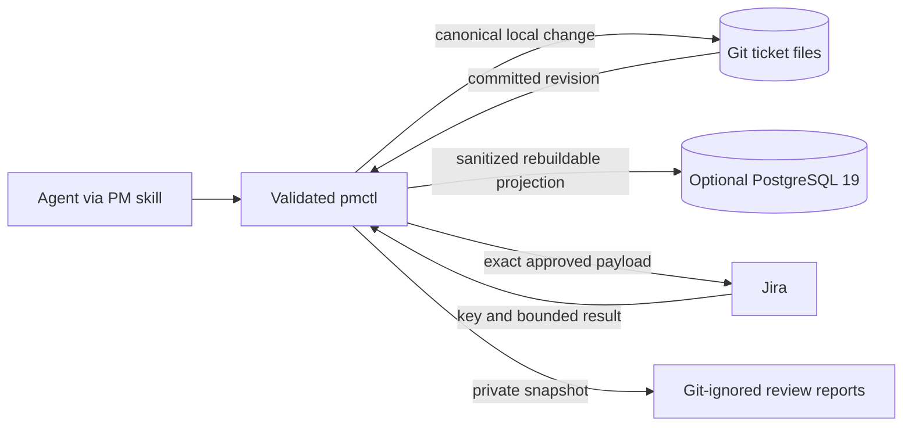
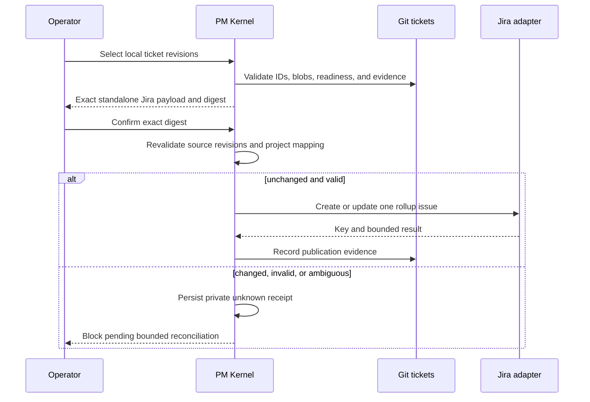
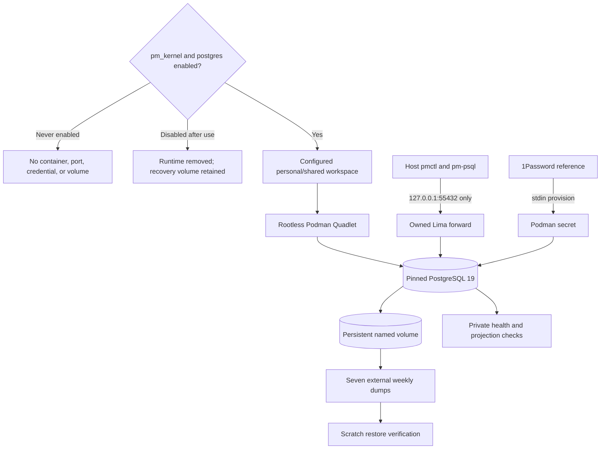

# PM Kernel

## Engineering Profile

| Field | Default |
|---|---|
| Deliverable | Client-neutral agentic work-context method, ticket store, CLI, and optional PostgreSQL projection |
| Owner | dotfiles-ai maintainer |
| Runtime | Python 3.12+, Git, OpenCode; optional rootless Podman and PostgreSQL 19 |
| Platforms | macOS host and configured Fedora Lima workspaces |
| Compatibility | Existing lifecycle backlog rows migrate without loss; Jira remains optional and explicitly invoked |
| Trust/data | Git tickets may contain private project context; Jira payloads and generated reports are private |
| Delivery | Feature branch and draft pull request; local deployment only after affected gates pass |
| Authorities | `pytest`, Git fixed-commit inspection, chezmoi dry-run/apply, and configured runtime smokes |

Current cycle overrides: PMK-003 is elevated risk because it reconciles local
OpenCode policy, restarts the personal workspace, exercises one separately
confirmed Jira mutation, and closes projection/reporting gaps against private
data. Delivery intent is a draft pull request with local deployment, recovery,
and operation evidence. PostgreSQL 19 Beta 3 remains pinned; no database version
change is in scope until a newer official release is independently approved.

## Overview

PM Kernel turns evidence into locally authoritative work items, reviews their
readiness, optionally publishes deliberate Jira rollups, and produces factual
Sprint Review reports. It is an agentic pull workflow rather than a copy of Scrum
ceremonies. Agile fields remain available for Jira and reporting.

Git ticket files are durable authority. PostgreSQL is a rebuildable cache,
coordination, query, and SQL/PGQ layer. Jira is an explicitly requested external
projection and need not correspond one-to-one with local tickets.

## Goals

- Replace monolithic `BACKLOG.md` tables with one human-readable Markdown file per
  work item under a stable Hive context partition.
- Make structured ticket data deterministic and queryable without renaming files
  when mutable workflow fields change.
- Refine and review work through evidence gates before optional Jira publication.
- Permit one standalone Jira rollup to tell the complete story of several local
  tickets without making Jira authoritative.
- Cache tickets and every sanitized DBSCTR JSON envelope in optional PostgreSQL 19
  while preserving source authority and provenance.
- Generate client-neutral, factual Sprint Review reports from explicitly selected
  Done Jira work.

## Non-Goals

- Automatic Jira publication or continuous bidirectional synchronization.
- One-to-one identity between local and Jira tickets.
- Replacing Git, Cycle Records, or private ledgers with PostgreSQL.
- Arbitrary SQL access for agents, a custom MCP server, Prefect, DuckDB, pgvector,
  or sprint scheduling in the first release.
- Client names, project keys, people, custom Jira fields, model providers, or
  organization-specific metrics in portable source.

## Bounded Context

`pm_kernel` owns local work-item identity, schema, workflow, readiness gates,
migration, Jira publication manifests, projection contracts, and review reports.

Adjacent contexts:

- `dbsctr_v3_lifecycle` owns engineering cycles, gates, evidence, and delivery.
- `writing_skills` owns evidence-grounded Jira wording and completion claims.
- `dotfiles_ai_distribution` owns optional workspace services and deployment.
- `opencode_control_plane` owns skill, command, and permission loading.
- Jira owns external issue workflows and project-specific fields.

## Ubiquitous Language

| Term | Definition |
|---|---|
| Local Ticket | One canonical Markdown file with YAML frontmatter and an evidence body. |
| Ticket ID | Context-prefixed monotonic identity assigned before Jira exists. |
| Frozen Slug | Filename description chosen at creation and never changed when the title changes. |
| Context Partition | Stable directory `docs/tickets/context=<bounded_context>/`. |
| PM Gate | Evidence decision for outcome, scope, acceptance, readiness, publication, or review. |
| Jira Publication | Explicit approved creation or update of one standalone Jira issue from selected local tickets. |
| Rollup | A Jira narrative synthesized from multiple selected local tickets; it duplicates necessary context rather than becoming authority. |
| Source Envelope | Sanitized versioned JSON plus source authority, identity, digest, and availability. |
| Projection | Rebuildable PostgreSQL representation of canonical Git or sanitized runtime evidence. |
| Sprint Review Report | Private factual Markdown report over explicitly selected Done Jira items and optional supplied goals. |

## Domain Model

### Entities

- **Local Ticket:** owns ID, frozen slug, context, mutable workflow metadata,
  evidence body, relations, completion evidence, and Jira publication references.
- **Ticket Revision:** identifies one committed ticket blob and projection digest.
- **Jira Publication Manifest:** selects local ticket revisions, target issue type,
  complete rollup narrative, exact preview, approval, and resulting Jira key.
- **Source Envelope:** retains sanitized DBSCTR JSON with its original contract and
  schema version rather than forcing every source into one lossy table.
- **Agent Lease:** coordinates bounded projection or publication work without
  becoming ticket authority.
- **Sprint Review Report:** records selection provenance, supplied goals, issue
  count, and generated factual Markdown.

### Values And Events

States are `intake`, `refining`, `ready`, `committed`, `in_progress`, `blocked`,
`review`, `done`, and `cancelled`. Point values are `0.5`, `1`, `2`, `3`, `5`, and
`8` when estimated. Priorities remain non-empty project vocabulary rather than an
invented global scale.

Events include `TicketCreated`, `TicketRefined`, `TicketReady`, `TicketCommitted`,
`TicketBlocked`, `TicketReviewed`, `TicketCompleted`, `PublicationPreviewed`,
`PublicationApproved`, `JiraPublished`, `EnvelopeProjected`, and
`SprintReviewGenerated`.

## Behavior

### Canonical tickets

**Scenario: Preserve stable human-readable identity**
- Given a bounded context and next context sequence
- When a Local Ticket is created
- Then its path is `docs/tickets/context=<context>/<id>-<frozen-slug>.md`
- And later title, state, priority, estimate, assignee, or Jira changes never rename it

**Scenario: Reject malformed or misplaced work**
- Given a ticket whose YAML is duplicated, incomplete, unsafe, or inconsistent
  with its partition, ID, slug, or filename
- When `pmctl tickets check` or fixed-commit audit runs
- Then it emits a deterministic finding and does not project or publish the ticket

**Scenario: Keep database absence non-blocking**
- Given PM Kernel or PostgreSQL has never been enabled
- When an agent reads or updates local work
- Then Git ticket workflows remain available
- And no PostgreSQL process, network listener, credential, or state is created

**Scenario: Reapply the PostgreSQL schema safely**
- Given the pinned PostgreSQL 19 schema already exists
- When migration runs again
- Then it recreates the read-only property graph definition using supported SQL
- And preserves the authoritative relational ticket data

**Scenario: Activate and disable PostgreSQL safely**
- Given the operator enables PostgreSQL for one configured workspace
- When host configuration is applied
- Then the password is provisioned over stdin before guest apply, service health,
  and owned host-loopback forwarding
- And disabling stops and removes the service, secret, forward, and backup schedule
  while retaining the named data volume for explicit recovery or retirement

### Refinement and review

**Scenario: Pull only ready work**
- Given a ticket has unresolved outcome, evidence, scope, dependency, ownership,
  acceptance, priority, or estimate questions
- When PM Kernel reviews it
- Then the ticket remains `intake` or `refining` with the missing evidence named
- And it cannot be represented as ready by formatting alone

**Scenario: Review completed work truthfully**
- Given implementation, validation, acceptance, deployment, or follow-up evidence
  is incomplete
- When a ticket enters review
- Then closure remains blocked and missing evidence is explicit
- And intent or code presence never becomes completion proof

### Jira publication

**Scenario: Publish an ad hoc rollup**
- Given the operator selects one or more exact committed Local Ticket revisions
- And `jira-ticket` has produced a standalone complete Jira narrative
- When `pmctl jira preview` renders the exact project mapping and payload
- Then no external write occurs
- And creation or update requires confirmation bound to that preview digest

**Scenario: Preserve non-one-to-one mapping**
- Given several Local Tickets form one sprint-sized external outcome
- When one Jira rollup is published
- Then every selected local ID and revision is recorded as publication provenance
- And the Jira key does not replace, merge, or complete those Local Tickets

**Scenario: Fail safely after an uncertain write**
- Given Jira returns an ambiguous timeout or adapter response
- When publication cannot prove whether creation occurred
- Then PM Kernel writes a private `unknown` receipt and blocks automatic retry
- And bounded marker search or direct target inspection must resolve the receipt
  before another exactly confirmed write

### Sprint review

**Scenario: Generate a factual Increment review**
- Given an approved bounded Jira selection of Done items and optional supplied
  Sprint and Product Goals
- When the Sprint Review report is generated
- Then every selected item appears exactly once, grouped by parent when available
- And missing goals, outcomes, links, metrics, and next steps are never invented

**Scenario: Keep Jira reports private**
- Given a report may contain private Jira content
- When it is persisted
- Then it is written beneath
  `data/interim/reports/report_type=sprint_review/snapshot_date=<date>/`
- And the Git-ignored report records selection and generation provenance

**Scenario: Read one bounded Sprint Review selection**
- Given the operator has approved an exact project-scoped JQL expression
- When PM Kernel reads Done Jira work for a Sprint Review
- Then ACLI returns at most the configured bound and no mutation-capable command runs
- And the report records the JQL digest, selected issue keys, and source snapshot digest

### Operational proof

**Scenario: Converge without overwriting local OpenCode policy**
- Given the managed OpenCode target contains unrelated machine-local values and mode
- When PM Kernel permissions are deployed
- Then the PM commands become approval-gated without deleting those unrelated values
- And a scoped post-apply diff proves the intended merge and private file mode

**Scenario: Recover across a workspace restart**
- Given a verified logical backup and a clean committed ticket tree
- When the personal workspace and PostgreSQL service stop and restart
- Then the retained volume, loopback-only access, schema, and ticket projection recover
- And the projection checkpoint advances to the exact committed ticket source identity

**Scenario: Defer an unavailable PostgreSQL upgrade safely**
- Given Beta 3 remains the current PostgreSQL 19 prerelease
- When upgrade readiness is reviewed
- Then the exact running pin remains unchanged
- And the recorded procedure requires logical backup, scratch restore, migration checks,
  rollback preservation, and renewed approval for any later prerelease or GA image

### Migration

**Scenario: Replace every canonical backlog row atomically**
- Given committed canonical Active and Completed backlog tables
- When `pmctl migrate-backlogs` runs without `--apply`
- Then it returns a deterministic manifest without changing files
- And with `--apply` it writes one ticket per row only after full validation
- And source row, section, commit, and original values remain traceable

**Scenario: Avoid dual authority**
- Given every row has a valid ticket and every consumer reads ticket files
- When cutover completes
- Then lifecycle `BACKLOG.md` files are removed
- And Discovery, audit, Hermes, templates, and documentation no longer require them

## Interfaces

### Ticket path and frontmatter

```text
docs/tickets/context=<context>/<id>-<frozen-slug>.md
```

Required YAML keys are `schema_version`, `id`, `slug`, `context`, `title`, `kind`,
`state`, `priority`, `points`, `depends_on`, `relations`, `owns`, `reads`,
`parallel_safe`, `validation`, `created`, `updated`, `completed`, `commits`,
`jira_publications`, and `migration`. YAML is restricted to a deterministic safe
subset supported by `pmctl`; duplicate keys and unknown schema versions fail.

The Markdown body contains `Outcome`, `Context`, `Scope`, `Acceptance Criteria`,
`Evidence`, `Risks`, and `Review`. Empty sections are explicit rather than omitted.

### CLI

| Command | Authority |
|---|---|
| `pmctl tickets list --root ROOT --json` | Read validated current ticket files. |
| `pmctl tickets check --root ROOT --json` | Report deterministic schema, identity, relation, and completion findings. |
| `pmctl migrate-backlogs --root ROOT [--apply] --json` | Preview or atomically apply legacy migration. |
| `pmctl project --source TYPE --input FILE --json` | Project an available validated envelope or an explicit bounded unavailable reason. |
| `pmctl project-tickets --root ROOT --psql COMMAND --json` | Project the exact clean committed ticket tree, including Markdown evidence bodies. |
| `pmctl jira preview --manifest FILE --json` | Render exact external payload without writing. |
| `pmctl jira publish --manifest FILE --preview-digest DIGEST --confirm DIGEST --json` | Invoke configured adapter after exact confirmation. |
| `pmctl jira reconcile --manifest FILE --preview-digest DIGEST ... --json` | Resolve one private unknown adapter receipt without mutating Jira. |
| `pmctl jira project-receipt --manifest FILE --preview-digest DIGEST --psql COMMAND --json` | Project one exact successful private receipt without Jira or Git mutation. |
| `pmctl sprint-review --jql JQL --confirm-jql-digest DIGEST --project KEY ...` | Read one approved bounded Jira selection and generate a private factual report. |

Agents use the skill and CLI. Direct `psql` is operator/debug access only. A
future MCP may wrap the same CLI contracts if multiple clients require typed
remote discovery; it is not required for the first OpenCode workflow.

### Configuration

```toml
[dotfiles_ai.pm_kernel]
enabled = false
workspace = ""
postgres_enabled = false
postgres_image = ""
postgres_password_ref = ""
postgres_backup_dir = ""
jira_adapter = "fake"
jira_project = ""
jira_issue_types = []
```

Defaults create no service and permit no Jira mutation. The PostgreSQL password
reference, external backup directory, Jira project, allowed issue types, and
adapter invocation remain machine-local. Portable source defines no client custom
fields, sprint assignment, or point mapping.

The OpenCode target is a private chezmoi modify source. Managed policy overwrites
its owned keys while unrelated machine-local providers, references, permissions,
and other JSON keys survive repeated apply. An absent target receives the complete
managed configuration.

### PostgreSQL projection

PostgreSQL 19 Beta 3 is pinned by its canonical Docker Hub name and exact image
digest when enabled. Tables
cover contexts, tickets, ticket revisions, typed relations, publication manifests,
publication members, Jira events, leases, source envelopes, and projection
checkpoints. Canonical rows retain source commit/blob and digest. Generic JSONB is
preserved beside typed query columns, including the canonical Markdown evidence
body, so projection never silently loses ticket context or fields.
The rootless container binds guest loopback `55432`; one owned Lima rule forwards
host `127.0.0.1:55432` to that guest loopback address. A host client resolves the
password from 1Password at runtime, while the guest receives only a Podman secret
provisioned over stdin. Weekly custom-format dumps leave the guest failure domain,
retain seven generations, and restore into an isolated scratch database before a
dump is accepted. Disablement removes runtime access but deliberately retains the
named volume until an explicit retirement decision.

SQL/PGQ uses typed edge tables or filtered typed views because one generic
polymorphic edge declaration cannot bind arbitrary heterogeneous endpoints.
Property graphs are read-only relational views; ordinary relational constraints
remain authoritative for the cache.

## Contracts And Invariants

- Git ticket files are canonical. PostgreSQL and Jira can be rebuilt or reconciled
  without rewriting ticket identity or history.
- Context, ID, and frozen slug in YAML exactly match path identity.
- IDs are unique repository-wide; filename slugs are unique within a context.
- `completed` and at least one commit are required for `done`; they are absent for
  other states except migrated evidence explicitly marked unresolved.
- Dependencies name existing ticket IDs and contain no self-cycle.
- Publication always has an exact preview; confirmation binds the payload digest.
- Each live publication has a stable opaque identity and deterministic Jira label.
  Create refuses an existing label; update requires an explicit key with matching
  project, issue type, and label.
- External Jira mutation is never covered by ordinary local-write authority.
- ACLI and Atlassian MCP adapters implement one bounded payload/result contract;
  adapter selection cannot broaden permission.
- Sanitized envelope projection validates the declared source contract and never
  imports raw transcripts, credentials, environment values, arbitrary paths, or
  unclassified payloads.
- Database writes are transactional and idempotent by source identity and digest.
- PostgreSQL failure never corrupts Git authority; rebuild begins from committed
  tickets and retained sanitized sources.
- PostgreSQL beta upgrades require backup, restore proof, schema migration, and
  rollback evidence before replacing the running service.

### PostgreSQL 19 prerelease upgrade procedure

PostgreSQL's [Beta information](https://www.postgresql.org/developer/beta/) and
[upgrade documentation](https://www.postgresql.org/docs/19/upgrading.html) treat
prerelease transitions as major-version-style migrations. Before any later exact
image is approved, create and checksum a logical dump, restore it with target
tooling into an isolated scratch cluster, run schema and application projection
checks, and retain the untouched old volume/cluster for rollback. Physical/WAL
reuse and in-place binary replacement are prohibited. Only after those checks and
separate exact-image approval may the configured Beta 3 pin change.

## Migration And Recovery

Migration maps legacy Active `pending` to `intake`, `in_progress` or `active` to
`in_progress`, `blocked` to `blocked`, `cancelled` to `cancelled`, and anomalous
`done` rows lacking Completed evidence to `review`. Completed rows map to `done`
with their original date and commit text. Original priority, effort, reason,
ownership, reads, dependencies, and validation are retained without semantic
invention. A manifest binds source commit, path, line, row digest, output path,
and output digest.

`--apply` stages output in a temporary repository-local directory, verifies count,
identity, digests, relations, and destination absence, then promotes files. It
does not remove `BACKLOG.md`; repository cutover removes them only after all
consumer tests pass. Re-running the same migration produces the same files.

## Security And Operations

- Jira content and generated reports are private; no public research receives
  ticket text, identifiers, paths, or project configuration.
- Database credentials are resolved from 1Password at runtime and enter the guest
  only through stdin-backed Podman secret provisioning. They are never rendered
  into source, command arguments, logs, backups, or reports.
- The rootless Podman service binds only to the configured private workspace or
  host loopback and uses a persistent named volume with health checks.
- Backup and restore are explicit operator operations. Failed restore validation
  leaves the prior volume authoritative.
- Operations expose version, readiness, last successful projection, source lag,
  failed envelope count, backup age, and schema version without payload content.

## Validation Strategy

- Unit fixtures cover safe YAML parsing, duplicate keys, identity, states, points,
  dependencies, completion, publication digest, and source envelope validation.
- Migration fixtures prove dry-run purity, deterministic output, row parity,
  source provenance, malformed-input refusal, idempotence, and no partial cutover.
- Audit fixtures inspect one fixed Git commit and exclude dirty overlay.
- Fake Jira adapters prove preview-only behavior, exact confirmation, rollups,
  ambiguous writes, and no automatic retry.
- PostgreSQL fixtures prove schema migrations, idempotent projection, graph views,
  disabled behavior, backup/restore, and version mismatch refusal.
- Distribution validation proves default-off rendering, rootless private service,
  pinned identity, health, deployment idempotence, and removal behavior.

## Visual Evidence

| Concern | Decision | Review question | Canonical source | Owner/change trigger |
|---|---|---|---|---|
| Boundary | required: authority and trust-boundary flow | Which store may change canonical work? | Overview and Contracts | PM owner; authority changes |
| Interaction | required: Jira publication sequence | Which checks precede an external write? | Jira behavior and CLI | PM owner; adapter or approval changes |
| State | required: Local Ticket lifecycle | Which evidence transitions work? | Domain Model and Behavior | PM owner; state/gate changes |
| Data/trust | required: authority and trust-boundary flow | Where may private content move? | Security and Operations | PM owner; storage or integration changes |
| Schema | required: ticket/projection relationship | How do Git identity and projections relate? | Interfaces | PM owner; schema changes |
| Dependency/deployment | required: optional PostgreSQL topology | What exists when the feature is disabled or enabled? | Configuration and Operations | Distribution owner; runtime changes |
| Quantitative | not_applicable: point choices and limits are invariants, not comparative evidence | - | Domain Model | PM owner |



**Text Equivalent:** Agents use PM Kernel guidance and the validated CLI. The CLI
reads and writes canonical Git ticket files. It may cache committed revisions and
sanitized DBSCTR envelopes in optional PostgreSQL, send an exactly previewed and
approved payload to Jira, and write private reports beneath the Git-ignored data
tree. Neither PostgreSQL, Jira, nor reports can replace Git ticket authority.

```mermaid
stateDiagram-v2
    accTitle: Local Ticket evidence lifecycle
    accDescr: Work moves from intake through refinement and readiness into commitment and execution. Blocked work returns to execution, review requires evidence, and only reviewed work becomes done; cancellation may occur before completion.
    [*] --> intake
    intake --> refining
    refining --> ready
    ready --> committed
    committed --> in_progress
    in_progress --> blocked
    blocked --> in_progress
    in_progress --> review
    review --> in_progress: evidence missing
    review --> done: evidence accepted
    intake --> cancelled
    refining --> cancelled
    ready --> cancelled
    committed --> cancelled
```



**Text Equivalent:** New work enters intake, is refined until ready, becomes
committed before execution, and may block and resume. Review either returns work
to execution when evidence is missing or closes it as done. Work may be cancelled
before completion. State changes do not rename the ticket file.



**Text Equivalent:** The operator selects exact committed Local Ticket revisions.
PM Kernel validates them and produces one complete Jira rollup payload plus a
digest. Only confirmation of that exact digest permits the configured adapter to
write. Source drift or invalid mapping blocks the write. An ambiguous response
creates a private receipt and blocks retries until bounded reconciliation proves
success or absence. On proven success, PM Kernel records the Jira key and source
provenance without making Jira authoritative.



**Text Equivalent:** A fresh installation with either feature flag disabled
creates no PostgreSQL resources. Disabling a previously active installation
removes its runtime, secret, forward, and schedule but retains the recovery
volume. When both flags are enabled for one configured workspace,
rootless Podman runs an exact PostgreSQL 19 image. Host access is limited to one
owned loopback forward; 1Password provisions a guest Podman secret through stdin.
The named volume has readiness checks and seven external weekly dumps, each
accepted only after scratch restore verification. Git tickets continue to work
and remain authoritative if the service is unavailable.

## PMK-001 Gate Ledger (Historical)

| Gate | Capability | Applicability | Result | Authority/evidence | Exception | Owner |
|---|---|---|---|---|---|---|
| Domain | Work-context language, ownership, authority, and trust boundaries | required | passed | This specification; `31d6c0c` | - | Primary |
| Behavior | Ticket, migration, review, Jira, report, and disabled-service scenarios | required | passed | Focused behavior tests | - | Primary |
| Spec | Paths, YAML, CLI, configuration, SQL, adapter, and report interfaces | required | passed | This specification and generated tickets | - | Primary |
| Contract | Identity, provenance, approval, privacy, migration, and recovery invariants | required | passed | Contract and security tests | - | Primary |
| Test-driven implementation | Failing fixtures followed by affected passing tests | required | passed | 339 passed, 1 expected skip; focused final 23 passed | - | Primary |
| Refactor | Remove BACKLOG authority and duplicate parsers | required | passed | `7a43c51` and fixed-commit audit | - | Primary |
| Review/Integrate | Migration and downstream consumer coherence | required | passed | `b872a08`; independent review ended clean | - | Primary |
| Release | Publish a versioned artifact | not_applicable | not_run | No package or image publication requested | - | User |
| Deploy | Apply managed skills, CLI, config, and optional service definitions | required | passed | Targeted chezmoi apply, source identity, and empty diff | - | Primary |
| Operate | Verify disabled behavior and enabled PostgreSQL health when configured | required | passed | Default-off state, command resolution, deployed ticket smoke | - | Primary |
| Maintain/Retire | Retire BACKLOG readers and define beta upgrade/restore | required | passed | 144-ticket validation and zero-finding typed audit | - | Primary |

## PMK-002 Activation Gate Ledger

| Gate | Applicability | Result | Current evidence |
|---|---|---|---|
| Domain through Contract | required | passed | Activation specification, canonical ticket, and review remediation |
| Test-driven implementation | required | passed | 116 affected tests, canonical ticket check, and three runtime-driven regression fixes |
| Refactor and Review/Integrate | required | passed | Independent review ended clean after four remediation rounds |
| Release | not_applicable | not_run | No versioned artifact publication |
| Deploy and Operate | required | passed | Healthy PG19 Beta 3, loopback-only forward, 146-ticket relational/graph projection, loaded weekly schedule |
| Maintain/Retire | required | passed | Real custom-format backup and scratch restore passed; seven-generation and retained-volume policy active |

## PMK-003 Operational Proof Gate Ledger

| Gate | Applicability | Result | Planned evidence |
|---|---|---|---|
| Domain through Contract | required | passed | PMK-003 ticket, bounded JQL/canary contracts, and projection authority review |
| Test-driven implementation | required | passed | 120 affected tests and canonical ticket validation |
| Refactor and Review/Integrate | required | pending | Independent findings remediated; sanitized replay integration pending |
| Release | not_applicable | not_run | No versioned artifact publication or PostgreSQL image change |
| Deploy and Operate | required | pending | Sanitized replay exact-head projection pending |
| Maintain/Retire | required | pending | Closure evidence pending |

## Decisions And Risks

- PostgreSQL 19 Beta 3 is current as of discovery and is explicitly not production
  stable. Operational use accepts incompatible prerelease upgrades but contains
  them behind an optional cache boundary, exact image pin, backup, and restore.
- Official PostgreSQL guidance treats prerelease transitions like major upgrades.
  Logical dump/restore or `pg_upgrade` is required; physical/WAL compatibility and
  binary replacement are not assumed between Beta 3 and a later prerelease or GA.
- PG19 property graphs are read-only views over relational sources. Typed edge
  views are required for heterogeneous endpoints.
- The current runtime exposes no discoverable Atlassian MCP server. The bounded
  ACLI adapter is active independently; an existing Atlassian MCP may continue
  iterative reads without broadening mutation authority.
- Local ticket count and Jira sprint capacity intentionally differ. Jira rollups
  are ad hoc standalone narratives, not automatic mirrors.

The PostgreSQL image digest, 1Password item reference, external backup path, Jira
project, and allowed issue types are deployment-time machine-local inputs. Their
absence leaves the optional features disabled and does not change portable
behavior.
