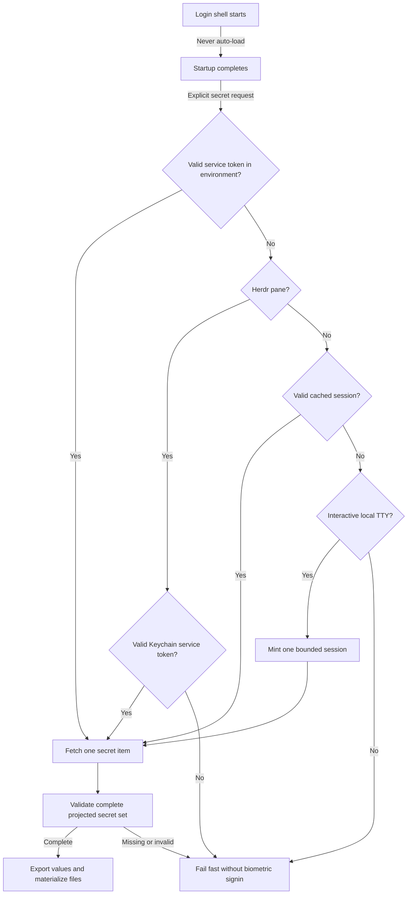
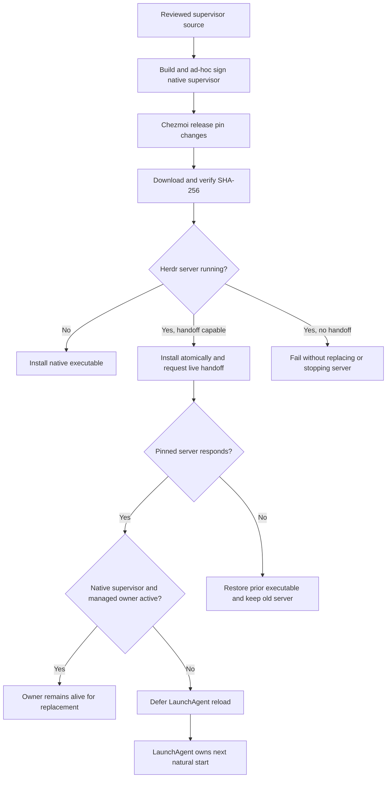
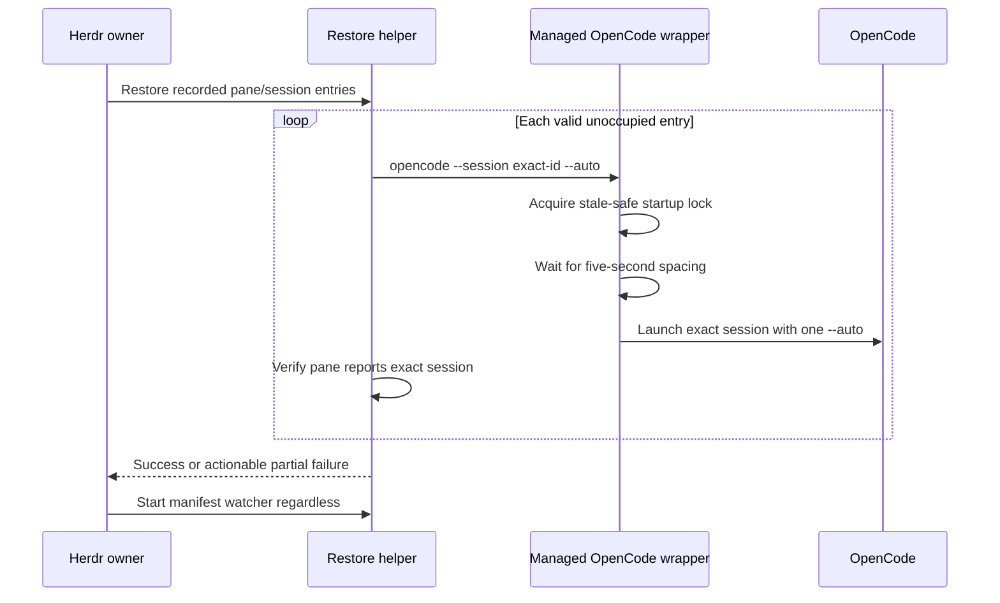

# Shell Auth Startup

**Status:** AUTH-014 in progress to restore external-volume access to managed Herdr panes

## Engineering Profile

### Defaults

| Field | Value |
|---|---|
| Deliverable | Managed shell startup, bounded 1Password loading, Keychain-backed Herdr authentication, native Herdr installation, and status-bar polling contracts |
| Languages/frameworks | Bash, Zsh, C, Go templates, launchd plist, and Markdown |
| Applicable modules | Security |
| Runtime/platform support | Interactive macOS shells, SSH, Herdr panes, Aqua LaunchAgent, chezmoi, 1Password CLI, and Keychain |
| Public compatibility | Shell startup remains non-blocking; optional authentication does not become a startup dependency |
| Trust/data classification | Public configuration and private credentials; tokens remain in environment, Keychain, cache, or 1Password and never enter Git or logs |
| Operational owner | Dotfiles owner maintains shell, Keychain, 1Password, and Herdr startup compatibility |
| Release/deployment | No packaged release; managed configuration deploys through explicit chezmoi apply |
| Maintenance/retirement | Rotate or revoke credentials externally; upgrade native Herdr through reviewed version and checksum pins; preserve bounded failure and explicit Herdr ownership handoff |

### AUTH-011 Delivered Overrides

| Field | Value |
|---|---|
| Risk | Elevated: changes ownership handoff for a persistent credential-aware Herdr server |
| Delivery intent | Deployed to the local macOS Aqua session after targeted validation |
| Scope | Structured running-state detection, unmanaged-server refusal, bounded managed shutdown, and retryable chezmoi handoff |
| Overrides | Never stop an unmanaged server; never expose credentials; a blocked handoff remains retryable |

### AUTH-014 Cycle Overrides

| Field | Value |
|---|---|
| Risk | Elevated: changes the responsible executable at a macOS removable-volume privacy boundary |
| Delivery intent | Draft pull request plus local managed-file deployment; active server restart remains separately approved |
| Scope | Native responsibility supervisor, deterministic local build, LaunchAgent ancestry, signal propagation, and TCC-aware operation |
| Overrides | Preserve live handoff, state-root validation, exact-session recovery, and all active pane processes until an approved restart |

## Domain

Bounded context: shell authentication startup for interactive panes, agents, and status-bar plugins.

Entities:
- `LoginShell`: shell started by terminal, Herdr pane, or SSH.
- `SecretLoader`: sourceable `secret` command that exports credentials into current shell.
- `OnePasswordCommand`: `op` CLI command that can require app integration or biometric approval.
- `TemplateRenderer`: chezmoi render path that must not require live 1Password access.
- `HerdrPane`: restored or newly opened Herdr pane with `HERDR_ENV` set.
- `HerdrServer`: persistent pane owner launched in the macOS Aqua bootstrap context.
- `HerdrResponsibilitySupervisor`: native process launched directly by launchd so macOS attributes removable-volume access to a user-grantable executable while the handoff-aware shell owner remains its child.
- `NativeHerdrRelease`: reviewed macOS Herdr version, protocol, asset URL, and SHA-256 pin installed under `~/.local/bin`.
- `OpenCodeSession`: persisted OpenCode identity resumed in its recorded `HerdrPane`.
- `ClockifyPoller`: SketchyBar plugin that checks current Clockify timer.

Value objects:
- `CachedClockifyApiKey`: local API key file used by the poller.
- `OnePasswordSessionCache`: local token cache under `~/.cache/op/session`.
- `OnePasswordServiceAccountToken`: per-session token injected into SSH/Herdr environments as `OP_SERVICE_ACCOUNT_TOKEN`.
- `MacOSKeychainServiceToken`: local login-Keychain item that stores `OnePasswordServiceAccountToken` for Herdr panes.
- `ShellSecretsItem`: consolidated 1Password item containing every secret required by `SecretLoader`.
- `ShellSecretsVault`: non-Personal 1Password vault (`Automation`) containing `ShellSecretsItem` for service-account access.
- `InjectedSecretBundle`: JSON document produced by the `ShellSecretsItem` fetch.
- `OnePasswordItemId`: stable item UUID used to fetch a secret item without title search.
- `ProjectedSecretSet`: validated JSON object containing every scalar secret and file payload needed by the shell.
- `CommandTimeout`: maximum wall time for external auth calls.

Events:
- `LoginShellStarted`
- `SecretLoadRequested`
- `OnePasswordCommandTimedOut`
- `HerdrPaneRestored`
- `OpenCodeSessionResumed`
- `NativeHerdrReleaseApplied`
- `HerdrLiveHandoffCompleted`
- `HerdrResponsibilityChanged`
- `ClockifyPollSkipped`

Glossary:
- **Startup-safe**: shell/profile path must not block on interactive auth or network credentials.
- **Fail-fast**: auth command exits with an error after a bounded timeout.
- **Poll loop**: recurring SketchyBar script execution driven by `update_freq`.

## Visual Evidence

| Concern | Decision | Review question | Canonical source | Owner/change trigger |
|---|---|---|---|---|
| Boundary | required: authentication decision flow and Herdr responsibility chain | Which executable owns authentication and removable-volume policy decisions? | Domain, HerdrServer scenarios, and contracts | Shell-auth owner; authentication or process-ancestry changes |
| Interaction | required: authentication decision flow and OpenCode restore sequence | In what order are authentication sources and restored OpenCode sessions started? | Behavior Scenarios | Shell-auth owner; precedence, restore order, or failure changes |
| State | required: authentication decision flow | Where must loading fail instead of prompting? | OnePasswordSessionCache invariants | Shell-auth owner; session-state changes |
| Data/trust | required: authentication decision flow | Where can a service-account token originate without entering managed configuration? | SecretLoader and Keychain contracts | Shell-auth owner; credential-source changes |
| Schema | not_applicable: the projected JSON object is fully defined by executable projection contracts | - | SecretLoader invariants | Shell-auth owner |
| Dependency/deployment | required: native install and live handoff sequence | How does chezmoi replace Herdr without terminating pane processes? | HerdrServer scenarios and contracts | Shell-auth owner; release pin or launchd ownership changes |
| Quantitative | not_applicable: timeouts are fixed safety bounds, not comparative evidence | - | CommandTimeout contract | Shell-auth owner |

V3.35 adds the missing profile and completion ledger without changing credential
precedence or the authentication boundary. The existing decision flow and Text
Equivalent remain current.

**Text Equivalent:** Shell startup never loads secrets. An explicit request first
uses a valid environment service token. A Herdr pane may then use only a valid
Keychain service token and otherwise fails without biometric sign-in. Other
shells may use a valid cache; only an interactive local TTY may mint a new bounded
session. SSH and noninteractive contexts without valid credentials fail fast.
One grouped fetch succeeds only after the complete projected secret set validates.

**Text Equivalent:** Chezmoi builds and ad-hoc signs the reviewed native
responsibility supervisor, then downloads and verifies a changed native Herdr
asset. Launchd starts the native supervisor first; it starts the state guard and
handoff-aware owner as children. With no running server, chezmoi installs Herdr
directly. A compatible running server receives an atomic executable replacement
and live-handoff request. Unsupported or failed handoff never triggers a stop;
failure restores the prior executable where present. The supervisor and managed
owner remain alive across handoff. An unmanaged replacement runs detached until
the next natural login or reboot gives ownership back to the Aqua LaunchAgent.
The shell-auth owner updates this view when authentication precedence, context,
or failure behavior changes.

**Text Equivalent:** The Herdr owner asks the restore helper to process valid,
unoccupied manifest entries. Each entry invokes the managed wrapper with its
exact session ID and automatic permission approval. The wrapper uses a stale-safe
lock and a shared timestamp so session starts occur at least five seconds apart,
then OpenCode starts. The helper verifies the exact pane/session identity. Any
entry failure remains actionable but does not prevent the owner from starting
the manifest watcher.

## Behavior Scenarios

### Feature: Startup-safe Herdr panes

**Scenario: Restored Herdr pane starts without auth fanout**
- Given many `HerdrPane` instances are restored at once
- When each `LoginShell` starts
- Then no `SecretLoader` runs automatically
- And no `OnePasswordCommand` runs from shell startup

**Scenario: Herdr resumes OpenCode sessions without a startup stampede**
- Given multiple recorded `OpenCodeSession` identities require restoration
- When the managed restore helper starts them
- Then each exact identity starts in its recorded `HerdrPane`
- And starts are serialized at least five seconds apart
- And each OpenCode process receives exactly one `--auto` flag
- And a non-Herdr OpenCode invocation receives no implicit permission flag or delay
- And a failed restore entry does not prevent manifest capture from continuing

**Scenario: Herdr server starts in the GUI security context**
- Given the user has an active Aqua login session
- When the managed `HerdrServer` starts
- Then launchd runs it with `LimitLoadToSessionType=Aqua`
- And no credential is stored in its plist or environment configuration
- And restored `HerdrPane` processes can request the login-Keychain service token

**Scenario: Herdr panes access a configured external state root**
- Given the managed state root and project directories are on a removable macOS volume
- And the operator has allowed removable-volume access for `HerdrResponsibilitySupervisor`
- When launchd starts the managed `HerdrServer`
- Then launchd executes `HerdrResponsibilitySupervisor` as its direct program
- And the supervisor starts the state-root guard and handoff-aware owner as children
- And new `HerdrPane` shells inherit the supervisor's responsible process identity
- And Herdr and pane processes can traverse the configured external volume

**Scenario: Native responsibility supervisor stops**
- Given `HerdrResponsibilitySupervisor` has started the managed owner
- When launchd sends termination to the supervisor
- Then the supervisor forwards termination to the managed owner
- And it waits for the owner and returns the owner's exit status

**Scenario: Unmanaged Herdr server blocks managed handoff**
- Given an unmanaged `HerdrServer` owns the Herdr socket
- And the managed Aqua LaunchAgent is not loaded
- When chezmoi applies the managed `HerdrServer`
- Then deployment fails without stopping the unmanaged server
- And the handoff remains pending for a retry after the operator stops the server
- And server ownership is determined from structured Herdr status rather than command exit status

**Scenario: Chezmoi installs the pinned native Herdr release**
- Given no native `HerdrServer` executable exists at the configured path
- And no `HerdrServer` is running
- When chezmoi applies `NativeHerdrRelease`
- Then it downloads the pinned asset
- And it verifies the pinned SHA-256 before installation
- And the installed executable reports the pinned version

**Scenario: Chezmoi upgrades a running Herdr server**
- Given a live-handoff-capable `HerdrServer` owns pane processes
- And `NativeHerdrRelease` pins a different version or protocol
- When chezmoi applies the release pin
- Then it installs the verified native executable atomically
- And it requests live handoff with the pinned version and protocol
- And it never requests a normal server stop
- And the replacement server retains the pane processes
- And a managed owner remains alive while the replacement serves them

**Scenario: Managed Herdr owner observes a transient probe failure**
- Given the Aqua LaunchAgent owns a live `HerdrServer`
- When fewer than five consecutive structured health probes fail
- Then the owner remains active and does not terminate the server coalition
- And an unexpected server disappearance exits as failure so launchd restarts it

**Scenario: Native Herdr live handoff fails**
- Given a live `HerdrServer` owns pane processes
- When the pinned replacement cannot complete live handoff
- Then chezmoi leaves the old server running
- And it restores the previous native executable when one existed
- And deployment fails without invoking a stop fallback

**Scenario: Active Herdr defers LaunchAgent reconciliation**
- Given any `HerdrServer` is running when chezmoi reconciles the Aqua LaunchAgent
- When the managed plist, responsibility supervisor, or owner wrapper changed
- Then deployment does not boot out the LaunchAgent
- And managed ownership resumes at the next natural login or reboot

**Scenario: Herdr panes do not inherit OpenCode XDG state**
- Given centralized OpenCode state is configured on an external drive
- When launchd starts the managed `HerdrServer`
- Then the server environment contains the explicit state, DBSCTR, and Hermes roots
- And it does not contain `XDG_DATA_HOME` or `XDG_STATE_HOME`
- And the managed OpenCode wrapper still routes OpenCode data and state to the external drive
- And an active server is not restarted merely to adopt the corrected environment

### Feature: Fail-fast secret loading

**Scenario: OnePassword command hangs**
- Given `SecretLoadRequested` runs while `OnePasswordCommand` is wedged
- When an `op read` or session probe exceeds `CommandTimeout`
- Then `SecretLoader` fails fast
- And partial credential state is cleaned up

**Scenario: Secrets are loaded from one consolidated item**
- Given `SecretLoadRequested` runs with a valid 1Password session
- When `SecretLoader` resolves required secrets
- Then it fetches exactly one `ShellSecretsItem` by `OnePasswordItemId`
- And it projects them into one `ProjectedSecretSet`
- And it exports all required environment variables
- And it materializes required credential files
- And missing required values fail the whole load

**Scenario: SSH session uses injected service account token**
- Given `SecretLoadRequested` runs in an SSH `LoginShell`
- And `OnePasswordServiceAccountToken` is present in the environment
- When the token passes the session validity probe
- Then `SecretLoader` uses that token for the `ShellSecretsItem` fetch
- And no biometric session mint is attempted
- And no `OnePasswordSessionCache` is written

**Scenario: Herdr session uses Keychain-backed service account token**
- Given `SecretLoadRequested` runs in a `HerdrPane`
- And no `OnePasswordServiceAccountToken` is present in the environment
- And a `MacOSKeychainServiceToken` exists
- When the token passes the session validity probe
- Then `SecretLoader` uses that token for the `ShellSecretsItem` fetch
- And no biometric or delegated `op signin` is attempted
- And no `OnePasswordSessionCache` is read or written
- And the `ShellSecretsItem` fetch specifies `ShellSecretsVault`
- And `SecretLoader` sources sibling `op-session` directly instead of using shell command lookup

**Scenario: Herdr session reads Keychain with shell noclobber enabled**
- Given `SecretLoadRequested` runs in a `HerdrPane`
- And the shell has `noclobber` enabled
- And a `MacOSKeychainServiceToken` exists
- When `SecretLoader` resolves 1Password authentication
- Then it reads and validates the service token
- And temporary diagnostic capture does not block the Keychain command

**Scenario: Herdr session lacks service account token**
- Given `SecretLoadRequested` runs in a `HerdrPane`
- And no `OnePasswordServiceAccountToken` is present in the environment
- And no `MacOSKeychainServiceToken` is available
- When `SecretLoader` resolves 1Password authentication
- Then it fails fast without calling `op signin`
- And it tells the user to configure a Keychain-backed `OP_SERVICE_ACCOUNT_TOKEN`

**Scenario: Herdr cannot read the Keychain service token**
- Given the Keychain item exists but macOS denies non-interactive access
- When `SecretLoader` resolves 1Password authentication
- Then it reports the Keychain failure without exposing the token
- And it provides Keychain Access guidance that trusts `/usr/bin/security`
- And it does not call delegated `op signin`

**Scenario: SSH session lacks service account token**
- Given `SecretLoadRequested` runs in an SSH `LoginShell`
- And no valid `OnePasswordSessionCache` is available
- And no `OnePasswordServiceAccountToken` is present in the environment
- When `SecretLoader` resolves 1Password authentication
- Then it fails fast without calling `op signin`
- And it tells the user to inject `OP_SERVICE_ACCOUNT_TOKEN`

**Scenario: Cached session is stale**
- Given `SecretLoadRequested` reads a cached `OnePasswordSessionCache`
- When the cached token is expired or rejected by the session validity probe
- Then `SecretLoader` mints one fresh `OnePasswordSessionCache` in a TTY shell
- And no grouped item fetch starts before the session is valid
- And partial credential state is cleaned up

**Scenario: Exported session is stale while a lock remains**
- Given `OnePasswordSessionEnv` contains a stale token
- And `OnePasswordSessionLock` remains from an earlier attempt
- When the session validity probe rejects the exported token
- Then `SecretLoader` discards the exported token
- And it force-mints one fresh `OnePasswordSessionCache` in a TTY shell
- And it removes the stale lock before minting

### Feature: Clockify polling without auth storm

**Scenario: Cached Clockify API key is missing**
- Given `ClockifyPoller` runs in its poll loop
- And no `CachedClockifyApiKey` exists
- When the poller checks Clockify state
- Then it does not call `OnePasswordCommand`
- And it hides the Clockify item

## Contracts & Invariants

### LoginShell
- **Invariant:** profile startup must not invoke `secret` automatically.
- **Invariant:** profile startup must not run `op` commands.

### TemplateRenderer
- **Invariant:** `chezmoi status` and `chezmoi apply` must not call template-time `onepasswordRead` for routine config files.

### SecretLoader
- **Pre:** `secret` is sourced, not executed.
- **Post:** every `op` command either returns successfully or fails within `CommandTimeout`.
- **Post:** failed secret loading unsets `_SECRETS_LOADED`.
- **Invariant:** secret values are parsed from `InjectedSecretBundle` as JSON, not shell-evaluated text.
- **Invariant:** `ShellSecretsItem` is fetched by `OnePasswordItemId`, not title lookup.
- **Invariant:** `ShellSecretsItem` is fetched from `ShellSecretsVault` so service-account reads satisfy 1Password CLI vault scoping.
- **Invariant:** `SecretLoader` performs one secret item fetch per load after session validation.
- **Invariant:** required fields are projected into `ProjectedSecretSet` by one JSON projection step before exports or file writes.
- **Invariant:** the grouped secret path requires `jq` for JSON field extraction.
- **Invariant:** installed `SecretLoader` sources sibling `op-session` by path so stale shell command hashes cannot select an old broker.
- **Post:** all required secrets are non-empty before `_SECRETS_LOADED` is set.

### OnePasswordSessionCache
- **Invariant:** cached tokens must pass one bounded validity probe before grouped item fetches start.
- **Invariant:** `OnePasswordServiceAccountToken` takes precedence over cached and biometric session paths.
- **Invariant:** `HerdrPane` uses `OnePasswordServiceAccountToken` from environment or `MacOSKeychainServiceToken` only; it must not call delegated desktop `op signin`.
- **Invariant:** `MacOSKeychainServiceToken` service and account names come from machine-local configuration.
- **Invariant:** Keychain failures retain actionable diagnostics without printing credential values.
- **Invariant:** Keychain diagnostic capture works when the calling shell enables `noclobber`.
- **Invariant:** Keychain repair is explicit and interactive; `SecretLoader` never mutates Keychain ACLs.
- **Invariant:** repair guidance does not use `security -w` interactive input because it truncates the service-account token.
- **Invariant:** `HerdrServer` runs in the Aqua launchd domain without embedding credentials in its plist.
- **Invariant:** launchd directly executes a native `HerdrResponsibilitySupervisor`; no script or platform shell precedes it in the managed process ancestry.
- **Invariant:** the responsibility supervisor starts the state-root guard and handoff-aware owner as children, forwards termination, waits for the owner, and preserves its exit status.
- **Invariant:** supervisor source changes rebuild one ad-hoc-signed Mach-O executable at the fixed managed path; unchanged applies do not replace its TCC identity.
- **Invariant:** removable-volume access is granted only through macOS privacy controls; managed code never edits the TCC database or grants Full Disk Access.
- **Invariant:** chezmoi owns the native Herdr version, protocol, asset URL, SHA-256, installation path, and upgrade workflow.
- **Invariant:** native release bytes are installed only after SHA-256 verification and executable version validation.
- **Invariant:** chezmoi deployment never stops a running `HerdrServer`; compatible upgrades use live handoff and LaunchAgent reconciliation waits for the next GUI login or reboot.
- **Invariant:** `HerdrServer` ownership checks use the structured `running` status because the Herdr status command exits successfully when no server is running.
- **Invariant:** failed live handoff never falls back to `herdr server stop`.
- **Invariant:** a managed owner remains active across live handoff and tolerates fewer than five consecutive failed health probes.
- **Invariant:** every Herdr OpenCode launch receives one `--auto`; non-Herdr launches preserve caller arguments.
- **Invariant:** Herdr `--session` starts use a stale-safe lock and occur at least five seconds apart.
- **Invariant:** OpenCode session capture recognizes `--session` regardless of later arguments.
- **Post:** failed live handoff leaves the old server available and restores the prior native executable when applicable.
- **Post:** an active server causes LaunchAgent reconciliation to succeed as deferred rather than terminate pane processes.
- **Post:** valid service account tokens must not call `op signin` or write `OnePasswordSessionCache`.
- **Post:** invalid service account tokens fail fast with a service-account-specific error.
- **Post:** SSH shells without a service account token must not attempt biometric or password-based `op signin`.
- **Post:** stale exported session tokens are discarded before a forced mint.
- **Post:** stale cached tokens are refreshed once in a TTY shell before parallel 1Password item fetches run.
- **Post:** non-TTY shells fail fast when no valid cached token is available.

### ClockifyPoller
- **Invariant:** recurring poll path reads `CachedClockifyApiKey` only.
- **Invariant:** recurring poll path never calls `op read`.
- **Post:** missing API key hides the Clockify item and exits successfully.

## Gate Ledger - AUTH-011

| Gate | Capability | Applicability | Result | Authority/evidence | Exception | Owner |
|---|---|---|---|---|---|---|
| Domain | Managed and unmanaged Herdr ownership language | required | passed | This README and BACKLOG | - | Primary |
| Behavior | Structured status, refusal, bounded handoff, and retry scenarios | required | passed | Focused regression tests | - | Primary |
| Spec | Loader, owner wrapper, and LaunchAgent handoff | required | passed | README and `_archive/AUTH-011.plan.json` start plan | - | Primary |
| Contract | Preserve unmanaged server, credentials, and retryability | required | passed | Rendered shell and ownership assertions | - | Primary |
| Test-driven implementation | Regression failures followed by focused pass | required | passed | 3 focused tests | - | Primary |
| Refactor | One structured running-state authority and bounded wait | required | passed | Shell syntax and integrated diff | - | Primary |
| Review/Integrate | Authentication and ownership safety | required | passed | Targeted review and deployment evidence | - | Primary |
| Release | Publish a versioned artifact | not_applicable | not_run | No release requested | - | User |
| Deploy | Apply managed Herdr ownership configuration | required | passed | Targeted chezmoi deployment; `e858602`, `4a05198` | - | Primary |
| Operate | Verify Aqua LaunchAgent and Herdr-mode authentication | required | passed | Running Aqua LaunchAgent, Keychain access, and `op-session` | - | Primary |
| Maintain/Retire | Keep failed ownership handoff retryable | required | passed | Unmanaged refusal and bounded shutdown contracts | - | Primary |

## Gate Ledger - AUTH-012

| Gate | Capability | Applicability | Result | Authority/evidence | Exception | Owner |
|---|---|---|---|---|---|---|
| Domain | Native release and durable handoff ownership | required | passed | This README and AUTH-012 ticket | - | Primary |
| Behavior | Install, handoff, rollback, and owner continuity | required | passed | Focused regression tests | - | Primary |
| Spec | Pinned native lifecycle and managed/unmanaged ownership | required | passed | README and `AUTH-012.plan.json` | - | Primary |
| Contract | Preserve panes; never stop on upgrade failure | required | passed | Rendered shell and runtime identity checks | - | Primary |
| Test-driven implementation | Native installer and owner regressions | required | passed | `tests/test_herdr_launchagent.py` | - | Primary |
| Refactor | Shared structured status and bounded owner probes | required | passed | Shell syntax and integrated diff | - | Primary |
| Review/Integrate | Process and ownership safety | required | passed | Independent review clean; 75 affected tests passed | - | Primary |
| Release | Publish a versioned artifact | not_applicable | not_run | No release requested | - | User |
| Deploy | Apply native binary and owner wrapper | required | passed | Native `0.8.2`; targeted chezmoi deployment | - | Primary |
| Operate | Verify pane/session health and durable ownership | required | passed | 54 panes, 46 sessions, stable owner/server PIDs over three minutes | - | Primary |
| Maintain/Retire | Retire Homebrew source declaration and retain rollback | required | passed | Brewfile declaration removed; installed keg retained as temporary rollback | - | Primary |

## Gate Ledger - AUTH-013

| Gate | Capability | Applicability | Result | Authority/evidence | Exception | Owner |
|---|---|---|---|---|---|---|
| Domain | Exact OpenCode identity and paced Herdr startup | required | passed | This README and AUTH-013 ticket | - | Primary |
| Behavior | Auto approval, serial restore, and partial failure | required | passed | Focused regression tests | - | Primary |
| Spec | Herdr restore sequence and trust boundary | required | passed | README and `AUTH-013.plan.json` | - | Primary |
| Contract | Preserve session identity and explicit permission denies | required | passed | Rendered wrapper and helper assertions | - | Primary |
| Test-driven implementation | Wrapper and restore regressions | required | passed | 78 affected tests | - | Primary |
| Refactor | Native stale-safe startup lock | required | passed | Rendered shell and Python syntax | - | Primary |
| Review/Integrate | Permission and process safety | required | passed | Independent review: no actionable findings | - | Primary |
| Release | Publish a versioned artifact | not_applicable | not_run | No release requested | - | User |
| Deploy | Apply wrapper, helper, and owner | required | passed | Targeted chezmoi apply and verify | - | Primary |
| Operate | Recover stalled exact sessions | required | passed | 45 recovered; 46 unique exact `--auto` sessions verified | - | Primary |
| Maintain/Retire | Keep pacing stale-safe and wrapper-owned | required | passed | Stale-lock regression; duplicate pane retained as an open shell | - | Primary |

## Gate Ledger - AUTH-014

| Gate | Capability | Applicability | Result | Authority/evidence | Exception | Owner |
|---|---|---|---|---|---|---|
| Domain | Native macOS responsibility identity and inherited pane access | required | passed | This README and AUTH-014 ticket | - | Primary |
| Behavior | External-volume access, handoff continuity, and termination | required | passed | 44 affected regressions and deployment preview | - | Primary |
| Spec | Native supervisor build and LaunchAgent process ancestry | required | passed | README and `AUTH-014-plan.json` | - | Primary |
| Contract | Narrow TCC grant without pane loss or Full Disk Access | required | passed | Rendered plist and strict Mach-O signature checks | - | Primary |
| Test-driven implementation | Supervisor and rendering regressions | required | passed | Red: 3 failed; green: 44 passed | - | Primary |
| Refactor | Reuse existing guard and handoff-aware owner | required | passed | Integrated diff and affected tests | - | Primary |
| Review/Integrate | Security boundary and process-lifecycle safety | required | passed | Independent review findings resolved; affected QA passed | - | Primary |
| Release | Publish a versioned artifact | not_applicable | not_run | No release requested | - | User |
| Deploy | Install supervisor and managed plist without stopping active Herdr | required | passed | Targeted apply; owner/server PIDs `2974`/`3109` preserved | - | Primary |
| Operate | Activate supervisor and verify fresh-pane removable-volume access | required | pending | Approved restart, TCC attribution, and fresh-pane probe | - | User + Primary |
| Maintain/Retire | Rebuild only on source change and retain explicit privacy approval | required | pending | On-change build and rollback contract | - | Primary |

## Verification

- Shell syntax checks pass for edited scripts.
- Static search confirms no Herdr profile auto-`secret` block remains.
- Static search confirms Clockify poller has no `op read` call.
- Static search confirms Databricks config has no `onepasswordRead` call.
