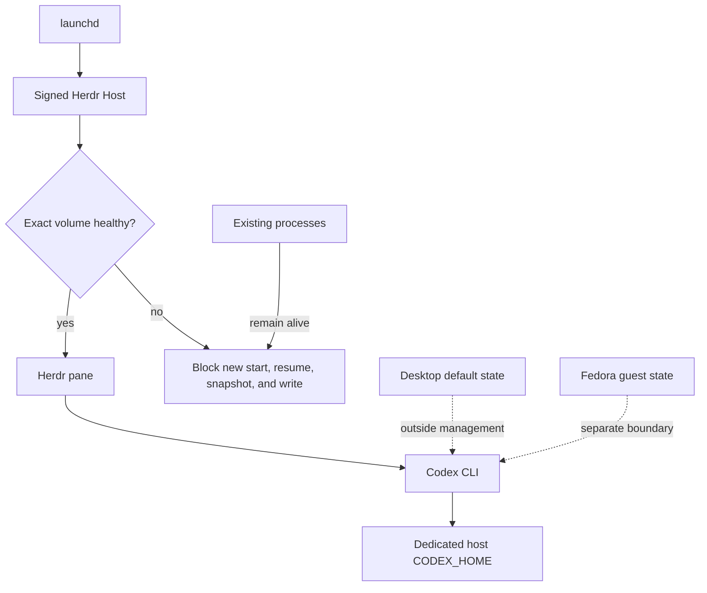
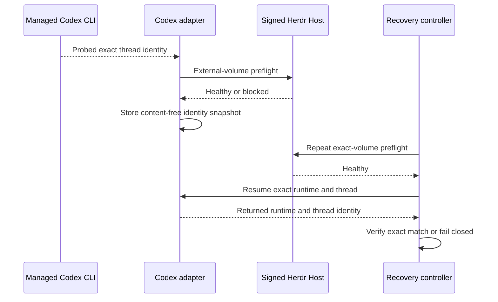
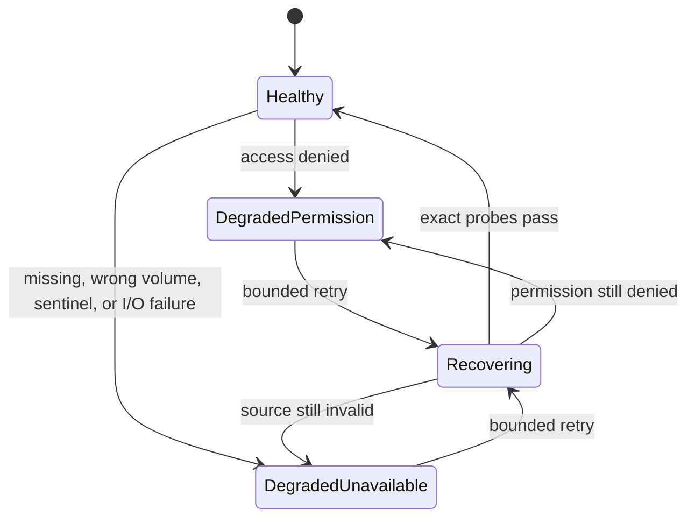

# Codex CLI State And Recovery

**Status:** Contract captured; implementation and capability probes not started
**Created:** 2026-08-29
**Last updated:** 2026-08-30

## Overview

The signed Herdr host and external-volume health boundary must protect Codex CLI
state and exact-session recovery without changing existing OpenCode or shell-auth
behavior. Codex CLI uses a dedicated `CODEX_HOME`; the desktop application and
every Fedora guest retain separate state and authentication.

## Profile And Overrides

| Field | Value |
|---|---|
| Engineering Profile | `docs/specs/shell_auth_startup/PROFILE.md` |
| Risk | Elevated: extends the macOS external-volume privacy and recovery boundary to another authenticated runtime |
| Delivery | Draft pull request and controlled deployment after Codex identity and external-volume probes pass |
| Scope | CODEX_HOME preflight, signed process ancestry, circuit breaking, exact session snapshot/resume, rollback |
| Non-goals | Codex installation/config semantics, lifecycle state, desktop management, credential copying, private storage parsing |

## Domain

| Term | Definition |
|---|---|
| CodexHome | CLI config, auth, logs, sessions, and package state root, separate from desktop default state. |
| CodexSession | Resumable thread identified through a supported Codex hook or app-server interface. |
| CodexSessionSnapshot | Minimal recovery identity containing runtime, exact session/thread ID, validated cwd/worktree locator, release, and adapter revision. |
| CodexStatePreflight | External-volume health decision before new Codex start, resume, snapshot, or state write. |
| CodexCredentialBoundary | Host-local or guest-local authentication that never crosses runtime boundaries. |

Events are `CodexHomeResolved`, `CodexSessionCaptured`,
`CodexSessionResumeRequested`, `CodexSessionResumed`,
`CodexSessionIdentityMissing`, `CodexStateAccessBlocked`,
`CodexStateAccessRecovered`, and `CodexRecoveryFailed`.

## Visual Evidence

| Concern | Decision | Review question | Canonical source | Owner/change trigger |
|---|---|---|---|---|
| Boundary | `required: process and state boundary flowchart` | Which signed process and state root govern Codex? | Architecture | Shell-auth owner; ancestry or state change |
| Interaction | `required: capture/resume sequence` | How is exact recovery attempted and verified? | Recovery | Shell-auth owner; recovery change |
| State | `required: existing health-state extension` | Which health states permit new Codex work? | External-volume health contract | Health transition change |
| Data/trust | `required: process and state boundary flowchart` | Can credentials or session content enter health records? | Privacy contracts | Retained field change |
| Schema | `not_applicable`: the bounded snapshot field list is complete | What recovery data persists? | Recovery contract | Snapshot shape change |
| Dependency/deployment | `required: process ancestry flowchart` | Which responsible executable receives external-volume authorization? | Signed Herdr host contract | Process ancestry change |
| Quantitative | `not_applicable`: fixed health bounds are safety invariants | What metric changes a decision? | Existing shell-auth profile | SLO decision added |



**Text Equivalent:** Launchd starts the signed Herdr host. The host validates the
exact configured external volume before a Herdr pane starts or resumes Codex.
Codex receives its dedicated CLI home. Desktop and Fedora guest state remain
outside this host boundary. Degradation blocks new starts, resumes, snapshots,
and writes but does not terminate existing processes.



**Text Equivalent:** Managed Codex supplies an exact thread identity established
by the capability probe. The adapter validates runtime, release, worktree
locator, and external-volume health before storing a content-free snapshot.
Recovery repeats preflight, requests the documented resume operation, and
verifies returned identity. Any mismatch fails without substitution.



**Text Equivalent:** Healthy state permits new Codex starts, resumes, snapshots,
and state writes. Permission, missing, wrong-volume, sentinel, or I/O failures
block those new operations but preserve existing processes. Recovering repeats
the exact probes. Successful recovery returns to healthy, and the operator must
retry the original operation explicitly.

## Behavior

### State resolution

- Given centralized state is configured, when Codex starts under a managed host
  process, then `CODEX_HOME` is `<root>/codex` and the existing exact-volume
  sentinel and atomic read/write preflight apply.
- Given centralized state is empty, when Codex starts, then the local fallback
  introduces no external-volume dependency.
- Given desktop Codex exists, when the CLI environment resolves, then desktop
  `~/.codex` is unchanged.

### Circuit breaking

- Given health is degraded, unavailable, wrong-volume, or permission-denied,
  when new Codex start, resume, snapshot, or state write is requested, then the
  operation fails before mutation.
- Given Codex or OpenCode processes already run, when health degrades, then those
  processes are not killed, restarted, or rearranged.
- Given the exact UUID, sentinel, read, and atomic-write probes recover, when
  health becomes healthy, then new work requires explicit retry.

### Exact recovery

- Given the Codex identity probe established a supported mapping and the snapshot
  names an exact session, runtime, release, and validated cwd/worktree locator,
  when recovery runs, then it invokes the control-plane's supported resume
  operation and verifies returned identity.
- Given identity is missing, ambiguous, duplicated, version-incompatible, or
  mismatched, then recovery fails without creating a substitute or falling back
  to OpenCode.
- Given a new resume process starts but fails identity verification, then only
  that failed new process may be terminated safely; prior processes and state
  remain available for manual recovery.

## Interfaces

The shell-auth context consumes validated values from adjacent contexts:

```text
runtime kind: host_macos | fedora_lima_guest
validated executable and exact release
resolved CODEX_HOME
exact supported session/thread identity
validated cwd or portable worktree locator
bounded resume operation
process executable and parent identity
health: healthy | degraded_permission | degraded_unavailable | recovering
```

The recovery snapshot does not persist raw argv, prompts, transcripts, command
strings, credentials, absolute state-root paths, or private session content.

## Contracts

- Existing shell startup remains nonblocking and never auto-authenticates Codex.
- Host and guests sign in separately; auth files are never forwarded or copied.
- Recovery requires an existing login in the current boundary and never
  auto-authenticates or injects a shared API key.
- The signed Herdr host remains the macOS external-volume responsibility owner.
- `CODEX_HOME` is scoped to managed CLI processes, not the desktop application.
- Existing external-volume health records retain no session ID, prompt, response,
  database content, repository path, or state-root path.
- Missing state or identity fails closed without automatic restart.
- OpenCode recovery behavior remains unchanged until a separately approved shared
  refactor proves equivalent behavior.
- Herdr presentation identity never becomes lifecycle or session authority.

## Gate Ledger

| Gate | Applicability | Result | Authority | Owner |
|---|---|---|---|---|
| Domain | required | pending | State, identity, and recovery language | Primary |
| Behavior | required | pending | Preflight, degradation, recovery, rollback scenarios | Primary |
| Spec | required | pending | This feature specification | Primary |
| Contract | required | pending | Identity and privacy tests | Primary |
| Test-driven implementation | required | pending | Herdr host and recovery tests | Primary |
| Refactor | required | pending | Reuse existing preflight and health controller | Primary |
| Review/Integrate | required | pending | Affected QA and independent security review | Primary |
| Release | not_applicable: no separately published artifact | not_run | Engineering Profile | Primary |
| Deploy | required | pending | Controlled signed-host and guest deployment | Primary |
| Operate | required | pending | FDA degradation, resume, and recovery probes | Primary |
| Maintain/Retire | required | pending | Upgrade, rollback, coexistence, and retained-state evidence | Primary |

## Validation

```bash
uv run --group test pytest tests/test_portable_distribution.py tests/test_lima_sandbox.py -q
git diff --check
```

Implementation validation additionally runs the affected
`tests/test_herdr_launchagent.py` cases after the baseline latching failure is
resolved in its owning cycle. Live operation requires exact-volume healthy/degraded/recovered probes, signed
process ancestry, process-preserving failure, exact Codex session resume, and
host/guest credential-isolation evidence.
